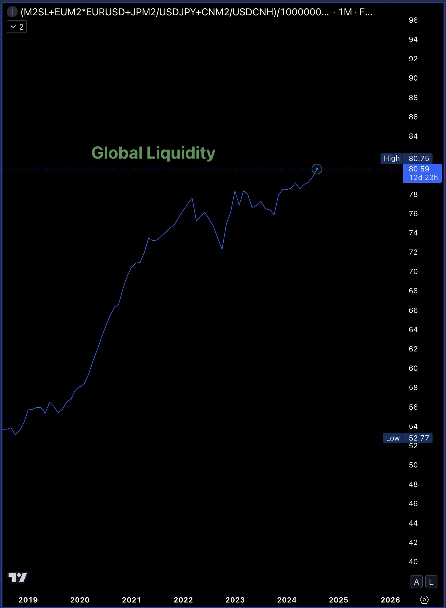

# 炒币等于洗钱？理解错误。

隔夜BTC强势反攻，重上6万刀。昨晚[“8.19教链内参：汇率战取得初步胜利，拉升黄金BTC水到渠成”]复盘了一年前关于汇率战的分析和中美博弈势必推高黄金和BTC的论断。2023年8月31日，教链发文当日，BTC收盘26.9k，黄金1940刀。至今日2024年8月20日，BTC再上61k，黄金则再创历史新高，突破关键整数关口2500刀。BTC +127%，黄金 +29%。

昨天2024.8.19教链文章说，《宏观流动性即将进入再扩张周期》。大家所看的数据，大抵上就是中、美、欧、日的M2供应量数据。目前已经攀升至80多万亿美元。

教链又反思了一下这个数据，觉得似乎有一些深层次的问题没有被发掘出来。且不提各国M2口径其实并不一致，以及，美元的全球流动性远非M2可以涵盖，而M3则早就秘而不宣，就说这能够被观察到的M2总量，其实也值得仔细琢磨。

教链便想到一个问题：你说这总量上升，到底是美元变多了，还是美元贬值了呢？举个例子，原有rmb 100元，usd 100元，usd:rmb汇率等于1:10，那么总量折算成美元就是110美元。但是如果美元贬值，usd:rmb汇率等于1了，那么rmb和usd数量不变的情况下，总量折算成美元就大幅升高到了200美元。

* * *

昨天，8月19日，最高法、最高检联合召开新闻发布会，发布了一个司法解释，全称《关于办理洗钱刑事案件适用法律若干问题的解释》（法释〔2024〕10号）[1]。最高检官网说的是「“两高”发布最新司法解释，明确洗钱犯罪认定标准」[2]，最高法官网说的是「最高人民法院、最高人民检察院关于办理洗钱刑事案件适用法律若干问题的解释」[1]。

但是，由于解释中第五条第（六）款的内容是「通过“虚拟资产”交易、金融资产兑换方式，转移、转换犯罪所得及其收益的」，于是就被各路媒体自媒体揪出来，强调说司法解释把通过“虚拟资产”交易明确列为洗钱方式。这说法倒是没有太大问题，只是传播出去之后，又被阅读理解不太及格的一些朋友们给理解成这是要把炒币和洗钱划等号了。

其实，解释第五条其他各款其实还列举了别的可能被用来实施洗钱的手段，比如：

「通过典当、租赁、买卖、投资、拍卖、购买金融产品等方式，转移、转换犯罪所得及其收益的」

「通过与商场、饭店、娱乐场所等现金密集型场所的经营收入相混合的方式，转移、转换犯罪所得及其收益的」

「通过虚构交易、虚设债权债务、虚假担保、虚报收入等方式，转移、转换犯罪所得及其收益的」

「通过买卖彩票、奖券、储值卡、黄金等贵金属等方式，转换犯罪所得及其收益的」

「通过赌博方式，将犯罪所得及其收益转换为赌博收益的」

等等。

炒币是手段，洗钱是目的。可以利用炒币洗钱，但不意味着炒币一定是洗钱。洗钱是犯罪，不等于炒币是犯罪。

就像刑法里，开车可以是杀人的一种手段，但不能说开车等于杀人。杀人是犯罪，不等于开车是犯罪。

* * *

教链想起来一个类似的事情。两年多前，2022年2月24日，最高法发布了「最高人民法院关于修改《最高人民法院关于审理非法集资刑事案件具体应用法律若干问题的解释》的决定」（法释〔2022〕5号）[3]。

在这次司法解释修订中，最高法在原司法解释第二条关于非法吸收公众存款的方法里面增加了第（八）款「以网络借贷、投资入股、虚拟币交易等方式非法吸收资金的」。

这个修订当时也被很多人错误理解为把所有的虚拟币交易行为都定性为非法集资了。其实，和这次的司法解释类似，虚拟币交易只是被作为一种非法集资的手段被列入，而并不意味着只要是虚拟币交易就等于非法集资。

当然，这个修订主要堵住了一个缺口，那就是兴起于2017-2018年的所谓“发币”（代币发行融资），即一个项目方使用token（数字代币）技术制作大量数字代币，按照人为约定的某个“发行价格”兜售给大量的散户投资人，从大量散户手中募集大量BTC、ETH或者USDT等虚拟币的活动。这种活动一度有一些洋气十足的称号，叫做ICO或者I什么O之类的。

由于以前刑法中非法集资要求募集的是人民币或者其他法律认可的财产，所以当这些项目方募集虚拟币如BTC、ETH或者USDT时，就绕过了法律的规定，钻了一个漏洞。这就是大陆法系必须严守法条的刻板之处了。像美英那种海洋法系，随便解释一下旧法律，就可以套到新事物上面去了。这种灵活性一贯被鼓吹为海洋法系的独特优势。

至于为何大陆法系不设计灵活的自由裁量权？笔者不是法律专业人士，不好妄言。不过，从近年来法官遇刺的一些案例来看，或许是大陆人民更倾向于把公平放到自由之上，从而执着于在自认遭遇不公时豁命也要进行终极追责，完全没有阿美莉卡人民那种疫情死了几百万也绝不怪罪执政政府的宽容和豁达。

司法解释算是一个补丁，它不需要受到“法不溯及既往”的限制。也就是说，拿2022年新修订的司法解释，去判决2017年某个发币募集BTC、ETH或USDT等“硬通货”然后卷币跑路的项目方，也是可以适用的。

所以，2022年初的司法解释修订一出，当年发币圈钱的项目方们，就如鸟兽散、应润尽润了。

---
[1] https://www.court.gov.cn/fabu/xiangqing/440681.html
[2] https://www.spp.gov.cn/xwfbh/wsfbt/202408/t20240819_663652.shtml
[3] https://www.court.gov.cn/zixun/xiangqing/346901.html

