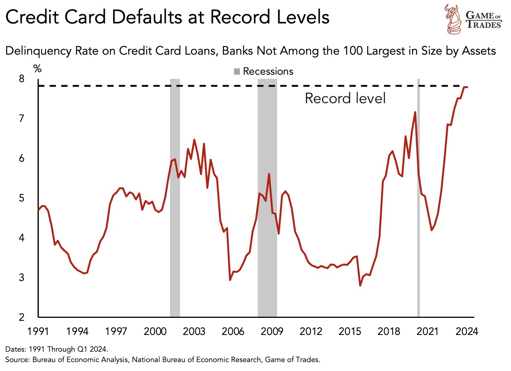
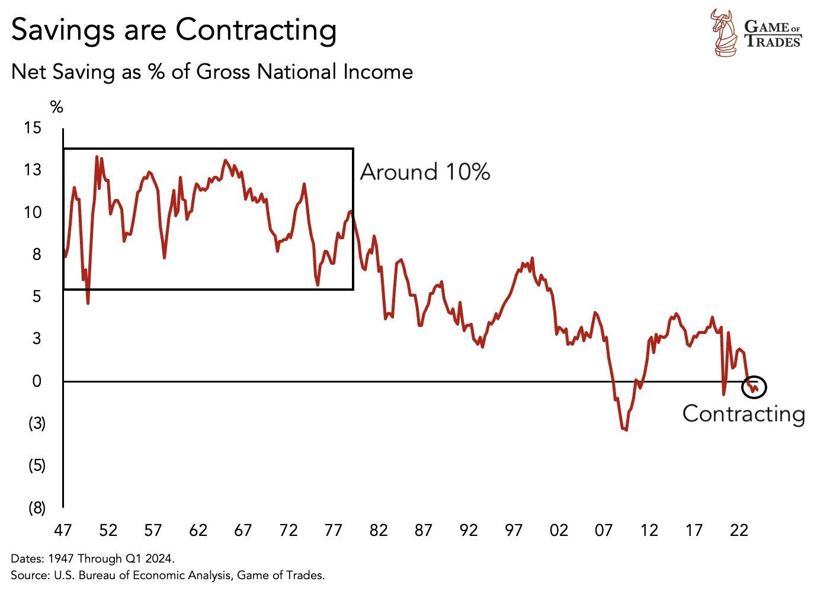
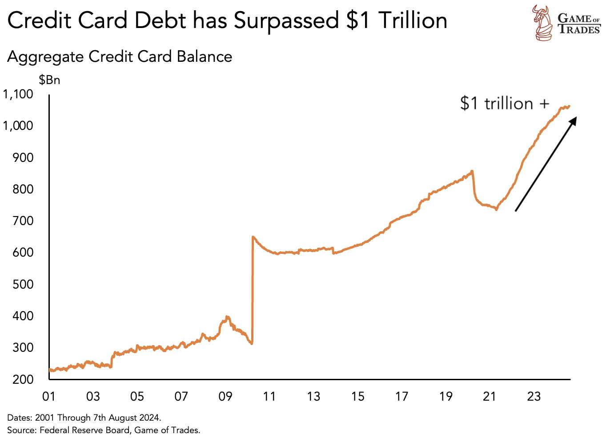
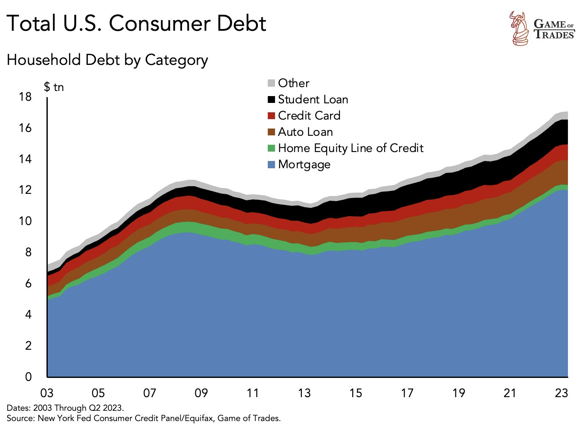
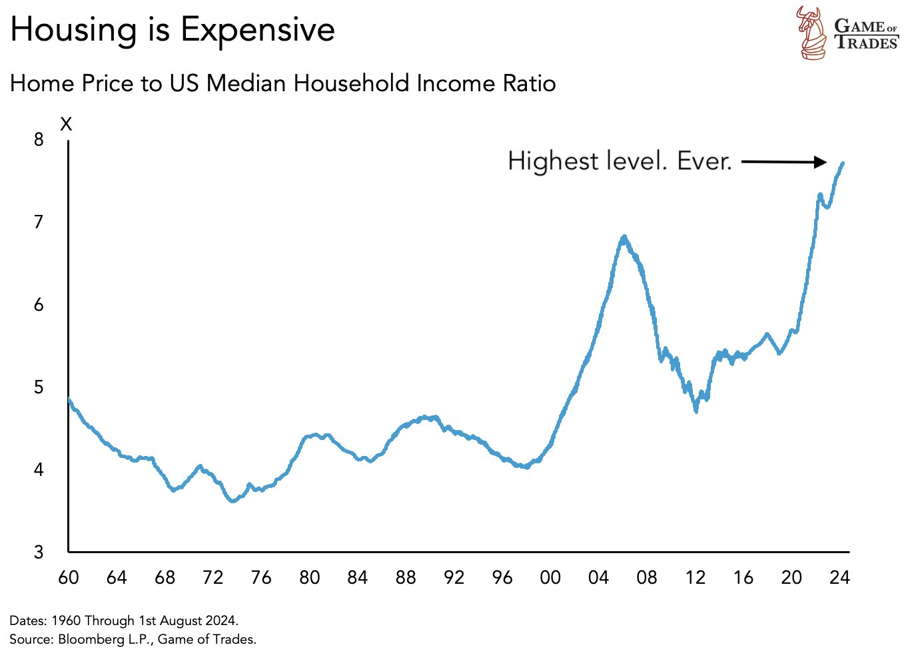
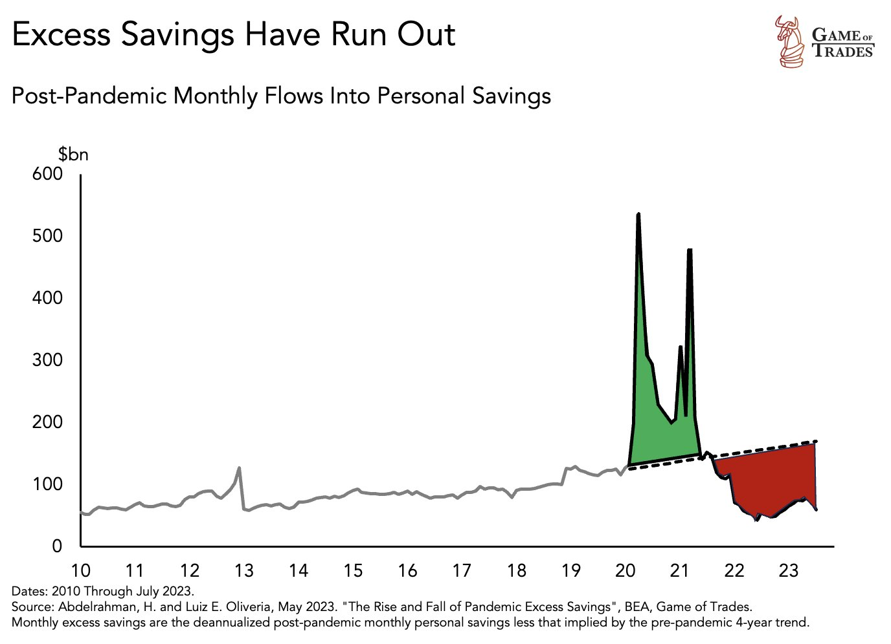
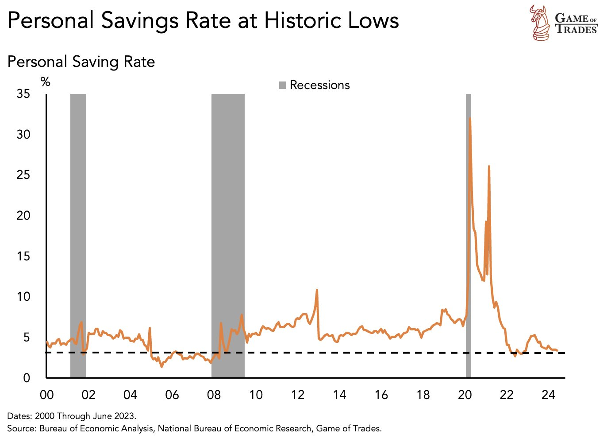
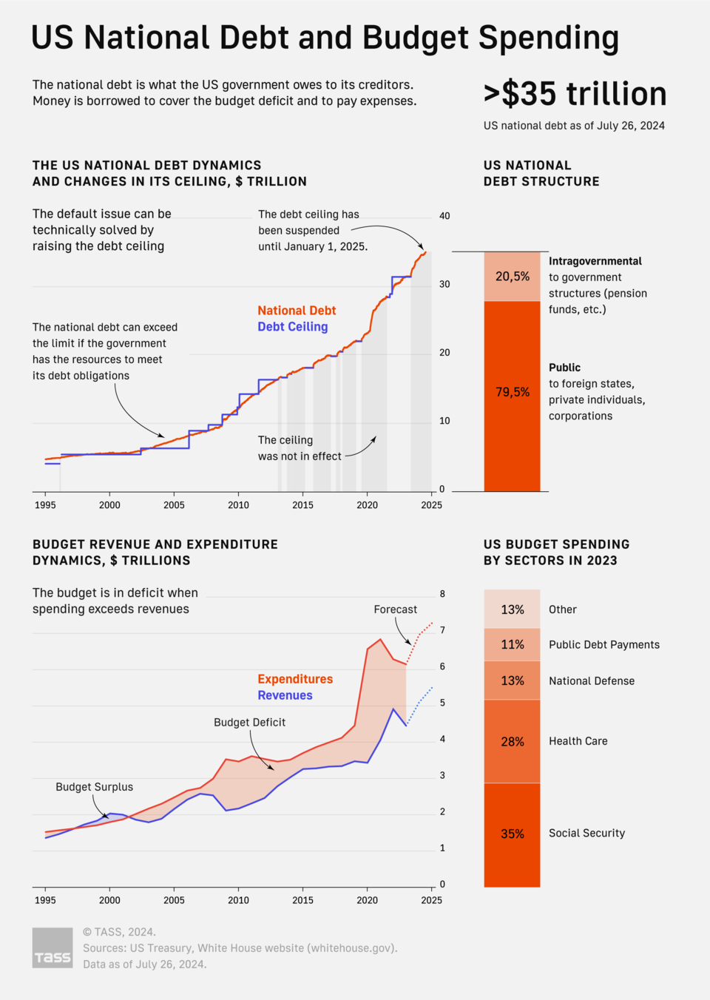

# 美联储的红舞鞋

隔夜BTC复又回落至6万刀下方，又一次给了5字头加仓的机会，贴心。

昨日教链在[“8.20内参：美SEC拒绝Solana ETF”]中说了，美元指数快速回落，美元快速走软，已近乎抹去今年以来的全部涨幅。相比2022年底超110已经跌去超10%。

这个位置，也回到了2022年初，或者是回到了2016年底。当然，相比于2008-2011年70-90的低位，目前美元指数还处于相对高位，还有下跌空间。

这两年100-110的美元指数，也许就是近25年来的第二个高点了（上一次还是2000-2001年110-120）。游戏就要告一段落了。

在[“8.19教链内参：汇率战取得初步胜利，拉升黄金BTC水到渠成”]的复盘中，提到2023年8月31日教链文章《人造繁荣：财富大转移》。在这篇一年前的文章末尾，教链解释了美国经济“高血压”的秘诀，那就是疫情前后通过直升机撒钱所创造的超额储蓄，而这份超额储蓄，即将在2023年底耗尽。

最后的最后，文章对美联储发出灵魂一问：「当（2023年的）这个冬季，美国人民花光了政府发的钱之后，鲍威尔还要继续咬牙维持那该死的高利率吗？」

果不其然，数据显示，2024年一季度，美国居民信用卡违约率已经飚至历史新高。情况甚至比2008年金融危机时的情况更加危急。

2008年次贷爆炸，蔓延成全球金融危机，其关键反思就是，美联储在开闸放水上犹豫了，行动迟缓了，等到它终于下定决心要出手，硬着陆已经发生了。

在枪手间的生死决斗中，比的就是谁的子弹出膛速度更快，容不得丝毫犹豫。

待到2020年疫情时，面对美股接连熔断的危急形势，美联储吸取教训，及时、大力出手，飞速地把利率降到零，并直接开启了无限制QE放水，硬生生地把美国金融市场从死神的手里给抢了回来。

现在，危情时刻再次拉响了刺耳的警报。美联储还有多少时间犹豫不决呢？

从1940年代到1970年代，美国人把10%的收入储蓄下来。现在，美国人的储蓄率一路收缩，已经接近甚至低于0 —— 这意味着普遍性的入不敷出。

美国人不得不寻求依赖信用卡维持生活。这进一步加剧了他们的债务负担。如今，全美信用卡债务总量已经超过了1万亿美刀。这一数字相比10年前已经翻了一番。

信用卡消灭了储蓄的传统美德，把美国人变成了负债消费者。

至2023年，美国消费者总债务规模已高达17万亿美刀。其中绝大部分是房地产抵押贷款。

2008年金融危机的引爆点，正是房地产次级贷市场。当时美联储为了救市慌不择路，突破法律限制，亲自下场购买MBS（抵押贷款证券）。

今年，前几个月开始，教链在内参中提到过，美联储正在“腾笼换鸟”，悄悄地把MBS给抛掉，换成美债。

是不是美联储也看到了数据，看到了房地产又一次迫近危机？

美国住房可负担指数已经触及几十年来的最低点。

而房价已攀升至家庭年收入的7倍。

另一方面，如教链在文章开头所说的，美国家庭在疫情那两年因“天降甘霖”而积累的超额储蓄，已经“坐吃山空”了。

这使得美国居民储蓄率在被动急速攀升后，迅速回落到低点。

美国经济过去几年的繁华，不过是如教链在2023年8月31日文章所说的，“人造繁荣”，是大放水加直升机撒钱向居民部门进行“财富大转移”制造出来的虚假景象。

美联储大放水，财政部大发债，美政府大撒钱。货币刺激就像安徒生童话里的红鞋子，而美国经济（美国政府）就像那个名字叫做卡伦的小女孩。

安徒生讲的故事大意是这样的：

一个叫卡伦的小女孩，在母亲去世后被一个富有的老太太收养了，她长大后自负又奢侈。

后来卡伦得到了一双红鞋子。她超喜爱这双红鞋子，甚至穿着它去教堂。当牧师把手放在卡伦的头上，讲述着她作为一个基督徒的责任时，她的心里却只想着她的红鞋子。

老太太告诫她在这种场合要穿黑鞋子，不要穿红鞋子。但是卡伦还是在下次去教堂时，又穿上了红鞋。

当卡伦离开教堂时，她就忍不住开始跳舞。她根本停不下来，直到大家帮她把脚上的红鞋子给脱下来。

后来，卡伦忍不住一次次穿上红鞋去参加派对。她越来越被红鞋子所控制，无论白天黑夜、晴天下雨，她都会不由自主地跟随者红鞋子不停地跳舞。

最后，她再也停不下来舞步。她祈求天使。天使告诉她，她必须一直跳下去，直到死掉为止。

卡伦那无法停止的舞步，简直就是无法停止增长的、已经高达35万亿美刀的美债的绝佳比喻！

在童话故事里，卡伦的结局如何呢？

她找了一个刽子手，帮她砍掉了双脚！

那双被砍下来的脚，依然穿在红鞋子里，翩翩起舞，永不停歇！

不过，失去了双脚、只能靠拐杖站立的卡伦，终于可以安静地坐下来了。

天使带着一束玫瑰重现，宽恕了卡伦。卡伦的内心充满了阳光、平和以及欢乐。她的灵魂在阳光中飞向了天堂，在那里，没有红鞋子。

童话总要编一个温暖的结局。

但是残酷的人间，却未必处处像童话。
