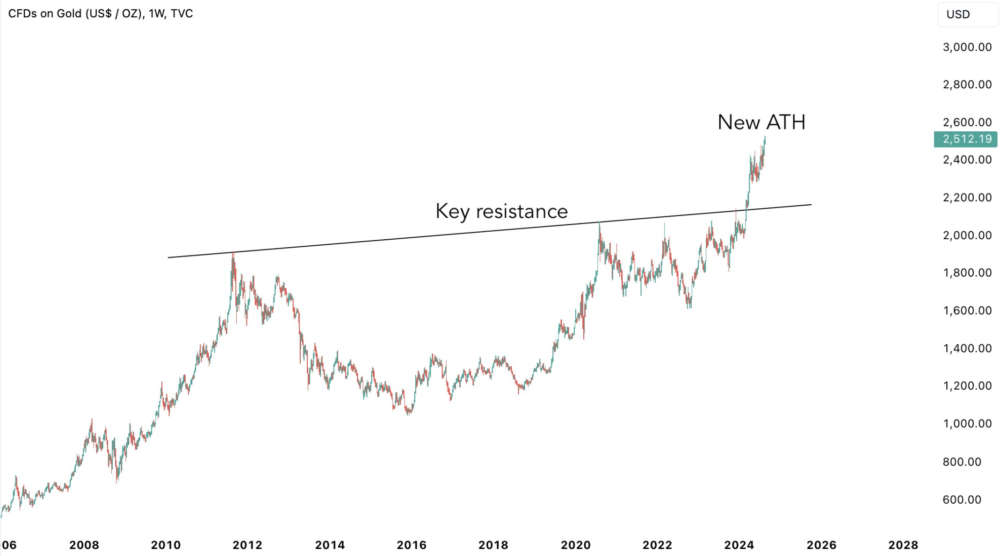
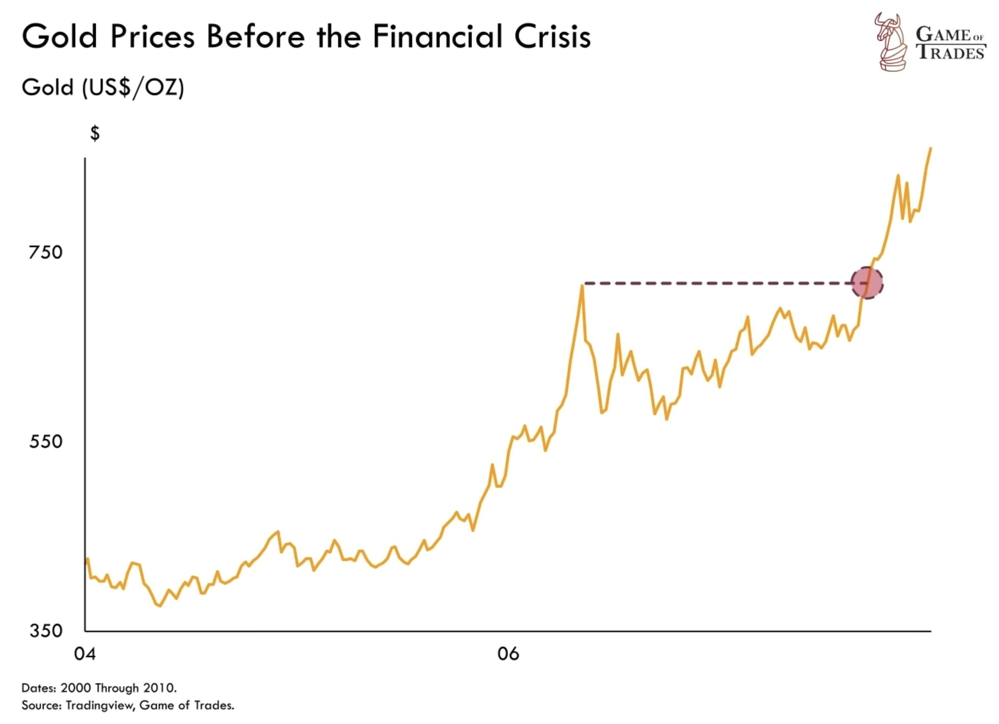
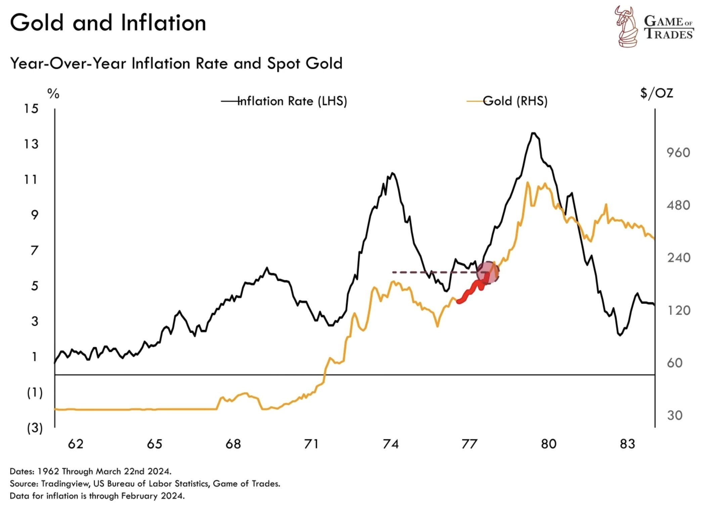
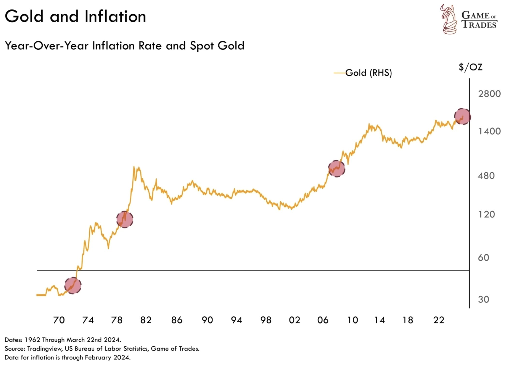
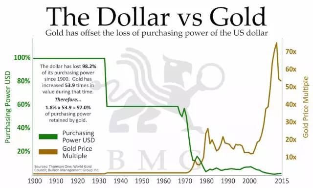

# 黄金发出警告！

隔夜BTC骤然跃升，站上61k，几乎完全填补了前天8月20日的上影线。黄金如昨晚[“8.21教链内参：逻辑变了。不要幻想。”]所说，继续在历史性的高位$2500刀以上盘整。

黄金对12年来关键阻力位的突破，叠加刚刚大幅下修的就业数据，以及美经济衰退的阴影，无疑是向所有人发出了最为强烈和严厉的警告信号！

打仗不是请客吃饭。同样，经济也不是小孩子过家家。

昨晚教链为什么在[8.21内参]里说，逻辑变了？变的就是，从小孩子过家家的逻辑变成了打仗要死人的逻辑。

以前是，经济数据一好，就说美联储又不用降息咯，于是风险资产就下跌；经济数据一差，就说美联储恐怕要降息咯，于是风险资产就上涨。

等到市场真正意识到，美国经济真的真的要衰退了，于是就真的吓尿了裤子，美联储降息的跷跷板效应消失了，风险资产开始踩踏出逃。

BTC向上突破，大家嘻嘻哈哈，说它不过就是一个风险资产的逻辑嘛。

黄金发出警告，嘻嘻哈哈的声音突然安静了下来。鸦雀无声，空气凝固了。扭头一看，最机灵的同学，巴菲特同学，索罗斯同学，甚至黄仁勋同学，早就趁大家嘻嘻哈哈的时候，悄悄溜出去了。

所有人都沉默了。剩下这么多人，这么小的一个门，如果一起跑，肯定都跑不掉。于是一千个人脑子里在飞快地盘算着一千个自作聪明的剧本。

上一次，2007年10月份，黄金突破1.5年关键水平，不断创出历史新高。后面，美国金融危机，全球金融海啸，经济大幅衰退。

再向回倒，上世纪70年代，尼克松冲击之后，72-78年，黄金不断突破新高，随之而来的，是破坏性的12-15%的大通胀。

可见，自从1971年美国单方面对全世界违约，撕毁布雷顿森林体系条约之后，黄金就走上了它对美元的复仇之路。每一次黄金对重大箱体的历史性突破，都预示着美经济的衰退，金融的崩溃，或者超级大通胀。

这一切还是在美国政府持之以恒地用行政、法律、金融做空等各种手段，立体性、全方位围剿和打压黄金的基础上实现的。要了解全部的历史脉络，诸君请阅读教链在2020年底写就的[《比特币史话》]，或者简单回顾一下教链旧文，比如[教链2023.9.25文章《黄金，黄金》]。

常规的逻辑是用所谓风险资产、避险资产的概念来分析黄金和BTC。这常常导致迷惑性的、易变的逻辑链条。而如果用价值存储的逻辑，我们将会有全新的视角和洞察。

实际利率 = 名义利率 - 实际通胀率

教链认为，经济学的底层并不是数学（现代经济学）或者逻辑（古典经济学），而是物理学。无论当代经济学用多么高深的数学方程对经济问题进行求解计算（举例：Black-Scholes期权定价模型），还是以前的经济学流派用各种滴水不漏的逻辑闭环来构建一套经济学理论（比如米塞斯令人叹为观止的《人的行为》），本质上还是在自洽闭环里面绕圈子。

数学和逻辑不必然符合我们所处的宇宙现实。完全可以用数学和逻辑构建出自洽的但不属于我们这个宇宙的图景。真正导致我们不得不坠向地心的，是我们这个宇宙的物理学。

从热力学第二定律的角度看，利息就是一件特别奇怪的事情。我们所在的宇宙只有一个方向，那就是熵增和毁灭。资产为什么、又凭什么可以自动孳生利息呢？

米塞斯的解释是，利息（自然利息）是对人延迟满足的补偿。可是，宇宙为什么偏偏就要补偿人呢？这么讲，难道不是人类的自大吗？

热力学告诉我们，在一种情况下可以发生局部熵减，那就是开放系统对外造成更大的熵增和破坏的时候，可以向其内部注入负熵流，从而造成局部熵减。

因此，任何人，躺着赚钱的时候，他攫取的价值，必然对应着对于其外部更大系统的更大消耗。

可以推知，根本不存在永恒为正的实际利率。宇宙的底色，就是负利率，也就是，什么都不干，总价值必然趋于损耗和毁灭，而绝非保值和增长。

人类要想获得正利率，就要靠有效的活动（称之为劳动），获得人类系统边界内的局部熵减，与此同时，这必然意味着人类系统边界外，宇宙更大程度的毁灭。

设人类获得的价值为V1，那么对应人类外部的价值毁灭就是-V2，且必有V2 > V1。因此，宇宙因人类活动而总体上得到的价值增量为V = V1 - V2 < 0。

不过，在宇宙面前，人类实在是太过渺小。实际情况根本不是人类想对宇宙造成多大破坏，就能造成多大破坏的。事实上，是宇宙决定了人类的边界，而不是相反。

基本上，太阳辐射消耗掉的能量，辐射到地球上的部分，其中大约73%的部分（卡尔达肖夫指数），就是当前阶段的人类文明所能达到的边界。

人类社会所能获得的总价值量，也只能被局限在这个边界之内。

不过，人类可以在文明内部，划分出更小的边界。让自己一方的价值增长，超过自己之外的人。此所谓增值。

从康波周期的超长尺度来看，教链甚至认为，能把局部价值保持在不损耗，也就是实际利率为零，也许就已经是了不得的事情了。此所谓保值。

这种层次的保值增值，才是价值存储（SoV）的深层含义。

实际通胀率就是价值毁灭的速度。所有人都被迫与之赛跑。

名义利率是有形之手的自大和谵妄。

有形之手无法无限度提高名义利率。于是到了某一个时候，名义利率无法继续提高，甚至要被迫降低，实际利率就转向了负数。

无论名义通胀率是多少，那都是掩耳盗铃。

当实际利率为正的时候，人们会涌向负债（本质是杠杆），追求更高的回报（本质是对其他人的价值转移，即“收割”）。

当实际利率为负的时候，人们会涌向价值存储，追求基本的保值（实质上的）、增值（相对于名义法币价值）。

这，也许才是所谓财富的底层真相。
