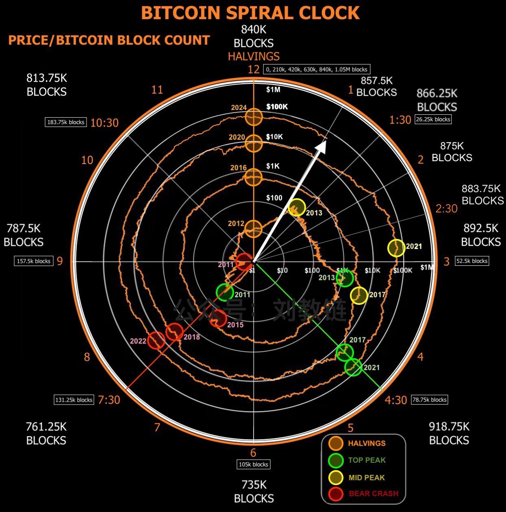

# 美债危局！

隔夜BTC继续坚守在6万刀一线，迎着空头的压力连日向上突破。昨日[“8.22教链内参：原来，美联储早就准备好了投降”]提到，BTC即将进入Q4启动季。

从BTC时钟上看，我们现在刚刚度过1点钟（下图）。你认为行情将会在1点半（10月）、2点钟（12月）、2点半（明年2月）还是3点钟（明年4月）以后启动呢？

昨天有个读者留言说，美国GDP近几十年来一直在发展，虽然每10-20年就会遭遇经济危机，但整体上还是上升的，黄金报复失败。

这位读者可能忘记了，名义GDP的增长并不等于真实财富的增加。

自从1971年尼克松突然对全世界违约，取消了美元与黄金的挂钩，撕毁了布雷顿森林体系，美元就放飞了自我，美债彻底失控。

此前，美债累积到1万亿美元用了200多年。

然而，从1万亿美元快速膨胀到35万亿美元仅仅用了40年！

美国GDP，及其背后所蕴含的综合国力，甚至国运，早已见顶，高位横盘整理很多年。只不过，在宏观债务驱动的美元快速贬值情况下，保持了依旧可观的名义增速而已。如果改用黄金计价，一切名义增长就将露出其本来的面目。

甚至有人说，美国国运见顶衰落的起点，就是2001年9月11日。

到了2015年，美债规模已经永久性地超过了GDP总量。

美债-GDP比例已经超过120%。未来只能持续升高。

很显然，随着债务规模的急剧扩张，债务对GDP增长的拉动力也越来越弱。当债务-GDP比例低于30%时，美国GDP可以轻易实现4%名义增速。而当债务-GDP比例高于90%以后，连2%的名义增速都难以维持。

事实上，一切的祸根都要追溯到上世纪70年代，美国对世界单方面违约。从布雷顿森林体系被美国一手撕毁之后，美国GDP增速就一路下滑。

数据显示，债务-GDP比例和GDP增速呈现出极其明显的负相关关系。

而这些，就是中本聪在2007年的洞察，在2008年提出BTC的设想，并在2009年正式推出BTC的动机。

无论如何，当你投资或持有BTC，你就是在做空美元，做空美国，押注美债的必然崩坏以及美国国运的下降。（其实对冲的是一切失去纪律的债务法币及其背后任性的权力，只不过债务美元是现阶段的“出头鸟”，而BTC就是人民手中的“猎枪”）

当然，没有人会希望美国骤然崩溃。它最好是温和地后退，回归到1971年之前有锚美元的状态，并成功实现美元换锚BTC。

如果得以实现，那就是伟大的软着陆。野兽美元及其背后的权力得以被关进BTC的笼子里。

1971-20XX，从黄金美元到无锚美元，从无锚美元到BTC美元，如梦一场。
