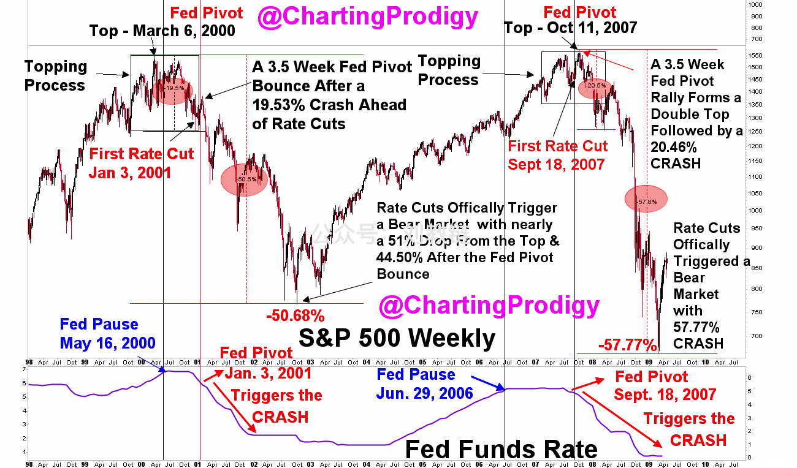
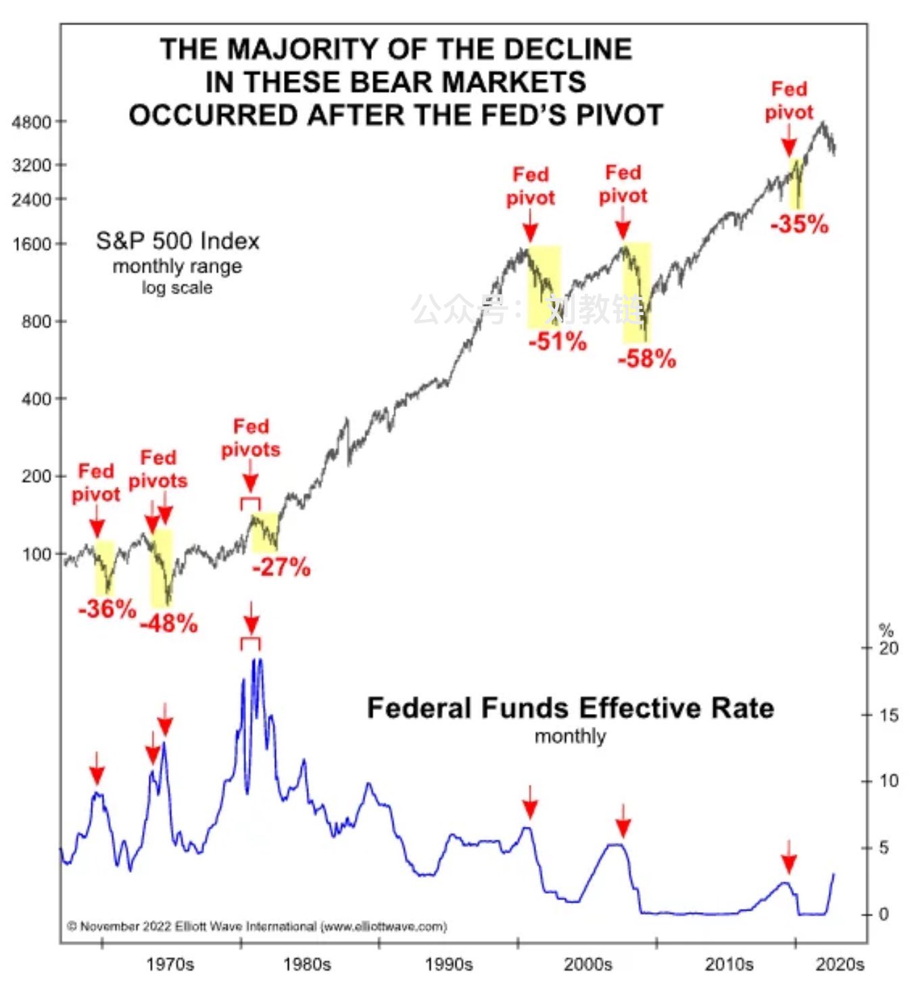
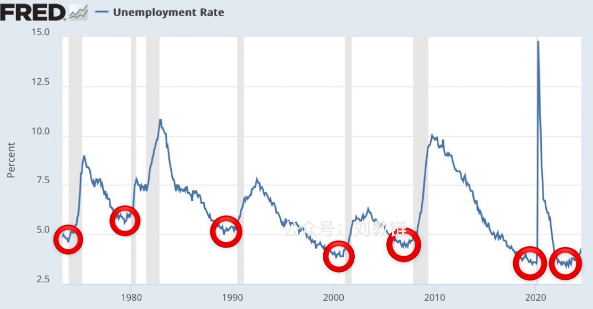
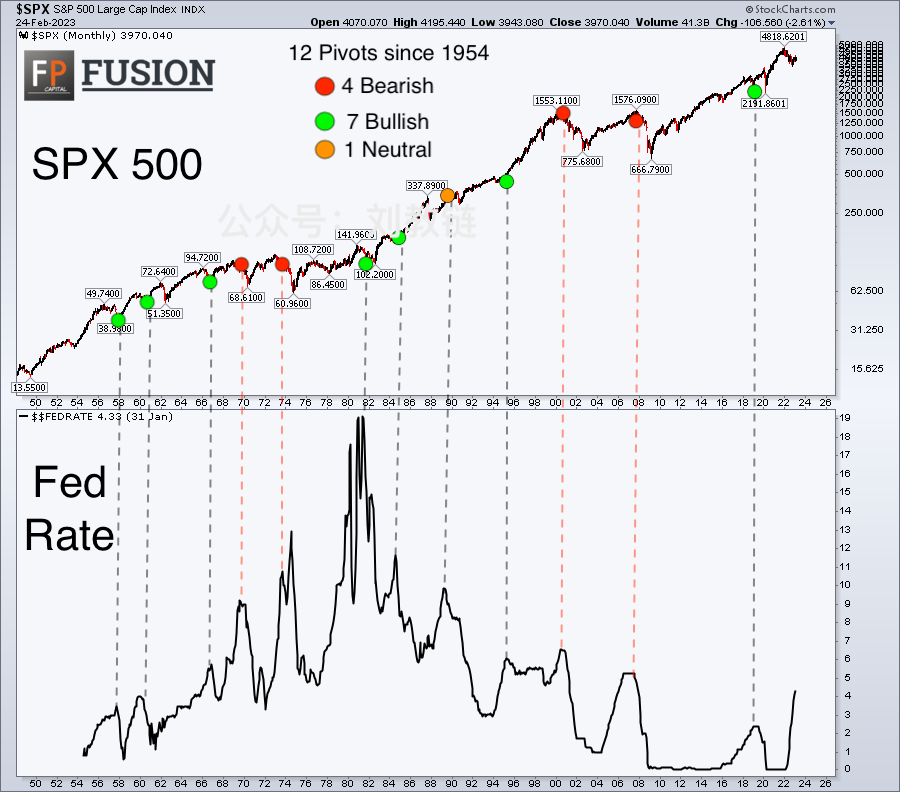
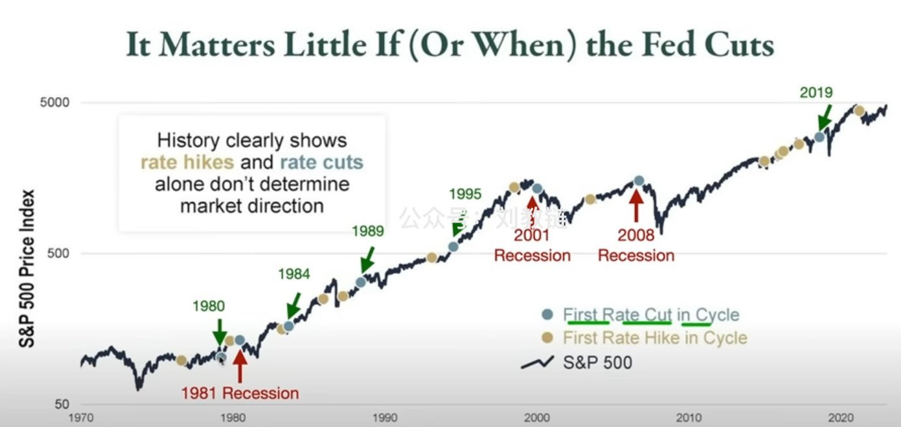

# 粉碎降息崩溃最终幻想

随着BTC一路高歌猛进站上64k、摸到65k，眼瞅着这是离8月5日下影线的低点是越来越远了。起初空头可能还想着二次崩溃，回填下影线。现在这希望是日渐渺茫了起来。于是便又把崩溃的希望寄托在了降息上。可是周五晚上美联储主席鲍威尔讲话确认要降息，市场没有崩溃。这最终幻想，又渐次推迟，开始想着是不是9月降息落地时来一次大崩溃了。

空头有这样百折不挠的幻想，从相反相成的辩证角度看，倒不仅不是一件坏事，而是一件大大的好事了。毕竟，根据教链讲的最大损失原理，市场总归是要碾碎最多人的暴富梦，一路前行。

为什么会有这么多人会拿降息等于崩溃的逻辑来安慰自己呢？因为历史经验。

2001年1月3日，美联储政策转向，开启降息。降息未能真正扭转已经崩跌19.53%的美股标普500指数。它在经历了3.5周左右的反弹后，继续大幅崩溃，并在一年多后触底，相比2000年3月6日的顶，跌幅高达-50.68%。

2007年9月18日，美联储启动首次降息。再一次，美股标普500指数在3.5周后见顶，然后开启标准崩溃模式，并在2009年触底，最大跌幅达-57.77%。

由此上溯到上世纪60-70年代以来，似乎每一次美联储转向降息，都会带来美股的一次大崩溃和大熊市。

如果看一下失业率，似乎可以窥见其中可能的逻辑：不是降息引起崩溃，而是经济衰退甚至市场崩溃已经开始，美联储被迫转向，启动救灾式降息，但由于货币调节传导速度有限，待援军到达时已无力回天。

所以，才有所谓神乎其验的“萨姆法则”（参考阅读教链2024.8.3文章《美股以死相逼》）。

也许不是美联储降息，倒是美联储犹犹豫豫，降息降得不够快？

其实美联储也在吸取教训。2020年疫情美股接连熔断，美联储就紧急无限宽松货币，迅速打开超级放水模式，挽狂澜于既倒。

猜想：如衰退之势已成，美联储降息也常回天乏术。但若衰退预判未竟，美联储降息或则添火加柴。

一种数据作弊的手段就是只挑选出有利于自己观点的证据，而舍弃不相符合的数据。有好事之人便拉出了1954年以来的12次转向降息的情况：4次熊市，7次牛市，1次中性。

由此足见，转向降息并不必然意味着熊市。甚至，转向加息也并非总是带来熊市。

从历史图表上全面地、不带偏见地看起来，似乎只能说，开启加息后，可能是牛市，也可能是熊市，还可能既非牛市亦非熊市；开启降息后，可能是牛市，也可能是熊市，还可能既非牛市亦非熊市。

不要守株待兔、刻舟求剑。要此心不动，随机而动。
