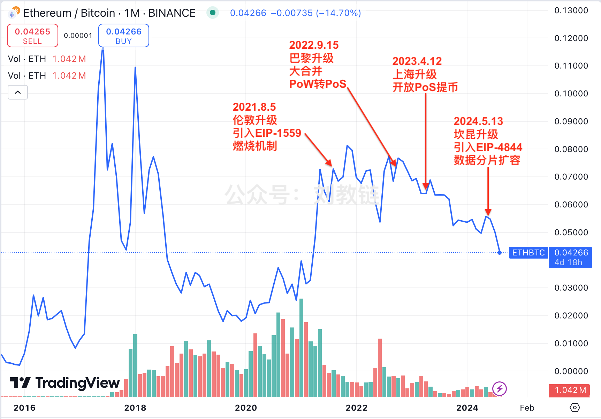
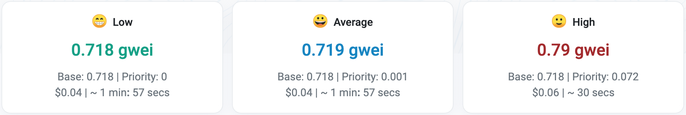
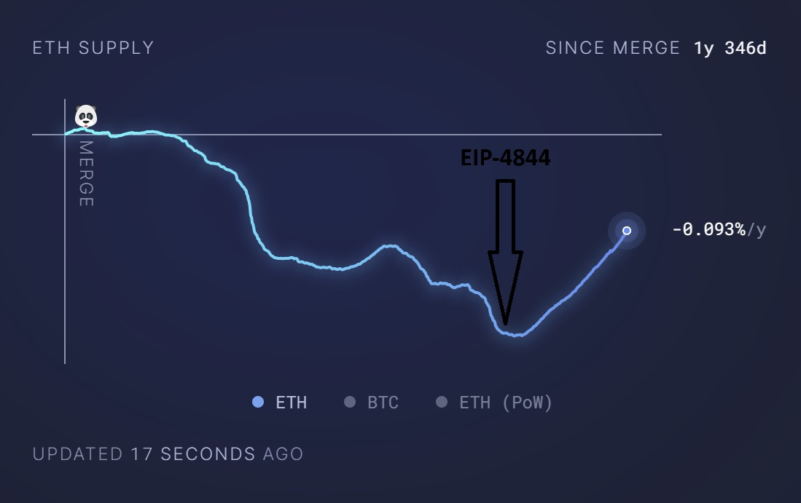

# 以太坊的人生困局

隔夜BTC在昨日触及65k后连续回落，目前已经回撤至63k下方。现在市场没有什么情绪。BTC涨涨跌跌，山寨跌跌跌跌。最大的山寨币、公链的领军者以太坊（ETH），以BTC计价，不断走低。ETH/BTC已经彻底失守0.5关键心理关口，来到了0.4一线。这不禁让许多ETH的重仓者心里破防，甚至前段时间创始人Vitalik Buterin忙着风花雪月的照片都被社区给揪了出来，斥他不务正业。

ETH的韭菜们骂得有理。毕竟，Vitalik谈小女朋友的开销，以太坊基金会每年大把烧钱发高薪的支出，那都是来自于二级市场上抛售ETH。换句话说，都是ETH的韭菜们买的单。

当年发币募资，以太坊基金会手握大量零成本的ETH。现在每年要向市场砸盘抛售1亿美刀，来维持它费用不菲的运作。从2013年项目启动算起，距今已有10年。

若以人类作比，以太坊十多岁了。而据[“8.25教链内参：以太坊基金会或将在8年后耗尽储备”]，基金会还能如此运作8年。18岁，刚好是一个人脱离父母、走向独立的年纪。

18岁之前的人，还是一个由监护人养活、受监护人呵护的孩子。18岁以后，他就要开始自力更生了。

从这个比喻来讲，现在在二级市场接盘以太坊基金会抛压，实质上为基金会的支出买单的韭菜们，就是以太坊现阶段的养父母和监护人。

父母骂孩子不求上进，不仅离学霸（BTC）越来越远，还眼瞅着有被其他后来居上的同学（比如SOL）超过的危险，这就完全是骂得既符合逻辑，也符合人伦。

比特币（BTC）就不同。这孩子自打离开生母中本聪的怀抱就一直自力更生。他不欠任何人的。任何人都没有资格指摘他。他就像孙悟空，生来要当齐天大圣，把旧秩序搅个天翻地覆。（多说一嘴，为啥中本聪是生母(实现者)，因为BTC的生父(授精者)是戴维和尼克·萨博——中本聪曾在2010年7月20日的帖子里说，Bitcoin是Wei Dai的b-money提案和Nick Szabo的Bitgold提案的一个实现）

青春期是人生中一个叛逆和困惑的时期。我们不知道以太坊18岁之后是否能飞黄腾达，还是继续啃老，这些问题都还远，还不到头疼的时候。但是现在摆在眼前的，是成长中的叛逆和不羁，带来的成绩节节倒退的问题。

上图是ETH/BTC自2016年来的走势图。大周期的楔形，令这种不上不下的心理困惑跃然纸上。曾经被寄予赶超第一名的厚望，现在却连防守住不后退、不下滑都似乎有些力不从心。

教链特意找出近几年来最重要的几次“大考”，即以太坊主网的关键升级：2021年8月5日的伦敦升级（引入EIP-1559燃烧机制），2022年9月15日的巴黎升级（PoW转PoS），2023年4月12日的上海升级（开放PoS提币），2024年5月13日的坎昆升级（引入EIP-4844数据分片扩容）。

尤其是今年5月份的坎昆升级，数据分片上线，给予二层网络（L2）们更大力度的支持，也降低了一层主网的费用，减少了燃烧，扩大了通胀。坎昆升级之后，ETH/BTC直线下滑，飞流直下三千尺，眼瞅着就要成为向下突破大周期楔形的罪魁祸首。

随着近期市场活跃度低迷，以太坊一层主网的燃料费（gas fee）居然连日保持在1 gwei以下！这让经历过2021年牛市在这条“贵族链”上疯狂烧gas的人们一时间竟有些恍惚。

于是有网友危言耸听地说道：「以太坊正在走向灭亡，而 L2 则在其坟墓上跳舞。」

他的逻辑是：以太坊错误地选择了向二层（L2）扩容的路线，当把执行任务全部外包给二层后，一层主网就缺乏使用和燃烧，从而无法消耗PoS造成的通胀。L2们一路高歌猛进，不断在用户量和费用收入上创出新高。

同时，他补充道：大量彼此割裂的L2出现，让整个以太坊生态越来越碎片化——流量碎片化，流动性碎片化，用户碎片化，…… 几乎看不到任何现实的可能性，把这些碎片化的东西重新整合起来。

而且，他接着说：事实上，目前前十大L2都是中心化控制的。理论上他们随时都可以偷走用户的资产。而走向完全去中心化的路线图遥遥无期……

还有，他认为：由于L2们几乎都是VC资本（风险投资）驱动的，他们形成了一个强大的利益集团，会对以太坊形成巨大的影响力，使得几乎不可能再重新回归直接对一层扩容的老路，因为那将会直接摧毁L2们生存的空间和资本的价值。

最后，他总结：L2们正在高效地窃取以太坊的用户和费用收入。而且我们再也回不去了。最好的情况，L2会成为竞争者。最糟的情况，L2会成为吸血鬼攻击，慢慢地吸干以太坊的生命。当以太坊死亡的那一刻，L2们就会迁往其他的一层链继续吸血，或者直接摇身一变自己变成一层链。

无疑，上述逻辑推演和叙事是黑色的、忧郁的、悲观的。

他似乎忘记了，L2们仍然需要把交易打包后回写到以太坊。

从这个意义上，当以太坊发现旧的ETH 2.0扩容方案走不通，选择向L2扩容时，就已经悄然转换了以太坊的定位：从一个通用计算层，变成了一个安全存储空间提供层。

对于任何反对向二层扩容、坚持在一层扩容的人来说，可能他们是真的不理解，计算分片和并行化对于目前的人类科技能力而言是一个多么巨大的挑战，更何况，要在去中心化的架构下完成它。

正是由于深知这个难题近乎无解，教链早在2020年12月20日的文章《三个预言》中的第三个预言里，就明确预判，「关于ETH的扩容路线，2.0还是1.0+rollup。我认为，原eth2的愿景和路线很可能会失败，将被迫变更技术路线。而在明年这个眼前的阶段，二层rollup扩展会是更务实、更看好的路线。rollup里的optimistic和zk，看好前者（在当前可见的阶段）。」

2021年，两个optimistic rollup，一个Arbitrum，一个Optimism，先后上线。

2021年12月3日，以太坊创始人Vitalik Buterin发推，正式公布了以太坊后续发展的新路线图。这宣告了对旧2.0路线的彻底放弃，正式转向新的扩容方案。（参阅教链2021.12.4文章《大合并：以太坊的卫国战争！》）

在这个问题上，教链还是相信Vitalik及其领导的以太坊基金会的技术水平的。他们都搞不定的一层直接扩容，其他公链也断然不可能不付出额外代价予以实现。

只不过，从来没有哪个宣称一层高性能的公链、新公链，会告诉韭菜们，他们付出的额外代价是什么。

他们讳莫如深，三缄其口。

教链可以告诉你，不管这个代价的具体技术形式是什么，它们几乎无一例外都指向一点：更加中心化。

问题是，牺牲去中心化，向中心化妥协，是一个可以持续滑坡的谬误。

人们能接受三分的中心化，就能接受十分的中心化。

如果连中心化都能接受，那么为什么不用互联网系统？岂不是又快又好又便宜！

以太坊扩容之后的冷清，与其说是一种失败，倒不如说是一种成功。毕竟，扩容的目标就是扩大供给。根据市场经济基本原理，供大于求，那必然意味着价格的下跌。

唯一的问题不过是，以太坊的步子迈得有点儿大：

其一，PoW转PoS，扩大了增量ETH的供给。（虽然燃烧了存量，但教链分析过，二者不可抵消）

其二，向L2扩容，扩大的执行层的供给，L2层出不穷，用户量都不够分得了。

其三，数据分片扩容，扩大了一层区块空间的供给。

这三大步集中在2022-2024这几年上线，而且刚好叠加新一轮熊市周期，市场能消化得了么？

一切的问题，归根结底还是在于用户量和活跃度不足的问题。一切问题的解决，也要有赖于所有二层生态全部数倍、数十倍地繁荣起来，带来更大量的用户和活跃度。

人生的困局，要靠成长来解决。发展的问题，也还是得靠发展来解决。
