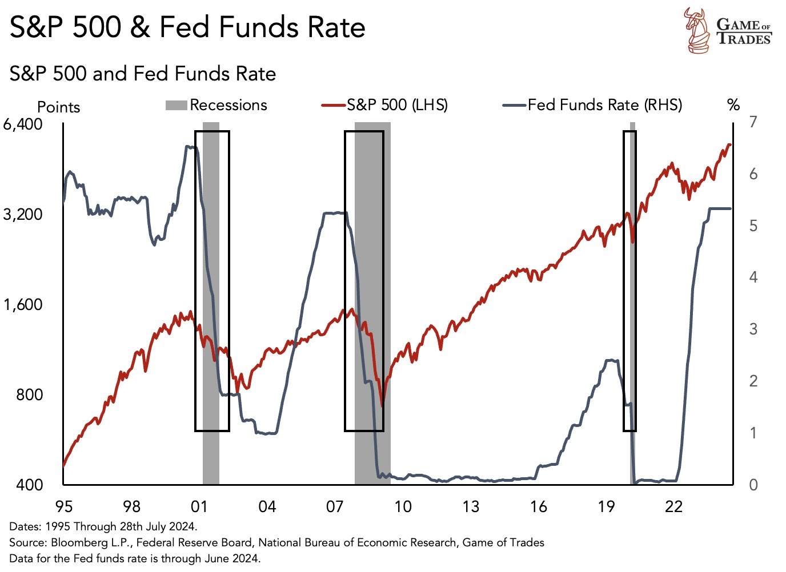
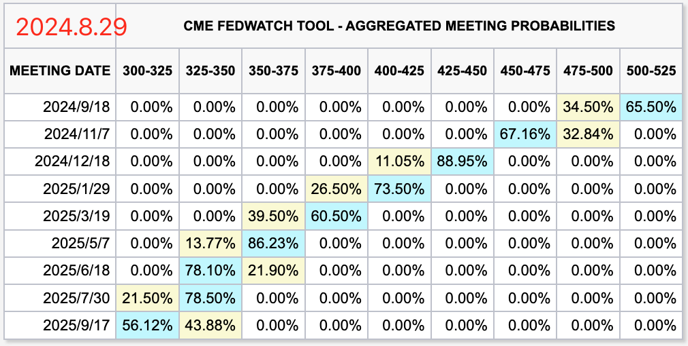

# 金融战败后美元或将被迫涌入加密市场

隔夜BTC暂时企稳59k。现在这市场直入惊弓之鸟，一点儿风吹草动都要抖三抖。昨[“8.28教链内参：金融战美或将败，是暴涨还是先暴跌再暴涨？”]初步前瞻了本轮金融战败后美将面临的几方面后果，主要有三：降息，衰退，金融崩溃。不过，降息不一定崩溃，至少，降息不是崩溃的原因，恐怕它俩都是衰退的结果。

那么为什么从历史数据图表上看，感觉是美联储先启动降息，然后紧随而来的就是衰退，继而美股开始崩溃呢？原因就在于，美联储总是能比市场更早“偷看”到经济恶化的真实数据，而给到市场看的公开数据，则是经过修饰的，并且会延迟释出，从而让美联储总是得以“抢跑”市场。

不过，说实话，美联储和统计局这帮官老爷们实在是太傲慢了一点儿，把人民群众当白痴耍。从数据上明显可以看出，“狼来了”喊多了，操纵效果就会越来越差。市场早就洞若观火，只要你美联储一降息，甚至刚有降息举白旗投降的预期，我就抓紧脚底抹油开溜，高位抛售，才不会傻呵呵地呆在原地等着被埋呢。

所以这种操纵市场的事情干多了，就会搞成了一种“自我实现” —— 因为大家都预期崩溃，于是纷纷逃跑，结果反而就真的造成了崩溃的结果。

美联储失败的剧本其实早在去年2023.9.19教链文章《隔山打牛：金融大崩溃》发表时就已经写好。只不过靠着美劳工统计局粉饰数据，硬扛到今天还没有正式举白旗投降罢了。

从CME降息概率表上看，自下个月开始，美联储转向降息恐怕已经是100%板上钉钉的事情了。除了简中自媒体还有几个崇美学者扬言美联储绝不会降息（言下之意，决不投降，绝不承认本轮金融战败）之外，恐怕连美国人自己都没几个相信这种鬼话。

去年9月文章《隔山打牛》在本轮金融战两大力量战至最白热化时，教链明确指出，由于一方不愿意放弃加息，另一方不愿意放弃汇率，两大神仙斗法的结果，必然是推升BTC和黄金的价格。撰文当日，BTC收盘报2.7万美刀，黄金收盘报1931美刀。至今近一年开启了怎样的上涨，诸君有目共睹。

现在我们要开始为本轮金融战败后，美联储和美元何去何从，开始做一些思量和考虑了。

我们先要考虑一个传统的、经典的美元潮汐闭环，收割的方法和美元的流向。简单地讲，就是加息周期加降息周期，完成两波收割。

首先是加息周期，把美元流动性从全世界抽回美国，拉爆他国杠杆和汇率，通过戴维斯双杀让资产价格脚踝斩，同步发债稀释所有人的财富（第一波收割），经由赤字开支把收割到的美元输送给利益集团，推高美股，把流动性进一步集中到美利益集团及其理财白手套即华尔街机构手中。

布局完成后，操纵经济数据，反转货币政策，开启降息周期。在降息周期，前一步骤中拿到大量美元流动性的美利益集团通过其白手套，冲出美国，冲向世界，面对遍地骨折价的优质资产，大肆收购，甚至可以像廉价并购二毛那样“趁你病买你命”（第二波收割）——凡是自己创过业，在公司急需融资时到处求VC给钱续命，而被迫签下不平等条约（“卖身契”）的人，应该都会对金融资本只愿锦上添花、绝不雪中送炭的冷酷无情深有体会。

第一波收割，是抢走你的钱。第二波收割，是用抢你的钱，买走你的命。

不过，自从中国人站起来之后，美国这一套屡试不爽的金融收割术就有点儿玩不转了。

其实2008年那一次，它就玩砸了。加息周期硬着头皮拉升利息，结果没拉爆别人，把自家的房地产杠杆给拉爆了，自爆成了次贷危机。不过靠着无与伦比的金融传导能力，把危机迅速传给了全世界，搞成了全球金融危机。这杀敌一千、自损八百的招数，也是把全世界给吓怕了。大家纷纷救市，狂买美债，给老美输血，终于算是齐心协力帮着它一起扛过去了。

到底最后还是全世界人民承担了所有。

不过，也得感谢那一次全球金融危机，直接点亮了中本聪的灵感，催生了BTC这项划时代的伟大发明。

到了2016年，老美缓过劲来，吃大白馒头就咸菜觉得有点儿太难受了，怀念天天燕窝鱼翅的奢靡日子，于是就又动了小心思，启动了又一轮的加息周期。这一次，它在全球产业链上同步进攻，一边搞贸易战（限制中对美出口商品，打压需求端），一边搞禁运和制裁（限制美对中出口高端技术，打压供给端），期望能够来一个“两头堵”，毕其功于一役。

人算不如天算。2020年来了个全球大流行病，直接打断了美联储的加息进程，逼迫它迅速把利率归零，还开启了无限放水。不过老美又一次展现出了强大到可怕的抗击打能力：2008年自爆，爆掉的成千上万人的工作和金钱，人家一点儿都不觉得疼；2020年自爆，灰飞烟灭的是数以百万计的人命，人家还是眉头都不皱一皱。这种换个国家可能都要触发国内革命的事情，老美竟然犹如练成化骨绵掌之神功，硬是活生生吞了下去，嗝都不打一个，依旧谈笑风生。这份无敌实力，着实让对手心惊。

江山易改，本性难移。2022年，老美稍微自我感觉好一些了，就立马开始了超高速的加息。它这一方面是要应付高通胀，另一方面恐怕也是要把2020年失去的2016-2019年三年加息的成果尽快补回来。

但是因为速度太快了，小弟都跟不上节奏。美联储才玩了半年多，就把自家小弟硅谷银行、签名银行这些中小行给拉爆了。2023年就看教链文章的朋友应该都知道这些经过。不过你若往深里再多想一层，为啥偏偏是这几个中小行那么傻、那么蠢，不知道自己可能会出现期限错配的问题呢？是不是他们没有接收到一些关键的信息？是谁，给他们制造了信息墙，让他们和大银行、大资本之间出现了信息差？

金融的东西，你不要怕想的太多，想的太深。你要相信，庄想的一定比你多得多，也一定比你深得多。

到了2023年下半年美联储实在是加不动的时候，也就是上文说教链写《隔山打牛》的前后，美联储的失败就已经是将要注定的事了。只不过，它觉得自己还能再撑一撑。坚持一下，再坚持一下，也许对手先投降了呢？

不得不说，这完全是一种战略侥幸，是机会主义的表现。

这第一波加息收割，它就搞得有些仓促。高通胀悬在头上，也就实在是有点儿身不由己。

主要咱们这次没惯着老美。它发债卖债，试图搞第一波收割。咱们也咣咣减持美债。你吸美元流动性，我也吸。咱们拿到大量美元流动性，做了两件事：第一件事，借给有美元杠杆的国家，让他平仓，别被拉爆了，作为交换，就是要和咱们搞货币互换，把美元踢出双边贸易；第二件事，捍卫汇率的同时囤囤囤黄金，带动全世界一起囤囤囤黄金，也推动了其他美元对冲替代品比如BTC的拉升，截胡了回流的美元流动性。

这就让老美很难受了。第一波收割没割到，第二波收割的基础也不复存在了。如果收割不到，美联储是不敢降息的。因为现在高息保持美元紧缩，还能显得美元比较坚挺。如果一旦降息，而无法获得足够优质资产支撑，那么被货币乘数急剧放大的海量美元，就会面临迅速贬值的巨大风险！

如果美元迅速贬值，将会对美元信用造成巨大的打击。这是美国无论如何都无法接受的。

也正因为这层考虑，所以美劳工统计局宁可上半年粉饰数据，也要配合美联储维持高息，就是不敢降息，同时幻想着第二波收割的条件和机会能够从天上掉下来。

可是中国走的两步棋太稳了。时间根本就不站在美联储一边。它的坚持，不过是无意义的硬挺和干耗。它硬挺和干耗的时间越久，胜利的希望反而越发渺茫，崩溃的风险反而越大。这不，萨姆指标都到衰退临界值了？（参阅2024.8.3文章《美股以死相逼》）

况且，两步棋都是阳谋。美元始乱终弃，抽身便走，太过无情，让小国心寒。没有人让美元走，是他自己要走的。咱们只是在他走后，及时上门送温暖罢了。你亲手抛弃的女朋友，还不准别人去照顾了？是否过于霸道？所以说，阳谋无解。

现在马上要周期反转，美元耐不住寂寞，家里的睡完，又想出来睡遍全球了。这就是霸道。想让霸道的人讲一点道理，没有东风、航母、055大驱，恐怕是不行的，所以还得多造一些。

人心都是肉长的。体会过暖男的好，谁还会想去拿自己的肉体去承接村霸的欲望发泄呢？所以说，只要新欢打得过村霸，有足够武力值拒止其于门外，那么就像教链在2023.10.26《美元求仁得仁》一文中说的，「这一次美元拔腿无情地走了，它也就不用再回来了。」

看清了这个局势，也就可以大致推演出美联储举手投降之后，战后事态会如何发展了。

一边是憋在美内部的美元流动性欲火焚身地想出来，另一边是全球没有几位佳人在加息周期中被踹倒等着美元上身，都还站得好好的，依偎在别人的怀抱里呢。想靠自己的坚船利炮强上吧，佳人身边的那位好像也不是吃素的，掂量掂量还真不敢来硬的。

这可咋办？

这边不得不出去，那边老路又回不去了，那就必须得找个新的出口来泄洪、减压。

于是这天量的美元流动性，就不得不涌入对其敞开怀抱的加密市场。

贝莱德到底姜还是老的辣，早就在今年紧锣密鼓地为战后新形势提前布局，上市了BTC和ETH的加密ETF产品，铺好了路，搭好了桥，打通了美国内市场到加密市场的通道，为的就是让届时排山倒海、汹涌澎湃的美元流动性，能够更快速、便捷地冲到加密世界去。

届时，中本聪将会用那慈爱、包容的胸怀，慰藉鲍威尔空虚的心灵。
