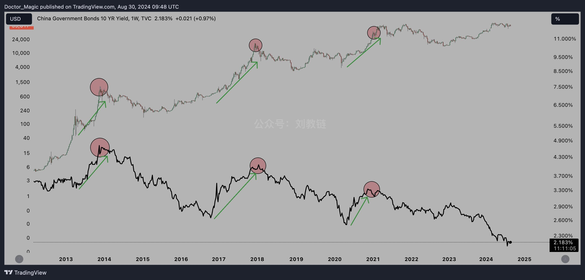
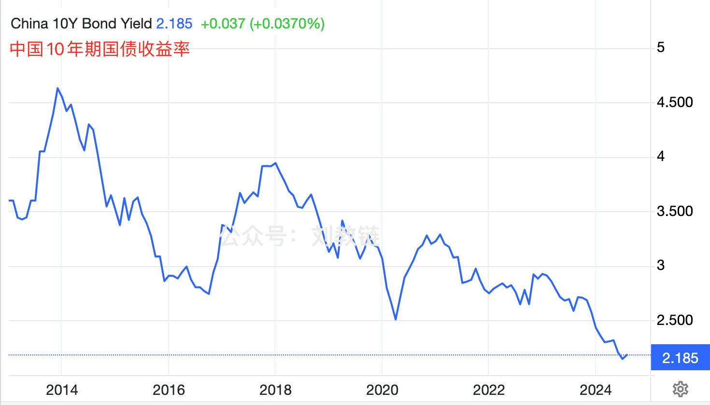
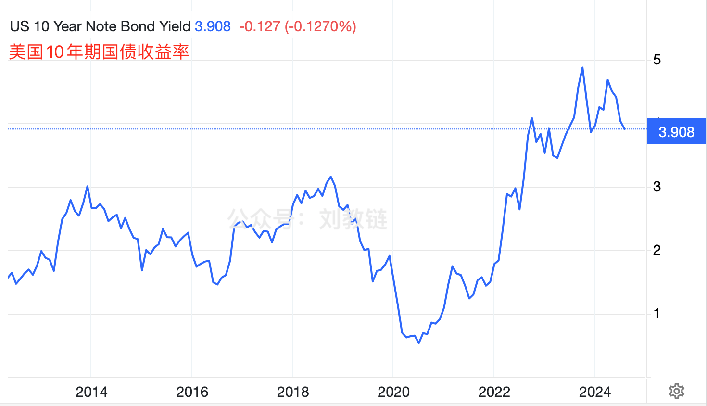
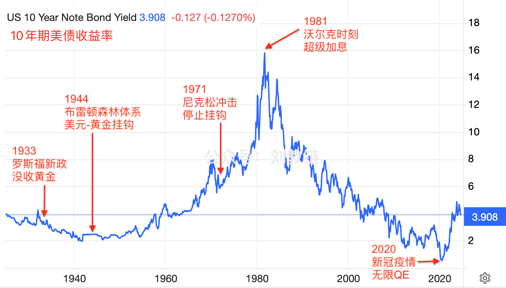

# 中国长期国债收益率与BTC的奇妙相关

隔夜BTC收复59k。今天是8月份最后一天，目测大概率这个月是要收跌。从今年3月份以来的这5个月，你看这盘控得多棒，3涨4跌5涨6跌7涨8跌…… 就像梳子，一齿一间。又似钢琴，一黑一白。

教链在内参里会日常同步宏观经济政策相关的态势和评论，以便各位感知当前局势。这比普通的行业消息，或者你的操作策略和技巧，其实是要更为重要的。毕竟成功过的人都会或多或少地领悟到，相比于自己的辛苦努力和个人奋斗，顺势而为、乘势而起才会让你事半功倍，更快到达成功。

咱们汉语里有个成语叫做“审时度势”，讲的意思就是告诫我们，做事情要选择恰当的时机，把握态势的方向。

“势”，若要译成英语的话，教链觉得可能用 momentum 这个词会比较贴切。它是外在宏观环境表现出来的一种运动方向，以及保持方向的趋势，即物理学上的“动量”概念。只不过，物理学的“动量”是一种有形之物的运动趋势表象，而教链这里谈的“势”是一种无形环境所表现出来的运动趋向。

按照德国哲学家、唯意志论主义开创者叔本华（Arthur Schopenhauer, 1788-1860）的说法，我们所觉察到的势，又不过是其背后意志力量的博弈和显现。

教链觉得，从势的角度，可以把人分为三种情况：第一种人能够造势，或者影响和改变势。这是精英。第二种人能够看清势，但只能顺势、借势，也足以取得或大或小的成就。这是普通人。第三种人看不清大势，或者误判形势，要么随波逐流，浑然不知，要么误入歧途，执迷不悟。这是蠢货。

当然，在这一层思维上继续突破，我们还可以进一步认识到，所谓精英，不过是背后意志力量所选择出来的操盘手。

美联储，显然是精英的典型之一。美国劳工统计局，也是。他们的一举一动，发布的每一份数据，做出的每一个决策，无不牵动着全世界每一位投资者的神经。

今天我们处于一个全球化、信息化、数字化的时代。我们每天都可以接收到大量的数字指标信息，用来指示态势的变化和发展。不过，信息过载，盲人摸象，成了阻碍我们洞悉时局最大的障碍。

要破解这两个难题，一是要剔除噪音，筛选指标，二是要关联交叉，综合研判。前者运用的是“奥卡姆剃刀”的思想，后者运用的是中医整体思维。教链在内参日常做宏观态势感知和综合的时候，就积极借鉴此等思想，来尝试获得拨云见日、剖得真相的效果。

在西落东升的时代大背景下，人们或许习惯上仍然常常被西天美丽的晚霞吸引了全部的目光，但是东方泛起的鱼肚白和万里朝霞，也将越来越值得引起更多的关注和重视。

有外国友人发现，自2013年以来，中国10年期国债收益率的每次反弹趋势，都奇妙地与BTC过往三次牛市进程完美同频：2013年如此，2017年如此，2020末-2021年初还是如此。如下图所示：

中本聪思想告诉我们，不要相信，要验证。于是教链单独找出来中国10年期国债收益率曲线，以及美国10年期国债收益率曲线，来看看实际的情况究竟如何。

下图这是中国10年期国债（下文简称“中债”）收益率曲线：

上文讲了，指标是势的表象，势是意志的结果。

通常而言，债券收益率上升，说明市场在抛售，压低了债券价格。市场抛售债券，说明金融资本的风险偏好在升高，它们在把钱从债券市场撤出，去追求更高风险的高收益率机会。

过去十年，中债收益率总体是在不断走低的，这说明金融资本的风险偏好总体上是越来越低的，也就是趋于稳健和保守。宁可把钱放在长期国债里求一个比较稳定的收益，也不愿意拿出去冒风险搞投资。这符合资本市场的普遍发展规律，即钱越多越稳健、越保守。

所以，保持创业精神，保持艰苦奋斗，是很不容易的。无论是对于谋求做大做强的创业公司，还是对于谋求发展复兴的国家，道理都是一样的。

教链印象中前段时间央妈还专门就某些金融机构不听劝阻，依旧加大杠杆、开足马力朝国债市场盲目猛冲的行为，进行了严厉的批评。好像还逼得央妈亲自出手进行债券抛售，打击这股炒债之风。

但我们要怎么理解BTC在牛市发展阶段和中债收益率高度同频，但在跨周期或者长周期尺度上，走势又是背离的——BTC越来越高，中债收益率越来越低——这一费解的现象呢？

教链能够想到的一个解释是，BTC在单一牛市周期表现为风险资产，而在跨周期或者长周期尺度上表现为避险资产。而中债在短周期是风险对冲资产，长周期是避险资产。

也就是说，当资本风险偏好升高时，BTC上涨启动牛市，中债收益率反弹。当资本风险偏好转向，二者同步见顶回落。但资本总体发展方向是趋于稳健和保守，因此会越来越多地沉淀在抗风险资产里，因此每轮周期过后，总是会回归更多。这也就表现为跨周期或长周期尺度上，BTC的市值越来越高，中债收益率越来越低。

这话倒过来理解，也就是资本用脚投票，默默地表达其意志的见解：BTC在资本看来是一种比较不错的跨周期避险资产。中债也是。

再来看看美国10年期国债（下文简称“美债”）收益率曲线，对比对比：

情况大相径庭。

最近10年来，美债虽然在短期也会表现得像一个风险对冲资产，比如2013年、2017-2018年、2020年末-2022年初的收益率上涨，但在长周期上，它却一反常态，表现的不像个避险资产，而是风险越来越高了——这直接表现为美债收益率的飙升。

也许有人会说，债券收益率是利率影响的体现。但是教链不这么认为。教链认为，无论是人为调节的利率，还是市场定价的债券收益率，都不过是背后意志的不同表象而已。

美债收益率在2020年之后的异常飙升，反映了一个严峻的事实：某些强大的意志，不想继续为美债买单了。

这是自上世纪80年代以来从未有过的挑战。

下图是美债百年走势图（1924-2024）：

可见，从上世纪80年代的沃尔克时刻，直到2020年新冠疫情，美债经历了美好的40年。

这40年里，美债越发越多，收益率却越走越低。这说明美债在市场上大受欢迎，人人争相购买，根本不需要高息促销，反而还被投资者视为避险资产长期持有。

不知道美国的精英们在暗喜于发债印钞如此容易、如此爽的时候，有没有想过，这长达40年的无比美好的黄金年代，真正的原因到底是什么？

这一段美债百年历史上时间最长、收益率下降最稳定、避险性质最强的40年，正好和中国改革开放40年相吻合。

成就美债1980-2020的40年辉煌期的，不是别人，正是中国。这是我们从数据中得出的赤裸裸的结论。

这长达半生的黄金年代，在2021年阿拉斯加的坦诚对话之后，戛然而止。

中方的话，彷佛是对那溘然逝去的、令人感觉彷佛无限美好的40年做了总结陈词：「我们把你们想得太好了; 你们没有资格在中国面前说，你们从实力的地位出发同中国谈话。」

现在，美联储主席鲍威尔有些左右为难了。加息，美国经济恐怕要衰退。降息，以后财政部的美债还怎么卖？

目前来看，对美债和中债的前瞻对BTC的后市给出了完全相反的指引：

如果我们观察认为美债收益率4%处于局部高点，接下来要下降，那么这一判断或将指引BTC进入下跌周期。

如果我们观察认为中债收益率2.2%处于局部低点，接下来要反弹，那么这一判断或将指引BTC进入上涨周期。

亲爱的读者，请不妨独立思考一下，你会押哪个选项呢？
