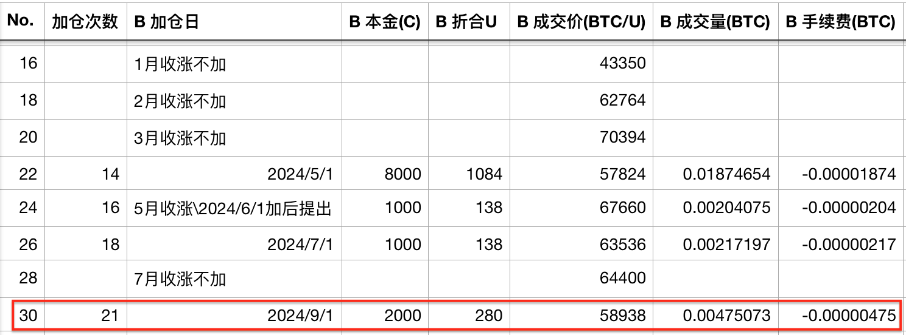
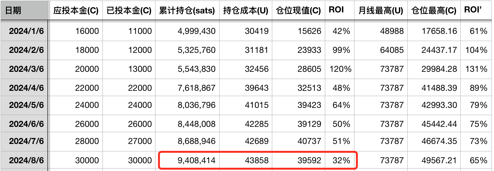
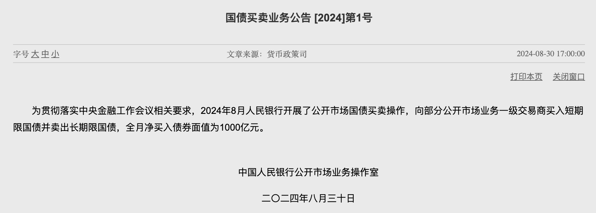
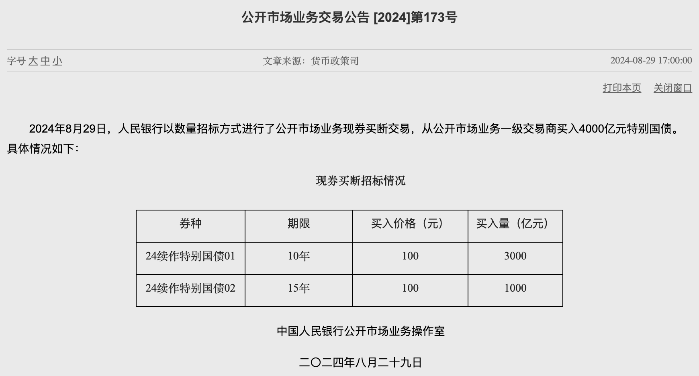
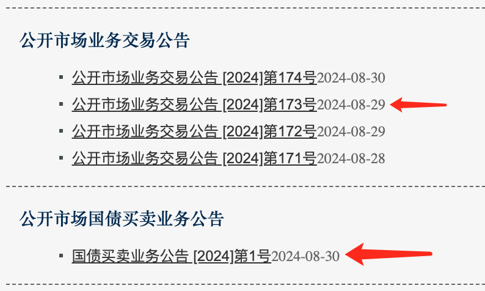

# 央妈购债欲何为 —— 十年之约＃30（ROI 32%）

十年之约系列上一会书写到《日元偷袭珍珠港》，那是第29篇。今天《央妈购债欲何为》是第30篇。

今天又是无量回撤的一天。8月份BTC拉了个很长的下影线，收跌于59k。今早刚跌破59k时教链顺手做了一下十年之约第21次逢跌加仓。下午BTC继续下滑到了58k一线。

本次投后持仓增长至940万聪，持仓成本拉高至43.8k，按最后一次加仓价计算投后收益率为32%。现在是满仓状态。

* * *

现在距离美联储下一次议息会议，即9月17-18号预定召开的9月份议息会议，还有半个多月。目前市场处于降息落地前的博弈期。不过，博弈的焦点从降不降息变成了降多少。是降25bp还是50bp？

有一种看法是，美联储迫切希望大降快降，因为经济真的有点儿扛不住了，但是，如果起步太猛，又恐市场感受到美联储的惊慌失措，印证了美经济衰退的猜测，反而容易造成市场踩踏 —— 因此，若是降25bp，云淡风轻的，反而有利于市场修复；如果突然暴降50bp，表现出急切救市的张皇，倒是可能引发市场暴跌。

事实 - 观测 - 数据 - 决策 - 解读 - 心理 - 博弈，一层一层叠起来，一环环串起来。金融市场的逻辑，从来都是混沌的。混沌到一只蝴蝶扇动翅膀，都有可能引起一场死伤惨重的飓风和海啸。

* * *

在美联储降息博弈的聚光灯之外，8月底央妈悄然而公开地做了一件大事。什么大事呢？就是在公开市场，也就是二级市场，买卖国债。

这就是2024.8.30公布的“国债买卖业务公告 [2024]第1号”。

公告说，「2024年8月人民银行开展了公开市场国债买卖操作，向部分公开市场业务一级交易商买入短期限国债并卖出长期限国债，全月净买入债券面值为1000亿元。」

这里插一个问题。教链看到有很多人去大谈特谈那个“公开市场业务交易公告 [2024]第173号”的续作特别国债的事。其实那个事并没有什么特殊的。怀疑是他们集体迷路，找错了关注点。

首先这两件事，在央妈的公开市场业务分类里就不是同一个类型。后者放在“公开市场业务交易公告”下面，而前者放在“公开市场国债买卖业务公告”底下。

可见这两件事不仅不是一个事，甚至都不是同一类事儿。

续作特别国债这里简单说下。其实这就是对2007年为了成立中投公司而发行的1.55万亿rmb的特别国债的常规展期操作。当时的1.55万亿rmb其实并没有印出来，而是换成美元给财政注资到中投公司作为初始资本金了。前些年这批特别国债也陆续到期了几部分，都是做了同样的“续作”处理。

也就是说，这1.55万亿rmb从头到尾就没有投放到国内市场，甚至从来就没有存在过。一开始没有，现在也没有。

相反的，如果央妈完全不对其做展期操作，反而会导致国内市场（财政的钱也是钱）减少掉高达1.55万亿rmb的货币（国债以rmb计价，理应是用rmb来偿还），形成巨大的通货紧缩。这对于当前国内经济的“低血糖”显然是很不好的。

大家都知道，rmb的发行机制一直都是以外汇占款作为主要支撑，而外汇里面，其实说白了美元或美元资产是绝对的大头。看央妈的资产负债表就很清楚的。忘了的朋友可以温习一下教链2023.10.31文章《央妈的“秘密”》。

当年财政部从央妈手里借走了价值1.55万亿rmb的美元，央妈只是给它记了个账，这被称为“特别国债”。这些美元被注资到中投后，中投就去海外投资收购各种资产，相当于又回流到全球市场了。如果不是被借走对外投资，那么可能就会作为外汇占款对应在国内发行基础货币rmb，最多在国内可以增发出来1.55万亿rmb。这反而才是“印钱”了。

听教链这么一说，各位是不是明白了，2007年的这个特别国债，反而是减少了向国内印出最多1.55万亿rmb（也就是人们常说的“输入性通胀”）的可能性。

另外就是还有人说这个是无锚印钞。这就是不懂乱喷了。可以说，“无锚印钞”这四个字错了一对词儿。既不是“无锚”，也没有“印钞”。这1.55万亿rmb当年就有对等的美元作为底层资产的，这如何称为“无锚”？而上面教链又解释过了，这1.55万亿rmb甚至根本就没有印出来过，又何谓之“印钞”？

还有说QE（量化宽松）的，那就更是没谱了。

好了，续作特别国债先说这么多。本来说简单讲下，一不小心又说了不少字儿。

其实更重要的消息反而是教链上文说的另外一个公告，也就是2024年第1号国债买卖业务公告。

公告里说，卖出长期国债，买入短期国债。

这个好理解，就是把长债置换成短债。

这个操作有什么用呢？主要作用就是对长短债的市场进行调控。

昨天2024.8.31教链写了篇文章《中国长期国债收益率与BTC的奇妙相关》，读过的读者应该至少会get到这么两点：

第一，买入国债会拉升其价格，从而压低其收益率；反之，卖出国债会打压其价格，从而拉升其收益率。

第二，目前中国长期国债（长期中债）收益率处于低点。

当然，昨天那篇文章总体上是为了引出一个惊人的研究发现，那就是从过去十年三轮BTC周期来看，长期中债收益率拉升和BTC牛市高度同频。

好，请把get到的这两点，再和央妈1号公告置换国债的操作放在一起看。

把点连成线，把线交织成面，把面升维成体。绝大部分人只能看到线，也就是1维。但是你一旦能够升到更高维度，就能从交叉关联中洞悉别人视而不见的东西。现在，我们也只需要2维的彼此交织就够了。

卖出长期中债，这就会打压其价格，从而拉升长期中债的收益率。买入短期中债，这就会拉升其价格，从而打压短期中债的收益率。

这显然是央妈发出的对国债市场的调控信号。和昨天文章教链说过的，央妈警告盲目投机长期国债的资金，相互印证了。

进一步思考三个问题：

第一个问题：央妈对长期中债的价格打压，会是一时兴起呢，还是会作为一段较长时期的基本政策？

第二个问题：如果央妈确定了要在一段较长时期打压长期中债的价格，那么是否会令长期中债走出一段收益率拉升（反弹）的行情？

第三个问题：它是否有实力做到这个调控目标呢？

好了，再回顾一下上文。交织起来看。如果对这三个问题的答案都是“是”的话，如果昨天惊人研究发现反映了一种内在规律的话，那么加在一起，将会发生什么？这应该不需要教链多讲了吧？

反正2023.9.19教链在文章《隔山打牛：金融大崩溃》中说，央妈如果坚决顶住美联储加息，捍卫汇率的话，就会导致黄金和BTC被推高结果。事实证明，一年过去，央妈还真是有实力捍卫住了汇率，也就有了当时文章所谈的结果。

这一次，央妈又要开始拉升长期中债收益率了。这一次，你相信央妈有这个实力吗？

这个问题讲完了。看一下另一个更重要但更不起眼的问题。

回头再看一遍公告，虽然只有短短一句话。

公告里还有半句，净买入债券1000亿。也就是说，把长债置换成短债，并没有100%置换，而是多买入了1000亿rmb的短债。

教链觉得，上面说的那些咋咋乎“无锚印钞”、“量化宽松（QE）”的人，其实可能应该抓住一点大做文章的，反而应该是这1000亿净买入。

这1000亿净买入债券，才是真正意义上的用自家的国债扩表印钞。

央妈的一小步，rmb的一大步。

回顾上文说的rmb发行机制。靠美元外汇来发行rmb，这不还是在拿美元给rmb做信用背书么？

美元怎么来的？美元主要就是美财政部发的美债，加上房地产抵押债券（MBS），作为底层资产，发行出来的。

所以，穿透来看，rmb大部分是以美债为基础发行的。这里说的是央行发的基础货币。

那么，问题来了，为啥一定要靠美债来发行rmb，就不能靠中债来发行rmb呢？

rmb的成长，终有一天，要摆脱对美国的依赖，实现真正的独立自主。

独立自主的第一步，就在2024年8月份，正式迈出去了。虽然，只是毫不起眼的1000亿。多么小的一小步。

这注定会是历史性的一刻。
