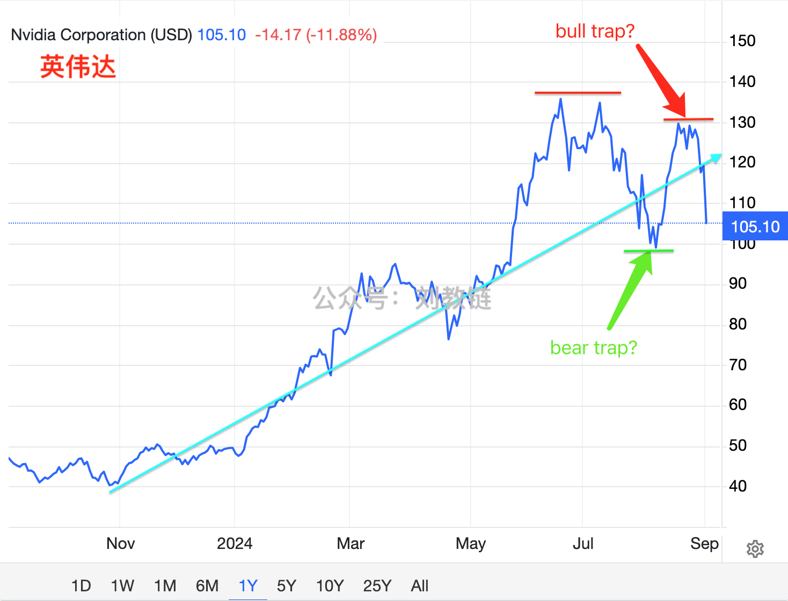

# 交易的目标是他人的亏损

隔夜BTC继续向下破位，跌落至56k一线。或许和美股崩溃有关。英伟达闪崩了10%多。这让前几天喊8/5是bear trap的KOL一时无语，8/20前后的第二次高点随时可能转换成bull trap。

昨天教链写了一篇加密“心经”——《加密小白生存避坑简明指南》。正文仅753个字，浓缩了教链穿越加密周期一路走来的所感所悟。

在这条路上，“修仙成佛”，可分三步：一步曰“生存”、二步曰“盈利”、三步曰“财务自由”。生存，要能穿越牛熊周期生存下来，没有被割、被盗、亏光离场。盈利，要是长期稳定盈利，能够连续5年、10年获得持续为正的CAGR（复合年化收益率）。财务自由，要能靠资产被动收入覆盖日常开支，不需要投入时间交易。

还有另一条路，交易。看似容易，实则凶险。看似捷径，实则绕远。千年修炼，修不成仙，反倒成了吃人的妖。

在教链看来，由妖成佛亦有三阶段：一阶段曰“被吃”，二阶段曰“吃人”，三阶段曰“放下屠刀、立地成佛”。

99.9%走上妖道的人，终其一生都卡在第一步，成了被吃人的妖反复收割的“韭菜”，一直炒一直亏，陷入“打工赚钱-炒股炒币亏钱”的无尽轮回之苦。

他们始终无法突破第一阶的原因有很多，决定性的一点是，他们的底层思维没有突破。

他们天真的以为：交易的目标是自己的盈利。

不信，你可以采访一下他们，来炒股炒币是为了什么？他们基本上答案出奇一致：为了自己赚钱。

把交易目标理解成自己盈利的人，大概率只会成为傻白甜的小韭菜，饿虎猛狼口中的小白兔。

交易的目标是他人的亏损。他人的亏损才会是你的利润。

是的，走上这条路的人，没有退路。要么吃人，要么被吃。想想布林肯的“餐桌菜单论”：你不在餐桌旁，就在菜单上。

每一次上牌桌，如果你不知道谁是那个输牌的人，那么你就是那个输牌的人。

每一次下场交易，如果你不知道谁会亏损给你提供利润，那么你就是那个亏损并给别人提供利润的人。

不管在生活中你是一个多么满面春风、彬彬有礼的人，一旦杀入场内，你就必须立刻化身为一个黑暗、冷酷、无敌的武士，神挡杀神，佛挡杀佛。

教链见识过三阶段成佛者之真身。

教链敬畏每一个升级二阶段的常胜将军。

教链怜悯每一个困在一阶段被反复屠杀却始终执迷不悟的小散兵。

教链批判每一个四处宣扬妖道成佛是捷径的别有用心的家伙。

教链有时劝人为善，不要杀生。有人就与教链争辩，讲这条路也能修得大成功，而且更快。

其实，教链根本就不是在谈这条路通不通彼岸，而是提醒上路者：你杀气不足！

杀气不足，此去恐凶多吉少呀。

你只是一个平凡人。根本就举不起屠刀霍霍，砍不落人头滚滚，又如何能修得到三阶段“放下屠刀”？

游资大神徐翔都没能修到三阶段，凭啥你觉得自己能？

不如放弃这条路，把本来要亏光的那点儿钱，省了下来，买一壶酒，把酒而歌，如何？

把酒叹平生
把往事熬成药
一秋风雨敬桑田
从此无年少

我问月亮借华韶
再听秋风诉情长
一段芳华煮清欢
琐碎了平凡

……
