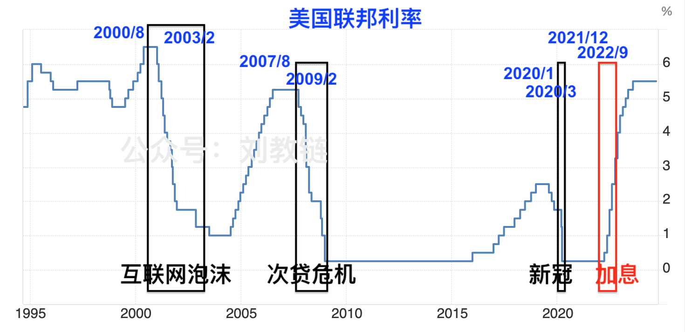

# 降息将至，美国真的会崩溃吗？

隔夜BTC一度跌落至55k一线，后又收复失地，回升至58k上下。昨天有好几位朋友就某海外机构研究者提出BTC减半效应和四年周期已不复存在的观点询问教链，教链做了详尽的剖析，尽写于内参[“9.4教链内参：BTC减半效应真的消失了吗？”]，供有兴趣的朋友自行取阅。

随着美联储9月议息会议临近和对降息的预期，市场竟开始莫名恐慌。这一点，从市场上弥漫着大量空头情绪，以及过度的空单，便可见一斑。

芝加哥期货市场预期9月份美联储降息概率100%。其中有55%的概率降息25bp，45%的概率降息50bp。年内3次降息，总降息幅度将达100bp，即1%。

萨姆法则（sahm rule）已拉响衰退警报。美股似现双顶。英伟达闪崩超10%。…… 市场上演危情时刻。

降息崩溃论开始蔓延。不仅是中文社群，海外英文社交平台上面，也充斥着类似言论。认为美联储会在操作层面搞砸，笃定美国经济甚至美元霸权会就此全面崩溃，这显然是犯了战术上的轻敌思想。这种速胜论的调调断不可取。

教链时常谈及美联储的困境，美元霸权的末路，一切被霸权骑在屁股下面的国家（包括中国），都终将通过自己的奋斗，和美国平起平坐，乃至全球货币体系“三分天下”的“新隆中对”。如此种种，都是战略层面的研判。

战略上，不可畏敌。战术上，不可轻敌。

一方面，要承认帝国的强大；另一方面，要认识到帝国霸权终将落幕。二方面是辩证统一。投降论者只有一而没有二。速胜论者只有二而没有一。不要学投降论者下跪，也不要学速胜论者意淫。

当看不清前方的路时，不妨看看来时的路。

教链把过去40年的美联储利率调控历史，美股标普500指数走势历史，以及黄金走势历史三份图表拉了出来，仔细端详。

这40年，是中美共同推动全球化发展的40年，也是人类社会步入信息时代和互联网时代、移动互联网时代的40年。40年风云变幻，40年沧海桑田。

在过去40年中，美联储有过4次典型的货币政策干预行动。其中3次被动应对的降息，1次主动为之的加息。

这4次行动，无一例外都伴随着美股的短暂崩溃：

第1次，2000/8-2003/2，互联网泡沫破裂，美股重挫。美联储降息应对，但速度较慢（近3年），且终端利率并未降至0。

第2次，2007/8-2009/2，次贷危机，美股真的崩盘，低点甚至比互联网泡沫破裂的低点还要低。美联储降息出手仍然慢了，在花了一年半时间才最终把终端利率降到0之后，美股触底反弹，开启了十年长牛。

第3次，2020/1-2020/3，新冠疫情，美股接连熔断。这次美联储提前开启降息，并在美股触顶崩溃时光速降息，2个月时间就降到了0利率。

第4次，2021/12-2022/9，美联储加息，美股回调。这次是美联储以抗通胀之名义开启加息，主动刺破了泡沫。过去美股都是顶着加息上涨，但是这次一加息就崩溃，有些不同寻常。

看似一个谜团。教链希望能够找出过往美股能够顶着加息上涨的原因，以及这次没能顶住前半程低位加息，但却顶住了后半程高位加息的原因。

于是教链又把过去40年黄金的走势图拿过来一起看。

先思考一个问题：既然巴菲特批评黄金这种零息资产没有利息或分红收益，为啥有人会买它呢？（不考虑工业用途，也不考虑感情因素，仅考虑理性投资者）

答案应该是，零息资产是对负实际利率的对冲。实际利率为正，零息资产下跌。实际利率为负，零息资产上涨。

这么看来，如果我们把黄金涨跌看作是一种利率现象的话：

2005-2007年那一波加息，看起来名义利率加得挺猛，但是由于黄金在快速上涨，所以我们知道，市场在定价实际利率依然不高，甚至为负。所以，这波加息并没有摧毁美股的上涨，直到高息把次贷杠杆拉爆。

2011-2015年，虽然美联储一直在保持0利率，但是由于黄金在2011年下半年就见顶回落，一直到2015年底触底，所以已经起到了加息的效果。这样等到了2016-2020年开始提高名义利率，黄金开始触底回升，两相抵消，大大缓和了实际利率的提升，从而保证了利率调控的平缓性，没有中断美股复苏的十年长牛。

2021-2022年，这加息前半程，黄金同步下跌，这实际上造成实际利率抬升的程度被加强了，大大超过了名义利率的增加。这就把美股直接给干崩了。待到了后半程，虽然名义利率处于高位且继续上调，但是黄金也开始迅速拉升了，这就等效于说实际利率其实反而有所缓和，于是美股也就见底复苏，甚至创出新高。

分析到这里，结论也就呼之欲出了：正是因为零息资产的上涨，对冲抵消了名义利率的高息，缓和了高息的压力，推动了风险资产的牛市。

接下来，美联储要降低名义利率了。

那么，如果黄金继续上涨，就相当于加强了美联储降息的力道。反之，如果黄金同步下跌，那么就会削弱美联储降息的功效。

显然，前一种情况可能更有利于实现美联储心念念的软着陆。

至于BTC，它既是零息资产，又具有风险资产的属性。

讽刺的是，黄金和BTC的上涨，恰恰代表了美元的衰败。

美联储的目标，似乎也只能在“软着陆+美元贬值”和“美元坚挺+硬着陆”之间二选一了。
