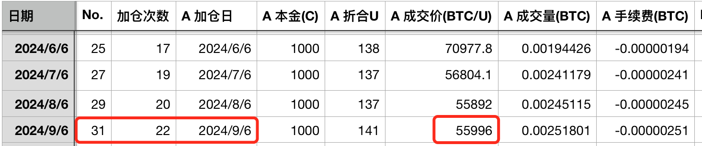
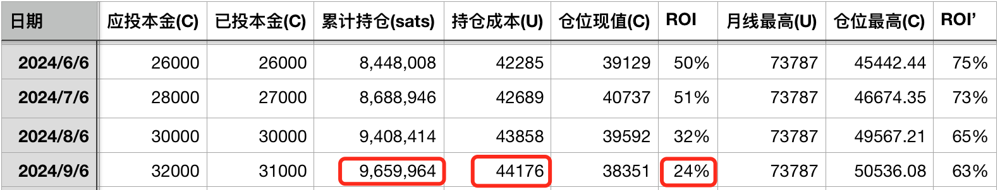
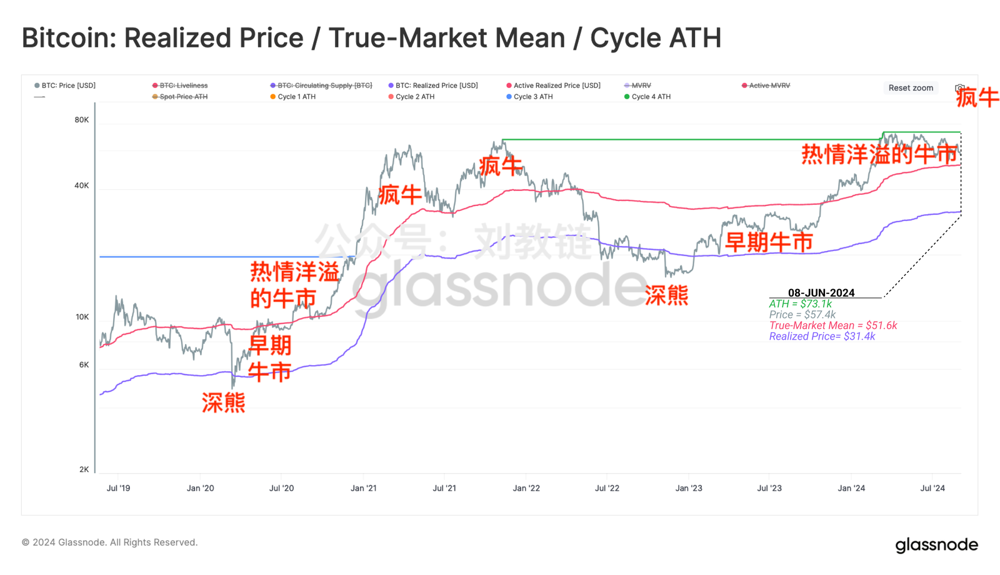
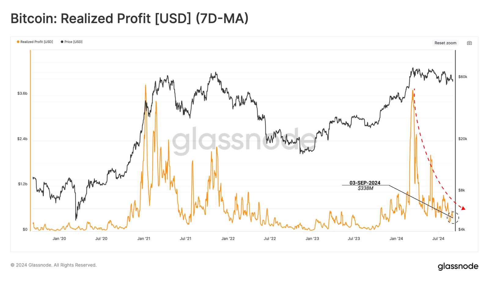
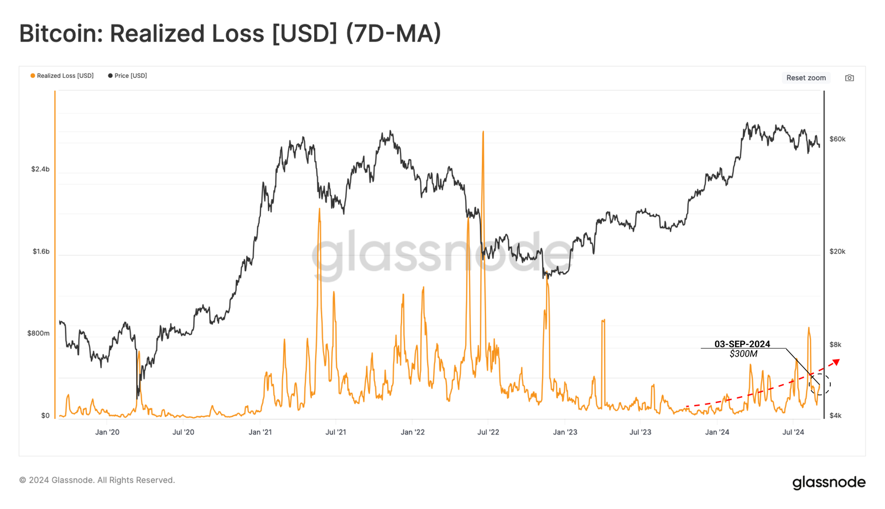
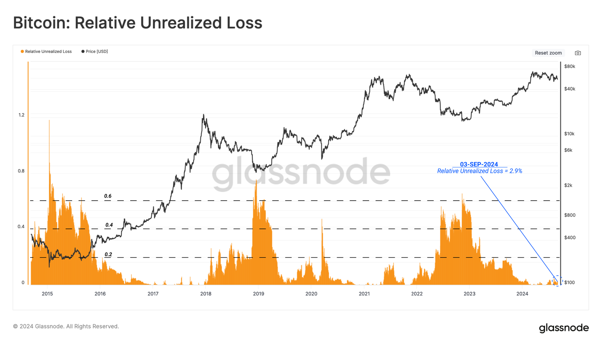

# 该割肉的都割完了 —— 十年之约＃31（ROI 24%）

隔夜BTC回撤到56k一线。这给今早儿执行十年之约定时加仓创造了极好的捡便宜机会。于是速速出手，以不到56k的价格完成了本次加仓，美滋滋。这是《八字诀 · 十年之约》实盘见证计划第31篇报告，第22次加仓。

不知不觉，这已经是十年之约计划实施的第二个年头。本次投后持仓量增长到966万聪，持仓成本4.4万刀，收益率24%。现在由于btc回调加rmb升值，所以导致了对ROI（投资回报率）的“双杀”。

教链在[“9.3教链内参：USDT假性正溢价和BTC下跌的关系”]中已经说过，美联储降息投降在即，rmb对usd的升值，usdt假性正溢价，多个点连起来看，明眼人都能看出来，教链在一年前的2023年9月19日文章中所阐述的“隔山打牛”局已经可以收工了。

美联储正似太上老君的座下青牛，拿了老君的金刚琢，套走天下流动性。但是，终究孙悟空还是找到了它背后的主人，降服了青牛精，把金刚琢套在了牛鼻子上。套天下人的法宝，终究还是成了套住自己的枷锁。青牛精也就乖乖地跟着主人太上老君回天庭复命去了。

现在这市场究竟是熊市还是牛市？按照数据分析的说法，当前我们仍然处于热情洋溢的牛市阶段 —— 虽然这似乎与最近的“体感温度”不太相符。

自打3月中旬突破2021前高、再创历史新高以来，从“已实现盈利”来看，该逃顶的都已经逃顶了，从”已实现亏损”来看，该割肉的也差不多都割完了。

这么一来，浮亏也就所剩无几。浮亏减少，可以是因为价格快速上涨，大家都在浮盈；也可以是因为该割肉的都割完了，只剩下长期持有者的浮盈仓位。最近半年来，BTC整体在震荡下行，所以，并不是前一种情况，而是后一种情况。

教链曾在2021.6.30文章《小杂感》中写过，韭菜有三宝，一曰高位接盘，二曰低位割肉，三曰回本止盈。

3月份的逃顶，可能夹杂着很多2021年牛市高位套牢盘解套“止盈”。近半年越跌越多的割肉，大概就是3月4月追高进场、高位接盘的短期持有者，忍受不了越买越跌，于是挥泪斩马谡，低位割肉、认亏离场。

可见，虽然在市场上赚到钱不容易，但是亏钱真的是挺简单。

如果你真的明白了怎么亏钱，那么也就离盈利不远了 —— 反其道而行之即可。
