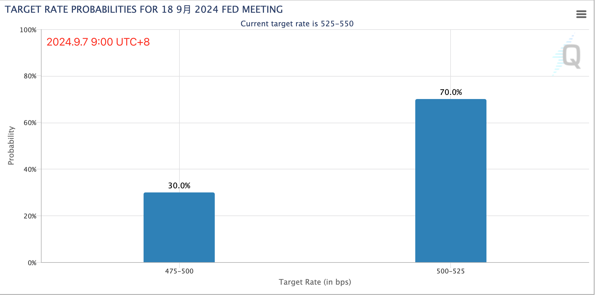

# 取胜之道的秘密就是做好自己的事

周五晚间美国非农就业和失业率数据出炉，具体数字在昨晚[“9.6教链内参：美国非农数据出炉，市场押注降息+不衰退双重利好”]里已经做了详细介绍和剖析，此处不再赘述。

就在数据公布后一刻钟左右，纽约联储主席威廉姆斯喊话，准备开启降息进程。现在可能除了比美联储更懂美国货币政策的中国专家和大V之外，没有人不觉得美联储不降息了。

现在唯一的焦点落在了美国经济是否衰退这个问题上。昨天失业率数据还不错，暂时脱离了所谓萨姆法则的衰退指标。所以数据20:30出，到22:30两个小时，美股表现尚稳。但很快就开始支撑不住，三大股指齐齐下跌。

BTC的空头也趁机兴风作浪。一度把BTC从56k给下压至53k以下。看起来是奔着8月5日48k一线的目标而去，只是力有不逮而已。

很显然，对后市最好的情况是美联储降息，同时美国不衰退。只不过，一群坐在办公室里不接地气的交易员，哪里知道怎么判单衰退不衰退，还不是看统计局和美联储的脸色？

这就有意思了。如果美联储稍稍降息25bp，反而会让市场觉得，“一定知道更多内幕”的美联储如此云淡风轻，那应该没啥大事。反倒是如果美联储大幅降息50bp，有可能给市场传递一个错误信号，觉得美联储是不是已经偷窥到经济要完，反而可能加剧市场恐慌，导致了崩溃的自我实现。

现在，华尔街也有些精神分裂了。昨晚数据出台后，据9.6教链内参记载，市场定价降息50bp的概率一度超过了降息25bp。这是市场开始自我恐慌。于是就在教链发出内参的一刻，美国三大股指开始集体跳水。

但是，这看起来更像是一种情绪性的冲动。很快，情绪冷静了下来，降息概率又发生了逆转。现在，最新的数据显示，降息50bp的概率回撤到了30%，而降息25bp的概率上升到了70%。后者远远高于前者。

毕竟，如教链2024.9.5文章《降息将至，美国真的会崩溃吗？》中所介绍的，近40年降息叠加崩溃的历史经验，无论是2001年、2007年还是2020年，都有着其特殊的内外部因素。

2001年，出现了外部黑天鹅“911事件”，深刻改变了美国的国运。

2007年，出现了内部黑天鹅“次贷危机”，打得华尔街和美国整个金融业一个措手不及，一盆冷水浇了个透心凉，才知道自己这次“玩砸了”。

2020年，出现了外部黑天鹅“新冠疫情”，直接打断了美联储的加息节奏，强行阻断了美元环流，并在接下来忽热忽冷地折腾下，让美国经济成功患上了“高血压”。

现在美联储的技术更为娴熟了。运气也还不错。对内，它可以灵活运用甚至出台新工具（比如BTFP），托住金融系统。对外，目前并未出现动摇美国国本的黑天鹅事件。早已启动的俄乌和巴以冲突，虽然意外，但对美反而有利，有利于促使欧洲资本逃往美国，或者打出欧洲资产抄底机会。

战略上的取胜之道，其实就是干好自己的事，不要把命运寄托在他人的崩溃或不崩溃之上。

正如孙子兵法说的，不可胜在己，可胜在敌。先为己之不可胜，而待敌之可胜。故曰，胜可知而不可为。

可以说，美国这些年来方寸大乱，恰恰就在于国之战略，违背兵法之言，不把重心放在做好自己的事，却整天把目光、精力和预算放在干涉别人的事上面，拳打这个，脚踢那个，打压这个，制裁那个，最后不仅没能扒下敌人的裤衩子，反而把自己的屁股露出来了。

反观中国是怎么做的呢？那就是坚定做好自己该做的事，而且要把自己的计划公诸于天下。美国联邦通信委员会的专家南森·辛明顿（Nathan Simington）在他近期发表在知名杂志 American Affairs 的题为《China Is Winning. Now What?》的文章里是这样写的：

「尽管“中国不可捉摸”或“中国喜好秘密行事”的刻板印象仍大行其道，但中国媒体却信息量极大，领导层也常常公开商讨问题。这对西方来说似乎很奇怪：其实中国一直以来都公开、反复地把全部筹码摆在台面上——通过实现技术和产业主导来改革国际秩序。这些声明往往由中国政府在重要活动中用中文发表，也出现在内部使用的政策文件中，所以真没必要认为中国话里有话：所见即所得！既然中国显然打算持续推进这些计划，那无论我们看法如何，中国的计划都是当今大国竞争的关键。我们不必认为这些计划是最优的，但必须承认它们确实塑造了中国政府的行为和选择。」

我们每个人做事情，也要学会独立判断，自主行动，自我负责，不把成功的希望寄托在多变的外因之上。不管风吹雨打，我自闲庭信步。无论美国崩不崩溃，我都能实现自己的目标，这才是好的战略，万无一失的战略。

随着娃渐渐长大，也越来越有一些小叛逆。我就会告诉他们，叛逆有两种，一种是摆脱家长的判断和指令，要自己作独立的判断，这是好的；另一种是故意与家长对着干，这本质上和盲目听从家长是一样的，这是坏的。你应该有自己的主见，自己的行动不应该以别人的意见为准，既不应因别人赞同而去做，也不应因别人赞同而故意不做，既不应因别人反对而不去做，也不应因别人反对而故意去做。你应该判断自己兴趣和利益所在，然后按照自己的判断去做。

我们浸淫市场，也应有自己的主见。多方面意见都可以听，多元信息都可以收，但务必要有自己的思考和判断。拒绝别人的荐币，拒绝别人的带单。既不盲从，也不叛逆——本质上这都是幼稚。要以坚定不移的战略意志，和不屈不挠的努力，稳步地实现最终的胜利。
