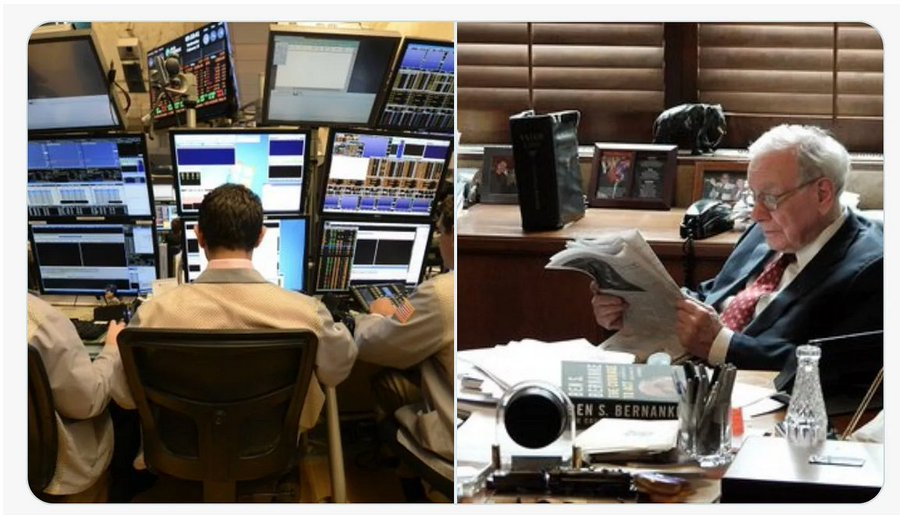
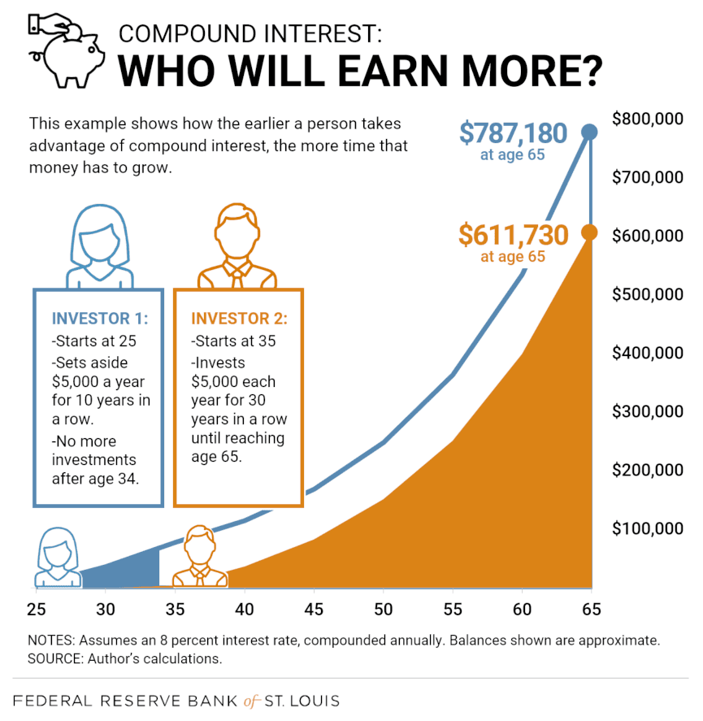

# 投资要趁早

BTC在降息恐慌下跌后暂于54k一线企稳。有趣的是，这一“针”只插破了53k，此前看到5万以下的Arthur Hayes却草草平空了（参阅[“9.8教链内参：看牛陷阱还是看熊陷阱”]。见好就收，溜之大吉。哈哈。

做一个正确的投资者（双关语：在英语中，正确 = 右边 right）。不要做下图左边的交易员。

有人说，投资要趁早。因为复利的力量，主要就是通过时间显现。

下图是圣路易斯联储银行的一个试算。

有两个投资者：小美和小张。年纪相仿。他们投资于同一个标的，复合年化增长率CAGR为8%。

小美从25岁开始投资。每年投资5000美元。连续投入10年。34岁以后不再继续加仓。

小张从35岁开始投资。每年投资5000美元。连续投入30年。一直坚持投入直到65岁。

等小张65岁的时候，他的仓位累计价值已经增长到了61.2万美元。

但是，小美的仓位价值却已经增长到了78.7万美元。比小张的61.2万美元还要多17.5万美元！

想象一下，小张和小美本来是同学。小美本科毕业就参加工作赚钱了，赚了钱才能有钱投资。小张又是考研又是读博又是出国又是深造又是当博士后，就这么多折腾了十年。

最后的结果呢？

十年寒窗，不如早早建仓。

小张已经混成老张，努力定投30年，还是追不上小美年轻漂亮的时候仅用5万美元建的仓位。

这才是CAGR 8%，大概也就是美股股指的长期回报率水平。那么，如果小美早年买的是BTC呢？

白小美可能早就晋级成了白富美。

任何事情都是有成本的。教育也一样。教育最大的成本不是学费，而是时间和青春。

这一代家长对孩子教育的投资是过热的。在“双减”之前，学区房、课外班简直是标配。可是，又有几个家长朋友真正把给娃的教育看成是一种长期投资，用投资思维去冷静思考一下：你的娃真的有那个潜力值得去重金培养吗？你不计成本投入进去的资金和时间成本，真的是一笔划算的买卖吗？鸡娃投入的巨额成本，如果换成BTC囤起来，留到娃大学毕业走向社会后给他/她作为梦想基金，是不是会给孩子一个更加幸福快乐的人生呢？

写到这里，想起来之前有个挺火的视频，随机采访路人问，上清华和500万，怎么选？

教链忽然觉得，这其实并不是二选一的问题。这两个问题应该由两个人来回答：

娃负责上清华。你负责500万。

即，如果你家娃真的有天赋，保证他基本的教育，他就应该凭真本事自己考上清华。

而你应该做的，是鸡自己，等娃清华毕业的时候，确保自己能拿得出500万交给他，支持他追求自己的梦想。

从上面圣路易斯联储银行的推算也明显看出来，起步就有500万，比起先走十年时间弯路才开始起飞，人生的差别有多么巨大。

当然，更大的可能性是，娃没有上清华，你也没有500万。

因此，实事求是一点，能考什么学，就上什么学，能赚几个钱，就赚几个钱。别把自己人生的遗憾，变成给下一代的盲目投资。这实在是你强行套在娃头上的枷锁，却还自欺欺人的说，你为娃付出了这么多，他怎么不认你的好。

回过来讲，为什么小张十年寒窗，不如小美早早建仓？

归根结底，不是小张不努力，不是小张不上进，不是小张没理想，就是因为小张起步晚。

年轻的时候穷。赚不了几个钱，再怎么省，也省不下几个钱。但是，年轻时候省下来的仨瓜俩枣，远胜中年过后的拼命找补。今天投1块钱，也许胜过十年后投10块钱。

年轻时要努力加油干好工作，很容易把赚到手的钱快速翻番、翻几番。积累本金的速度会大大加速。远胜中年人的努力，只能是努力送外卖或者努力跑滴滴，再怎么努力也很难实现爆发式增长。没有本金的爆发式增长，就很难快速建立起足够厚重甚至将来足以改变命运的仓位。

年轻人容易犯两个错误：第一个错误是荒废主业，把精力都放在场内交易上，妄图一夜暴富，结果亏掉底裤。第二个错误是只知努力工作，忽视投资理财，最后就发现，在这个资产增值远远跑赢劳动收入的时代，错过十年，错过半生。

开始学习投资理财、开始囤BTC最好的时间是十年前。其次就是今天。
