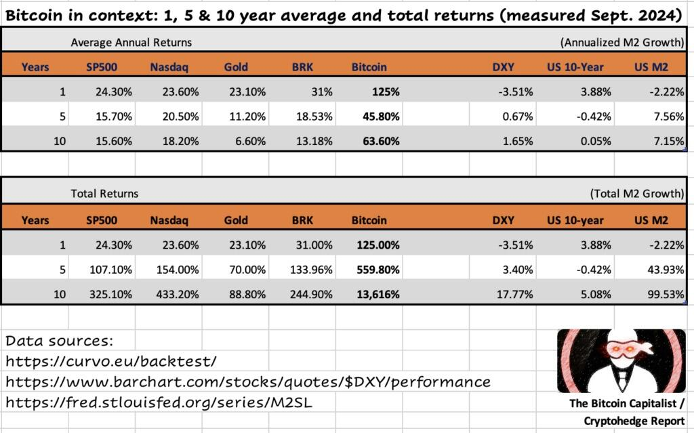

# 是什么阻止了我们抓住财富机会

隔夜BTC一度修复至58k，早晨又回落至57k一线。最近的市场充满了怀疑和纠结，甚至是割肉或爆仓的痛苦。如果一个新手被这种情绪感染，而停止了思考和尝试，那实在是一件不幸的事。

牢骚太盛防肠断，风物长宜放眼量。截至2024年9月，无论是1年期、5年期还是10年期收益率，无论是平均收益率还是总和收益率，BTC都远远跑赢各种资产，各种在传统观念上被视为优质资产的标的：标普500，纳指，黄金，伯克希尔·哈撒韦（巴菲特的投资公司），美元，10年期美债，以及，作为相对参照物的美元M2发行量。

过去十年，美元M2发行量翻了一番，标普500增长了325%（CAGR 15.6%），纳指增长了433%（CAGR 18.2%），黄金增长了88.8%（CAGR 6.6%），伯克希尔·哈撒韦增长了244.9%（CAGR 13.18%），BTC增长了13616%（CAGR 63.6%）。

不知道各位读者朋友对CAGR 60%有没有概念？CAGR 60%意味着，假设你的家庭年开支是20万元，你只需要持有大约33.3万元的BTC就可以实现财务自由。而从5万元本金，只需要一轮周期大约4年多，就可以达到这个财务自由所需的标准——因为5万乘以1.6的4次方大约等于33万元。而对于一个家庭年开支20万元的人，省出5万元本金应该没有太大困难吧？

看上去好像有些不可思议。但这就是数学。

这就是BTC的速度。

不谈拿不住和提前下车的问题。对大多数人来说，是高速列车从自己面前驶过，而根本就无意甚至拒绝登上列车的问题。

到底是什么阻止了我们抓住财富机会？

穷、没钱是一个主要原因。问题是，所有人在面对巨大投资机会时都是相对“没钱”的。君不见，像微策略、萨尔瓦多这样的公司甚至主权国家投资人，在买入BTC的时候也是“捉襟见肘”的么？

教链也是从一穷二白的时候过来的。刚毕业参加工作时，兜里只有几千块钱。靠一点儿微薄的薪水，作为北漂一族，能扎下根、生存下来就已经要付出艰辛的努力，又如何奢谈在衣食住行、结婚生娃之外，还能省出几个闲钱，拿来参与“高风险”的投资呢？

手上无余钱，和投资需要闲钱，这是永恒的矛盾。

但是“穷”、“没钱”又像一道紧箍咒，牢牢地禁锢了我们的思想，让我们要么觉得手头这点儿钱不值得投资打理，要么觉得没有底气敢冒投资的风险。

要打破财富的枷锁，就要先从思想上打破这个紧箍咒。就像教链在前天文章《投资要趁早》里说的，年轻时钱少，但是它早啊。越早的钱，投资产生的效果就越大。

反思起来，教链觉得思想被禁锢的最大问题还不是穷，而是认知缺陷。其中最主要的一条就是，缺乏比例思维。

以至于这几年教链写过多篇文章来讲这个问题，投资一定要有比例思维，不要用绝对思维来看问题。比例思维就是看百分比，绝对思维就是看绝对值。1块钱赚10%和1万块钱赚10%，你看到收益率都是10%，这就是比例思维；你看到前者才赚了1毛钱，后者赚了1千块，这就是绝对思维。

时至今日，还是经常看到诸如“1个BTC太贵了呀”或者“十年之约的仓位怎么那么小”这样的论调。一看这人就还在思维枷锁内禁锢着呢，离进到投资的大门还有不小的距离。

比例思维不仅用于标的——买不起1个BTC可以先买0.01个嘛，还应用于本金——我一个月才3000月薪，但可以先拿300来尝试嘛。

要知道，2011年6月第一个牛市时，BTC也就100块rmb一个嘛。300块已经足够买上3个了。

比例思维就是要求我们摒弃非黑即白的二极管思维——要么不买，要么全押。正确的做法是选择适合的投入比例。

已故投资大师查理·芒格曾经说过：要对任何投资机会保持开放，唯一需要评估的，是风险-收益比。

害怕风险，摒弃一切投资。这固然不会损失本金，但也无法抓住任何资产增值的机会。当今时代，拼命工作只够温饱，资产增值才能致富。

无惧风险，常常一把梭哈。这就把成败交给运气，或者更多的时候，交给收割你的人。当今时代，很多暴发户快速发迹，靠的既非生产也非资产，而是靠收割别人，收割那些心怀暴富梦想、却又胆大心粗的人。

只有灵活掌握比例思维，才能把风险变成我们手中掌握的可调节变量，帮助我们去抓住非对称投注（风险有上限、收益潜力无上限）的财富机会。

阻止我们抓住财富机会的另一个主要原因是看不懂。

对于谨慎如教链的很多投资者而言，都知道投资有一条铁律：不懂不投。

不知道其他人初看BTC是什么感觉，反正教链第一次读BTC的白皮书，看的是一头雾水。尽管教链还是做互联网技术的，但是BTC的架构思想和中心化的互联网系统实在是背道而驰。旧的知识体系反而成了阻碍接受新思维的障碍。

这也是这样一个异常现象屡见不鲜的原因：越是IT技术的专家，越是经济金融科班出身的内行，反而越容易固执地否定BTC。教链见过太多生动的例子。也许脑子里的旧思维越是根深蒂固，就越是难以接受BTC的离经叛道吧？

回想起来，教链最初对BTC的理解，也仅限于认为它大概相当于是一个类似QQ币的东西，只不过不是由一家公司发行的。

但是教链对它的技术架构始终有一个“中心化思维”的“质疑”：是谁在协调和控制BTC各个节点的减产，以实现对总量上限2100万的约束的？

教链实在是一个愚笨的人。当年就是迟迟没能想通这个问题。从中心化思维转变到去中心化思维，实在是要迈过一个大门槛。

4年之后，教链毅然闭关，日夜钻研BTC的所有细节，如此心无旁骛研究了小有一年时间，方才透彻领悟到中本聪设计的整个BTC系统的各处精妙。

教训就是，工作太忙碌，实在是耽误开眼看世界，耽误抓住财富机会的罪魁祸首。

于是乎，投资意识或者说财商方面的障碍，阻碍了一个周期；技术方面，从中心化思维到去中心化思维的障碍，又阻碍了一个周期。待两座大山翻过去，已经错过了两轮周期，BTC已经暴涨了1万倍。

于是乎，便在暴涨1万倍的高山之巅，进场接盘。
