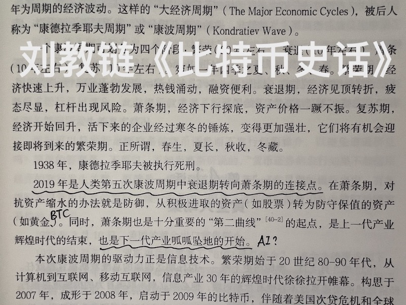
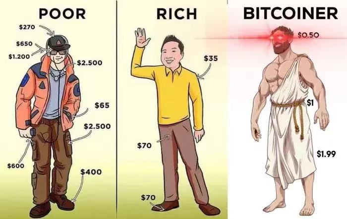
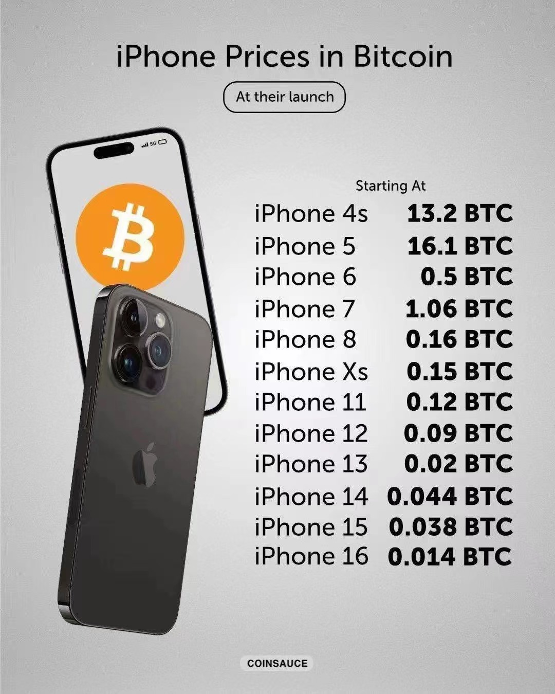

# 消费降级，储蓄升级

BTC已连续5日向上修复。美国最近密集释放的经济数据，仿若都是在为即将到来的美联储议息会议上做出温和降息的最终决定铺开红地毯。这几年全球经济被美联储忽热忽冷地调控给折腾的够呛，要不是及时裹上中国送去的御寒衣物，很多国家可能早就感冒发烧甚至送进ICU了。

太平世界，环球同此凉热。全球经济一体化，美元全球流通，所有国家就像是呆在一个屋子里办公的同事，而空调的遥控器掌握在美国手里。美联储就像一个只顾自己爽快、不顾他人感受的精致利己主义者，自己感觉热了（通胀高企），就猛吹冷风（加息缩表），自己感觉冷了（就业低迷），就猛吹热风（降息扩表）。忽冷忽热，折腾地满屋子人都跟着减衣加衣。稍微节奏慢点儿，或者身体抵抗力不行，或者太穷没有足够衣物，就要染上风热风寒（经济危机）。

这几年，很多人感到经济形势差的一批，对未来十分迷茫。2014-2019年踩着短期债务周期尾巴逆势融资、猪突猛进的创业者和老板们，如今纷纷破产，债务暴雷，进入老赖名单。在这些只能靠输血存活的企业里拿高薪的所谓中产打工人们，也随之纷纷失业下岗，一夜返贫。

2020年教链写《比特币史话》的时候，就曾以史为鉴，指出2019年或许是又一个1929年（美国大萧条起点），这一轮康波周期，由此从衰退转入萧条。

教链在书中明确写道，康波萧条期，个人资产配置要从进攻转向防御。主动去杠杆，节衣缩食，熬过寒冬。

寒冬会有多冷？教链在书中引述了1929年那个康波萧条周期的惨状：白领失业后不敢告诉家人，每天穿起西装领带出门装作去上班，实际上却是去大街上翻垃圾桶捡吃的。全世界都在痛苦地煎熬，熬了十年终于熬不住了，于是1939年，第二次世界大战正式爆发。

二战打到1945年，军民死伤据估计在7000万-8500万之间。待到1949年新中国成立，那一轮康波周期终于迎来了正式的向上复苏。整个康波冬天持续了长达20年之久。

以此观之，这一轮康波萧条，若从2019年起算，那么怎么着也要做好熬到2039年的准备。至少，也要熬到2035年。

2035年是BTC减半前的复苏之年，依幂律看或在70万美刀(低轨)-200万美刀(中轨)之间。这一复苏年，将会和康波复苏叠加共振。

现在是2024年9月，距离2035年还有十年。

而康波大底如果是以1939年二战起算，那么对应这一轮康波就会大约在2029年。距今还有4-5年，一轮BTC周期。

BTC具有内生恒定的4年产量减半周期。以减半年为锚点，可以把4年分别命名为“减半年”(0)、“牛市年”(+1)、“熊市年”(+2)和“复苏年”(-1)。

2019是复苏年，2020是减半年，2021是牛市年，2022是熊市年，2023是复苏年，2024是减半年，2025是牛市年，2026是熊市年，2027是复苏年，2028是减半年，2029是牛市年，2030是熊市年，2031是复苏年，2032是减半年，2033是牛市年，2034是熊市年，2035是复苏年，2036是减半年，2037是牛市年，2038是熊市年，2039是复苏年。5个BTC周期。

2029年是BTC减半后的牛市年，幂律区间或在40万美刀(中轨)-130万美刀(高轨)。如果这一年恰逢本轮康波萧条的底部，那么也许恰好形成一个对冲，对BTC持有者形成一个保护。

如果这一轮康波萧条果真要熬10年，从2019一直熬到2029的话。那么对于今天在2024年的寒风中喊冷的人来说，抱歉，接下来5年还会更冷。

每每重温《比特币史话》大萧条这一章节，教链就会感到一种特别的幸福，那种窗外雷雨乌云大风天，自己却能不上班，而是躲在床上暖暖和和的被窝里，舒舒服服躺着睡觉的小小幸福。

是的啊，相比于1929-1939年那一波康波萧条，至少还只是破产、只是失业，至少还可以送外卖、跑滴滴、直播带货，至少还吃得上饭、穿得起衣、上得了学，至少，今天的国家强大起来了，让我们免于日日炮火洗脸，至少，世界还没有爆发三战。

至少，可以消费降级。

公款吃喝、会所嫩模、输血扩张本来就不是这个世界的常态，也不应成为常态。萧条期好啊，好就好在刮骨疗毒，把这个社会的蛀虫和骗子，以及因他们而生的不良产业链一扫而光。

幸福从来都不是锦衣玉食、觥筹交错、权力幻觉。幸福是减法生活，身外无赘物，身上无赘肉。幸福是窝在暖和的被窝里，读自己爱读的书。幸福，从来都和金钱、权力、欲望无关。幸福，不需要花一分钱就可以获得。

只可惜，在这个被消费主义洗脑，充斥着拜金、拜权力价值观的物欲横流的当代社会里，很多人都患上了一种严重的疾病，教链愿称之为“幸福ED”。“幸福ED”的典型症状有：常常焦虑，略有神经质，无法放松，无法慢下来，无法忍受一切不对自己节奏的人和事，易怒，无法从做的事情、相处的身边人以及大自然中感受到幸福，彷佛失去了找到幸福、获得幸福、感受幸福的能力。需要从金钱、权力（暴力）——包括夫权、父权——或者消费欲望的满足中寻找短暂的快感，快感过后更大的空虚，又会不断提高下一次获得快感的阈值，从而让自己彻底沦为这些外部刺激的“奴隶”，逐渐异化为一个失去人味儿的社会齿轮。

消费ED是病。BTC是药。

当我们真正掌握了囤BTC的奥义，就会进化为比特币人。我们的价值观将由外观转向内观：廉价的身外之物，强健的体魄，摆脱欲望束缚的、自由的灵魂。

人的一生做的所有事情，从经济角度来说，有且只有三种：消费，储蓄，投资。

消费可以分为消费金钱和消费时间。吃饭就是消费金钱，娱乐就是消费时间。

投资也可以分为投资金钱和投资时间。买股票就是投资金钱，工作就是投资时间。创业就是同时投入时间和金钱（不打工少赚的钱也是投资金钱，这是经济学机会成本的基本概念）。融资创业则是加杠杆投入大量金钱和时间。

投资有风险。单一投资有一份风险。同时投入就是风险的平方。再加上杠杆那就是风险的N次方。

融资创业近乎赌。萧条期的刮骨疗毒，就是要打爆这些赌徒们的杠杆才能善罢甘休。否则，经济增长一分，他们赚走十分，岂非对那些本分老实不加杠杆的人太不公平？

天之道，损有余以补不足。老天爷的道理，就是爆杠杆，就是要让在经济繁荣期猛加杠杆的人破产、失业，一夜返贫。

唯有储蓄最特别。我们只能储蓄金钱（价值），却不能储蓄时间。时间如流水，一旦逝去，就永远不再来。

但是由于金融跨时空转移价值的性质，又使得我们储蓄了价值，就彷佛储蓄了时间一般。

如果用广义相对论来类比，时间其实也就是空间，时空本自一体。所以，时间其实也就是价值，价值也就是时间，时间、价值也本自一体。

保存了价值，就保存了时间。偷走了价值，也就偷走了时间。

偷走了你的时间，就相当于偷走了你的生命。

因此，务必小心选择储蓄所用的“容器”（资产）。

对于所有资产而言，价值被“偷走”的主要途径之一，非“超发”莫属了。

房子可以近乎无限地盖。股票可以定向增发。法币可以不断发行。黄金可以永久产出。而BTC，总量限定在2100万枚。

有人抨击BTC不是生息资产，没有分红，没有利息，没有价值。（这也是巴菲特对BTC的主要批评意见）

问题是，零息资产并非真的利息为零 —— 当法币世界的名义利率不敌通胀或贬值，而表现为实际负利率时，就代表你的“时间”正在被持续“偷走”，此时，零息资产如BTC和黄金，其法币实际利率就大于零，于是吸引避险资金的涌入。

零息资产的避险属性，避的不是波动性风险，而是利率风险。

经济学家米塞斯说过，利息是对人们暂时不消费的忍耐而给予的奖励。

因此，一个好的储蓄资产，应该具有一个最基本的特性，就是奖励那个持有资产的人，而非卖掉资产以满足当前欲望的人。

对这个奖励一个直观演示就是：一个早年忍住，没有抛掉13.2个BTC去换取iPhone 4s的人，今天只需要变卖0.014个BTC就可以获得更快、更好的最新款iPhone16。

一个微妙的底层细节是，当年囤积13.2个BTC的人，当他用法币买入BTC的时候，他实际上同时放弃了一些法币。这些法币并没有消失，而是流向了别人的口袋。而那些拿到这些法币的人，可能选择了消费（比如马上买入了一台手机），或者选择了投资（比如开了一家公司）。

经济学家凯恩斯说，储蓄就是投资。教链的理解是，你的储蓄，会变成别人的投资。说的就是上面的这个逻辑。

回过来说教链的逻辑。如果BTC是一个好的储蓄资产，它就必然要奖励储蓄者。因此，BTC必须做到，卖掉BTC拿了你的法币去消费的人，一定不如你持有BTC待到未来可以消费的更好；同样，卖掉BTC拿了你的法币去投资的人，平均而言，投资回报率一定不能跑赢你持有BTC。（请注意是平均而言）

这两个推论必须同时成立，否则，今天，你的理性选择就不应该是持有BTC，而应该是立刻变卖掉它，去消费，或者投资别的事情。

教链把这一双重要求总结为“储蓄跑赢一切（消费和投资）”。和上面的结论结合起来就得到了这样一个命题：一个好的储蓄资产要能跑赢一切（消费和投资）。

我们普通老百姓日常所说的“存钱”，即储蓄法币，也就是用法币作为储蓄资产，是否能够满足这个命题条件呢？并不能。这根据各国央行公开的货币政策就可以推理出答案。

以全球前两大经济体，美国和中国为例。

美联储的公开货币政策，众所周知，是维持温和的、长期2%水平的物价通胀率。也就是说，持有美元，长期必然温和跑输消费，严重跑输投资（美股）。

咱们央行的公开货币政策，与美国不同。在2023年10月21日在第十四届全国人民代表大会常务委员会第六次会议上，时任央行行长做了《国务院关于金融工作情况的报告》[1]。报告中明确指出：「稳健的货币政策精准有力，加强逆周期调节，发挥总量和结构双重功能，广义货币（M2）供应量和社会融资规模增速同名义经济增速基本匹配。」

人民币货币总量控制，不是像美联储那样看物价通胀率，而是看经济发展增速，也就是GDP增长的情况。

还是拿馒头来举例。

美联储的政策好比是，今年1个馒头1美元，明年要控制在1个馒头1.02美元。持有美元，你的馒头购买力就缩水了一点点。

而央妈的政策则好比是，今年1个馒头1块钱，全国能生产1亿个馒头，对应1亿元产值，明年全国能生产1.5亿个馒头了，那就扩张货币量到1.5亿元产值，匹配了馒头生产力的增速，落到馒头价格上可能还是1个馒头1块钱。你存的钱，该买几个馒头还是买几个馒头。而馒头厂多赚了50%，投资回报大大增加了。

那么，如果是能同时跑赢消费和投资的储蓄资产呢？今年产能1亿个馒头，你储蓄了能买1个馒头的钱。明年产能增长50%到了1.5亿个馒头了，你的储蓄应该能买1.5个馒头了。这多出来的0.5个馒头的消费力，就是米塞斯说的，对你暂时不消费（不吃馒头）的忍耐的奖励，也就是（自然）利息。

所以，法币资产的名义利息或者分红，才是一个幻象。最终还是要以能够换回的生活资料（如馒头）或者生产资料（如设备）为准，实实在在的生活资料或生产资料，才是真正的奖励，才是真正的利息 —— 而不是虚幻的法币或分红数字。

掰开了揉碎了讲了这么多，希望各位明白了，从储蓄法币的存钱，到储蓄BTC的囤BTC，是实实在在的储蓄升级。

消费降级，储蓄升级 —— 这就是教链今天分享的，康波萧条期“渡劫”的关键心法。

---
- [1] http://www.npc.gov.cn/npc/c2/c30834/202310/t20231021_432324.html
