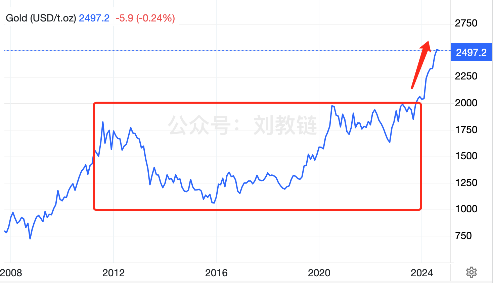

# BTC重回6万刀，钟慢效应显现

一夜醒来，BTC重回6万刀。稳稳当当地，屹立东方。掐指一算，从9月7号再次试探了52.5k的虚实之后，短短一周，就一路飙升了+15%。吾不知空头被爆了几回仓，却可以确信，满仓持有的人必然赚到了这全部的涨幅。

投资致胜的秘密，就是让你的每次操作或者不操作，都能增加你赢的确定性，减少不确定性。赢的确定性越来越高，最后的结果就大概率是赢。

教链从不惧空头的得势张狂。因为教链内心笃定，在教链的策略面前，所有空头都注定失败。教链的策略，对空头的胜率，是100%。

教链从不放弃一丝一毫到手的筹码。哪怕是1聪（1亿分之一BTC），都紧紧捂住，决不让它从指间流走。空头卖出后，要么滚蛋走人，要么继续玩就必须把筹码再买回来，甚至还要买回更多。所以BTC必然会回到空头砸盘之前的水平，并且会更高。空头必败，因为滚蛋出局是败，筹码更贵高位接盘还是败。

近期美通胀缓和，失业上升，美联储更大幅降息的概率又高了。所以，[“9.13教链内参：激进降息概率大增，黄金飙升”]。

黄金的惊天一涨简直是板上钉钉的。因为，1000-2000美刀 x 2012-2023年 这个十年箱体，在今年获得了决定性的右侧突破。

趋势一旦确立，就不会轻易反转。

上图中黄金的这个U型箱体，是不是看着有点儿眼熟？和下图BTC 20000-70000美刀 x 2021-2024年 这个5年箱体，是不是有那么一点儿形神俱似？

现在我们唯一需要期待的，就是BTC跟上黄金的步伐，在2024年底或者2025年初，走出决定性的右侧突破。

这一突破，势将气贯长虹、石破天惊！

为什么？因为这一次右侧突破，乃汇聚了两轮周期的力量。

近期有网传某海外分析师文章，称BTC四年减半周期已不存在。教链在[“9.4教链内参：BTC减半效应真的消失了吗？”]中已进行了拆解和驳斥。

之所以很多人会有这种感觉，其实是因为BTC正在加速。好似狭义相对论中的钟慢效应，当宇宙飞船加速时，它的时钟在我们地球人看来，就会变得越来越慢。

请注意，BTC的产量减半事件，锚定的是区块高度。而区块高度由出块速度决定。出块速度被动态调节的难度所约束，锚定的是我们所处现实世界的参照系和世界线。

不妨拿音乐来类比。BTC出块就好比是我们唱歌的时候打拍子。一首歌，比方说是4/4拍的歌，意思就是，我们打4个拍子就唱完一个小节，每个拍子是一个四分音符，或者两个八分音符，如此这般。我们让这个唱歌者群体出去星际旅行，并把他们称为“歌者文明”（好像《三体》里有这么一个文明）。

现在，歌者文明加速到接近光速飞行，假设相对论效应导致他们的时钟比我们地球世界线的时钟刚好慢了一倍。那么，他们唱一个四分音符，在我们听起来就变成了二分音符。4/4拍的歌，在我们听起来就变成了4/2拍。

“我来唱一首歌，古老的那首歌。我慢慢地唱，你慢慢地和。”

假设，歌者文明在唱歌，而我们地球人在边听边打拍子。我们还是按照谱子上标注的四分音符的时间长度来打拍子。于是我们地球人就会发现，我们需要打8个拍子，而不是4个拍子，才能正好和歌者文明演唱一个小节的地球时间相对应。

也就是说，在地球上仍然按照四分音符的节奏打拍子的话，打完4个拍子，歌者文明才刚刚唱了半个小节。

好了，BTC就是这个故事中的歌者文明，而我们就是地球文明。而BTC的出块，是按照我们地球文明的世界线节奏在打拍子，从而作为沟通两个文明的桥梁。

起初，每打21万个拍子，BTC就发生一次产量减半。这对应地球世界线大约是4年时间。对应歌者世界线是一轮“增长周期”。（不用“牛熊周期”一词，是为了避免和地球世界线的“4年牛熊周期”相混淆）

后来，歌者文明加速了。于是发生了钟慢效应。

依然，每打21万个拍子，BTC就发生一次产量减半。这对应地球世界线大约是4年时间。对应歌者世界线却是刚刚走过半轮增长周期。

也即是，需要打42万个拍子，BTC发生两次产量减半，对应地球世界线大约8年时间，歌者世界线才能走完一轮同样的“增长周期”了。

歌者文明所处的世界线的时钟（时间），变慢了。

物理学上有一个著名的“双生子佯谬”。说的是，一对双胞胎，哥哥跟着歌者文明进行星际旅行，弟弟待在地球上等哥哥回家。80年后，弟弟已经老态龙钟。返回地球的哥哥却是正青春。

“愿你出走半生，归来仍是少年。”

作为生活在地球世界线上的地球人类，你永远不用担心BTC会比你更早衰老。你的衰老速度，一定是远远大于BTC的。持有者快速老去，BTC永葆青春。

有调侃的话讲，男人的审美趣味是极其稳定的，20岁的时候喜欢18岁的，80岁的时候还是喜欢18的。

BTC之于持有者，便彷若是那样一个永远18岁的歌者文明的少女，陪伴着持有者从20岁到80岁，她却容颜永驻，永远不会令你看厌看倦，起意离她而去。

永远18岁的歌者文明少女，伴你一生。“相看两不厌，唯有敬亭山。”

教链不知道刘慈欣心目中的歌者文明是不是“长生不老”的，但是教链设想的歌者文明，或该大体如此。

“天上一日，地上一年。”

在《西游记》中所反映出的中国古代人民的智慧中，天庭正彷佛是那长生不死、永葆青春的歌者文明。

BTC，从这个角度看，仿若天宫之神物。

“此物只应天上有，人间能得几回闻？”

当歌者文明加速，地上凡夫惊呼四年减半周期已不在，却不知其不过是钟慢效应显现，增长周期延长，地球文明的唱和者需要打的拍子数变多罢了。
