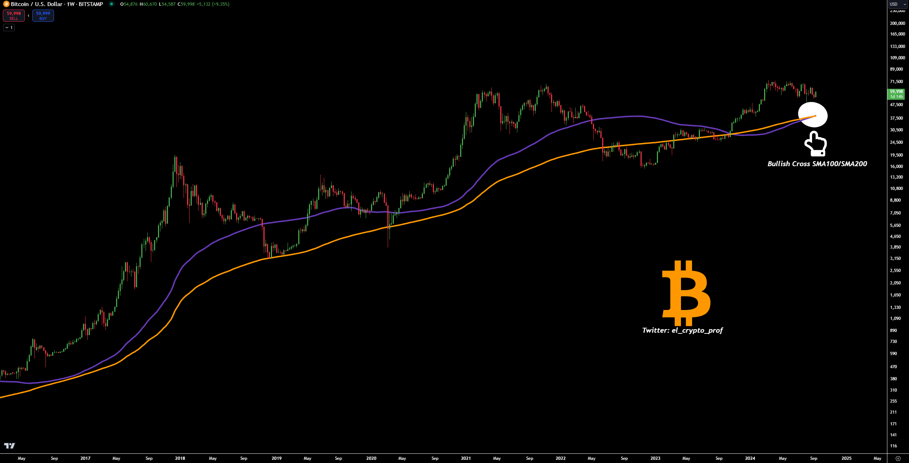

# 美联储的最后一战

隔夜BTC维持在6万刀一线。BTC历史上首次出现奇特一幕：100周均线向上穿过200周均线，形成“金叉”。

中秋节过后，美联储就要开会议息了。这次降息，几乎已经是板上钉钉。唯一的分歧，只是关于首次降息要降多少的问题。是25bp，还是50bp？据称，美联储主席鲍威尔正在同各位理事磋商，目前理事会内部尚有分歧。

好消息是，市场对于更大幅度降息，已经从恐惧衰退转为乐见其成。逻辑已经发生变化。于是，降25bp，是利好；降50bp，是更大的利好。

美联储现在最要紧的，就是让降息和美国经济同时平安落地。

有人对美联储此轮加息周期未能“毕其功于一役”实现战略目的而耿耿于怀。但是，形势比人强。38度线过不去，填再多美国大兵、美制炮弹也不行。于是就要签字认输。

盎格鲁撒克逊文化里，没有誓死不降这回事。打不过就投降，家常便饭。

九月，就是美联储的38度线。

美联储过不得这条线。早在一年前2023年[“9.5教链内参：美元美债一盘棋&现货ETF获批时间的推演”]中，教链就谈过，美财长耶伦在2023年8月大发债的时候多发了一些，进行了超额融资，并承诺今年2024年回购去年超发的美债。

所以教链在去年9月5号的内参中便给出推理，2024年年中或3季度，也就是6-9月，鲍威尔就要降息以配合耶伦回购。九月，正是这个时间窗口的“死线”(deadline)。

耶伦要回购去年超发的美债。这是一种迷惑市场的操作手法：通过回购操作，把纸面上的长期债（比如10年期美债）实质性变成了一种短期美债（1年期）。

颇有点儿“你看中了我给你的利息，我看中了你给我的本金”的味道，是不是？

美国两线作战，缺钱啊。耶伦出此下策，也是不得已的事情。

于是今年就得回购美债。

人尽皆知的、确定性的逻辑是，美联储降息，美债收益率必定下降，因此，美债一定会上涨。

于是我们最近就看到，很多“大聪明”仿佛一夜之间冒出来，在网上咋咋唬唬地忽悠人们去买美债。

稍微留个心眼儿想一想，美联储降息美债上涨是100%确定性的逻辑。问题是，所有人都知道的上涨，还会是赚钱的机会吗？

耶伦回购美债，再帮韭菜拉一把盘？岂非这天下的好人好事，都让美联储和美财政部都给做完了？

因此肯定是要逐步发新债置换旧债，配合降息，把之前高息时发的高息债，逐步置换为低息债。

还有还有，巴菲特老爷子去年“奉命”接盘大量美债，配合完成发债任务（参考教链2023.8.9文章《巴菲特囤积千亿美债》），现在要降息了，也该让巴菲特老爷子逐步解套退出了吧？

无论是发新债，还是抛美债，所有这些，都需要大量韭菜，进入美债市场，给耶伦和巴菲特接盘。

所以就要开始发动舆论攻势，拿“美联储降息必有美债上涨”这个无懈可击的命题大做文章，给韭菜洗脑。

收割不了大国，还收割不了韭菜们吗？

所谓降息落地，还有很多局需要布置，很多网需要拉开，让“朋友们”安全着陆。

美联储的最后一战。

从7月到9月，短期美债收益率已经下降了近13%，这意味着相应的美债已上涨近15%。

而同期黄金上涨了超12%。

债券涨了，但美元贬值了。

BTC还在下降通道，处于被低估的位置。贝莱德苦心孤诣，布局的现货ETF，不可能就做一锤子买卖。

贬值和泛滥的美元，就要进入BTC。

耶伦笑了。巴菲特笑了。贝莱德也笑了。“朋友们”都笑了。这才是好的降息，好的落地。

看到“朋友们”都笑了，鲍威尔和美联储各位理事们，也就可以放心地笑了。
