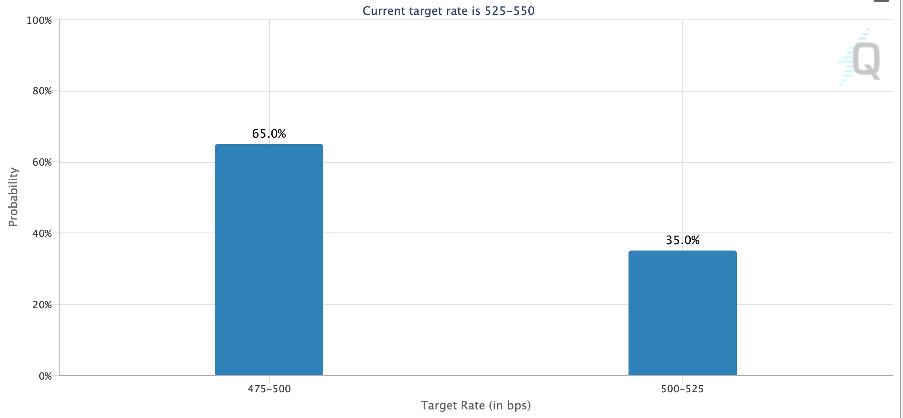
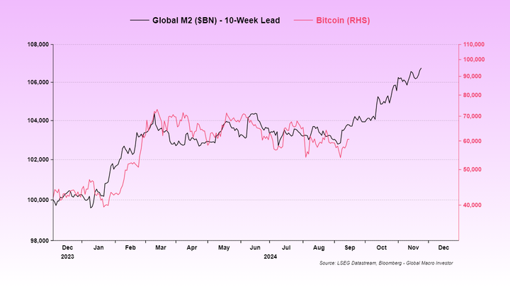

# 中秋月更明，月明饼更香

今天是农历甲辰年八月十五中秋节。祝各位教链的新老读者朋友们节日快乐，阖家团圆。家家有大饼，人人赛神仙！

BTC在节日发力向上修复至60k一线。众所周知，9月17号也就是今天，美联储既定的议息会议也就开始了。会开两日，18号结束。目前市场预期的降息概率已经悄然生变。于是就有一个坏消息，和一个好消息。

坏消息是大幅降息概率反超温和降息，似乎暗示了美联储对经济前景的悲观。数据显示，降息50bp的预期概率飙升至65%，而降息25bp则降至35%。

好消息是市场似乎已经不再认为大幅降息是坏事了。降息带来流动性扩张的利好，压过了降息暗示经济衰退的利空。

虽然直到最后一刻，还有很多人在给教链留言，信誓旦旦地说美联储这次肯定不会降息。好，那咱们就骑驴看唱本——走着瞧。反正再过两天就能揭晓答案了。

还有拼命鼓吹美联储一降息，美股就要崩，带崩BTC，就要去3万刀、2万刀甚至更低的。也一样。时间会亮出他们想要的巴掌。

可能苦了那些听信了这些谎话、假话、大话的人，割肉在降息前。求仁得仁，又何怨？

中秋佳节，不适合割肉，适合吃饼、赏月，忘却一切烦恼。

BTC对冲的是法币的通胀。请注意，是法币的通胀，即流动性法币数量的增加，而不是物价的通胀。现代货币理论（MMT）早就说明了，法币通胀并不必然导致物价通胀——只要统计局精心选择把哪些物价纳入统计范围就可以完美掌控物价通胀率的数字。

所以美劳工统计局有整体通胀率（headline inflation rate），还有核心通胀率（core inflation rate）。以后实在不行再“发明”出来诸如关键通胀率（critical inflation rate）、事实通胀率（factual inflation rate）等更具迷惑性的概念，也不是不可能。

通胀率多了，选择权就给到了美联储。美联储只承诺把长期通胀率控制在2%水平，但是它却有选择任何一种定义的通胀率的自由。

就业诚可贵，通胀价更高。若为自由故，两者皆可抛！

剥离这个充斥着人为操纵的体系中，看得见的手的操弄，法币流动性水平，也就是数量的变化，是一个较为客观的数据。

把全球法币流动性水平的变化，向前平移10周（约2个半月），就会看到它和BTC的波动是多么惊人地吻合。

很显然，从今年以来的数据来看，法币通胀似乎已成为BTC的领先指标。领先时间是2个半月，也就是10周。

法币流动性扩张，2个半月后传导至BTC，BTC开始拉升。法币流动性横盘，同样是2个半月后传导至BTC，BTC开始横盘。

而现在，BTC在6万刀下方，正处于变盘前夜。

月圆之夜。BTC变身。嫦娥奔月。未来三个月，飞往十万广寒宫。

