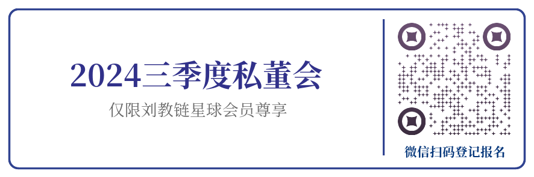

# 100 - 1 = 0

隔夜BTC在教链发文《中秋月更明，月明饼更香》之时开始猛然向61k拉盘，今晨又回守6万刀。9月17-18日美联储议息会议。9月22日教链星球三季度私董会。

现在所谓的加密行业大会，大多沦为镰刀交友专场。1个人赚1万个人的钱是蓝海市场；1万个人赚1个人的钱是疯狂内卷。打开大会演讲嘉宾名录，放眼望去，不是创始人就是CEO，挂个总监title都不好意思和别人打招呼。你说这样的大会，能有几个自费买票“千里送人头”主动接受洗脑的韭菜呢？都是镰刀自high罢了。所以就要再把《加密心经》阅读几遍——「拒绝参加加密行业的线上、线下大会以及项目宣讲会等，不做主动上门被洗脑的傻瓜。」

教链调侃道：应该召开“韭菜诉苦大会”，把话筒交给寂寂无名的小散，让他们有机会上台发声，讲一讲自己的故事。

100 - 1 = 99 是数学。100 - 1 = 0 是冰冷的现实。整个加密行业，韭菜是1，所有光鲜亮丽的交易所、项目方、机构、KOL...，都是1后面的0...

所以，就算是行业美轮美奂的泡泡吹到了1000000000000000...，只要没了韭菜的那个1，大厦顷刻崩塌——再多的0，也只能等于零。

加密行业的底色是金融。金融归根结底只转移价值，不生产价值。那么多0嗷嗷待哺，绞尽脑汁把价值从别人口袋转移到自己口袋里。给整个行业的输送养分的，只有生生不息的韭菜。

100 - 1 = 0 是人性的顿悟。市场中的人们，被表象迷惑了心智，被盈利勾起了贪念，被亏损注入了恐惧，勤奋交易，拼命做0。可是他们忘记了，没有正确的投资理念和标的，做再多0，结果也还是0。

竹篮打水一场空。

一个好的投资者有三大美德：懒惰、孤僻和傲慢。

投资盈利的关键在于耐心地等待。不够懒惰的人，过于勤奋地操作，迟早成为韭菜。早起的鸟儿有虫吃，早起的虫儿被鸟吃。

投资致胜的要求在于独立地思考。不够孤僻的人，容易把自己的思想淹没在别人的七嘴八舌之中，为了所谓高情商而附和别人久了，早晚会失去自我。坚持自我独立思考而又直言不讳的投资者，从来都是一只思想的刺猬。别人的观点，不过是五彩缤纷的气球，只要靠近，就会被无情扎爆。

投资长赢的秘诀在于理性地坚持。不够傲慢的人，经不住家人的质疑，经不住亲戚朋友的带偏，经不住群友天天唱空洗脑，对自己的持仓没有“虽千万人吾往矣”的坚定信念和绝对自信，没有坚决拒绝“百倍山寨币”、“千倍模因币”诱惑的绝对定力，只会不断失去手里的BTC，越来越少，越来越少……

记住：在加密世界，“收割”的定义，不是仓位法币价值减少，而是你手里的BTC数量减少。

在这个市场，赚点儿美刀十分容易，但是想赚BTC，特别是长期、稳定、持续地增加手里的BTC，十分困难。

还有很多人看不起BTC的原因，不是它太贵，而是它还太便宜。

今天1 BTC才6万美刀。当其50万刀、100万刀的时候，这些当初看不起的人，才会如梦初醒，深切认识到：

1个BTC是顶级奢侈品。

大部分商品，价格越便宜，买的人越多。但是，对于有些东西，拥有的难度越高，想拥有的人就越多。

今天，拥有1个BTC的难度早已稳稳超过拥有一部全球最先进的手机。

未来，拥有1个BTC的难度还将超过拥有一辆全球最先进的汽车，超过拥有一套全球最宜居的房子，超过……

要知道，BTC总量只有21百万枚。而全球百万美元富翁的数量有大约60-80百万人。姑且不算丢失和被大户囤积的BTC，21百万枚BTC均匀地分给这些百万美元富翁们，把他们手头的1百万美元置换成1个BTC，也只能做到每3-4个人才能分到1个BTC。

所以就算是1个BTC = 1百万美元，很贵么？需求会不足么？根本就不会。一点儿也不贵。

如果你现在还不是百万美元富翁，而你却有幸参与了BTC的历史进程并提前拥有了1个BTC，那么，未来你定将跻身全球百万美元富翁之列 —— 只要在这个过程中，你没有弄丢你的BTC的话。

跻身全球百万美元富翁之列的你，也就必然登顶全球近80亿人口的金字塔尖的1%。

百里挑一的你，是最好的自己。

100 - 1 = 0，是人生的哲学。

那一天，娃问我：爱迪生说，“天才等于1%的灵感加上99%的汗水”；有人说了，后面还有半句，“但是这1%的灵感却比99%的汗水更重要”。

我自然知道，后半句并不是爱迪生说的，而是Cindi Myers的添油加醋。不过我并不准备和娃讲枯燥的考古，而是反问他：和100、10000类似，1后面99个0，甚至更多0，你觉得是最前面的1更重要呢，还是后面的0更重要？

娃思考中。我提示他：没有了最前面的1，无论有几个0，它也还是零。但是，只有1，而没有0，那就永远只能是1，而不会得到100万、1000万、1亿。盲目努力，没有正确的方向，还是白忙活。空谈思路，不持续地付出艰苦的努力，还是不可能取得大成就。

娃悟了。他回答道：1和0都重要。

我趁机进一步启发他：对的，1和0同样重要，方向和努力缺一不可。不过，对绝大多数人来说，还是努力更重要一些。因为1是可以借鉴、学习得到的，所以剩下的其实主要就是看能有多努力，能在后面补上几个0了。补的0越多，最后的结果越大。

举例说明：就好比BTC吧，它不是我发明的，投资BTC的思路，也不是我发明的，这个1我就是拿来，然后不断实践、提高，努力在后面补0。每个人都可以把这个1拿来，然后付出自己的辛苦，在后面补0。

东方哲学自古便有“知易行难”还是“知难行易”之辩。极至王阳明提出“知行合一”，却依然晦涩、不够明白。教链对此悟了十年。以“知”为1，以“行”为0。始知非难易之辩，实得失之辩。得证上言。
