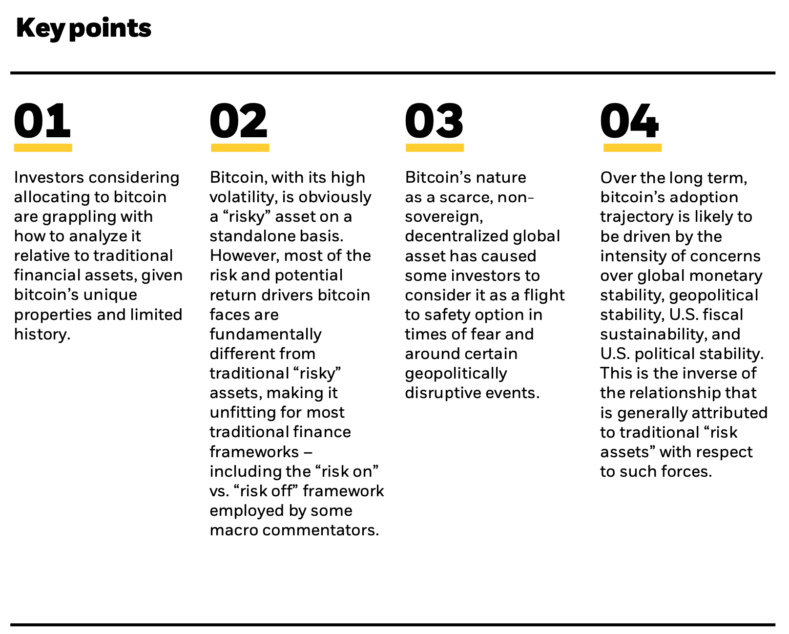
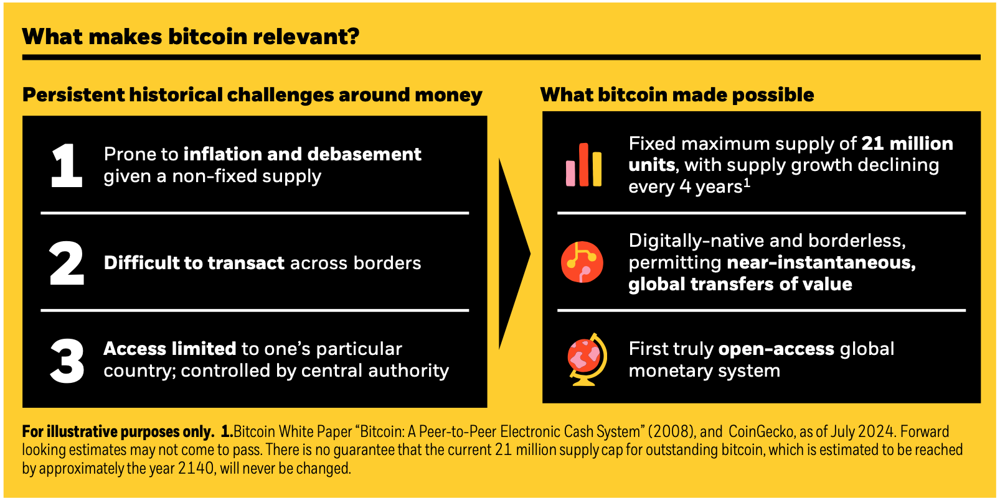
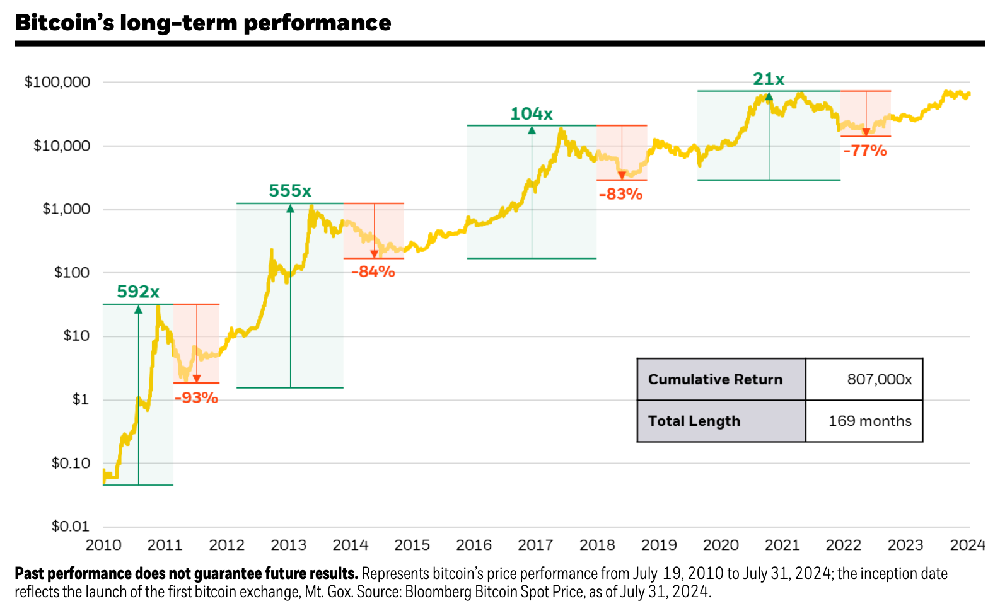
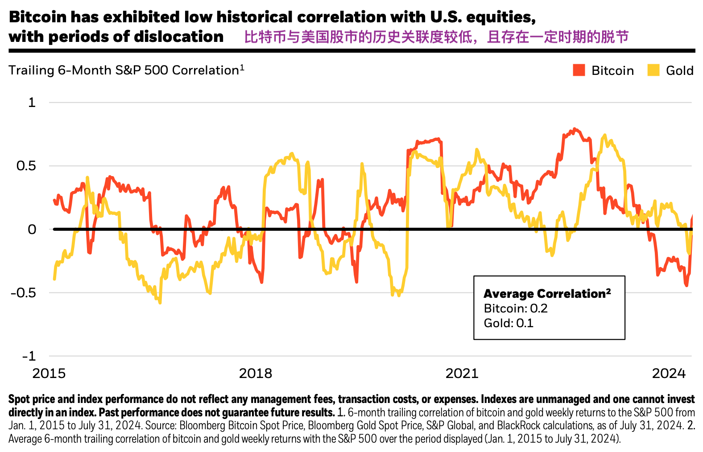
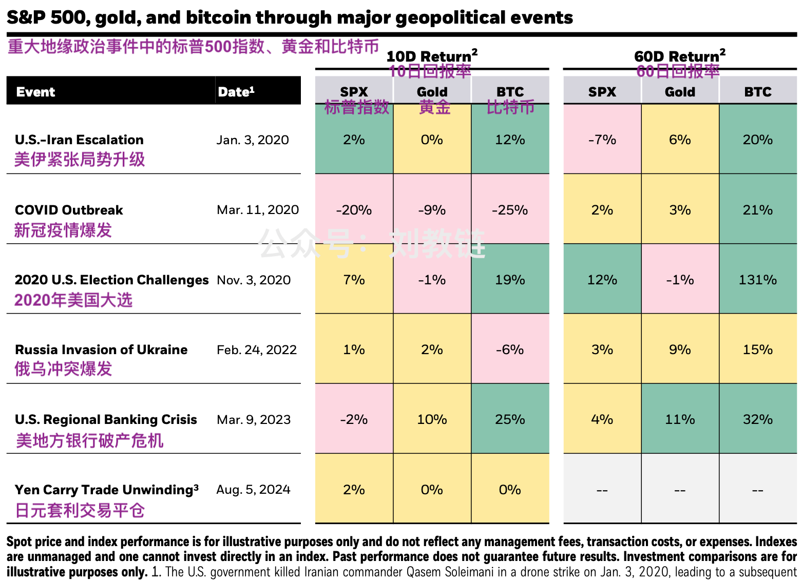
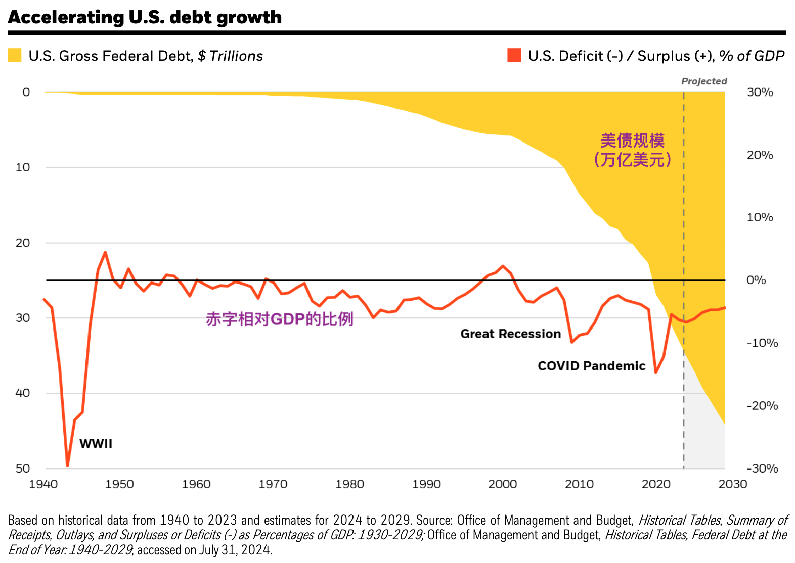

# 贝莱德研报：比特币，一种独特的风险分散工具

教链按：近年以来，经常有读者错误地以为，BTC（比特币）和美股具有强相关性。根据资产配置理论，如果一种资产和另一种资产具有强相关性，则其便失去了独立配置的意义。教链此前曾介绍过一些有关此课题的严肃研究。今天，再介绍一篇。希望能帮助有关读者跳出直觉的错误，步入科学的大门。

鼎鼎有名的全球资管公司贝莱德，日前发布了一篇短小精悍的研报，标题叫做《比特币：一种独特的风险分散工具》，副标题叫做“比特币对投资者的吸引力在于它脱离了传统的风险和回报驱动因素”。

论文的署名作者有三位：贝莱德ETF和指数投资部门的首席投资官Samara Cohen，贝莱德数字资产部门主管Robert Mitchnick，以及贝莱德全球宏观固收头寸主管Russell Brownback。

## 前言

比特币诞生 15 年来，经历了一段历史性的旅程，从默默无闻发展成为越来越多个人和机构在不同程度上持有的资产。虽然贝莱德于 2022 年首次推出围绕比特币的首批客户产品，但在此之前的几年对我们来说是研究、监控和客户参与的重要时期。

作为受托人，我们寻求为客户提供访问和选择，以满足他们的个人需求。与任何其他资产类别一样，当客户表示需要访问时，我们会努力为他们提供更多投资选择。但为客户提供选择只是第一步：我们还必须仔细检查业绩并进行自己的研究以教育客户。

就比特币而言，当客户寻求我们对这种极为独特且相对新颖的资产的见解时，我们努力为他们提供同样慎重的方法。我们认为，比特币作为一种全球性、去中心化、固定供应、非主权资产，具有与传统资产类别不同的风险和回报驱动因素，并且**从任何长期来看，它们之间基本上没有相关性**。即使短期市场交易行为偶尔（在某些情况下有很大差异）与比特币的基本特征所暗示的背离，我们仍坚持这一信念。

我们最近一次观察到这种情况是在 2024 年 8 月 5 日，当时比特币单日下跌 7%，而标准普尔 500 指数下跌 3%，因为全球市场经历了与日元套利交易平仓相关的大幅回调。这一事件恰逢一系列与比特币相关的事件，这些事件与长期悬而未决的破产分配和清算（Genesis、Mt. Gox）有关，这些事件提前三天已经展开。随后，全球市场抛售引发的流动性争夺加剧了这种情况。

在这些偶尔出现的短期大幅下跌与美股联动的事件中，比特币的价格反弹，在三天内就超过了抛售前的水平，这是一种常见的模式。我们认为这种模式是基本面最终战胜短期杠杆交易反应的例子。正如沃伦·巴菲特所说，**“股市是一种将资金从没耐心的人转移到有耐心的人身上的工具。”** 纵观比特币市场的发展历程，这种智慧也往往是正确的。

为了满足客户的极大兴趣，我们在附件中尽力捕捉比特币在风险、回报和投资组合互动方面的动态。我们这样做是考虑到比特币的发展处于早期阶段，以及全球投资者群体对比特币的采用和理解正在迅速发展。

## 要点

要点一：鉴于比特币的独特属性和有限的历史，考虑配置比特币的投资者正在努力分析它相对于传统金融资产的表现。

要点二：比特币波动性大，单独来看显然是一种“高风险”资产。然而，比特币面临的大部分风险和潜在回报驱动因素与传统的“高风险”资产有着根本区别，使其不适合大多数传统金融框架，包括一些宏观评论员采用的“风险偏好”(risk on)与“风险规避”(risk off)框架。

要点三：比特币是一种稀缺的、非主权的、去中心化的全球资产，这种特性使得一些投资者在恐慌时期和某些地缘政治动荡事件发生时将其视为一种避险选择。

要点四：从长远来看，比特币的采用轨迹可能会受到对全球货币稳定、地缘政治稳定、美国财政可持续性和美国政治稳定的担忧程度的影响。这与传统“风险资产”相对于此类力量的关系通常**相反**。

## 引言

比特币是“风险偏好”(risk on)资产还是“风险规避”(risk off)资产？这是我们的客户在首次考虑投资比特币时最常问的问题之一。我们认为，答案是，比特币的独特性质使其不适合这种和大多数其他传统金融框架，并且比特币的长期回报驱动因素与其他投资组合回报来源**基本无关**。

虽然比特币波动较大，并曾出现与股票市场短暂联动的情况（特别是在美元实际利率或流动性剧烈变化的阶段），**比特币与股票和债券的长期相关性一直较低**，且其长期历史回报率**远高于**所有主要资产类别。

从长期来看，我们认为比特币的采用驱动因素可能与推动大多数传统金融资产发展的全球宏观因素截然不同，在某些情况下甚至与之相反。在本文中，我们将试图解释这种动态。

### 为什么比特币是有意义的

首先，我们必须从深刻理解是什么让比特币有意义。比特币于 2009 年诞生，成为首个获得全球广泛采用的互联网原生货币工具。它的技术创新是创造了一种数字原生、全球、稀缺、去中心化和无需许可的货币形式。由于这些属性，它在其他形式的货币一直难以解决的多个世纪难题上取得了重大突破：

1）比特币的硬编码供应上限为 2100 万单位，这意味着它不能轻易贬值。

2）其全球性和数字原生性意味着它可以以接近零成本、近乎实时地运输到世界任何地方，从而超越了长期以来跨越政治边界转移价值所固有的摩擦。

3）其去中心化、无需许可的性质使其成为世界上第一个真正开放的货币体系。

图：是什么让比特币具有重要意义？

图左：围绕货币的、历史性的持续挑战

挑战1：由于供应不固定，容易出现通货膨胀和贬值

挑战2：跨境交易困难

挑战3：访问权限仅限于特定国家/地区；受中央机构控制

图右：比特币使什么成为可能

赋能1：固定最大供应量为 2100 万个单位，供应量增长每 4 年下降一次

赋能2：数字原生且无边界，允许近乎即时的全球价值转移

赋能3：第一个真正开放的全球货币体系

虽然其他加密资产后来都是在比特币最初突破的基础上建立起来的，但在许多情况下是为了追求更广泛的使用案例，但全球已经将比特币视为该领域的首要资产。这使其在加密资产领域中独占鳌头，成为全球货币替代品和具有可信稀缺性的资产。

## 比特币迈向1万亿美元市值之路

尽管比特币迄今为止已取得了显著的增长并在全球范围内被广泛采用，但其最终能否发展成为一种广泛的价值储存手段和/或全球支付资产仍不确定，而比特币不断变化的市场价值也反映了这种不确定性。

在过去 10 年中，比特币有 7 年的表现优于所有主要资产类别，在过去十年中，其年化回报率超过 100%。尽管比特币在这 10 年中的另外 3 年也是表现最差的资产，其中四次跌幅超过 50%，但比特币仍取得了这样的成绩。在这些历史周期中，尽管熊市持续，但它表现出从此类下跌中恢复并创下新高的能力。

比特币价格的变动在一定程度上反映了其作为全球货币替代品被广泛采用过程中不断变化的前景。

## 一种低相关性的资产

比特币几乎不反映其他宏观变量的基本面，这解释了其与股票和其他“风险资产”的长期平均相关性较低。虽然比特币的相关性曾在短时间内飙升——尤其是在美元实际利率或流动性突然变化的时期——但这些事件都是短期的，未能产生明确的长期统计显著相关性关系。

比特币是首个获得全球广泛采用的去中心化、非主权货币替代品，没有传统的交易对手风险，不依赖任何中心化系统，也不受任何一个国家命运的驱动。这些特性使它成为一种与某些关键宏观风险因素（包括银行系统危机、主权债务危机、货币贬值、地缘政治动荡和其他国家特定的政治和经济风险）基本脱节的资产。从长远来看，比特币的采用轨迹可能会受到全球货币不稳定、地缘政治不和谐、美国财政可持续性和美国政治稳定性等担忧程度上升和下降的影响。

由于这些特性，在过去五年中，一些全球性事件发生时，比特币被一些投资者视为恐慌时期的“避险资产”。值得注意的是，在某些情况下，比特币首先表现出暂时的负面反应，然后才开始反弹。我们认为，这些短期交易反应通常很难根据基本面来解释，可以归因于以下几点：

i. 比特币是一种全天候交易且几乎即时结算的资产，这使得它在传统市场流动性紧张的时期（尤其是周末）成为一种极具销售潜力的资产

ii. 比特币和加密资产市场，以及投资者对比特币的理解，仍不成熟。

在大多数情况下，包括最近 2024 年 8 月 5 日的全球市场抛售，比特币在几天或几周内就恢复到了之前的水平，而且在许多情况下，随着人们认识到此类破坏性事件对比特币基本面的积极潜在影响，比特币价格开始进一步上涨。

## 美国债务动态重新成为焦点

在这一方面，美国国内和国外对美国联邦赤字和债务状况的担忧日益增加，增加了潜在的替代储备资产作为对冲未来可能影响美元事件的手段的吸引力。这种动态似乎也出现在债务积累严重的其他国家。根据我们迄今为止与客户打交道的经验，这在很大程度上解释了近期机构对比特币兴趣日益浓厚的原因。

## 比特币仍然是一种风险资产

上述分析均未否认比特币本身仍是一种高风险资产这一事实。它是一种新兴技术，尚处于早期采用阶段，有望成为一种全球支付资产和价值存储手段。比特币也一直不稳定，面临诸多风险，包括监管挑战、采用路径的不确定性以及尚不成熟的生态系统。

但关键在于，这些风险是比特币独有的，其他传统投资资产并不具有这种风险。因此，比特币，作为一个特别突出的案例，说明了为什么简单的“风险偏好”与“风险规避”框架会因缺乏细节而无法广泛适用。

从投资组合的角度来看，这就是为什么适度配置比特币可以对投资组合产生多样化效应，而当头寸规模较大时，其独立波动性的上升开始对投资组合风险的增加产生巨大影响。

## 结论

虽然比特币表现出与股票和其他“风险资产”短期联动的例子，但从长期来看，与大多数传统投资资产相比，其基本驱动因素截然不同，而且在许多情况下是颠倒的。

随着全球投资界努力应对不断加剧的地缘政治紧张局势、对美国债务和赤字状况的担忧以及全球政治不稳定性加剧，比特币可能被视为一种越来越独特的风险分散工具，可以抵御投资者在其投资组合中可能面临的一些财政、货币和地缘政治风险因素。

