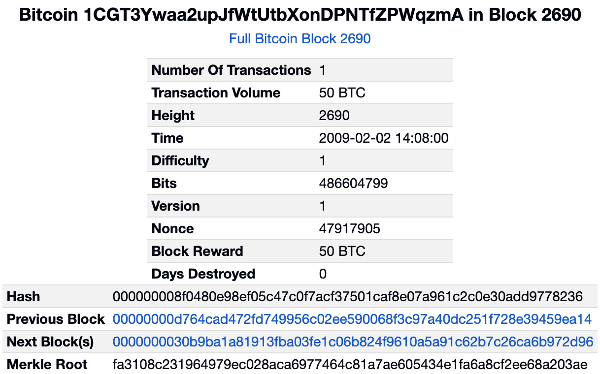
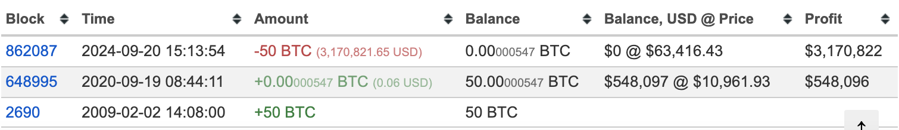
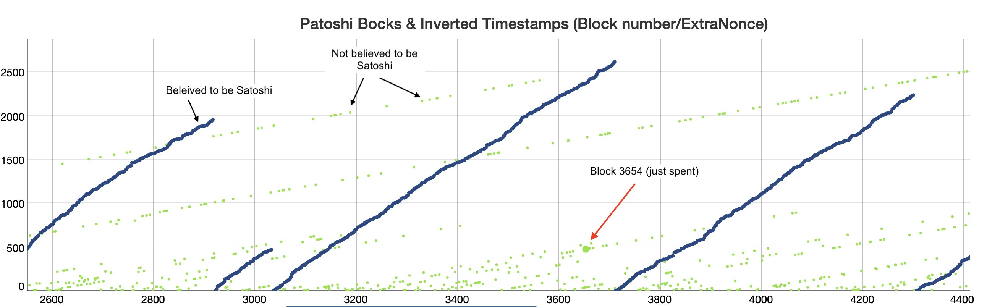

# 中本聪回来了？！

周末BTC继续横亘在63k一线。前方，目之所及，是江水滔滔的阻力区间。过，还是不过，这是一个问题。

钟山风雨起苍黄，百万雄师过大江。
虎踞龙盘今胜昔，天翻地覆慨而慷。
宜将剩勇追穷寇，不可沽名学霸王。
天若有情天亦老，人间正道是沧桑。

近日传出惊人消息：几个BTC初创期的古早挖矿地址动币了！这些币的挖出时间基本在2009年1月29号至2月2号附近。这几个地址是：

1C4rE41Kox3jZbdJT9yatyh4H2fMxP8qmD - 2009年1月29号
18E5d2wQdAfutcXgziHZR71izLRyjSzGSX - 2009年1月30号
13J8FkimCLQ2EnP1xRm7yHhpaZQa9H4p8E - 2009年1月31号（这个据说是“郁金香信托”的地址）
1MBBJBFEaYKHFZAeV7hQ7DWdu3aZktjzFH - 2009年1月31号
1CGT3Ywaa2upJfWtUtbXonDPNTfZPWqzmA - 2009年2月2号

众所周知，比特币的第1个区块即所谓创世区块中的时间戳是2009年1月3号，而据教链在《比特币史话》中介绍，其实直到1月9号才“有人”（可能是中本聪）挖出了第2个区块。

由此可见，本次动币的地址背后的所有权人，能在2009年1月底、2月初参与BTC的挖矿，肯定是极资深的密码学社区的人，很大可能性是密码朋克邮件列表中的一员——这个邮件列表，也正是中本聪最早发布BTC的地方。

不过，从2008年10月31号中本聪在密码朋克邮件列表里发表比特币白皮书，到2009年1月3号甚至可能是1月9号正式上线，开启挖矿，中间也有2-3个月的时间来让更多人知晓此事。

当然，从知晓到感兴趣，从感兴趣到动手参与挖矿，这中间的鸿沟也是巨大的。很多人，往往是出于本能的怀疑，看不见、看不懂、看不起，更别提投入时间精力付诸行动了。

据估计，能够在上述动币地址挖矿的时间参与BTC的人，全世界可能也就十几个人，很可能不会超过50人。

换个角度看，能够从BTC一文不值，拿住15年，一直拿到63000美刀，没有丢失私钥，没有在暴涨暴跌的诱惑和恐慌中抛售，属实也是一个传奇。

有网友很兴奋，疯传中本聪回来了。但是很抱歉，这些地址大概率并不是中本聪的挖矿地址。

据研究，被怀疑为中本聪早年的挖矿地址采用了一种被称为Patoshi模式的特殊印记。这一印记把疑似中本聪的挖矿地址，和同期其他挖矿者的地址区分开。具体技术细节，可以回顾一下教链2023.1.14文章《中本聪是个贪婪的矿工吗？》。

具有Patoshi模式的这些地址，总共挖出了大约110万枚BTC —— 迄今从未动过。是的。如果它们真的属于中本聪的话，中本聪确实从未利用他的发明（BTC）从社区中（通过抛售BTC）提取一分钱利益。这等纯粹的道德高度，让后面所有的模仿者望尘莫及。

就像在2022.9.30文章《中本聪的传奇宝藏》中，Tomer Strolight给予这一大笔分文未动的遗产的精彩评价：

「他选择把它变成一座献给人类精神的永恒纪念碑。永远矗立在那里，表明一个人可以完成许多其他人宣称不可能的事情。它永远矗立在那里，表明一个人可以抵挡住人们广泛持有的信念并证明它们是错误的。它表明，一个人可以引发一场质疑世界上最强大实体的必要性、有效性和权威性的运动。它永远矗立在那里，表明一个人实际上可以牺牲财富、权力和名誉来创造，以及做道德上善的事情。它永远矗立在那里，说“人类可以创造永恒的善的事物”。」

在这个创新乏善可陈，模因币甚嚣尘上，行业领军者带头堕落，投机炒作甚嚣尘上，密码朋克精神渺无踪迹的年代，人们不由地愈发怀念中本聪。怀念日久，恍惚间，仿佛看到中本聪意外归来。

一从大地起风雷，便有精生白骨堆。
僧是愚氓犹可训，妖为鬼蜮必成灾。
金猴奋起千钧棒，玉宇澄清万里埃。
今日欢呼孙大圣，只缘妖雾又重来。
