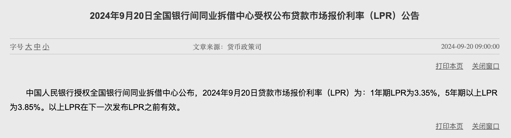
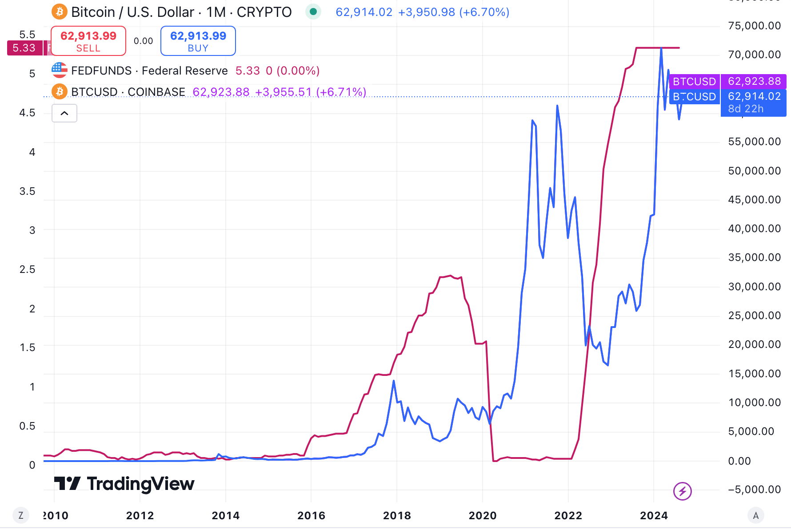

# 央行为何按兵不动？

周日BTC继续在63k上下震荡。前日[“9.20教链内参：美元降息周期，rmb汇率会升还是会降？”]在宏观态势部分汇报了一个信息，在2024.9.19《美联储降息落地，一半的人都错了》之后，其他央行意外地按兵不动——「中国人民银行出人意料地保持了其基准贷款利率不变，英国央行和日本央行也维持了它们的政策利率稳定。」

降息的暂时不降了，加息的也暂时不加了。似乎大家都停下来在观察，美联储意外大幅降息的诚意，以及美国经济是否避免衰退的数据。

不消说，这是一件极难判断的事情。

二级市场炒股炒币难不难？反正98%的人都是越炒越亏，你说难不难？那么，宏观经济判断的难度，比炒股炒币还要难上一万倍。

二级市场的价格数据是市场形成的，极其透明。宏观经济的指标数据是人工统计的，还掺杂着各种修正，充满操弄。

个人的判断和行动对于二级市场的影响是微乎其微的，而各国对于宏观经济的判断和行动对于宏观经济的影响是较大甚至巨大的，于是“观察者效应”就会极其显著，以至于根本就不能用旁观者思维去理解整个市场和宏观态势。

正因为观察者效应的存在，我们就不能用投机者思维去理解宏观经济中的各个主体的判断和行动，而是应该换成博弈者思维去理解和分析。否则，肯定是要滔滔不绝，谬以千里的了。

这里的投机者思维，从宏观的更高层面来说，就不仅覆盖了炒短线的所谓投机者，也覆盖了搞所谓长线投资的投资者。

有句话说的很有意思：投机者和投资者都是在赌，只是赌的东西不一样。投机者赌的是现在，投资者赌的是未来。

就好比说，张三今天63k买了1个BTC，期待明天65k卖出去赚2k，这被大家称为投机。李四今天63k买了1个BTC，期待10年后100万美刀卖出去，这就被大家称为投资了？

因此教链说，不管张三李四被称为投机还是投资，他们本质上没有太大区别，都是投机者思维。

博弈者思维完全不同。

博弈者思维，要求思考者清醒地认识到自己不是旁观者，而是局中人，甚至是举足轻重的局中人。

博弈者思维，思考的是我如何参与市场，我的行动会如何影响全盘的力量均衡，对方会针对我的行动作出何种反应，我又如何应对，……，我应该如何谋篇布局以实现我的战略目标，等等。

不客气地讲，如今资本市场上活跃着的大大小小的所谓投资机构，绝大部分也都是投机者思维。

教链不是要评价它们这种思维方式好还是不好，而是要指出它们形成和固着于这种思维方式的根本原因，乃是由它们本身在社会分层中所处的阶级地位和阶级属性所决定的：它们是高高在上、脱离底层的一小撮人，锦衣玉食，五谷不分，对于人民勤劳、国家发展抱持旁观者思维，因而必然孕育出投机者思维。

从这一小撮人的利益出发点、投机者思维以及阶级立场来看，央妈没有兴高采烈地紧跟美联储降息的节奏，赶紧做出开闸放水的姿态，让在“枯水期”快要渴死的金融有产者“久旱逢甘霖”，进一步拉大他们与底层普通人之间本已巨大的财富差距，果真可以称得上是“意外”了。

但是对于远离“水龙头”的实体产业，乃至种地老农而言，放水，他们是最后受益甚至是受损的，收水，他们也是最后被波及的。这就是人们熟知的“坎蒂隆效应”（Cantillon Effect）——中央银行的量化宽松政策可能会首先惠及金融机构和富裕阶层，而普通工人和消费者可能会在资产价格上涨后才感受到影响，这可能导致社会不平等的加剧。

于是他们就要出来拍短视频，发营销号文章，公开表达他们的惊诧，甚至是批评了。

站在社会底层人民的角度，站在全世界劳动者的立场，站在广大穷人的一边，他们越是批评的，反而是我们应该大力做好的。

有读者可能会有疑问：教链你不也是做投资么，为何不站他们的立场，而是要站人民的立场？

答案清晰可见。因为教链真正透彻地思考清楚了BTC的性质和价值基础。教链相信，每一个BTC的投资者和持有者，如果真正理解了BTC的话，就都会站人民立场。

BTC是不是一个靠权力赋能的货币资产，而是靠共识赋能的货币资产。拥有的人越多，共识的广度和范围越大，它的价值才越大。相反，如果它被少数寡头垄断掉，它就会被人民抛弃，其价值也就很小了。

又因为拥有BTC的唯一方法是赚钱购买。因此，先不谈意愿和认知，首先必须支持任何能够让更多底层人民赚到更多钱的政策，这样才能让更多人具备拥有的能力和可能性。毕竟，购买力都没有，谈什么意愿和认知都是“何不食肉糜”的扯淡，不是么？

于是我们就能得出一个板上钉钉的结论：社会贫富差距越大，越不利于BTC价值提升；社会越是接近共同富裕，BTC的价值也会越大。

基于这一点，教链的真切心愿就是，所有的读者朋友，只要是认可BTC、愿意囤BTC的，都越来越有钱，越来越富裕——不是指你的BTC仓位增值，而是指你的场外收入越来越高，能拿出来加仓的钱越赚越多！

也是基于这个出发点，教链认可央妈的宏观审慎。

教链在2024.9.13文章《消费降级，储蓄升级》中引述过央妈公开表述的货币政策总体方针，其中一点就是“加强逆周期调节”。

读懂这个，就读懂了央妈为何按兵不动。

何谓“逆周期调节”？简单来讲就是说，美联储加息我降息，美联储降息我加息。

现在我们需要流动性——也就是俗称的“水”，但如果这水是央妈来放，那就会对rmb形成汇率压力。换成美联储来放，效果就不同了：既可以解决缺水的问题，又可以让rmb保持对usd的汇率。

而汇率，是一切人民币资产的锚。汇率升值，所有人民币资产升值；汇率贬值，所有人民币资产贬值。

放水让美联储来做，这就抬升了人民币资产的价值，抑制了美元资产的价值。

无论美联储如何操弄利率，上上下下，美元资产之锚的贬值，在零息资产如黄金和BTC的面前是一览无遗的了。（下图是美联储联邦利率变化和BTC的价格曲线）

