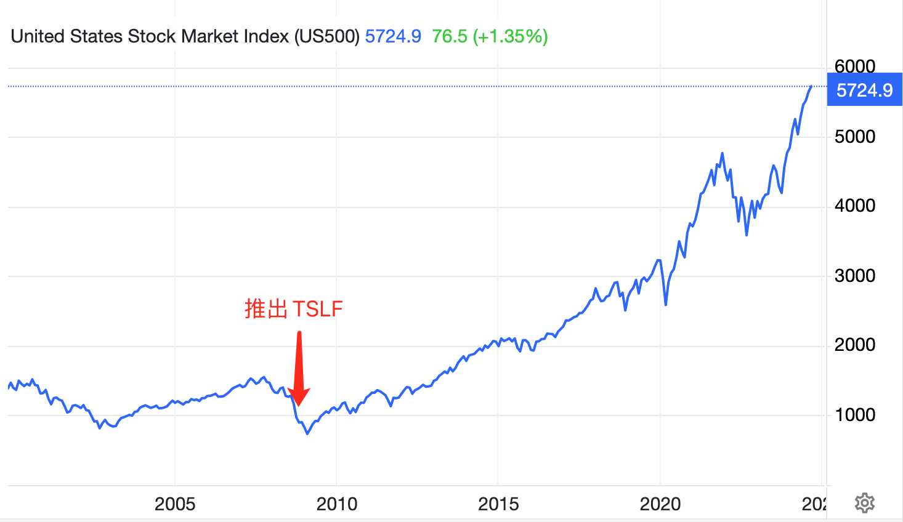

# 央妈大招之后的热思考

24号，三部门（中国人民银行、国家金融监督管理总局、中国证监会）同台发布重磅金融政策，引发全球瞩目。教链此文将着重思考和研判一下，这套政策对大A、中债以及BTC的后市会有怎样的影响。

先提炼一下这套政策的要点，也就是有真金白银的条款。分清批判的武器（口头引导）和武器的批判（真金白银），是第一步。主要就是三方面：

第一方面，降准降息。

其中，降准是下调银行存款准备金50bp，这可以立即释放流动性大约1万亿rmb。今年内可能继续下调25-50bp。

降息是通过7天逆回购这个工具，操作利率下调20bp——相比于通常10bp的下调节奏加倍了——从1.7%降至1.5%。这会直接作用于存贷款市场，引导LPR（贷款市场报价利率）和存款利率同步下行。这有助于维持净息差，不至于压缩商业银行的利润。同时，降低了国债收益率的天花板，有助于对国债市场的资金进行引导。

我们通常所说的市场利率(interest rate)，指的便是LPR。2024.9.22教链文章《央行为何按兵不动？》中提到，央妈没有紧跟美联储节奏降息，说的就是LPR暂时维持不变。目前，1年期LPR为3.35%，5年期以上LPR为3.85%。

现在存款利率是多少呢？以工商银行2024.7.25调整后数据来说，活期0.15%，3个月定存1.05%，6个月1.25%，1年1.35%，2年1.45%，3年1.75%，5年1.8%。

国债呢？9月20号的数据：3个月1.4%，6个月1.43%，1年1.39%，2年1.38%，3年1.5%，5年1.73%，7年1.91%，10年2.04%，30年2.15%。

不知道大家看到上述数据有何想法？首先呢，中债长短期收益率还比较正常，不像美债那样出现严重倒挂——即，长期债收益率低于短期债——这说明中国经济状况还比较正常，因为常理就应该是还钱时间越长，占用资金时间越久，给付利息越高嘛。

其次就是不正常的地方了：这国债收益率也太低了吧？比如5年1.73%，居然比5年定期存款利率1.8%还要低？这不就离了个大谱？

教链之前讲过，债券收益率与其价格成反比。国债收益率太低，说明有些资金在拼命地买入国债，已经达到了近乎非理性的程度了！

这就造成了一个现象，那就是中债收益率被买到了一个极其不正常的低点。2024.8.31教链文章《中国长期国债收益率与BTC的奇妙相关》中给出过10年期中债的收益率曲线图。

央行早就在公开喊话，警告机构们不要冲国债，无奈批判的武器似乎发挥不了效果，于是这次直接搬出来重磅大招，对市场进行武器的批判。

这个大招就是首次推出的全新工具：互换便利。

第二方面，推出新的货币政策工具：互换便利，以及股票回购增持专项再贷款。

为什么说这个互换便利是个重磅大招呢？因为这一工具的出现，史无前例地让央妈可以定向去奶大A了。

有人热泪盈眶地说，以前每次货币调控，都要加一句禁止进入股市，这次居然是指定必须进入股市，真的是“萧瑟秋风今又是，换了人间”！

那么这个所谓的互换便利究竟是怎么操作的呢？简单地讲，就是央行首次允许非银机构（如证券、基金、保险等机构），把流动性一般的资产（比如债券、股票ETF、沪深300成分股等）抵押给央行，从央行那里换到高流动性资产（比如国债、央行票据等）。

请注意，机构换回来的是国债和票据，不是rmb。他们需要先在二级市场抛售，比如抛售国债，才能拿到rmb。好家伙，上面教链不是刚讲过么，现在国债被某些不听劝的机构给买得贼高，这下子好了，好言难劝该死的鬼，央妈直接放出了一堆国债空头，高位砸盘。

国债多头是想继续负隅顽抗，妄图战胜央妈呢，还是乖乖听劝，赶紧撤离国债市场呢？从国债收益率开始见底回升，就能洞察到他们的心思和动向了。

最后也是最重要的一步，抛售国债拿到rmb的机构，被要求只能把这些钱重新投入大A。即，指定资金用途：通过互换便利所获取的资金只能用于投资股票市场，旨在提升资本市场的流动性和稳定性。

也就是说，这些参与的机构们，只能做国债的空头，同时做大A的多头。

另外有一点就是，央行强调，互换便利不是直接给钱，不会扩大基础货币规模，而是通过“以券换券”的方式进行，旨在提高非银机构的融资能力，同时不投放基础货币。

不投放基础货币的意思，就是明确告诉市场，这就是零和游戏和财富重新分配的过程，把债市的财富给逼出来，定向转移给股市。

前段时间某些国债死多头拼了命也要把流动性从大A抽走，给搬运到债市去。国家队默默地在3000点下方抄底抄了大半年，很多大V都在嘲笑他们托不住底，拼命忽悠散户底部割肉，换美元去高位接盘美股，美联储降息后又忽悠散户去冲债券，说什么降息利好债券走牛，云云。可是他们的建议几乎就没对过。

现在国家队抄底抄的差不多了。美联储也降息了，汇率压力也解除了。市场也苦盼政策很久了。天时，地利，人和。

手里囤积了大量低价优质筹码的机构，就可以和央妈以股换债，砸债市换钱，拿钱拉股市，买来的股再找央妈换成债，…… 循环操作，砸死债市的多头，拉爆股市的空头。

这个互换便利工具是一个长效工具，不是一个短期救急。首期规模5000亿先试试水，后面还有源源不断的千亿、万亿规模的量等着启用。

其实美联储早就有类似工具。美联储的互换便利工具叫做定期证券借贷便利（Term Securities Lending Facility，简称TSLF）。这个工具允许一级交易商使用流动性较差的证券为抵押，向美联储借入流动性较高的国债，便于在市场上融资，起到了提振市场的效果。在2008年金融危机期间推出，并在2020年疫情期间再度启用这一工具。

我们来欣赏一下美联储应用TSLF之后美股15年长牛的盛景吧：（见下图）

至于另一个工具，股票回购增持专项再贷款，乃是引导银行向上市公司和主要股东提供贷款，支持回购和增持股票。如果大股东有信心把公司搞好，利润分红也就是股息率只要超过专项贷款利率，就可以carry trade（套息交易），这就有助于激励公司股东回购拉升，并做好公司、搞好分红回馈股民。当然，作为一种杠杆，肯定也是有风险的。不再赘述。

第三方面是关于房市的支持。继续降低存量房贷，这与其说是支持房市，不如说是为了释放老百姓手里的钱以刺激消费市场。真正和房市有关的，只有一个把二套房首付比例和首套房统一为15%。与上面对股市的大招支持相比，就显得有些清汤寡水，索然无味了。

很显然，十年河东，十年河西。从政策的着力点也能看出，国家已经是下定决心要转变发展模式了，摆脱对房地产的依赖，把资本引导到股市，引导到匹配先进生产力发展方向的优质企业上面去。

教链在2024.7.12文章《鲍威尔意外松口，BTC十万可期》中已经说过，「至于大A，也将迎来它20年级别的楔形突破。」

牢骚太盛防肠断，风物长宜放眼量。

上面教链已经仔细分析了，央妈此番推出重磅长效工具互换便利，短期将打击债市，推升国债收益率，推高股市。

结合2024.8.31教链文章《中国长期国债收益率与BTC的奇妙相关》中的研究成果，我们也就可以判断，当长期中债收益率在短周期内触底反弹、冲高，往往就会伴随着BTC的一波牛市浪潮。

这个月中美货币政策接连出现重大转折，恰逢BTC今年减半年的年底、明年牛市年的前奏阶段，市场正在由分歧转向寻找到牛市的方向之际，不由得令人感叹，真是冥冥中自有天意。

喜看稻菽千重浪，遍地英雄下夕烟。
