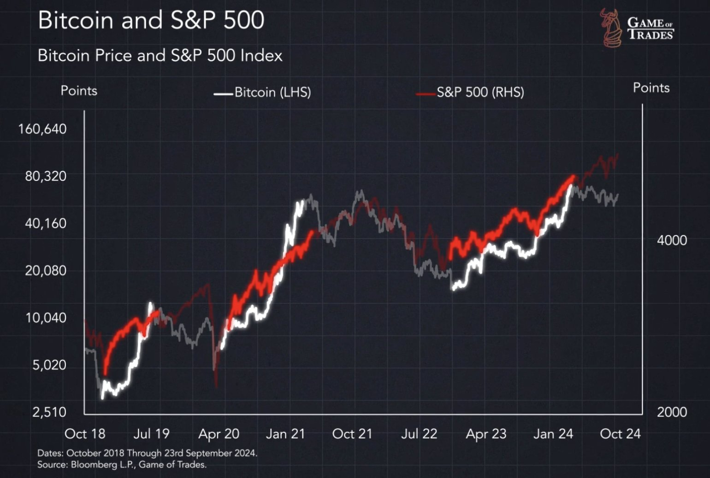
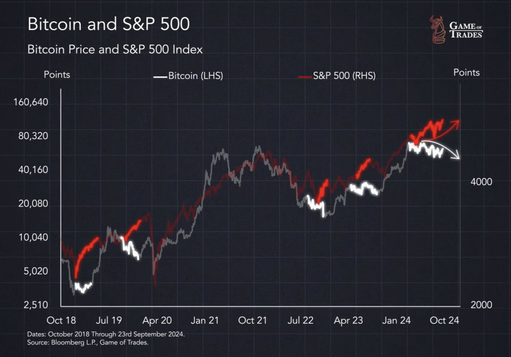
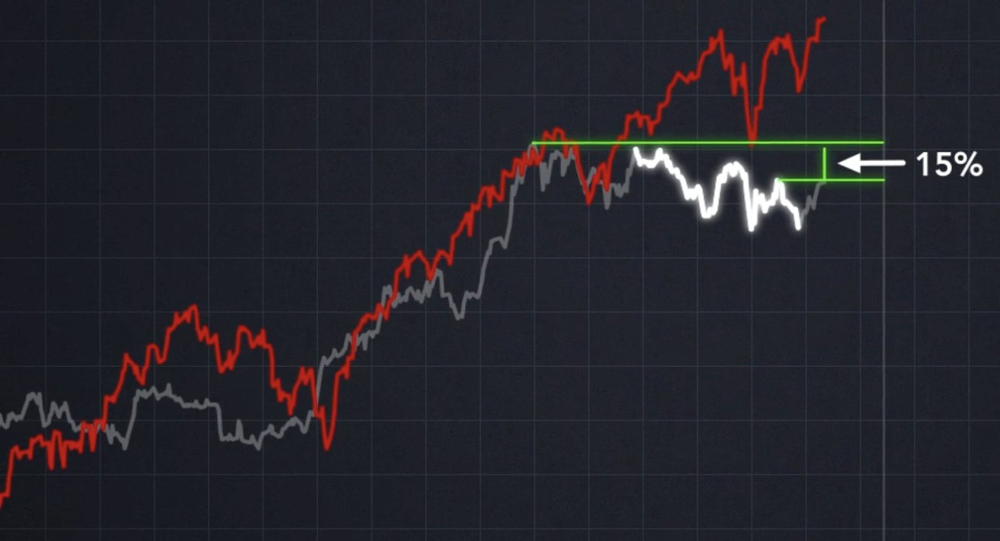
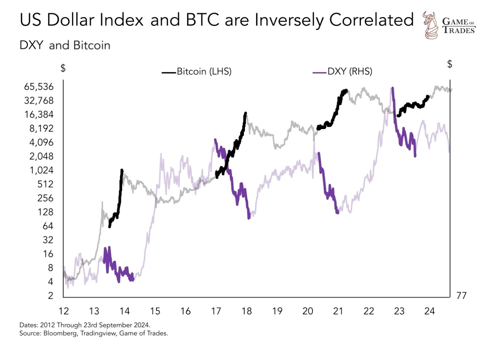
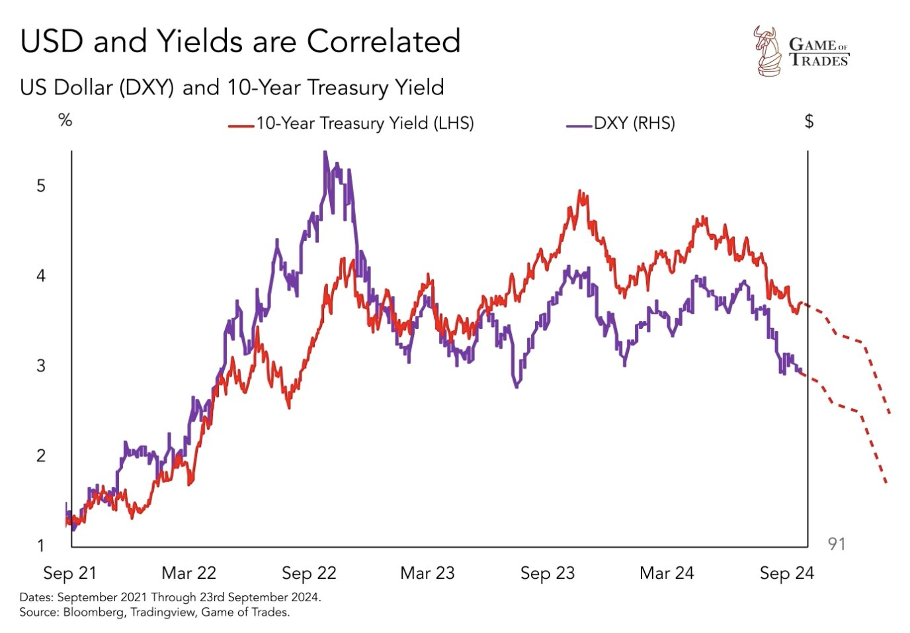
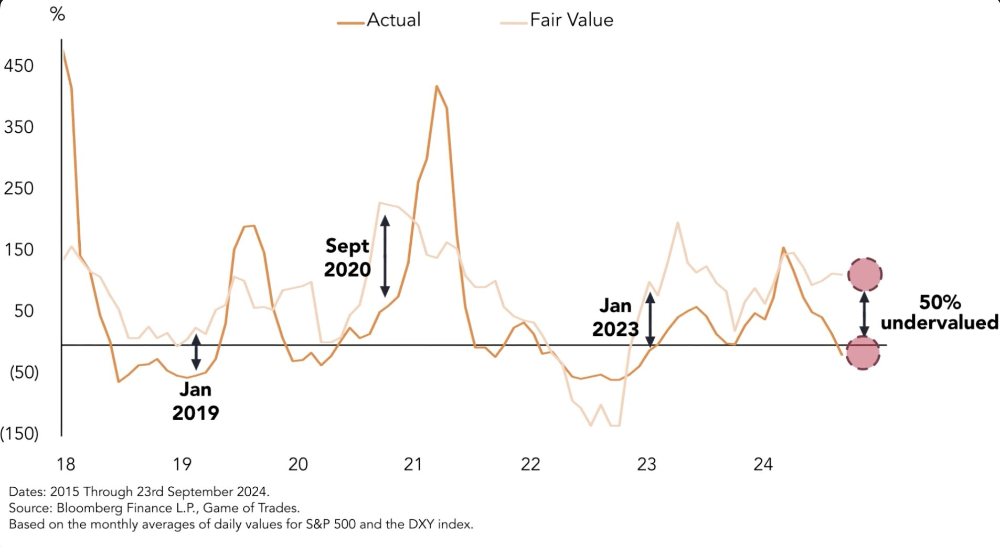
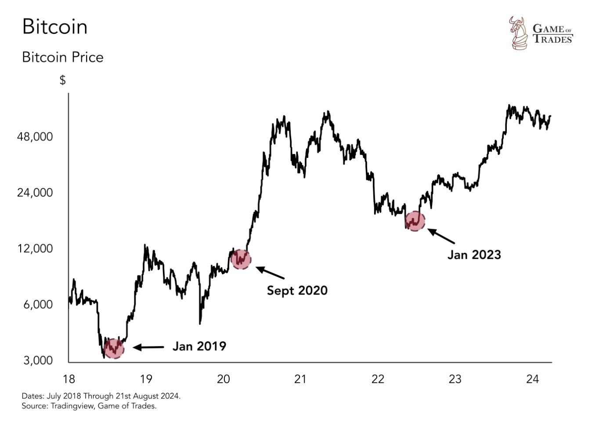

# BTC目前被低估50%，真实定价或超12万刀

隔夜BTC继续站稳65k，剑指66k。最近美联储降息后，黄金、美股、A股都陆续情绪高涨，反倒显得BTC有些落后了。有人（Game of Trades）研究了一下近半年来BTC和标普500的背离，以及BTC和美元指数的负相关性，得出一个结论：BTC目前的市场价格被低估达50%，真实定价或超12万刀至14万刀。

通常而言，BTC的上涨阶段会和美股同频共振。比如下图画出的，2018年底至2019年中的底部复苏，2020年4月到2021年初的早期快牛，2022年底到2024年初的走出熊市，等等。

但是，在某些时候，我们也会见到BTC和美股的走势背离。比如下图画出的，2018年底BTC熊市底部横盘震荡、标普500上涨，2019年下半年BTC震荡回落、标普500上涨，2022年下半年BTC熊市探底、标普500上涨，2023年初BTC回调整理、标普500上涨，最近一次长时间背离就是2024年3月份以来，BTC横盘震荡回落洗盘、标普500上涨。

由此，很多人会有一个错觉，那就是：BTC涨，美股一定涨；美股涨，BTC却不一定涨；但美股跌，BTC一定跌。这么看来，美股涨的时机应该是多于BTC才对。但是最终结果却是，BTC的涨幅远远跑赢美股。

这就像爸爸陪儿子跑步。儿子跑起来的时候，爸爸有时候一起提速，有时候就慢悠悠地走路。儿子跑不动的时候呢，爸爸也会停下脚步等等他。但是只要爸爸一加速，就总是能够轻松超越儿子。不要只看到儿子跑的时间远超过爸爸，其实爸爸总是用更少的时间，跑得比儿子更快、更远。BTC就是爸爸，美股就是儿子。

那么这一次从今年3月份到现在9月份，儿子还在跑，爸爸却停下来在慢悠悠地走，这就是在等待。

6个月震荡整理，就是给3月份追高进场的人，充足的时间窗口，逢跌加仓、建立仓位。平均建仓成本大约会在6万刀上下。这就是下一阶段行情的起点基准。

BTC是美元走弱的灵敏指示器。它和美元指数DXY具有负相关性。如下图所示，2013年DXY跌、BTC暴涨，2017年DXY跌、BTC暴涨，2020年DXY跌、BTC暴涨，2023年DXY跌、BTC快速复苏。

为何？因为所谓的BTC涨跌，乃是以美元计价的名义价格。当美元疲软时，名义价格不变，等于实际上打折了。这就会诱使非美买家抢购，需求暴增。这恰恰是由于BTC作为世界货币、全球资产所独具的优势。

现在，美联储正式启动降息。这意味着，接下来美元将和美债收益率一起，开启新一轮下跌。

而这将有望驱动BTC的新一轮暴涨。

据研究者估计，BTC当前的市场价格，存在约50%的低估。过往历史上，出现如此大幅低估的时候，还有2019年1月、2020年9月、2023年1月等。

而过往三次出现这种大幅低估的时候，无一例外都是BTC大爆发的前夜。

坐稳扶好，系好安全带，别被甩下车，有趣又刺激的惊险旅程，马上就要开始了哟！
