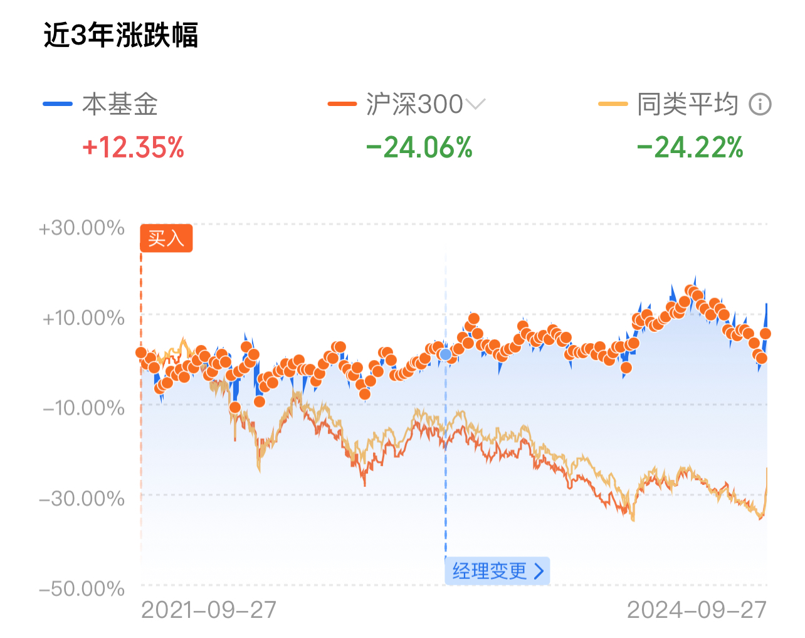
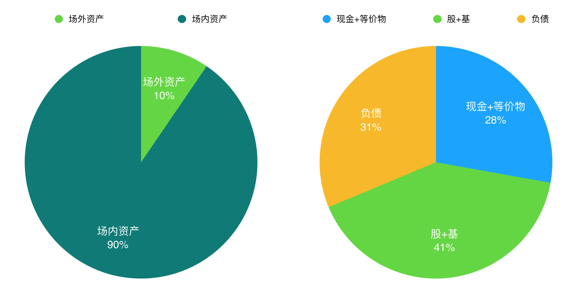

# 牛回速归，扭亏为盈（兼谈资产配置）

隔夜BTC继续在65k上下踟蹰。今天是大A国庆前最后一天开市。一开市就气势如虹，涨过了3200-3300点。教链在2021-2024三年冲高回撤阶段建仓的大A仓位也开始扭亏为盈了。这就初步达到了3年前进行这一实验的目的：验证“八字诀”是否适合A股市场。

明天就要十一放假了。在假期前最后一天，做一点儿总结和复盘吧。提前祝各位读者节日快乐。

教链的投资之路，始于股市，但成于加密。一穷二白的时候最难，要996打工糊口，根本没时间琢磨投资的事儿。在新闻里听到“杠杆”这种词儿都是一头雾水，完全不懂。越是没时间学习，就越是不得其门而入；越是穷，就越是没有能力去冒风险尝试。跌跌撞撞，总算是在加密，其实就是BTC这里，领悟到了一点儿投资的心得，摸索出了一些实操的方法，取得了部分还说得过去的成绩。

从这一点突破开始，才慢慢扩展开去，逐渐扩大了对投资一事的认知和视野。如《桃花源记》描绘的那般，「林尽水源，便得一山，山有小口，仿佛若有光。便舍船，从口入。初极狭，才通人。复行数十步，豁然开朗。」

“八字诀”（坚持定投，逢跌加仓）便是从BTC中总结出来的一个方法论。虽然有无数研究会说，逢低一把梭哈建仓会更好，但是，实践过就会知道，理论离普通人的实践差的太远。教链深知这一点，因为教链自认就是一个普通人，普通的不能更普通的人。什么是普通人？普通人就是会在2021年3500点进场大A、6万刀进场BTC甚至被山寨币、模因币、土狗币吸引的人。普通人就是会在2022年底16000刀割肉BTC、2024年2700点割肉大A从而“倒在黎明前”的人。

因而教链常常反求诸己，告诫自己，当特别想买的时候就忍住不要买，当特别想割的时候就忍住不要割——甚至应当加大力度买入。四个字，戒急用忍。当然，和“八字诀”搭配的，最重要的是忍住不要割，买如果没忍住顶多是成本略高而已。于是教链干脆定下一个纪律：任何时候都不许卖出。以此管住手。

经常有一些自以为不普通的人，和教链叫板。言下之意就是要比个高低，以此凸显自己策略的高明。其实真没啥高明的，是个人都知道二级市场的暴富秘诀只有四个字：低买高卖。更快暴富的秘诀，八个字：加上杠杆低买高卖。越是嘴上牛逼哄哄，越是没啥真本事。真有本事在零和博弈中取胜的办法，大家都恨不得当个武功秘笈似的藏起来，又怎会拿到台面上大讲特讲？

记住：拿出来卖的武功秘笈，那一定是假的。如果连钱都不收，竟然免费送，那肯定是谋财害命的东西了。

这也是区块链思维和互联网思维的重大差别之一。互联网鼓励免费思维，迎合了部分人贪小便宜的心理，实际上是请君入瓮、瓮中捉鳖。区块链倡导从一开始就付费，天下没有免费的午餐。没有一丝一毫的BTC是可以免费获得的，所有人都必须平等地付出相应的代价才能得到它，因此就会珍惜它。由此观之，如果某个打着区块链旗号的项目，竟然运用互联网免费思维的推销方法，通过蝇头小利来吸引流量，那么，它一定是心怀鬼胎，要在将来收割的。

教链相信，实践出真知。于是，本着“我不下地狱谁下地狱”的精神，教链在2021年进场很多人口中的“地狱级难度”副本——大A。只不过，相比于一把梭哈高位站岗的朋友而言，教链是拿真金白银在大A市场上测试“八字诀”的效果。

教链在大A同时建仓两个仓位：一、个股；二、股指基金。个股的选择逻辑，教链曾在“8.26教链内参：谈一点儿股市投资的基本逻辑”谈过。股指基金则选择了红利指数。原因是教链在《比特币史话》第40话“大萧条”中所下的论断，即全球经济处于康波萧条期，不应过度押注进攻性资产，而应着重考虑资产的防御性。全球经济的康波周期，构成了我们选择何种类资产配置的大基调。

事实果真证明，在面对指数跌跌不休的这三年里，教链选择的基金很好地对抗了宏观的衰退，避免了双腿陷入泥淖。而在个股上，八字诀的建仓手法，又使得教链把个股下跌所导致的套牢转变成了降低持仓成本的机遇，从而当宏观底部迅速反弹时，仓位就迅速扭亏为盈了。

可见，合适的策略可以帮助我们对冲宏观的不利局面，即便是面对“地狱级难度”，也能从容立于不败之地。在大A似乎是度过历史大底，初现右侧入场信号时，教链的股、基仓位已经全部扭亏为盈，这就站在了一条比较不错的起跑线上。

那么，迄今为之，教链的所有仓位中，只有另一个实验——山寨币UNI (-30%多)仍陷泥潭，其它仓位都暂时处于盈利状态，包括BTC (+超300%)、ETH (+4%，刚刚扭亏为盈)、大A个股(+3%，刚刚扭亏为盈)、大A基金(+超10%)等。总体上，教链的资产仓位汇总起来是盈利的，很好地实现了2020年关于防御宏观萧条周期的预想——当然，在本轮康波萧条完全渡过难关之前，还不能掉以轻心。毕竟，活到春暖花开，笑到世界尽头，才能谈论最后的胜利。

这些资产仓位，再加上现金和现金等价物比如货币基金，就构成了资产配置（教链把实物资产排除在外了）。其实决定投资成败最重要的，但也是最少被重视和谈论的，恰恰也是资产配置。

资产配置决定了仓位的风险暴露面向哪里，以及暴露面的大小和相互比例。教链的风险暴露9成在加密市场（场内），1成在非加密市场（场外）。加密仓位中，BTC又超9成，其他仅占不到1成。场外仓位中，传统意义上的低风险资产，即现金和现金等价物，与传统意义上的高风险资产，即股票和股指基金，约为5:5开。另外，保有一定量低成本长期负债，与现金及等价物规模大致相当，意在对冲通胀——通胀会令现金和负债同等贬值。

简单画个饼图示意一下：

说是风险暴露，其实恰恰需要控制的就是风险。教链的大部分策略，是防御性的。BTC是防御全球流动性泛滥风险。现金是防御市场波动性风险。负债和股、基则都是为了防御现金贬值风险。目的不同，资产配置的方式也就不同。

BTC仓位是压舱石。有人觉得BTC是极高风险资产，那只是因为认知不足。如果把所有资产的所有角度都充分思考一遍，而不仅仅是考虑短期波动性，就会认识到，什么才是最安全的资产。

教链对这些资产的看法和选择是基于自身需求出发，不同的人自有不同的看法和目的，因而决不能生搬硬套。
