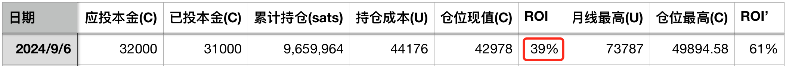
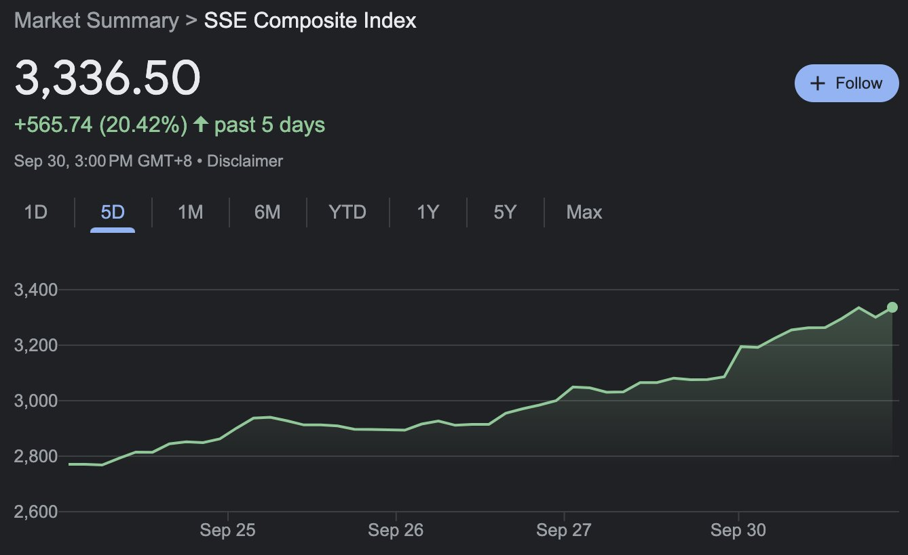
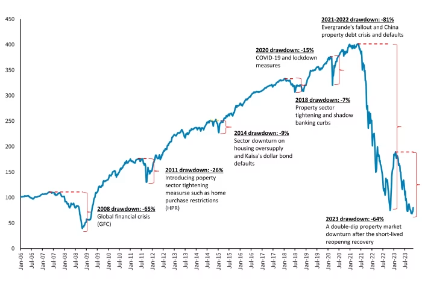

# 市场和孩子 —— 十年之约＃32（ROI 39%）

国庆节，祝福祖国生日快乐！

9月BTC开盘59k，最高66.5k，最低52.5k，收盘63.5k，收涨7.7%，打破了过往9月多收跌的局面。十年之约9月B份逢涨不加跳过，目前持仓成本44176刀，浮盈39%。

说到底，BTC对冲的是宏观流动性预期。美联储9月FOMC会议扭转了美元紧缩预期，拉开了美元宽松周期的帷幕。中国没有坐等美元上门，而是如“9.30教链内参：央妈或不愿rmb过度升值”所说，“先发制人”、“主动出击”，赶在十一前集中出政策，扭转和拉升资本市场。上证指数在9月18号美联储降息落地时触底2680.7点，短短9个交易日，到9月30号节前收盘已经站上3336.5点，暴拉近25%，堪称盛景。

这让一众信誓旦旦、头头是道地分析称「美联储降息宽松创造的美元流动性不会流往中国」的人错愕不已。当然，他们错愕不已也不是一回两回了。

也有一些外国分析师指着中国房价下跌的图表大讲经济衰退，口口声声说什么情况比当年的日本还要严重，现在刺激已为时过晚云云。他们是看后视镜自说自话，不懂什么叫做“沉舟侧畔千帆过，病树前头万木春”。

了解BTC周期的人都知道，在真正的自由市场，跌70-80%才能充分出清杠杆，刮骨疗毒，重新进入健康的复苏周期。2011年下半年熊市，跌幅99%。2014-2015年熊市，跌幅83%。2018年熊市，跌幅超80%。2022年熊市，跌幅77%。

经济学其实挺精神分裂的。这个理论说，资产价格下跌就要通缩衰退，必须抓紧救市甚至提前救市。另一个理论说，应当采取自由放任的政策，让市场自动出清，应死尽死之后，自然就会转向复苏了。

照顾过发烧儿童的都懂得，病毒性发烧的护理方法，是持续监测体温，如果一旦超过38度高烧，那就采取口服退烧药加物理退烧的办法控制体温以免抽风，退烧后大量饮水加速循环代谢，如此大概每数个小时循环一次，直至人体免疫系统战胜病毒，最终发烧程度越来越轻，身体也就康复了。

资产价格就好比是体温，经济系统好比是人体。资产价格暴跌，好比体温迅速升高，未必是人体扛不住了，马上送进特护病房各种输液，而恰恰是人体免疫机制还在正常运作的体现。体温升高正是免疫系统消灭病毒的机制之一。资产价格下跌也正是经济系统消灭不良杠杆的机制之一。一发烧就输液的孩子，因为自身免疫系统总是得不到锻炼，其抵抗力反而差，特别容易生病。

另一方面，虽然护理只是提供生命维持的支撑，最终靠得还是人体自己战胜病毒。但这绝不是说，退烧、饮水这些护理就不重要了，就可以把孩子扔在那里自由放任、自生自灭了。虽然发烧是免疫系统和病毒战斗的机制，但是如果战斗激烈到已经要反噬身体，比如高烧烧坏脑子了，那就需要良好的护理，把握好时机进行干预退烧。毕竟，我们要的，是一个活着的孩子，而不只是死掉的病毒。

资本市场，作为一个复杂系统，其实和孩子差不多。

美股是一个娇贵的孩子。别说发高烧了，就是打个喷嚏，华尔街都得逼着美联储赶紧安排特级护理病房，各种药水就开始打，甚至直接用激素。

A股就没那么娇贵，也就显得有些爹妈不亲。发烧不高就先躺着，哭呀闹呀也不能着急给药。如果烧到一定程度（比如跌破3000点），就会给点儿退烧药（国家队底部吸筹但不拉盘）。

BTC就是个吃百家饭的野孩子了。舅舅不疼，姥姥不爱。生病发烧全靠自己扛过去。但这造就了它独一无二的强壮身体和无可匹敌的免疫力。

中房本来是金枝玉叶，像美股一样，被父母精心呵护的。放在手心怕摔了，含在舌尖怕化了。但在这轮周期，新旧动能转换，失去了特级护理的待遇，于是突然要靠自身免疫力去扛了。公主一朝睡在民间的板床上，哪怕被子底下有一颗豌豆，都是要被硌得疼的。

要养一个身体健康的孩子，恐怕不能靠特级病房，而要靠日常锻炼。人人都明白的很通俗的道理，一旦用经济学术语包装之后，就突然变得稀里糊涂了。
