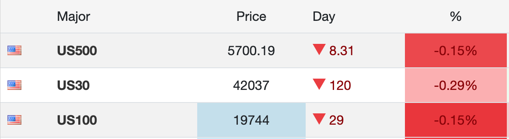
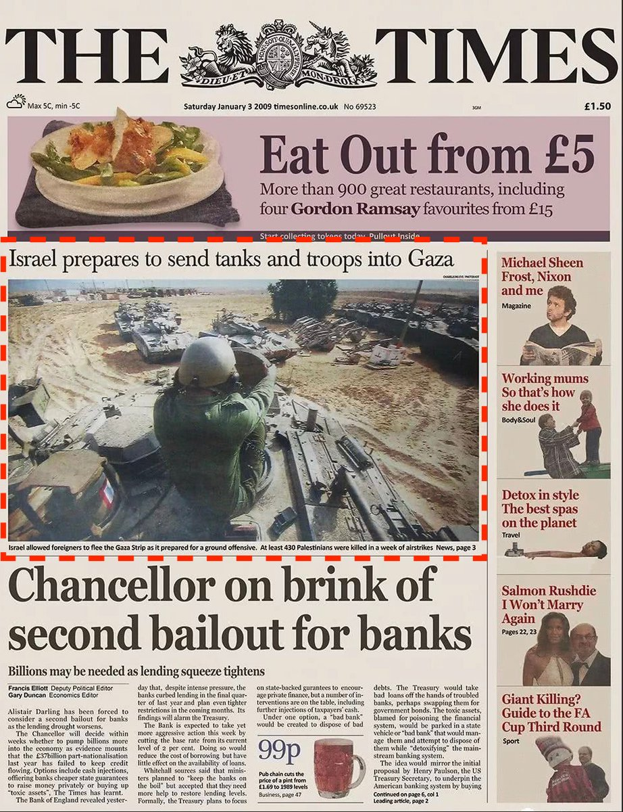
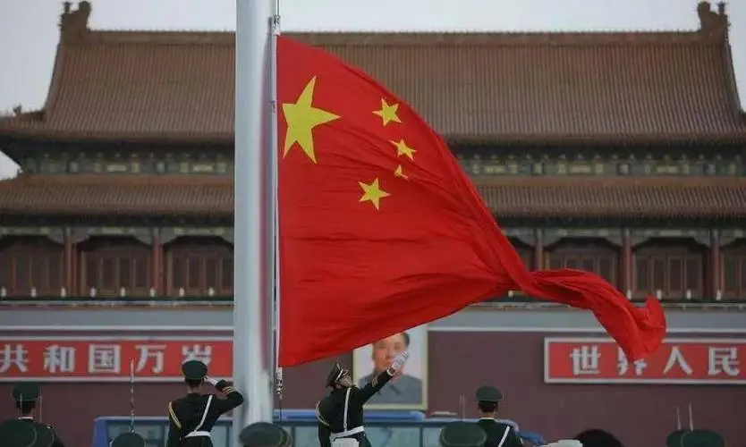
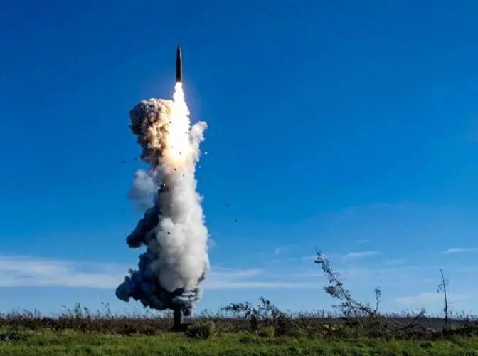

# 嘴炮和大炮齐飞，市场共跌跌不休

十一我们四处忙于游玩的时候，西方某些集团却加紧趁机搞事。“10.1教链内参：东线无战事，西线不太平”报，鲍威尔讲话，否认50bp降息成为常态，向市场传递了不急于过快降息的调子，打击了市场对流动性迅速宽松的幻想。与此同时，以色列地面部队入侵黎巴嫩，地区局势骤然升温。五角大楼说，美国要增派数千美军（使该地区美军总数增至4.3万），“保卫”以色列。

嘴炮加大炮，立竿见影地提振了美元，击沉了风险资产。美股全线下跌。BTC更是从9月30号最高66k连续3天下跌，大幅回撤到MA30即60k一线。

现在大A市场因为国庆长假在休市。没想到老美趁这时候搞这么大事。看风险市场被鲍威尔和以色列左右开弓狂扇耳光，节前追高进场的大A散户们不知是否有些瑟瑟发抖，恐惧于节后开市的审判了呢？

帝国主义就是帝国主义，你爱也好恨也罢，它要自己好，就必须吃人，以别人金钱的亏损，甚至生命的丧失为代价。而且，与东方文化里“慎战”的思维不同，它杀人越货的胆子不仅有，而且很大，想干就干。

教链不禁又一次想起，中本聪在2009年1月3号上线的比特币（BTC）创世区块中“铭记”的当日《泰晤士报》上另一个同版新闻：「以色列准备派遣坦克和步兵进入加沙」。

15年过去，这个世界的底色一直没有变过。那是鲜红的血色。

「为什么战旗美如画？英雄的鲜血染红了它。为什么大地春常在？英雄的生命开鲜花。」

为什么我们能够安心旅游度假？因为五星红旗的颜色，是血染的红色。钢铁的英雄用鲜血染红了五星红旗，英雄的钢铁一直在保卫五星红旗下的人民。

金钱和钢铁，本就是硬币的一体两面。看不到这一层的人，就会对经济数据、货币政策、宏观调控等等眼花缭乱的概念和术语陷入主观主义的幻想。

美国是个好老师。它在搞货币调控的时候，必定会配合军事行动。

虽然美国在意识形态上反对导师，但在实践上却是导师最忠实的学生，一直切身地践行导师在 《〈黑格尔法哲学批判〉导言》中的至理名言：「批判的武器当然不能代替武器的批判，物质力量只能用物质力量来摧毁」。

鲍威尔的嘴炮，是批判的武器。美军和以色列的大炮，是武器的批判。

导师接着说，「理论只要说服人，就能掌握群众；而理论只要彻底，就能说服人。」

在弱肉强食的价值观里，强权即正义，大炮即真理。因此帝国自信满满，自认自己掌握地球上最厉害的真理，所以肯定能说服人，说服全世界最为广大的群众。

但是帝国这种真理横行的自信，令全世界感到窒息，像黑人弗洛伊德一样无法呼吸。

不过它忘记了，导师最后两句话：「所谓彻底，就是抓住事物的根本。但人的根本就是人本身。」

帝国的真理，虽然仍旧强大，却越来越脱离群众。帝国精英的眼中，只有韭菜、耗材、狗和AI机器人，哪有“人”？对于脱离底层、高高在上的精英而言，全世界80亿人口中的大多数，都不被他们当“人”看。韭菜是被他们反复收割，敲骨吸髓的。耗材是被他们的大炮送上西天的。狗和AI机器人则是天天拿钱发帖、发评论给他们高唱赞歌、抹黑他们敌人的。

此物一出天下反。中本聪给世界带来了BTC。以巨大的算力（物质力量）对抗帝国的武器（物质力量），在帝国强大的霸权版图上，撕开了一个微小的口子，让人们重新拥有了呼吸的自由。

千里之堤，溃于蚁穴。帝国霸权，毁于一旦。

「我们可以在军备竞赛中赢得一场重要战役，并在几年之内攻占一片自由的新领地。」——中本聪，2009年1月16号
