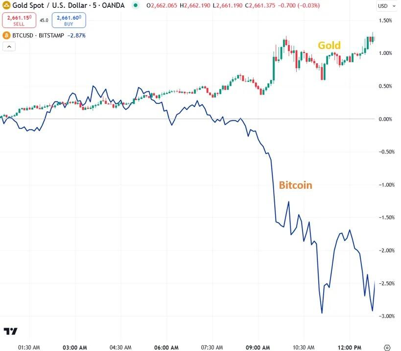
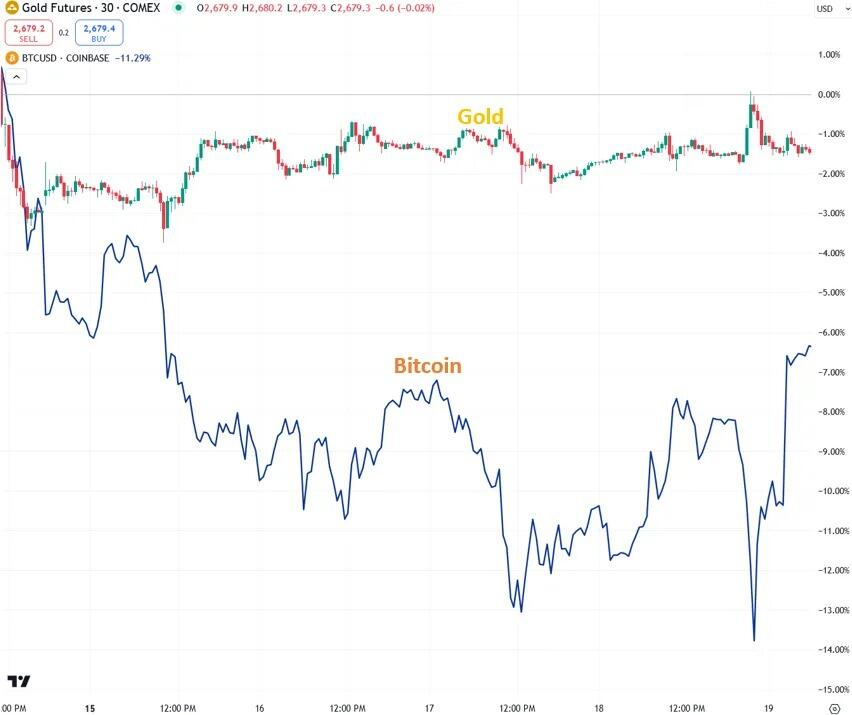
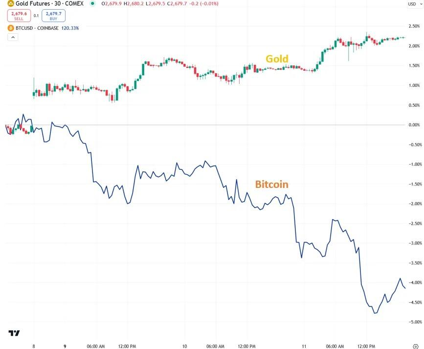
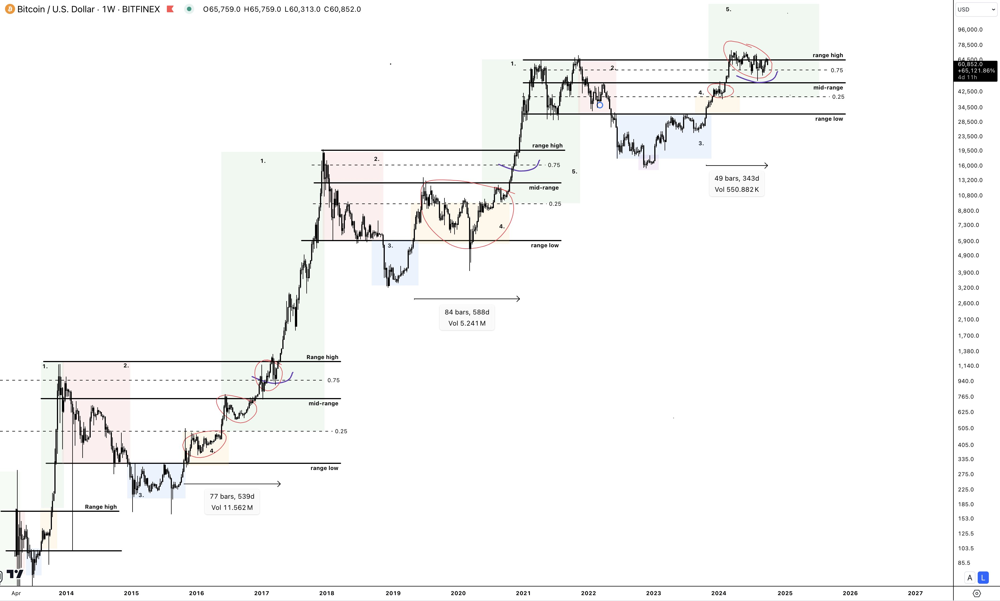
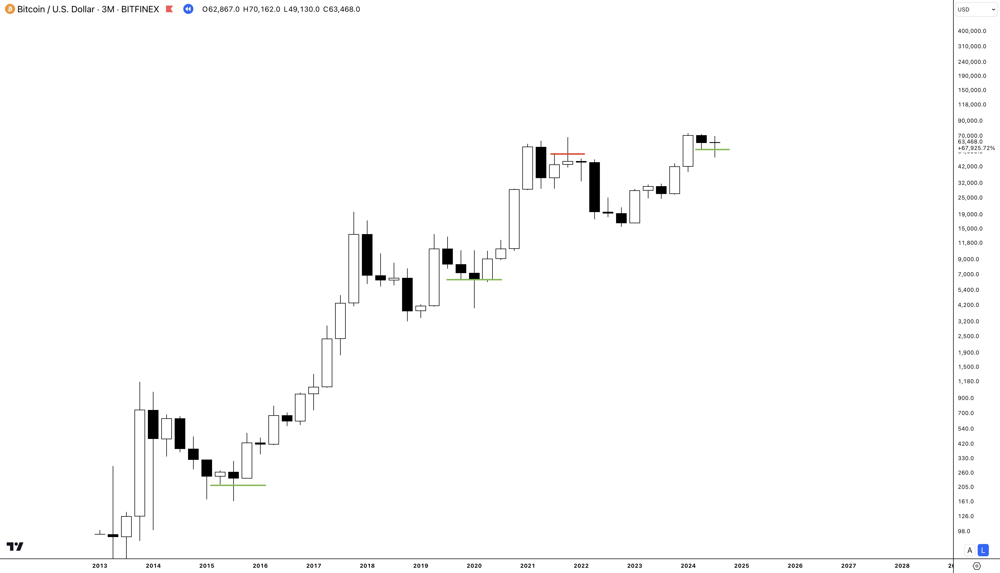
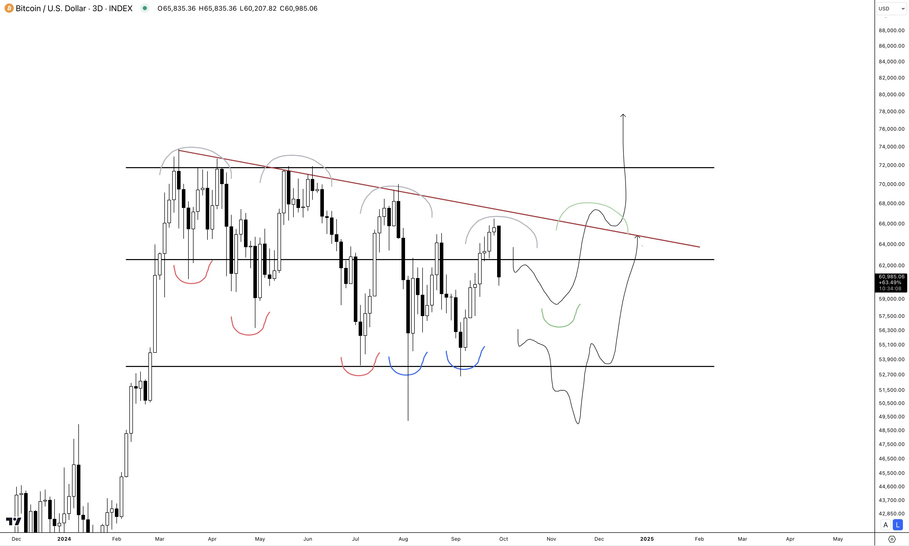
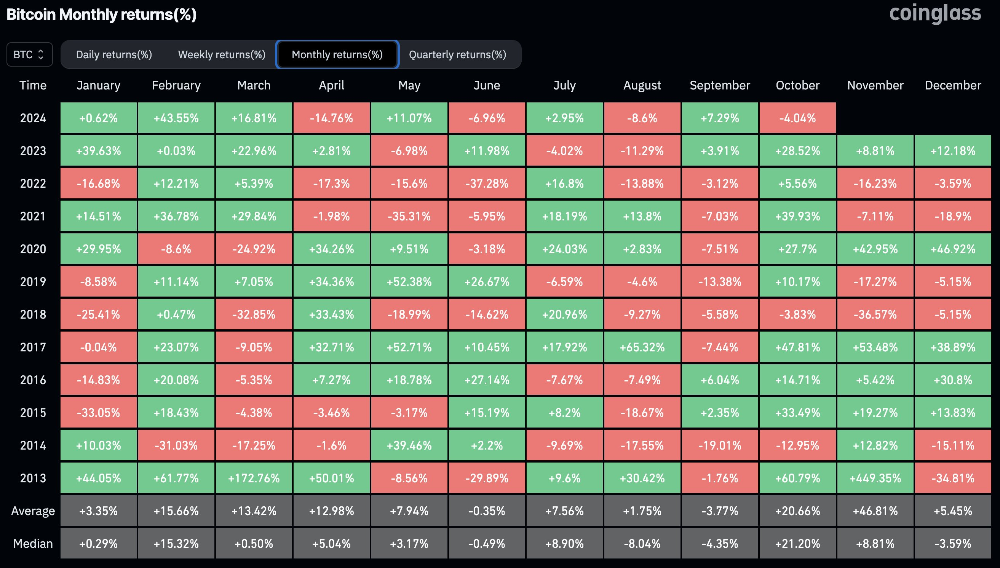
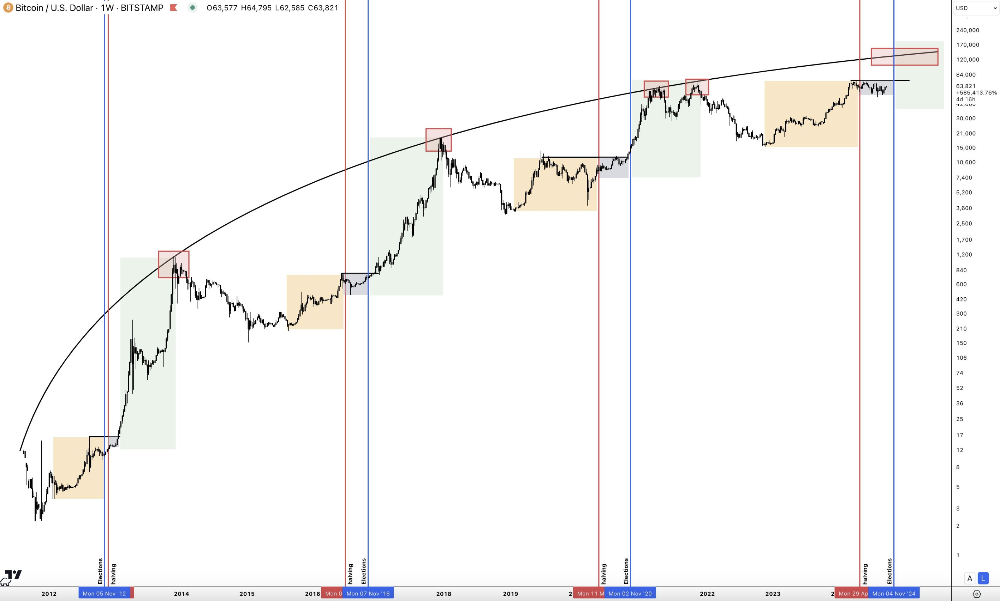
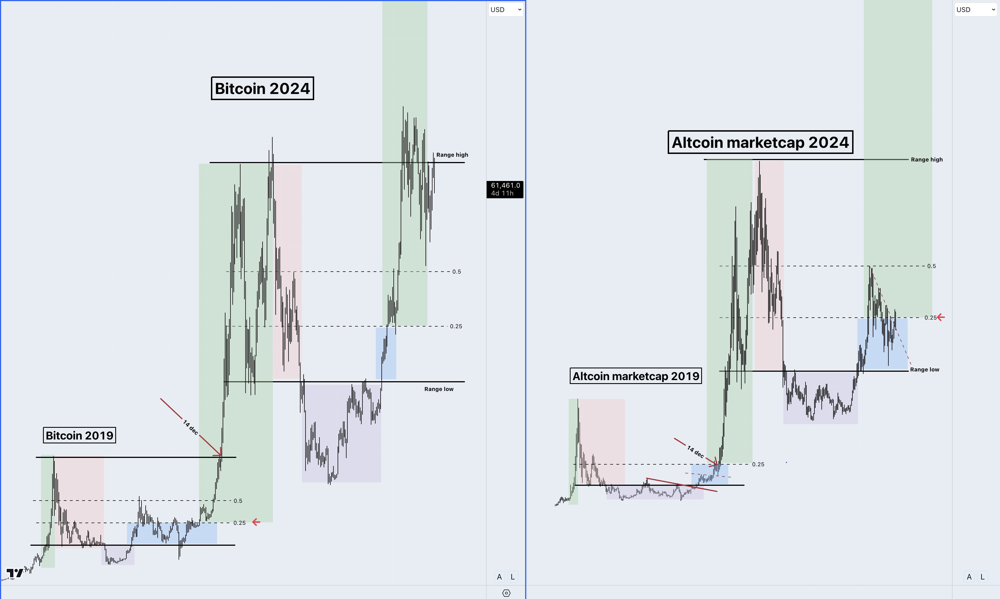

# 加密牛市将至的7点原因

受地区局势动荡影响，BTC一路回撤至60k一线。连续的跌跌不休，让追进的多头杠杆付出了代价。以至于有网友在zerohedge发文，直斥BTC不是“避险资产”，大炮一响，它就下跌。

2024年10月1号，伊朗向以色列发射导弹。黄金 vs. BTC：

2024年4月，伊朗向以色列发射导弹。黄金 vs. BTC：

2023年10月7号，以色列入侵加沙。黄金 vs. BTC：

这位网友最后总结道：

「BTC和科技股之间的强相关性可能是由投资者的大量重叠所驱动的——那些对现代技术着迷并过于自信的人。我相信，这群人将因科技股泡沫的破灭而措手不及，当他们被迫清算科技股并失去科技领域的工作时，这也会压低BTC的价格。当然，这并不是说BTC在某个时候不会经历疯狂的飙升，达到10万美元或更高。然而，我不认为它是一种像黄金一样可靠的投资，黄金在数千年中一直被证明是一种价值储存手段。

「证据表明，尽管被称为“数字黄金”，但BTC的表现始终更像一种投机资产，尤其是在地缘政治危机时期。它与纳斯达克 100 指数的相关性以及它对推动科技股的相同力量的敏感性表明，BTC缺乏黄金等真正避险资产所定义的稳定性。随着科技股泡沫不断膨胀，BTC的命运与科技股紧密相连，一旦泡沫破裂，BTC很容易遭受大幅下跌。尽管BTC的价格可能会大幅上涨，但它无法提供黄金的可靠性和历史实力，而黄金在历史上已被证明是一种坚定的价值储存手段。投资者在将BTC视为不确定时期的可靠对冲工具之前，应该考虑这一现实。」

虽然人们对于BTC究竟是投机资产、风险资产，还是贝莱德所说的“风险分散资产”依然存在争议，但是，网友CryptoAmsterdan还是指出，2024年四季度或2025年一季度的加密牛市依然可期。下面是他给出的7点原因。

第1点原因就是周期结构。

每轮周期都会有震荡整理，目前我们就是处于这一阶段。牛市突破通常需要500天左右的时间继续力量。这轮周期我们才刚刚度过350多天。耐心一点。

第2点原因是3月线的技术图形形成一个插针高收。

这是一个很有趣的技术形态。它跌破了前一根K线的低点，但是又收复了所有的跌幅，收在了前一K线的低点之上。这形成了一根针，刺破并站住了前低。在过去，这种形态发生的时候，往往紧随着行情的大幅向上突破。

第3点原因是近半年以来的整体震荡下行通道只待一个向上突破。

当然，市场短期仍然可能在通道内测试新低。

第4点原因是季节性行情。

十月、十一月在历史上通常都是BTC表现较好的月份。

第5点原因是减半和大选。

产量减半：BTC 通常会在减半后经历一段横盘整理期，但减半结束后仍会继续这一周期。

美国大选：利好的是选举结束后不确定性就会消除，而选举通常标志着第二轮牛市周期的开始。

第6点原因是山寨币周期。

加密周期通常分为两个阶段：BTC发动牛市；山寨币开始轮动。不过，现在看起来山寨币似乎要趁BTC在前高阻力位徘徊时率先形成突破，结局仍未可知。

第7点原因是山寨板块的结构。

许多山寨币似乎已经处于底部，做好了迎接一轮新行情的准备。

最后这位网友认为，目前或许是布局山寨的时机。当然，这不构成任何投资建议。

教链记得有不少人，包括满手ETH的一些朋友，不无失望地说，也许从这一轮周期开始，BTC和山寨板块将彻底拉开差距，再也没有什么山寨行情，BTC一骑绝尘。

如果这只是价格低迷的心理投射，那不过就还是“涨了是技术革命，跌了是庞氏骗局”的低等条件反射而已。

条件反射经历地再多，也不会形成什么有意义的经验积累，认知水平也不会提高，只能陷在“希望-亏损-失望”的无限循环当中。
