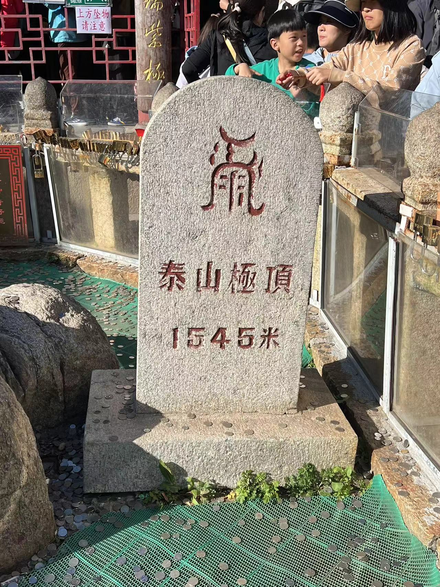
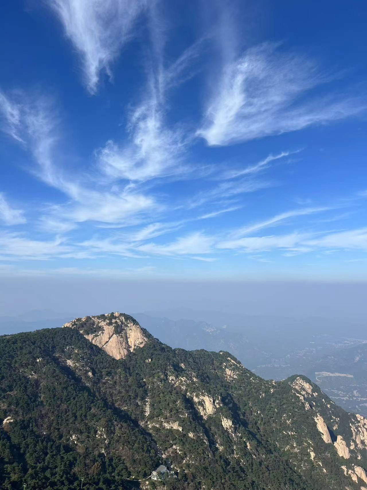

# 登顶 

今日BTC站住30日均线并反弹至逼近62k，教链登顶泰山。《孟子·尽心上》载，「孔子登东山而小鲁，登泰山而小天下。」当我们沿着BTC不断登上一个比一个更高的顶，极目远眺，也会发出“登BTC而小全球资产”——登顶BTC而见全球资产之渺小——的感慨吧？！

泰山在五岳之中不是最高的。BTC在所有的加密资产中也不是所谓技术最时髦的。但是，它们为何能够穿透历史的长河，逐渐沉淀出一种历史和文化的厚重，从而日益加强其底蕴和价值，日新日高呢？这是一个值得思考的问题。

这世界上的东西有两类。

一类是随着时间的流逝而日益灭失的。时间越久，它就越是倾向于折旧、崩坏、消亡。例子比如大部分的消费品，手机、汽车。还有一些无法抵御岁月侵蚀的存在，比如国家，公司，以及，人的生命。

另一类则是随时间流逝而日益增强的。时间越久，它的生命力就越强大，基础就越牢固，底蕴就越厚重，价值就越高。这类的东西往往是更高维度的存在，比如知识，传说，以及文化。这些东西可以变换物质载体而保持其灵魂不变，并且往往随着不断地传播扩散而在保持内核的基础上快速演化，屹立于历史潮流之巅。

BTC是一个资产，一个网络，一个系统，一份数据。BTC更是一种特定的知识，一个吸引人的传说，一项独特的文化产物。

所以BTC是极难被消灭的。你可以摧毁它的部分有形载体，但是你却永远无法彻底消灭它的这种精神。只要这种精神永存，就总会有物质和能量会在此种精神的引领之下，源源不断地汇聚于此。

就像中华几千年文明史，蛮族常常侵占华夏的部分土地，劫掠财富和人口，甚至短暂入主中原，但是，在中华文明强大文化的影响下，入侵者若不是被驱逐，就是会被同化而融入华夏。

古代封建王朝，不管皇帝换了姓什么人来当，都要尊泰山为五岳之首，登之以拜谒天地，从这里获得自身统治的合法性背书。

这就是文化的力量。
