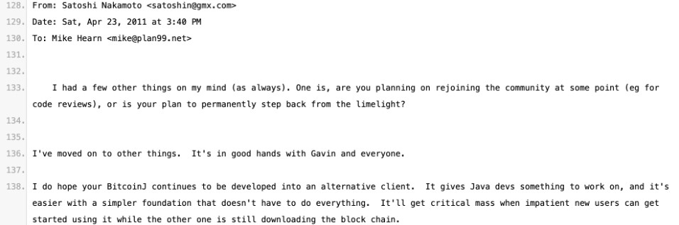

# Len Sassaman是中本聪吗？

周六BTC继续反弹站上62k。周五美国出了个大事，非农就业数据一声惊雷（详参“10.5教链内参：非农就业，一声惊雷”），把美联储降息50bp的概率给干到了0%。要知道，仅仅一周前，这个概率还高达53.3%来着！你就说惊人不惊人吧？

“10.5教链内参：非农就业，一声惊雷”还谈到，美国HBO电视台最近搞了个大动静，计划要在10月8号也就是3天后播出纪录片，拆解“谁是中本聪”这个世纪未解之谜。

这个话题被大众媒体炒作，对于扩大BTC的知名度及传奇色彩有好处。不过，对于他们蹭中本聪的名，名不副实地宣传炒作即将揭开这个谜团（实际上据信影片也只是猜测），又实在是非常违背中本聪和BTC务实的精神。

目前预测市场Polymarket开了个盘口来让市场用真金白银押注猜测，这片子会把疑似中本聪的对象指向谁。目前得票最高的是Len Sassaman（45.5%）。很多人可能都没听说过这个人。

得票较高的四位里面，反而是得票少得多的三位，Hal Finney —— 最早参与BTC并与中本聪互动，Adam Back —— 被中本聪直接借鉴工作量证明算法的hashcash的发明人、Blockstream公司创始人，Nick Szabo —— 与BTC极其相似的“比特金”提案的提出人，有更高的全球知名度。

这四位顶级密码学家中，两位已经离世 —— 其中Len Sassaman是2011年7月3日因抑郁症自杀，Hal Finney是2014年8月28日因渐冻症不治身亡；另外两位Adam Back和Nick Szabo均健在，但是都曾公开否认过自己是中本聪。

而其中又以自杀殒命的Len Sassaman最为令人扼腕。毕竟，作为一名80后（1980年4月出生），Len Sassaman去世时年仅31岁。

Len Sassaman全名Leonard Harris Sassaman，生于美国宾州，在比利时读博，后长期生活在比利时，去世时也是在比利时。由于中本聪部分单词存在英式英语习惯，以及BTC创世区块引用英国报纸泰晤士报，有人就怀疑Len Sassaman是中本聪，但稍显捕风捉影了。

Len Sassaman 18岁时就在互联网标准化组织IETF负责TCP/IP协议相关工作。他和点到点下载协议BT的发明者Bram Cohen是室友 —— 而正是后者把他带入了密码朋克的世界。

他追随著名加密学家、PGP算法的发明人Phil Zimmermann，在PGP的相关工作上做出过贡献。

他和Hal Finney一起在重邮器（remailer）方面做过一些工作。

他在比利时的博士生导师是著名密码学家、有“数字货币之父”之称的David Chaum —— 后者曾经在上世纪八九十年代发明了基于密码学的数字货币技术并成立企业进行运行，但都失败了。

虽然有一些人怀疑Len Sassaman是中本聪，但是并没有任何过硬的证据可以支持这种猜测。

比如，中本聪在2011年4月23号写信给Mike Hearn说“我已经去做其他事情了”，此后没过多久，Len Sassaman自杀离世。

但这种关联性实在是过于勉强。比如有网友就指出，如果Len Sassaman是中本聪，他又是如何在死后的2014年3月7号发帖澄清说，他不是Dorian Nakamoto的呢？

当然，也有人压根儿就不认为2014年的这个帖子是中本聪本人发的，而不排除是被黑客盗号。

FBI也认为中本聪是一个非美国人。不过，FBI对谁是中本聪可能也一无所知。

Len Sassaman的妻子曾经公开表示过，说他不是中本聪。但是，也许他的妻子只是不知情而已。

这些旁证都不能说明任何问题。

不过，由于Len Sassaman生前在推特上颇为活跃，所以很容易找出他当年有关BTC的一些发言。比如他认为BTC和非法活动的关系，以及他的这条2010年12月8号的推文：

翻译一下：「我还没有分析过比特币，但与我交流过的多位数字现金专家的印象是，它是一派胡言。」

看起来，作为第一代中心化数字货币先驱David Chaum的弟子，他对中本聪第二代数字货币去中心化的设计思想颇为龃龉。

很显然，中本聪也明确地把一代目们的尝试定性为“失败的”且造成了严重的后果——即阻碍了人们继续尝试的勇气。2009年1月16日中本聪在论坛中说：「由于自 20 世纪 90 年代以来所有那些失败的公司的缘故，很多人自动地把电子货币看作是注定不会成功的事情。很明显，仅仅是因为那些系统的中心化控制的本质让他们注定失败。我认为这是我们第一次尝试去中心化、基于非信任的系统。」（见刘教链《比特币史话》第44话）

教链认为，有近乎100%的概率可以确定，Len Sassaman不是中本聪。

后记：听说有人开始配合HBO影片的宣发，开始炒作以Len Sassaman为主题的模因币了。奉劝各位读者远离这些骗局。
