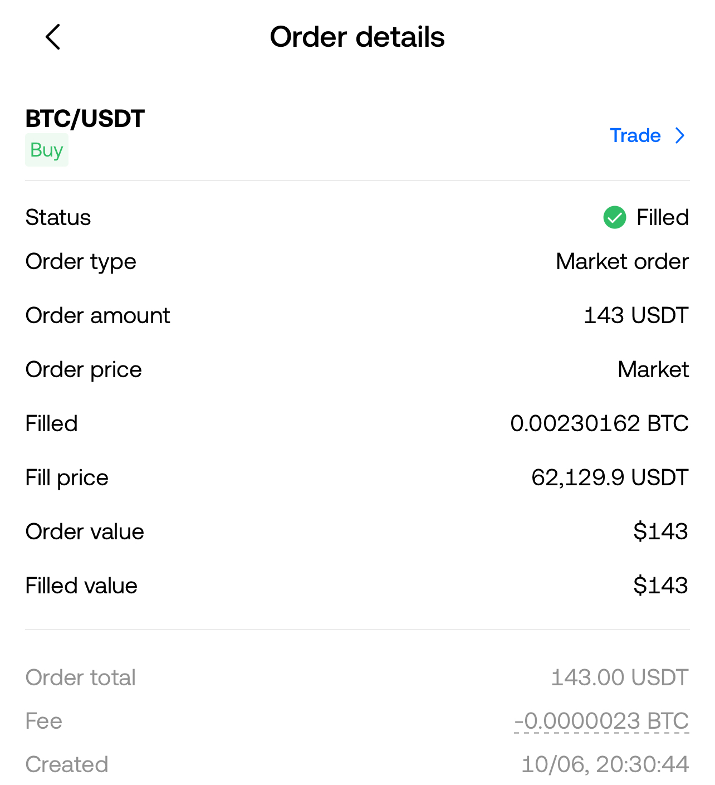
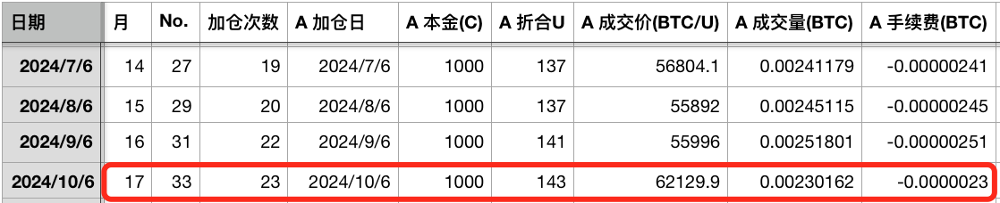
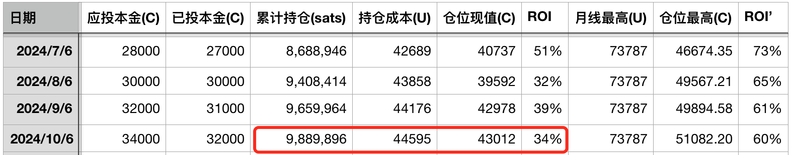
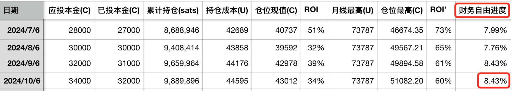

# 月薪5000工薪族的财务自由计划 —— 十年之约＃33（ROI 34%）

周末BTC横亘于62k。今天是《八字诀·十年之约》实盘见证计划坚持执行的第17个月，第33次汇报，第23次加仓。本次加仓成交价62129.9u，增持23万聪。

本次加仓后，持仓量增长至约989万聪，平均成本44595u，浮盈34%。

如昨“10.5教链内参：非农就业，一声惊雷”所言，美联储趁咱们国庆长假，通过鲍威尔讲话、发布超乎想象的非农数据，配合节前炮制的《爱国投资法》等，从政策、数据、政治等多方面形成组合拳，试图阻止美元转入降息周期时美元资本向外逃逸的局面，特别是，阻止美元资本被暴涨的大A和低价优质的中国资产吸引逃往中国。

但是，正如教链在内参中所说的，螳臂当车的努力，是无法撼动既定的趋势的，当然更不可能改变历史的进程。所以，我们做投资，就是要透过世界风云变幻，正确判断历史大势和市场趋势，并合理规划、量力而行，战略战术相得益彰，稳步实现财务自由的目标。

教链启动于2023年6月份的《八字诀·十年之约》实盘见证计划，就是这样一次实事求是的投资实践，也是检验个人投资理念和理论实操水平的一次社会实验。

在这个实盘情景、真金白银、长达十年的社会实验中，教链是一个月薪5000元（RMB）的普通工薪族。实验的目的是检验这样一个投资理念：普通工薪族通过工资理财，囤BTC，也能实现财务自由。

具体的操作和执行计划就是这个“十年之约”。每个月的资金分两份，一份1000元，执行“八字诀”之坚持定投，另一份1000元，执行“八字诀”之逢跌加仓。加起来每个月投资金额为2000元。

很多人对投资有一种错误观念，就是觉得没有个几百几千万怎么好意思谈投资。可是不知各位是否想过，这个社会到底是月薪5000元的普通人多，还是随随便便能拿出几百几千万闲钱来投资的人多？

教链认为，这个问题的答案毋庸置疑，肯定是普通人多。甚至于，月薪5000元在全中国14亿人里已经是相当高收入的群体了。

因此，教链的理念是，要始终坚定地和最大多数的普通人站在一边。至于那些寄希望于所谓“暴富”来一朝翻身成为“人上人”的，很抱歉，教链始终认为，一个和谐的社会，其主流价值观不应该是当人上人、把别人踩在脚底下。所以，教链不仅不会谈如何暴富的学问，反而会批判这种把人生希望寄托在暴富之上的错误思想。

教链心目中的理想社会是人人平等——平等地劳动、平等地财务自由，没有任何人可以“暴富”、可以做“人上人”。

财务自由绝不等于暴富。财务自由也绝不等于成为人上人。

财务自由只是一个数字意义上的概念：你的仓位增值足以覆盖你的生活支出。

实事求是就是回归数学。

月薪5000元，每月要节余出2000元进行投资，假设不留备用金，也就是3000元全部被以各种方式“花费”掉了。也就是说，储蓄率等于2000 / 5000 = 40%。实话说，这绝不是一个很低的储蓄率了。

且慢。这是毛储蓄率——把强制“花费”的社保等也算入基数了。事实上，一个月薪5000元的工薪族，每个月到手的钱是要少不少的。

以2024年北京的社保扣缴标准（公积金按最低档5%缴纳）计算，5000元月薪，实际到手大约只有4030元（如果公积金按12%满缴则仅有3680元），约等于4000元。

要从4000元里结余出2000元投资，就要求达到高达50%的储蓄率。这对很多人都是相当有挑战的事情了。这个50%，姑且叫做净储蓄率。

所以各位读者知道了，为什么教链在2021.8.21文章《从投资小白到财务自由》里，推荐的储蓄率区间是10%-50%为宜、上限是50%了吧？

因为，净储蓄率超过50%真的很不容易。

净储蓄率50%意味着：（以下计算按2024北京政策，公积金按12%满缴，财务自由APR按4%）

月薪5000，每月到手3680元，月投资额约2000元。月开支1680元，达成财务自由目标需积累仓位：51万元。

月薪1万，每月到手7664元，月投资额约3800元。月开支3864元，达成财务自由目标需积累仓位：116万元。

月薪2万，每月到手15182元，月投资额约7600元。月开支7582元，达成财务自由目标需积累仓位：228万元。

月薪3万，每月到手22699元，月投资额约11000元。月开支11699元，达成财务自由目标需积累仓位：351万元。

月薪5万，每月到手40872元，月投资额约20000元。月开支20872元，达成财务自由目标需积累仓位：627万元。

月薪10万，每月到手85872元，月投资额约43000元。月开支42872元，达成财务自由目标需积累仓位：1287万元。

月薪30万，每月到手251566元，月投资额约12.6万元。月开支115566元，达成财务自由目标需积累仓位：3467万元。

月薪50万，每月到手398860元，月投资额约20万元。月开支198860元，达成财务自由目标需积累仓位：5966万元。

月薪100万，每月到手729802元，月投资额约36.5万元。月开支364802元，达成财务自由目标需积累仓位：1.1亿元。

更多数字就不再列举了。人数太少，没有什么意义。

数学直觉好的读者可能已经发现了，无论月薪多少，到达财务自由目标需要的时间几乎都是一样的。所以，教链并没有在上面各自列举这个时间数字。

这个数字是多少呢？如果在储蓄期只攒钱而不投资，也就是不增长，那么用财务自由目标除以月储蓄额就能算出来，大概需要300个月左右，也就是大约25年。

当然，如果是用八字诀，每月投入，需要的总时间要更少。具体的，就不再帮大家计算了。有兴趣的读者可以参考教链2024.7.29文章《存够几个BTC可以提前退休？》自行推算。

可见，储蓄率是一个关键变量。

财务自由的第一步，是从节衣缩食，提高净储蓄率开始的。

但是，从另一个角度看，每个人衣食住行、吃喝拉撒的社会成本，无论怎么压缩，也总是有一个底线的。况且，过度压缩生活消费，会减少幸福感，甚至会损害健康。

这么说来，找份好工作，提高月薪，其实是会让你更容易实行财务自由计划的。

好工作的定义，也不是月薪越高越好，而是适当的高，其他重要的方面，一是要稳定，可以25年不失业、不降薪，二是不能太忙，忙到无暇学习投资知识，根本没时间打理你的仓位。

所以，务实地看，月薪太低的时候，努力提升自己，提高月薪水平，是更为立竿见影的；月薪足够高之后，就要兼顾其他方面，适当取舍，不要过度追求榨干自己所有精力，且属于赚快钱的方向，可能并不长久。稳定的现金流，稳定和流量，同样重要。

于是，作为月薪5000元、每月投资额2000元、毛储蓄率40%、净储蓄率50%的“十年之约”实盘见证计划，就可以增加一个“财务自由进度”的指示器了。今日投后，财务自由进度已经达到了8.43%。

过去一年多，时常有人问，为何每月只投2000元。讲“要关注百分比，别关注绝对值”的道理是鲜有听得进去的，看起来还是要讲“因为月薪只有5000元”，也许这才是更容易被听懂的语言。

重要的是净储蓄率50%，财务自由进度8.43%。你月薪5万，每月就要投2万。财务自由进度也是这个进度，并不会相去甚远。

因此，《八字诀·十年之约》实盘见证计划或许可以有另一个更加直白的名字：月薪5000工薪族的财务自由计划。

---
风险提示：本计划所投之标的并不能保证未来收益水平，因此，本计划只是作者所做实验的公开披露，不构成任何投资建议，也不应成为任何人模仿的对象。任何人对本计划所有材料的任何理解和使用，均为自愿、自发的个人行为，与作者无关，一切后果均由使用者自行承担，本文作者概不负责。
