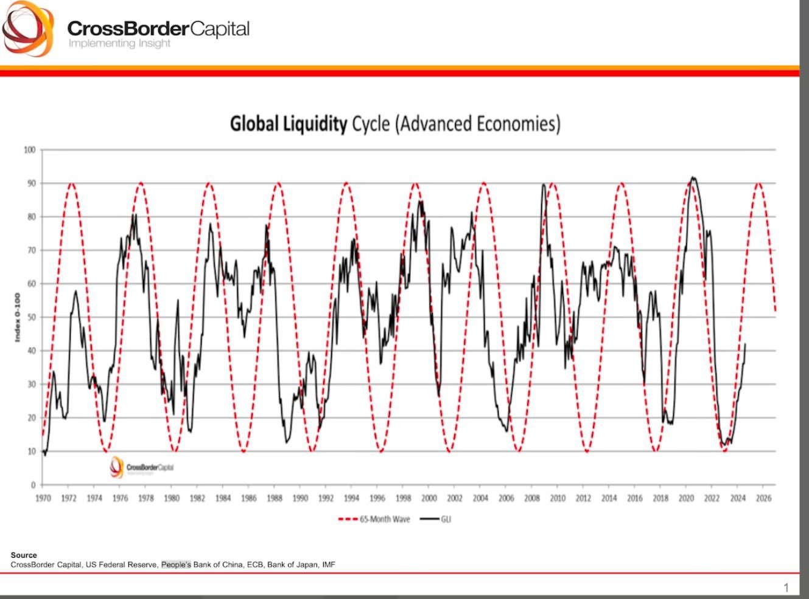
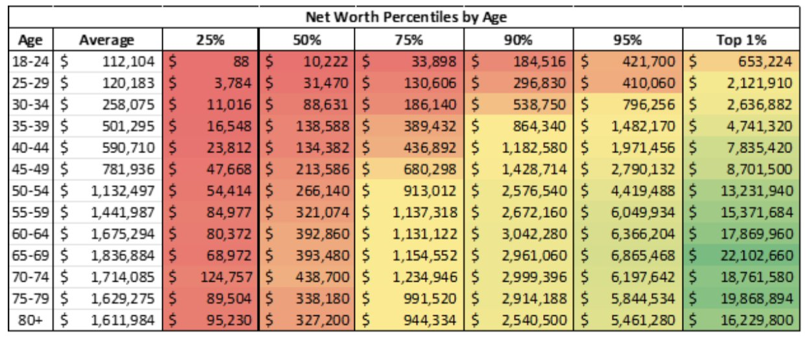
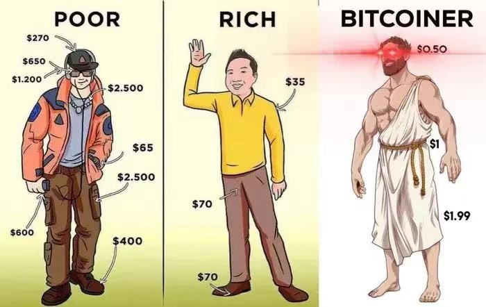

# 财务自由后的10个忠告

周一BTC继续向上挺进，站上63k一线。今天是十一长假最后一天，很多人也许从来没有这么急切的盼望过尽快结束假期、开始上班。如果BTC在假期中的上扬展示了全球流动性的增加的话，那么节后大A可能要顶着美联储“悔棋”的压力继续前进了。

一轮新的全球流动性扩张周期近在咫尺。在这一轮周期中，把握住机会，很多人又要实现财务自由了。

财务自由的话题我们在文章中时有穿插谈及。它绝不仅仅是一个金钱的问题，而是关于一个人的生活态度和生活方式的问题。

在昨天教链文章《月薪5000工薪族的财务自由计划 —— 十年之约＃33（ROI 34%）》中，说到了两个相反想成的问题：第一，财务自由只和自己有关，具体地说，开支水平越低，实现财务自由状态所需的金钱越少；第二，由于基本生活水平的底线所需的开支不为零，所以实践上，你的收入超过这个底线越多，会越容易实现财务自由。

这听上去像是大白话，没有任何高深之处，但是一旦落实到具体的实操层面，想不开的却是大有人在。这些想不开的做法比如：无节制地消费，攀比和追求奢侈生活，过度举债买入资产（比如房产），放弃本职工作和场外收入，因为收入水平低而放弃理财，等等。

财务自由只和自己有关，所以我们要看百分比，而不是绝对值。张三只需100万就能实现财务自由的生活，李四可能需要1个亿。这没什么好奇怪的。不过，社会平均水平又给我们划了一道线，那就是社会普遍认为，自由支配的钱达到多少就可以称得上财务自由，或者说足够有钱。

对于美国人而言，今天这个数字也许是100万美元。

上表是美国社会财富分配的一个统计数据。可见，对于任何年龄段，50分位点最高也不会超过50万美元。因此，拥有100万美元自由资金或者高流动性资产，的确可以称得上是“being rich”（变富）了。

当然，拿绝对值谈论这个问题，实际上是非常不严谨的。有人觉得这些钱太多了，自由无望；有人却又觉得这些钱太少了，不值一提。只能说，这只代表了相当大一部分人的普遍认知而已。

这里我们倒也不是要讨论100万美元够不够的问题，而是假设一个人有钱之后，也就是达到了财务自由的状态之后，应该如何对待这些财富的态度和生活方式问题。

网友David说：「如果你有了100万美元

「先到零房产税的地方买一套房子。花费50万美元

「再买一辆车。花费5-10万美元

「然后把剩下的钱放到10%年化收益的DeFi理财，或者“低风险”的投资基金里，每年无风险赚取3-4万美元

「你不会很富有，但是你会获得自由，不必再当一辈子房奴

「每月3-4千美元足够过基本的生活，你可以以此为起点开始构建真正的财富

「成为债务的奴隶，不拥有任何财富，交一辈子房产税，会让你感觉自己永远无法进步，这对自己的时间和生命都是巨大的浪费

「富有但不自由和成为奴隶并无区别」

另一位网友Duo Nine反驳说：「如果你有了100万美元，不要向上一位网友说的那么做。以下是为什么

「首先，花费一半的钱去买房子和车，从定义上就是妥妥的消费主义。如果这样干，你不会保持富裕太久。

「其次，不要辞职。而是去要求加薪。先等上1年再做出任何有关处置这100万美元的重大决定。在此期间把它放在高收益储蓄账户或者货币基金里（按照目前美联储的利率可以高达5%年收益率）。

「第三，不要告诉任何人你有这么多钱。包括你的朋友和家人。这么做通常都会以悲剧告终。不过，你可以马上带家人出门，给他们一场充满惊喜的旅行。

「第四，不要移民，除非有确实可以改善生活质量的机会。没有人喜欢税收，但是房产税只会是最后一个搬家的理由。作为替代，出去旅行吧，发现你喜欢的事物。

「第五，把财富保存在具有高流动性可以随时按需变现并且不会随时间贬值的资产里。比如比特币(BTC)、黄金、标普500指数ETF等。一座大房子随时间流逝会成为一项巨大的开支。

「第六，不要陷入FIRE（提前退休）运动之中。这是一个陷阱。你不会在30岁、40岁或者80岁退休。你在生活。生活包括了做事。找到你热爱的事情并去做。

「第七，拥有一份100万美元的财务安全垫可以让你更加坚定、自信，并且更加清楚你真正想要的是什么，包括你现在或者未来的工作或社会活动。这事实上将会让你随时间成长，更高效地赚更多的钱——如果你决定继续工作的话。

「第八，变得自由意味着你将拥有自己的时间。把最大化你的自由时间作为努力的目标。物质生活需要持续的修修补补，它通常会把你牢牢束缚。这就是比特币(BTC)为何如此独特，它可以随你到任何地方，并且免维护。

「第九，天下没有免费的午餐。没有人可以是你个人财富的比你自己更好的托管人。如果你委托别人帮你管理你的财富，那么激励通常是无法对齐的（这意味着没有人会比你自己更加尽心尽责——托管人追求的是自身利益最大化，而不是你的利益最大化）。

「第十，变富并不是游戏的终点。一旦你拥有了100万美元，就会很快意识到这一点。它将会改变你的思考和看问题的方式。

「当你买得起一件东西而选择不买的时候，你知道，你变富了。

「当你可以发朋友圈或者小视频炫耀你的有钱生活而你选择什么都不发的时候，你知道，你变富了。

「当你不再穿名牌服装、戴贵重手表，因为你已经不需要这些东西的时候，你知道，你变富了。」

