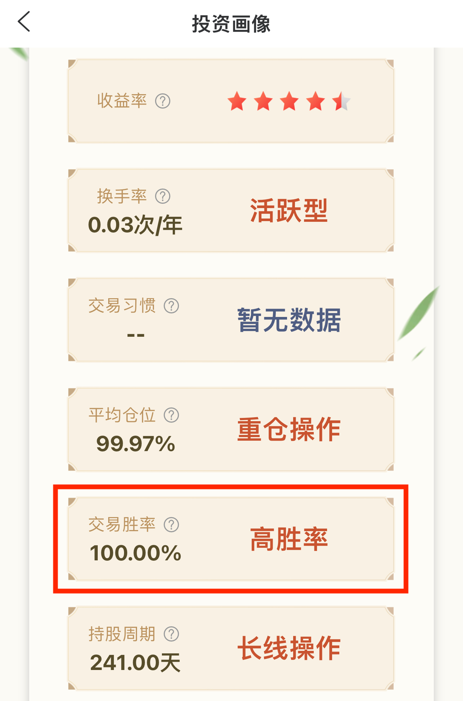
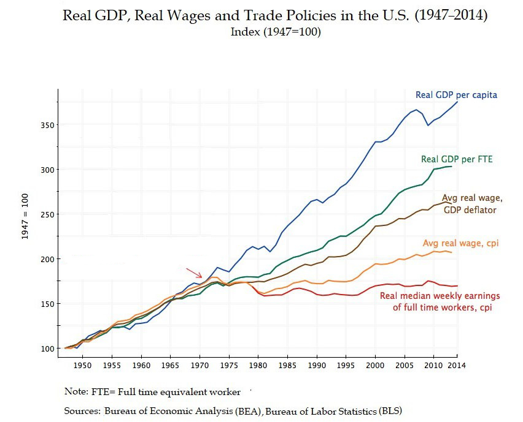
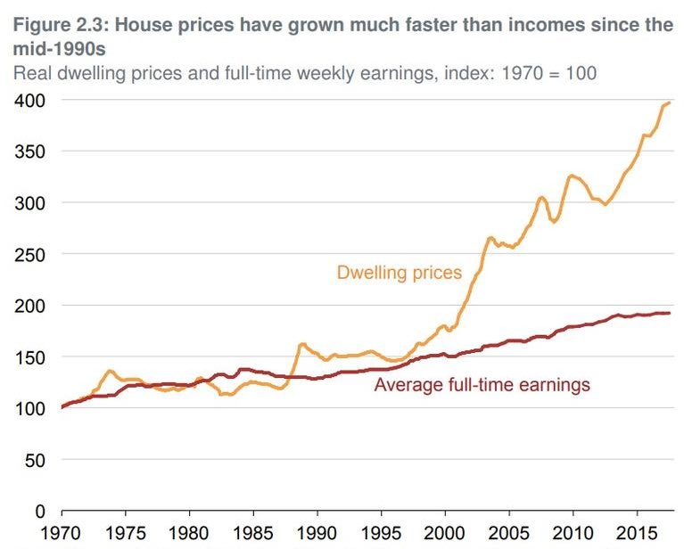
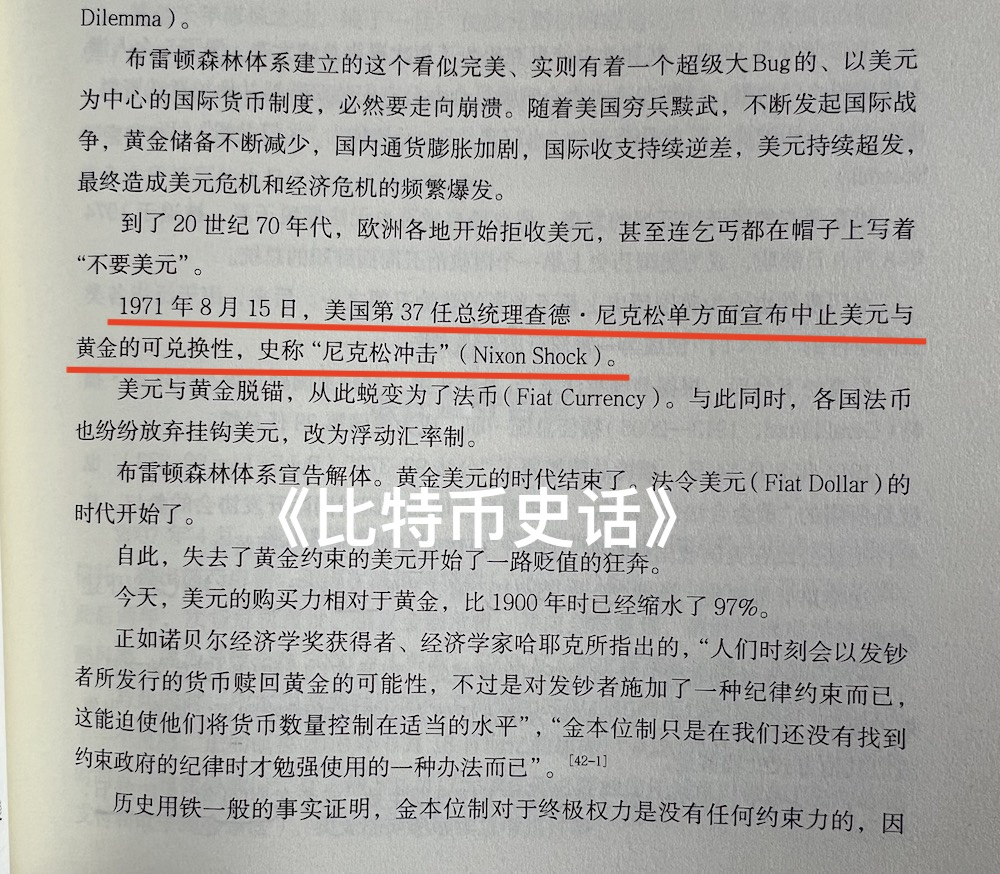

# 男怕入错行，韭怕加错仓——刷新择业和投资观念

隔夜BTC继续小幅下挫，维持在62k一线。有人担心美联储在长假期间频频“悔棋”的动作，会不会后面干脆关闭降息通道，不玩了。教链对此进行了一些剖析和推理，都写在昨天内参《10.8教链内参：美联储悔棋的障眼法》里面了。结论很简单，两个字：不会。

不过昨天内参也提到了一个潜在的利空，可能会让BTC近期继续承压。教链觉得，还是要多一些耐心。从某种程度上讲，或许至少要等到美国大选尘埃落定，以及大A这一波行情疯完，才能期待看到BTC开启行情。

从理性角度，教链是希望BTC的潜在利空能够在这个位置释放的。但是，很可能并没有足够的时间窗口了。那么就要等到以后在更高位置释放。想必对市场的伤害也会更大。哎，只能是可怜将来高位接盘的新韭菜了。

大A今天开始泄了。因为昨天出台了指导意见，严控银行信贷资金入市。这无疑是极为正确的做法。杠杆牛是走不远的。大A的问题就是散户赌性太重，什么烂公司烂股票都敢梭哈，不仅梭哈还要场外配置上杠杆。最后自己跳了天台，银行得了坏账，净便宜了那些趁机减持的垃圾公司的大股东们。大A要走好走稳，还缺一部《萨斯班法案》（又称“SOX法案”、“萨班斯-奥克斯利法案（Sarbanes-Oxley Act）”，是一项2002年正式立法的美国联邦法律，加强了对公司高管和白领犯罪的刑事责任，提高了财务报告的披露要求，并增强了美国证券交易委员会（SEC）的执法能力）。

现在的大A市场，就像加密市场，99%的都是垃圾。看好一个市场未来的潜力，和知道这个市场里99%的都是垃圾，并不矛盾，而是辩证。

20多年前，教链偶然和身边一位师兄聊到炒股。彼时教链坚定的认为，股市就是割韭菜的，散户不可能赚到钱。但是师兄说，不是的，因为他通过炒股赚钱买了一辆汽车。

20多年后，当教链初窥投资之道，开始在多个市场、多个标的上盈利时，教链刷新了认知。现在教链认为，各种金融市场都确实存在大量割韭菜的情况，但是散户仍然有办法可以稳步获得长期收益。

和很多人追求“暴富”、追求“高收益率”、追求“高赔率”不同，教链的投资，努力追求巴菲特说的那个原则——“不要亏钱”。换言之，追求的是“高胜率”。就像某平台给教链的投资画像中所统计的交易胜率那样：

胜率保证了，至于赔率，随缘就好。

昨天教链开车的时候，忽然有一个全新的感悟，瞬间感觉一下子刷新了自己关于择业和投资的观念。

很长时间以来，社会的传统观念是，上大学要上个好专业，毕业了要选个好行业，找个好工作。民间甚至有谚，说的是“男怕入错行，女怕嫁错郎”。这里应该是互文的修辞手法，男女都怕入错行，男女也都怕娶错妻或者嫁错郎。本文不准备探讨婚姻问题，单说这个前半句“入错行”的问题。

教链觉得，当我们的父辈或者亲戚朋友，忠告我们要小心择业的时候，他们其实都是站在打工人的思维上在思考和建议。这不能说全错，但是却已经不符合这个时代当下的情况。

为什么人们会无意识地站在打工的思维上去看待择业和入行这个问题呢？他们的显意识不知道，但是潜意识里其实是受到经济基础的支配而做出的逻辑推理。即，他们潜意识里认为，作为听取建议的你，将来一辈子主要是靠打工挣工资来生活。

马克思告诉我们，经济基础决定上层建筑。初中学到这句话并不懂怎么应用到实际生活中。现在我们懂了，那就是，你在生活中遇到的表面上不和经济、财务、金钱有关的任何问题，都应当一层层剥开，一直找到最底层的与经济、财务、金钱有关的出发点，那才是真正的原因和动机。

比如你高考完，要选择专业。你二叔劝你学医，给你讲了一通什么职业高尚、工作稳定的理由。背后的真实动机，可能连他自己都没有意识到，是想到将来你学成之后他要看病可以找你帮忙，省钱省力。

比如你大学毕业，面临择业。你大舅劝你考公，而且要考就考公检法。也许他还有那么一点儿小心思，就是觉得将来办事能够用得上你，可以省了很多请托费用。

比如你相亲遇到一个妹子，感觉很好。妹子说你们性格合不来。其实她就是觉得你没钱。

比如你初入加密行业，发愁加仓什么。你身边的朋友建议你赶紧梭哈他正在玩的XX币——其实他就是参与虚拟币传销，想拉你入伙当下线。你上网看到KOL拼命暗示你要买入OO币，吹嘘了一通其豪华的团队、牛逼的技术等等——其实他就是拿了一些早期筹码，想喊单拐你进场，拉高出货割你韭菜。

要听取多方面的建议，但是绝对不能盲目采信。原因有二：其一，对方有对方自己的利益动机，这个利益取向和你的利益并不是100%一致的，甚至，最糟糕的情况，是背道而驰的。其二，对方的认知有盲区，并不全面。

在择业和入行这个问题上，哪怕对方是全心全意站在你的角度来真诚地提建议，也不见得是对的，就在于对方的思维和认知，可能是与这个时代的真相脱节的。

这个时代发展到今天，真相是什么？真相是，打工的工资收入，已经远远跑不赢资产增值和投资收益了。

对普通人而言，最直观的感受就比如说，前些年房价飞速上涨的时候，打工十年不如早十年买房。又比如说，打工十年不如早十年囤BTC。等等。

身边劝告你的这些亲戚朋友，他们也许压根儿就不知道近几十年来，这个世界的底层逻辑发生了怎样的巨大变化，以及，这个变化是从何时开始发生的。

看两张图。第一张图，从1971年起，美国GDP继续一路增长，但是打工人的收入水平却增长缓慢（CPI修正前）、止步不前（CPI修正后）。

第二张图，从1971年起，美国的住房价格一路升高。相比而言，打工人的收入水平望尘莫及。

1971年究竟发生了什么？

据《比特币史话》第42话“布雷顿森林”记载，「1971年8月15日，美国第37任总统理查德·尼克松单方面宣布中止美元与黄金的可兑换性，史称“尼克松冲击”」。

当打工不如当老板、打工不如当房东、打工不如搞投资的时候，资本就战胜了劳动。不过，话说回来，自有人类文明以来，过往的任何经济形态、政治体制，从奴隶社会到资本主义，劳动什么时候赢过？好像从来没有哎。

后资本主义时代比前期经济形态的进步之处在于，参与机会对普通人更加开放、门槛更低。当老板，可能需要1000万本金。当房东，要500万本金。投资股票，买一手只需要几千块钱本金。买BTC呢，甚至十几块钱也可以。

不过，人的思维进化慢。资本的游戏是弱肉强食，大鱼吃小鱼。打工人思维不升级，盲目进入资本市场，不仅不能分享资本收益，还要把节衣缩食从工资里结余出来的本金给亏光，如果加了杠杆，还要负债累累，一波输掉一辈子。

于是当代打工人就陷入了二元悖论：老实打工不投资吧，眼睁睁看着自己辛苦劳动创造的社会财富，大头被资本不劳而获掠夺走了。参与投资吧，又玩不过大资本，成了韭菜，被吃干抹净、收割殆尽。

这就倒逼我们每个人都要进化——是思想、思维和认知的进化，而不是肉身的进化。

终于有一天，我们从水里爬上了岸，就像3.6亿年前的泥盆纪时期，我们的老祖先——鱼，从海里爬上陆地，进化成两栖和陆生生物那样，也终于可以轻松做到教链在2021.8.21文章所写的《从投资小白到财务自由》了。

这就可以考察一个重要的拐点，即你持有的资产性收入超过你的劳动收入的那一刻。这是你人生进化中的一个里程碑时刻，人生的奇点。从这一刻起，你已经彻底进化成为了另外一种生物。

从这一刻起，劳动对你而言，意义已经发生了根本性的变化。就像游泳对于鱼和对于人而言，意义差别之巨大。

回到最开始的情景，当有人还是从一生为鱼的角度，忠告你该如何择业、入行，对于此生注定要从鱼进化成人的你而言，又有多大的参考价值呢？

当教链的思维推理到了这个人生奇点的时候，就突然感悟到，我们这个社会对人的职业和行业的定义，其荒谬和错误在哪儿了。

试想，一个持有BTC的外卖小哥，每年靠送外卖赚5万元，而他的BTC仓位每年增值10万元。我们却要说，小哥所在的行业是外卖，而不是加密行业，这不是大错特错吗？

又比如，一个持有银行股的电商程序员小妹，每年工资奖金收入10万元，而她的股票分红每年20万元。我们却要说，小妹所在的行业是电商，而不是银行，这不也是传统的谬见吗？

当资本超过劳动，还用劳动来界定行业，就只是一种惯性思维和定势思维，是不实事求是的，是不符合经济基础决定上层建筑的基本哲学的。

当你的仓位收益稳定超过你的职业收入之后，不妨换个思维，抛弃普通人的认知和观念，“think different”，用你的投资仓位而不是你的职业来界定你所在的行业。

换个思维，豁然开朗。

对于择业，你将不再那么害怕“入错行”。不仅仅是行行出状元，而是你知道，择业在你的人生中，只是配角，是你完成人生进化的垫脚石，而不是人生的终点。

反之，对于投资，你应该借鉴“入错行”的告诫，谨慎地选择你建仓和持有的标的。当你想重仓某只股票或者某个币的时候，认真想一想，你真的确信自己可以一直喜欢它所代表的赛道、行业和方向吗？

既然当代社会的底层经济逻辑是资本大于劳动，那么选择投资标的的谨慎程度，理应也要比选择打什么工、从事什么职业要更加审慎。

男怕入错行，韭怕加错仓——这才是对待投资、对待仓位应有的态度。

