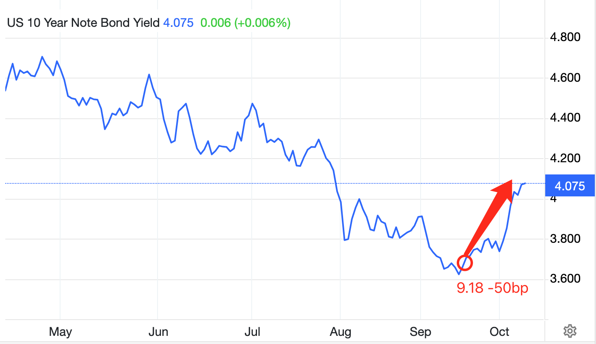
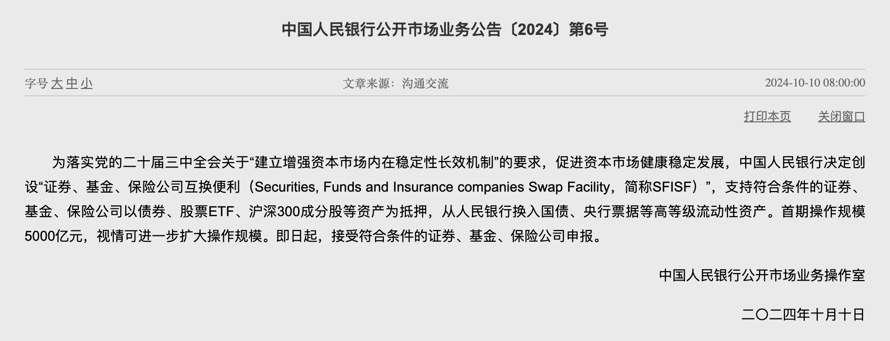
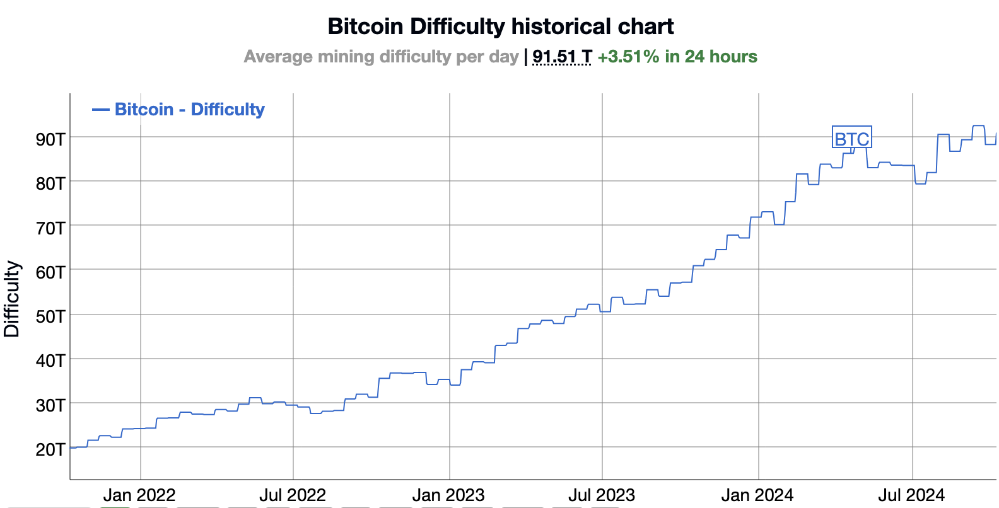

# 美联储回头，比特币坠落

隔夜凌晨美联储9月议息会议纪要公布，让世界倒吸一口凉气。比特币（BTC）骤然坠落，从30日线62k回撤至6万刀一线。

坐庄就要有坐庄的觉悟，别拿美联储不当干部。在尔虞我诈的金融博弈中，你一定要相信这三点：第一，庄家心里一定很清楚自己在坐庄，但庄家一定会伪装；第二，你能想到的庄一定能想到，你想不到的庄也能想到；第三，在残酷的生死博弈中，阴谋论不一定会死，但傻白甜一定会死。

从美联储官方会议纪要里，我们可以窥见9月会议是存在内部分歧的。鲍曼理事就投了反对票。还有相当几位票委其实是支持先降25bp的。纪要原文是这么写的：

「然而，一些与会者指出，通胀率仍然略高，而经济增长保持稳健，失业率保持在低位，他们表示，他们更希望在这次会议上将目标区间下调 25 个基点，还有一些与会者表示，他们可能会支持这一决定。几位与会者指出，降息 25 个基点符合政策逐步正常化的路径，这将使政策制定者有时间随着经济的发展来评估政策限制的程度。一些与会者还补充说，降息 25 个基点可能预示着政策正常化的路径更加可预测。」

最终，9月18号会议发布结论，大降50bp。（参见教链2024.9.19文章《美联储降息落地，一半的人都错了》）

显然，这是美联储主席鲍威尔努力说服的结果。

这就给十一期间的“悔棋”留了后手。

10月1日《10.1教链内参：东线无战事，西线不太平》报告，鲍威尔讲话，否认50bp降息成为常态，向市场传递了不急于过快降息的调子，打击了市场对流动性迅速宽松的幻想。

10月5日《10.5教链内参：非农就业，一声惊雷》报告，美国 9 月季调后非农就业人口 25.4 万人，预期 14 万人（离谱吗？实际数字高出预期80%多！），9 月份就业增长加速，进一步降低了美联储在今年剩余两次会议上维持大幅降息的必要性。

不久之后，11月降息50bp的预测概率就从超过50%迅速降到了0%。

10月10日，也就是今天，美联储公布纪要，把迅速降息幻想的棺材盖彻底钉死。连降息25bp的概率都在下降，而暂停降息的概率却在升高。

有人说，美联储这是预判了中方的动作，通过太极手法，摆了我们一道。

9月18号放出大降50bp的信号，“引蛇出洞”。9月24号我方果然开始推出重磅刺激政策（详见教链2024.9.25文章《央妈大招之后的热思考》）。很快，9月27号，《大A重回3000点，BTC重回65000》。海外机构纷纷调高大A评级，大A暴涨，散户疯狂入市。

然后，趁十一长假大A休市，散户无处可逃之际，开始太阳转太阴，10月1日鲍威尔讲话定调，10月5日发布高得离谱的就业数据表示支持。

10月8日十一长假结束，大A开市，开盘即涨停，然后高开低走。次日9日继续大幅向下，回踩5日线。大量新进场的韭菜被收割。10月10日公布纪要，露出真面目。

其实美联储这一招“神龙摆尾”，割得可不只是大A追涨冲高的韭菜，还有逻辑完美的债券投机者。

降息则债券收益率会下降，因此债券会上涨。这是正确的。但是，正确的经，到了网红大V的嘴里也就念歪了。当9月18日美联储降息落地，网红大V开始鼓吹冲美债的时候，其实谁信谁就是傻子了。看图：

看到了吧？当美联储降息落地时，美债收益率已经过了低点，开始反弹了。短短半个月，从3.7%暴涨到4%，这意味着当时被忽悠冲美债的朋友，已经亏掉超过7%的本金了。而华尔街什么时候买进的？从5月份就开始了——整整提前了4个月！

散户和庄家玩，先想想自己凭什么玩的赢？如果你不能确定自己会赢，那么你就一定会输，至少也是十赌九输。

如果说美联储的议息会议就是一场用专业和严肃包装的表演，那么韭菜就是那个入戏太深，把表演当真的大傻瓜！

对付这种戏弄的最佳办法，就是教链在昨天10.9内参里总结的，《要有自己的节奏，而不是被市场带了节奏》，就是教员说过的，“你打你的，我打我的”。

能做到这一点，需要两个前提条件：一是有看破对方把戏的洞察力，教链在《10.8教链内参：美联储悔棋的障眼法》中拆解过。二是有无惧对方的真正实力，比如东风快递（见教链2024.9.28文章《关于美国、中国和BTC的三个超级变量》），比如BTC的全球无人能及的超级算力。

于是，不管美联储玩什么太极，咱们还是坚定不移地按照既定方针政策稳步向前推进。10月10日早8点，央妈官方公布了节前宣布的“互换便利”启动实施的[2024]第6号公告。

于是，BTC挖矿难度继续上调，目前已超过90T。

