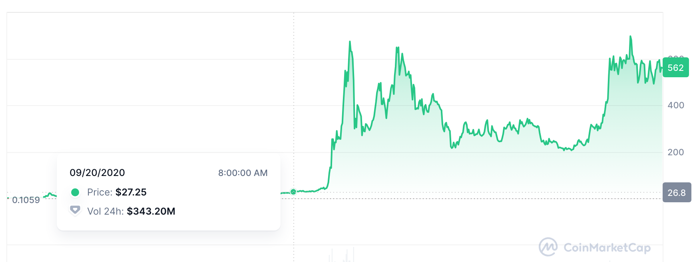
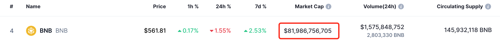
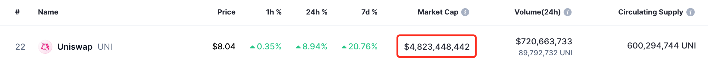
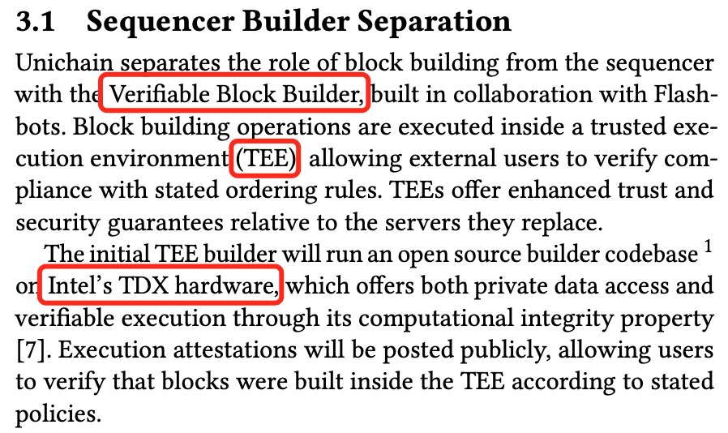
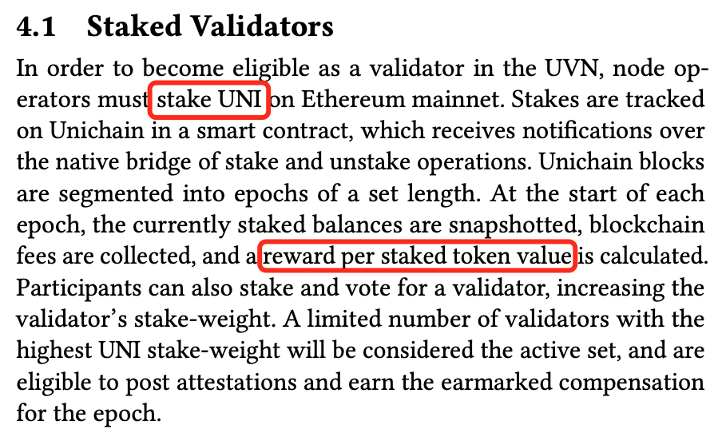
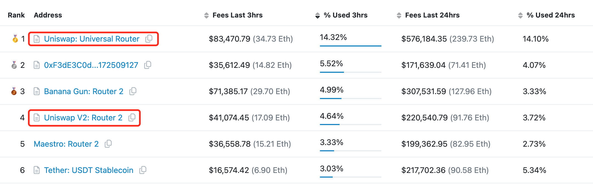

# Unichain会成为Uniswap赶超Binance之路上的关键里程碑吗？

隔夜BTC继续向下测试支撑，一度破位59k，晨时复回60k一线。受大A开启疯牛吸血以及美联储操纵宏观预期影响，加密市场阴晴不定，但昨日Uniswap(UNI)突然发力，站上8刀。原因如昨日《10.10教链内参：美通胀降温不及预期。Uniswap推出unichain。》所述，Uniswap Labs推出了自家的二层链——unichain。

很显然，unichain = uni + chain。uni来自于uniswap的前缀uni-，而chain的意思就是“链”。

这条链是个基于Optimism超级链技术的以太坊二层链。昨天10.10教链内参里都已说过，不再赘述。今天主要想谈一谈UNI的投资逻辑和这件事的关系。

时光荏苒，一晃距离教链建仓UNI已经4年了（参见教链2020.11.7文章《Uniswap(UNI)的估值分析和定投计划》）。成本11刀，按目前8刀计算，仍浮亏27%，是所有持仓中表现最差的（比ETH以及大A仓位表现还要差）。不过教链认为主要原因是在于自己操作上犯了一个错误，就是在第一批建仓计划圆满收官之后，经过2021年牛市有些上头，于是在没有进行严格计算和规划的情况下，盲目开展了第二批的补仓，导致持仓成本从第一批建仓完毕的8刀直接拉升到了11刀。也就是说，如果不是自己失去了纪律，现在应该是刚好回本。

因此反过来讲，教链觉得当初选择建仓UNI的一些底层逻辑，以及基本面，并没有变。所以，教链就仍然继续持仓不动。这符合投资的基本原则。

简单地讲，教链在众多山寨币中选择UNI所看中的基本面有这么5点：1、整个加密行业最刚需、最赚钱的业务是交易，目前被CEX所垄断，未来必然受到DEX的挑战，Uniswap是DEX的龙头（真正数据领先，而不是宣传的领先）；2、Uniswap创始人Hayden Adams发心很正（主要是去中心化思维，以及勇于直面监管），Uniswap Labs团队技术创新能力很强（从V3等技术迭代可以看出），做事踏实、本分（不管牛熊都在踏踏实实做真正的创新工作），这样的团队能走得远；3、Uniswap协议真正去中心化（看链上源代码可以验证为真实），充分赋权给社区（Governance相对典范）；4、Uniswap收入潜力很大，这一点从Uniswap Labs前端收入数据可以得到印证；5、UNI的代币模型相对合理，代币代码无后门，割韭菜的可能性不高。

当然，负面风险主要有内部和外部两方面：1、内部风险，UNI的价值捕获（或者叫赋能）逻辑目前是没有接通的，存在巨大的变数——包括Uniswap Labs作为商业实体，其利益与社区利益如何平衡的风险，比如Uniswap Labs会热衷于提取前端收入，而不太热衷于UNI分红（当然这个问题比较复杂，还有证券法律风险等问题）；2、外部风险，SEC对Uniswap Labs的调查以及Wells Notice，对UNI的性质认定，是否涉嫌证券化问题等方面也存在巨大变数。

4年来，这些基本面和内外部风险都没有怎么变。所以，当初持仓的理由，现在依然成立。当然，必须不厌其烦地提醒一句，山寨归零风险极高，这些个人看法，不见得正确，不构成任何投资建议。

上面说了，Uniswap作为DEX的代表，它的长期战略目标肯定是挑战CEX。目前CEX的一哥是哪位？当然就是Binance。

说来也巧，在CZ仍在执掌Binance的时候，他也曾讲过，Binance的发展方向是成为去中心化的交易平台。也许他是意识到，只有充分去中心化，才能解决很多中心化组织不可避免的腐败和堕落的问题。

自从CZ被美国司法部请去喝茶（参阅教链2023.11.22文章《美国鲸吞币安，长鹏认罪伏法》）并被强制卸去Binance一切职务之后，Binance新任CEO就曾公开声称，Binance已经实现了“去中心化”。

但是，这种董事会决策层面的“去中心化”，只是治理的去中心化，形式的去中心化，Binance的技术架构和组织架构，从底向上，还都是中心化的。这和从一开始就构建在去中心化平台、去中心化协议之上的Uniswap根本就不是一个物种。

举个简单例子：Binance上的做市商都是合资格的合作伙伴，Binance内部肯定有人负责（也就有权）拍板，选择谁当做市商；而Uniswap的做市商叫LP（流动性提供者），是permissionless（无需许可的），任何人都可以自由参与 —— 会有人为了当这个做市商给Binance的拍板负责人好处，但不会有人为了当LP给Uniswap Labs的什么人好处。

再举个例子：Binance的上币是有人负责（也就有权）拍板决定的，什么币能上，什么币不能上；而Uniswap的上币是开放的，随便什么币，只要加流动性池子，就可以用Uniswap协议进行交易，这也是permissionless（无需许可的）—— 会有人为了在Binance上币而花钱运作，但不会有人为了在Uniswap上币而花钱运作（有一个小漏洞是前端的默认列表，或许这个是Hayden Adams亲自掌握？）。

当然，从底向上在每一层按照去中心化的思想和方式构建整个技术栈和组织架构，现阶段也是存在巨大挑战的。最大的挑战有二：1、最终用户还不习惯私钥钱包的使用，而更习惯于互联网体验的账户和托管方式；2、运行性能，目前的区块链不如中心化的互联网技术系统。

2023年初，为了尝试解决挑战1，Uniswap Labs推出了自己的钱包App —— Uniswap Wallet。

现在，2024年10月，为了应对挑战2，Uniswap Labs终于走向了“应用链”的道路，推出了自己的二层链 —— unichain。

教链认为，在DEX向CEX进击的道路上，Uniswap Labs的战略布局思路是清晰的。

有人觉得，搞个链真的有意义吗？似乎目前行业里链太多，而好应用太少了。再多搞一条，意义不大。不过，教链觉得，也许Uniswap来搞，又会不一样。说不定，有机会成为战略转折的一个里程碑呢？

以史为鉴，我们不妨看一下Binance在2020年9月20日推出自己的以太坊兼容链 —— BSC (Binance Smart Chain，现在改名叫做BNB Chain了）之后，BNB的发展情况：

BSC链推出时，BNB是27刀。今天，4年之后，BNB是562刀，上涨了接近20倍。

巧了，今天BNB的市值是800多亿刀，UNI的市值是40多亿刀，恰好也是20倍。

也就是说，假设按照UNI未来4年可以达到今天BNB的高度，就是20倍的成长空间，从今天的8刀，成长到160刀。当然，这个目测空间的上限，比教链2024.2.25文章《Uniswap团队逢高出货100万刀之后……》中按业务规模测算的估值矩阵中的最大值50刀还要高出2倍。这样，教链就得到了自己心目中对即将到来的新一轮牛市周期UNI的目标范围有了一个盘算，即大概50-150刀上下。

注意估值不是科学，而是感觉。

就在今年5月份的时候，社区搞了个UNI分红的提案，一度把UNI给拉到了11刀（参阅教链2024.5.25《Uniswap(UNI)为何骤升突破10刀？》）。但是看起来Uniswap Labs团队对分红赋能是心存顾虑的，虽然明面上没有否决提案，但是他们逢高出货，把UNI给砸下来了。其后，提案的落地也暂缓了。

现在，Uniswap Labs亲自开发和主导的unichain粉墨登场了。他们应该对于从底层基础设施来赋能，会有更多信心，更少法律风险的担忧吧？

看unichain的白皮书，其中明确写了，出块节点要求使用Intel TDX (英特尔信任域扩展)硬件构建TEE (可信执行环境)，验证节点要求质押UNI、构建UVN (Unichain验证网络)，实现去中心化计算和激励对齐。

为什么Uniswap做链会和别人不一样？随便翻出来以太坊一层链上贡献燃料费（gas fee）收入最多的协议排名，第1名和第4名都是Uniswap，加起来有近18%了，接近五分之一。这只是一个随机抽样。

随手查一下，以太坊一层链一年的燃料费收入大概是30亿刀。当然，牛市和熊市肯定差别特别巨大，这里我们不细究，只是找个感觉而已。

30亿刀的五分之一就是6亿刀。请注意这还没有算Uniswap协议在其他很多侧链和二层链上产生的收入。姑且凑个整凭感觉估一个10亿刀吧。

那么，如果这些价值被迁移到unichain上，代表了收入上限可以达到10亿刀。当然因为unichain作为二层，燃料费会比一层链低很多，那么就必须是使用量大大增加，才能打满收入潜力。

多种因素平衡，就算每年有个上亿刀的收入吧，那也够参与UNI质押和验证的节点们开开心心地分润了。

教链想，这就是Uniswap做自己的二层链unichain最大的底气所在吧。

当然，按照白皮书的说法，unichain的野心肯定不是局限在成为Uniswap的“应用链”，而是要成为承载整个DeFi生态的最好的链。在unichain白皮书的总结部分，是这么写的：

「Unichain 解决了以太坊围绕 Rollup（汇总）扩展策略中交易面临的一些最紧迫挑战，尤其是流动性分散和低效的跨链交互。通过引入创新技术，如 Flashblocks、Unichain 验证网络，并与超级链集成，Unichain 旨在成为 DeFi 流动性的中心，以及在 Rollup 上访问 DeFi 的最佳平台。」

祝它成功。
