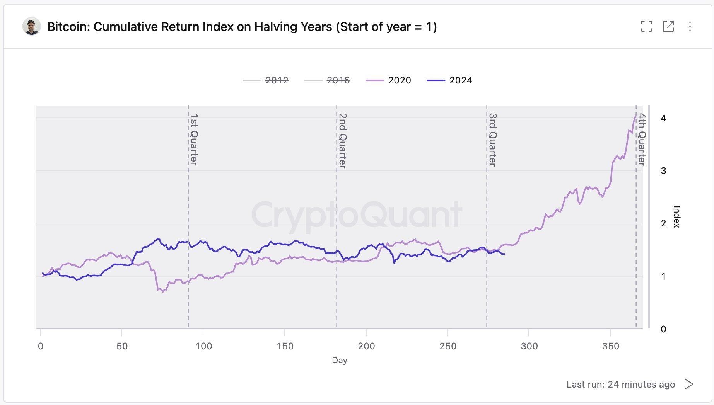
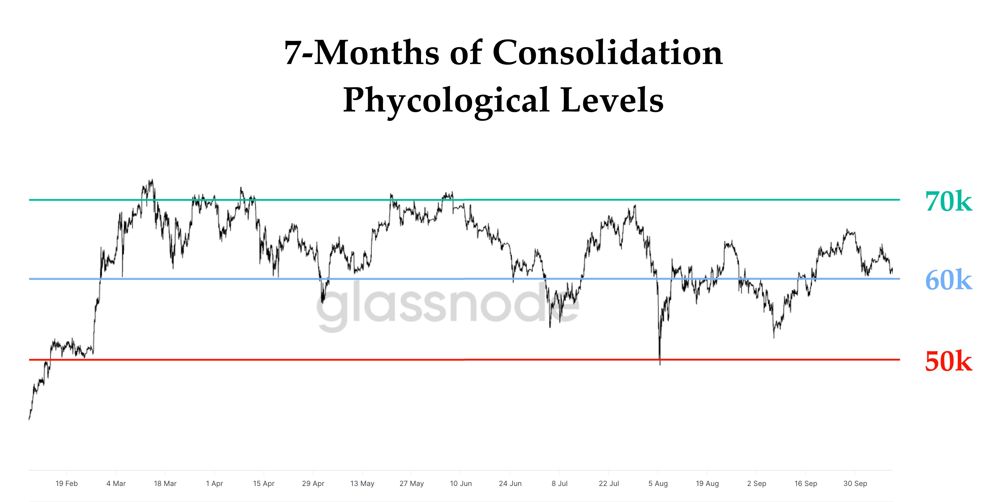
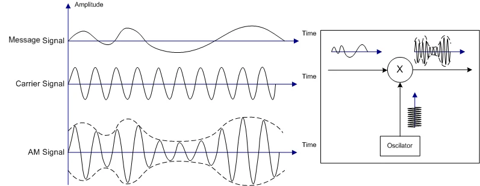
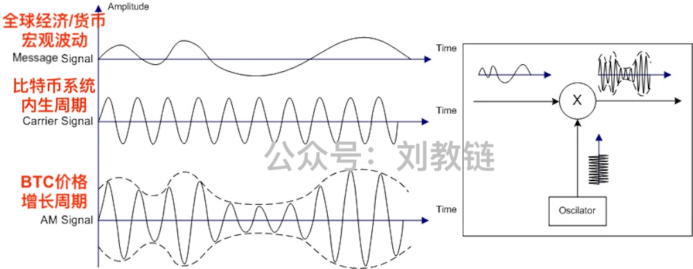

# 吸血的行情长不了，加密牛市虽迟但一定到

昨天傍晚《10.11教链内参：又被钓鱼，损失3500万美元》在BTC日内插针拉回61k时说「这种针通常显示了市场支撑力的强劲，对后市走高有预示性作用」话音刚落，晚上就一路拉高到63k。

这轮减半周期，这个减半年，虽然3月份就冲高前高，导致市场上充斥着两种杂音。一种是“牛市提前说”，大讲本轮牛市要提前到来了，今年下半年就要冲顶，不会等到明年。另一种是“大顶崩溃说”，大讲今年是十五年来周期大顶，下半年市场要大崩溃，然后对称反演过去15年上涨为一路下跌，最终归零。

事实胜于雄辩。到现在2024年已经过去了3个季度，BTC既没有提前牛市冲顶，也没有大顶崩溃，横盘整理稳如泰山，不慌不忙更胜以往。对比来看，大结构上，这次减半年和过往历次减半年并无二致；微观上，本次减半后走势更加闲庭信步，如果再过2周还不发动行情的话，那就要创下BTC历史上减半年最长时间的盘整记录了。

尤其是在过去7个月中，BTC经历了一段健康的盘整期。虽然这对很多3月高位进场的新手而言是一段磨人的考验，但是教链的八字诀可以很好的对付这个问题。很明显的，BTC位于60-70k区间的时间远长于50-60k区间，这还是在历经了许多令人恐惧的抛压和利空考验之后的结果。这显示出了BTC现阶段稳固的基本面，并为下一阶段的向上突破奠定了坚实的基础。一旦市场突破了8万刀，也许再见6万刀的概率就非常小了。

教链在2024.7.11文章《决定投资成败的最重要因素是（）》中，从定量的角度指出，6万刀是S+1.5，7万刀是S+2。所以，今天不到7万刀的BTC的确是值得珍惜的。而7个月的横盘事实，也验证了教链在3月份即2024.3.16文章《BTC现阶段或不具备长期下跌基础》的定性论断。

这份“采菊东篱下，悠然见南山”的气定神闲，显示出BTC强悍的实力和独特的魅力。正如《10.9教链内参：要有自己的节奏，而不是被市场带了节奏》中教链用无线电调制作比喻所说的那样：「BTC好像有独特的能力，能够把复杂的、杂乱无章的外部宏观因素，统统调制成自己的4年周期节奏，把无规律输入的外部能量，全部整形成规则的周期波形！简直是太有意思了！」

BTC十分钟的出块、4年一次的减半，就像是滴滴答答的时钟，频率一成不变的载波。外部世界的宏观经济和货币周期，美联储政策变化、美元潮汐的冲击也好，社会繁荣萧条、散户进退的投机也罢，都是不太规则的能量波动，是输入信号。输入信号携带能量，被BTC系统吸收和调制。调制后的频率与BTC系统的内生频率相同（周期不变），外部能量则转化成BTC自身的能量。

昨晚，美9月份生产者价格指数(PPI)数据出炉，年增长率跌至1.8%。虽仍高于预期的1.6%，但下跌趋势已令市场预计将传导到消费者价格指数(CPI)的继续回落，从而提高了对美联储继续降息的押注。

当美联储一步三回头但不可逆转地走上降息之路，大A的吸血行情暂时告一段落之际，距离BTC发动一场加密牛市的时机是越来越近了。
