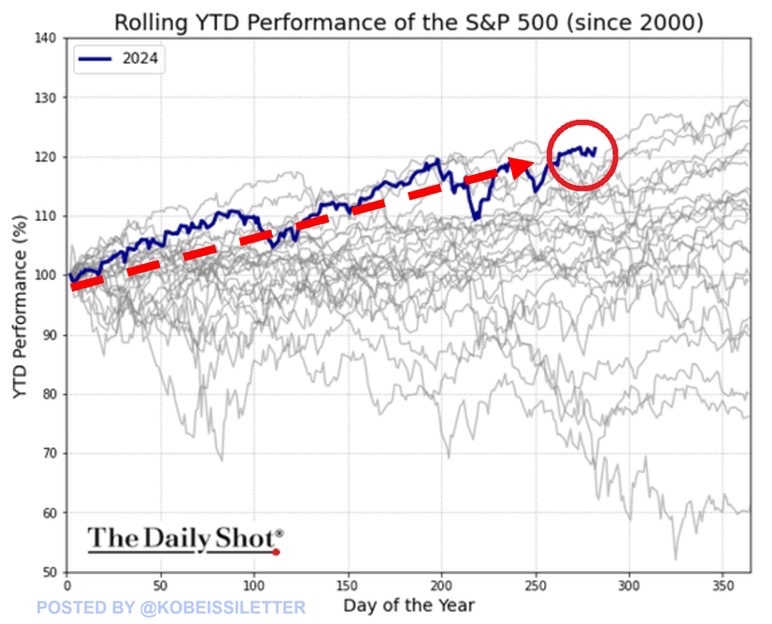

# BTC跑赢美股，微策略跑赢BTC

历史从不简单重复，它只是押韵。今日BTC继续在63k下方盘整。距离今年3月创下历史新高后已经过去200多天，BTC还没有突破。

以往各轮周期都是产量减半后不久，发动行情，突破新高。这轮周期似乎有些不太一样。

首先是减半前就创出了历史新高。其次是减半后横盘日久，迟迟不能产生新的突破。

如果以不断新高为牛市，不断下跌为熊市，那么BTC是熊短牛长，1年熊市，3年牛市。而如果以突破前高为牛市，迟迟不能再破前高为熊市，那么BTC是牛短熊长，1年牛市，3年熊市。

相同的价格序列，在不同的眼睛里，看到的是不同的牛熊轮动。悲喜在心，而不在物。

牛矮了，熊就短了。2021年只冲到了6.9万刀，于是2024年初减半前就破了前高。

怀疑的人疑自未消。巨鲸却利用这段前所未有的横盘整理窗口期拼命加仓。半年来，持仓量从33.5万枚BTC暴增至190万枚。

或许这是ETF们的阳谋？机构们想在这个位置建仓吃进，越多越好，至少要吃足筹码，才好拉升，不然岂非便宜了韭菜？

现在是不是抢筹阶段呢？一个想低价吃进，一个不想让它低价吃进，一个想拉升，一个不想让它过快拉升，于是就博弈，势均力敌？

一边是冰冷的海水，一边是炽热的火焰。

在一片衰退的忧虑之声中，美股标普500指数YTD收益率超22%，竟创下了自2000年来年内最佳表现。

一念崩盘，一念升天。

但纵它风情千万种，我自岿然不动。对比自2020年8月10日以来的收益率表现：标普500增长73%。美股7支花增长243%。BTC增长426%，跑赢99%的标普收录企业。

而最夸张的是从上述时间开始执行其“BTC策略”的微策略(Microstrategy)公司，其股价表现在美股市场上一枝独秀，增长了1620%。

拉出今年2024年以来的表现，微策略也是大幅跑赢Coinbase或特斯拉这样的公司。

时至今日，微策略市值已高达430亿美刀。它囤积了21.4万枚BTC，价值约130亿美刀。净值比3.3，即微策略市值相比其BTC仓位有2.3倍的溢价。

再继续这么发展下去，微策略竟然要回升到2000年互联网泡沫破裂前的历史最高点了。

微策略靠高股价带来的信用在美股举债，举债借美刀，美刀换BTC囤起来，BTC升值推高它的美股股价，于是有了更大的举债空间，它就进一步举债，借更多美刀，换更多BTC，……

理论上，假设微策略其他业务资产价值为零，其市值完全由BTC资产和负债构成，那么市值应当等于BTC资产市值减去负债。现在的实际情况却是，微策略的市值远高于其所持有的BTC资产的市值。

这或许暗示了市场对BTC未来的看涨预期。仅以3.3倍测算，也是6万刀乘以3.3等于19.8万刀。
