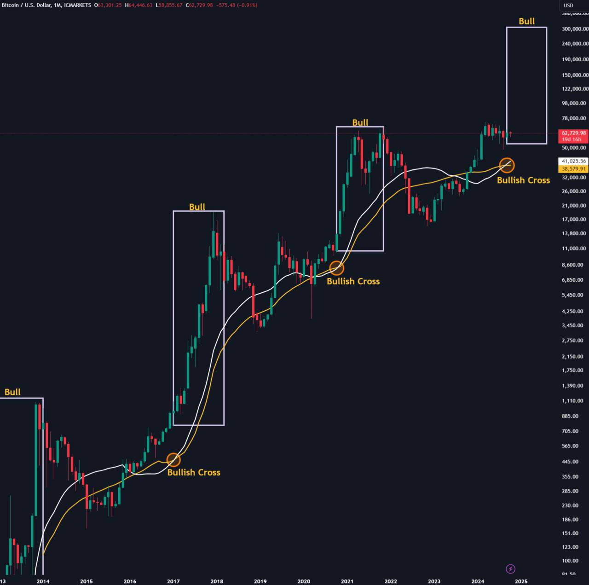

# 因为相信，所以看见

隔夜BTC依旧在63k一线震荡。有人贴出一张图，说每次月线25MA向上穿越35MA形成金叉，就会预示着周期快牛启动（见下图）。

'17年如此，'21年如此，如今，我们再次看到了金叉出现。

固然，均线不过是价格扫过市场之后留下的影子。市场是一个非记忆系统。过去不代表未来。但是，人们依旧热衷于从过去中发掘蛛丝马迹，给未知的明天抹上一丝亮色（或者暗色）。

悲观的人总是要看见才会相信。他们的问题就在于总是相信得太晚。等他们幡然醒悟开始梭哈的时候，市场往往就见顶了。

乐观的人常常因相信所以看见。不是冥冥中自有天意，而是相信所以行动，行动所以事成，事成所以看见。

相信BTC有牛市，所以持续加仓BTC。持续加仓BTC，所以推动了BTC牛市。BTC牛市被推动，所以果然看见了牛市。

BTC只有一个设计目标：永不辜负这种信任，永远兑现这种相信。于是就自我实现。

「如果有足够多的人这么想，那么它就会成为一个自我实现的预言。」——中本聪，2009年1月16日。《比特币史话》第38话

网络之上，很多人对国内经济形势感到悲观，主要是债务杠杆已达极限，债务驱动增长似乎已经走进了死胡同。上周与友谈及此问题，教链认为不必悲观。

过去这些年，中国放水的方式和美国不同，债务主体不同，战略转圜空间也就不同。美国是联邦财政举债，美联储印钱，中央政府负债直接扩M0（或者是准M0——不在美联储表内的高能货币），现在美债已超35万亿刀。中国则是地方政府投资和居民购房举债，银行印钱，扩的是M2，中央政府杠杆率很低，据估计只有22.6%左右（截至2023年三季度）。这就留下了战略腾挪的空间，即通过中央政府加杠杆，帮助地方政府和居民部门降低债务负担，来完成债务的转移和化解。

其中关键在于这个辗转腾挪的过程中，要对接盘的资产进行遴选。劣质资产该暴雷暴雷，该谁破产谁破产。只有长期优质资产，才从地方手中接过来。这就相当于中央在康波周期大底逆势加杠杆从地方手里抄底优质资产。等到这轮康波萧条期过去，进入下一轮康波繁荣期，这些今天看似忍痛“接盘”的资产，未来大幅增值，一跃而成为香饽饽。今天网上某些人批评的全民替地方债务埋单，将来就变成了价值投资典范。

周六（10月12号）财政部政策发布会，明确提出了中央上杠杆化债相关举措。主动权完全在中央。接盘什么资产类别，代表了未来经济增长新动能会落在哪些领域。很显然，这次借势美元紧缩周期，主动把房地产这个发动机给熄了火，就是为了给别的发动机点火——比如高科技制造业。

熄火房地产，就会刺破货币泡沫，于是就形成了通缩。日本当年房地产哑火，无法开启日本制造的发动机，从而陷入所谓“资产负债表衰退”、“失去的三十年”，根本原因不就是美国不许么？以拉动美国出口的名义，先签个广场协议，让日元对美元大幅升值，扼制日本制造业出口。

房地产是击鼓传花，但是暴富诱惑能够吸引全球资本进来玩。不过庞氏循环终有到顶的一天，对坐庄操盘能力的真正考验在于：第一，你能不能在国际资本出逃之前突然刺破泡沫，来一个瓮中捉鳖；第二，你能不能把这些闷进袋子的热钱，从金融空转的逐利游戏中逼进创造价值的生产行业。低附加值、低利润生产行业，追逐高收益的金融资本肯定看不上，所以，也需要能在房产盘子崩盘之前，把高附加值、高利润的生产行业准备到位，以足够体量吸纳逼出的资本。

日本当年做了第一点，主动刺破房地产泡沫，但是它却没能做到第二点，启动新动能引擎。为什么它做不成第二点？这个问题的答案，就是国庆节前发射DF-31AG的原因。

搞搞互换便利，把不愿意建设社会主义的躺平资本从国债市场里逼出来，逼进股市、逼进大A，不过是整个操盘计划中一个很小的战术环节而已。

万事俱备，只欠东风。东风一射，是一个重要的宣告。宣告战略准备已经完成，战略进攻现在开始。宣告战略防守攻守易势，战略反击已经打响。

昨天教链在《10.13教链内参：LPR》中略谈了一下LPR的问题。教链始终没想明白的一点是，为什么有那么多人笃定LPR长期下行。难道眼下康波周期萧条期的经济低增速会成为未来30年一成不变的新常态吗？如果我们相信中国经济能够取得博弈胜利、完成新旧动能转换，相信大A楔形突破之后未来20年的发展，那么为什么我们又会同时相信LPR会长期走低呢？这就似乎有些逻辑不自洽，自相矛盾。

作为无风险利率的参考基准，国债收益率与LPR常为正相关关系。而长期中债收益率又与BTC存在历史性的同频共振现象（参阅教链2024.8.31文章《中国长期国债收益率与BTC的奇妙相关》）。这样一来，如果我们相信互换便利会短期推高国债收益率，而BTC即将到来的牛市同样会暗示国债收益率触底反弹的话，那么LPR也许就接近短期底部了。
