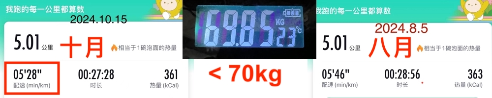

# 炒作随风起，风止意难平

隔夜BTC风乍起，拉升近6%，一度站上66k。很显然，66k有阻力，于是暂退65k盘整。

隔夜一场大风，也吹散了盘旋几日的雾霾，露出了极佳的天蓝色。北京的秋，是极美的。空气质量也特别的好，PM2.5降到了个位数。于是便跑了一个5公里。配速跑进了5分30秒，创下近期最快速度。体重继续保持在70kg以内，成功控制住没有反弹，初步巩固住了半年来瘦身的成果。

再也没有什么比体重减轻、体能提升、仓位盈利更加令人满足的了。在今年4月份以来的半年里，教链每时每刻都在享受着全方位自律带来的回报和幸福。饮食自律。健身自律。投资自律。

自律给你自由。心宽体瘦、身轻如燕，就拥有了健康愉悦的自由。肌体越活越年轻，就拥有了长命百岁的自由。仓位增值超过开销，就拥有了生活无忧的自由。

自律是一种可以迁移、复用的底层素质。能在投资上恪守纪律，就能轻松减肥瘦身。能坚持锻炼身体，就能锻炼投资纪律。能一咬牙就瘦下来，那么建立良好的健身习惯和投资纪律，也不会太难。

这就是教链常说的，投资带给我们的绝不仅仅是金钱的回报这么简单，而是让我们成为更好的自己。

所以，谨慎的选择你的投资风格，谨慎的选择你的投资标的。在一次次的操作中，投资风格会浸入你的骨髓，反过来塑造你。在一次次的拥有和失去中，投资标的会蚀进你的大脑，刻骨铭心。如果那些选择不能让你成为更好自己，无论诱惑多大，也要果断放弃。

教链从不逐势。左侧交易者总是提前行动，在趋势未现、情绪低迷时加仓。

这一轮周期，迄今为止，价值币失宠，模因币盛行。每一个火过的模因币，背后又有多少意难平？

大喜，大悲。意外，后悔。大赌，大输。对镰刀价值包装的反叛，终归还是被镰刀利用。

这世间，又有什么不模因呢？刚开头的BTC，不是模因么？没有赋能的UNI，不也是模因么？乃至于昨天教链文章《因为相信，所以看见》中的房地产，不也是一种模因么？

人类失去了模因，就失去了从众，失去了羊群效应，失去了社会共识和社会构建。

有了模因，就有了飞蛾扑火。关键不在于是不是模因，因为一切皆模因。关键在于，背后操盘的捕蛾人，站的是什么立场，持的是何种发心。

是模因总会熄火的。击鼓传花终将落。

为什么房地产模因熄火时，要搞动能转换，引导飞蛾扑火的资本去建设？

为什么模因币的明庄暗庄，却要把飞蛾扑火的韭菜一网打尽，尽数收割？

人性没有不同。对人性的迎合和勾引也没有不同。不同的是，背后是否有承诺，是否有诚信，是否有能力。最重要的，是否被约束。

没有约束，人性的恶就会显现。

众生畏果，菩萨畏因。

势起一阵风，势去如长夜。炒作随风起，风止意难平。
