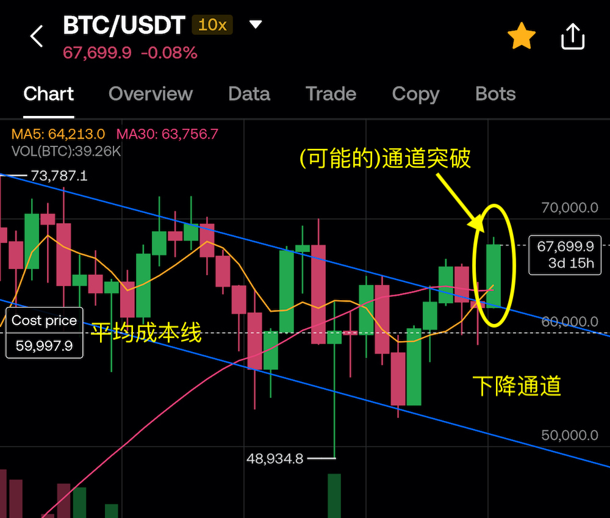
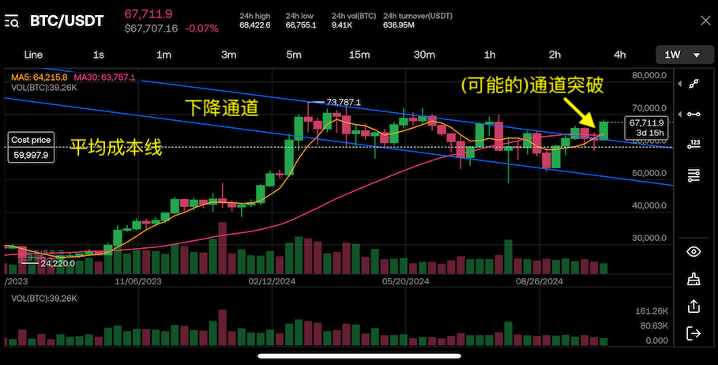
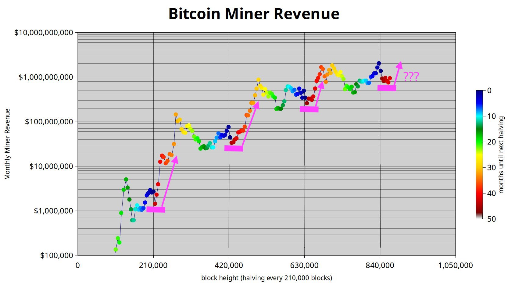
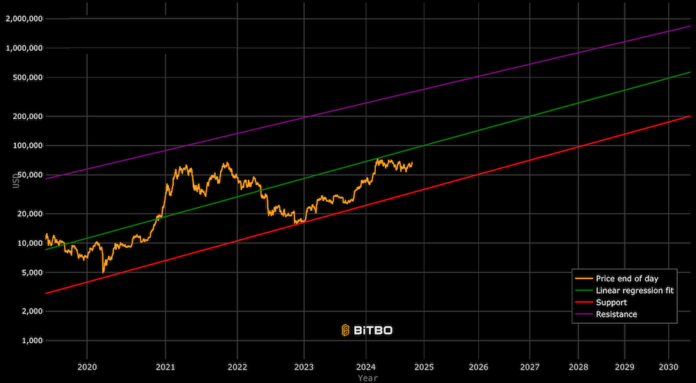
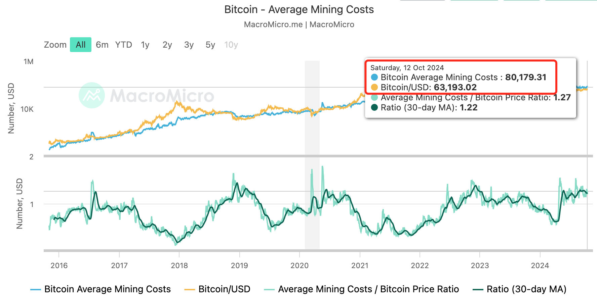
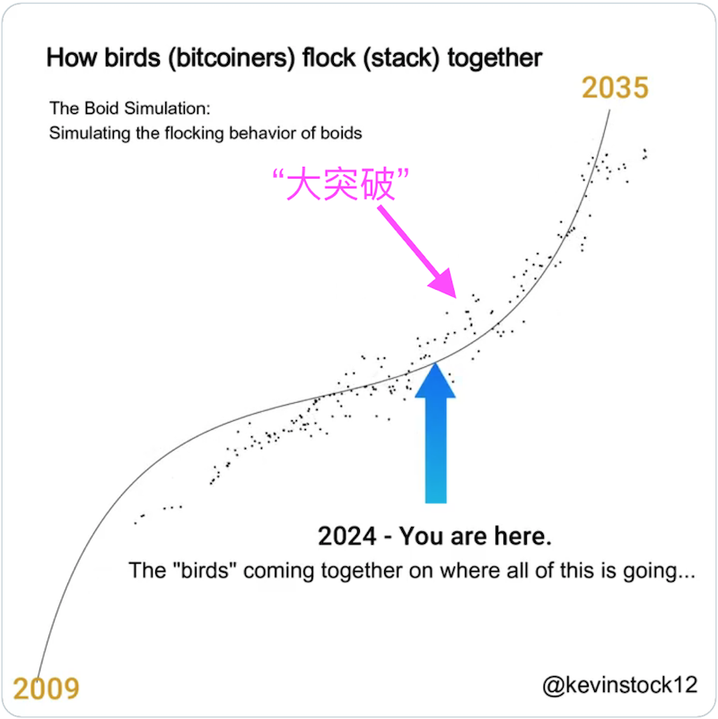
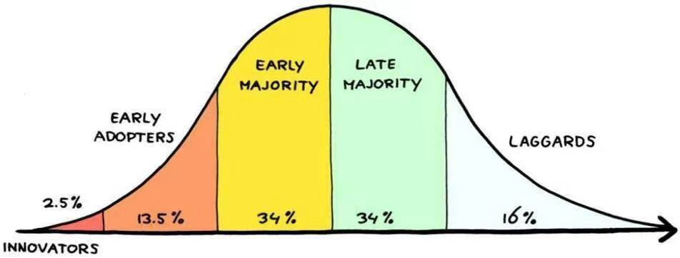
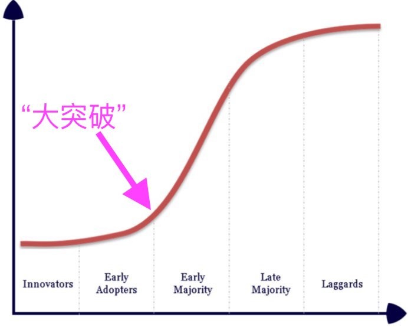

# 大突破：BTC反幂律增长的另一种猜想

当我们把镜头拉近到海滩上享受日光浴的比基尼少女时，就很难看清地球这颗尘埃一般的星球在整个星系中的位置。当我们陶醉在日线的波动，周线的突破，年线的幂律增长时，也很难觉察到，身后悄无声息靠近的那个巨物。隐于暗夜，不可名状，令人战栗。

隔夜《10.16教链内参：周三，扶摇直上》说到，BTC证伪了十字星，继续狂飙突进，抵进68k。从《科西嘉的怪物在儒安港登陆》，到《皇帝陛下将于今日抵达它忠实的巴黎》，也许只需要连拉一周的大阳线就足够了。没有什么看空的顽固思想是不可改变的，如果有，那就再多拉一根大阳线。

车太快，有些头晕。人在面对暴涨时，会出现“冻结”效应，一时无法行动。这就是八字诀的好处了。要提前加，逢跌加，坚持加。加到水穷处，坐看云起时。提前上车，就不怕车突然加速。即便是面对年初见新高而后连续震荡的下行通道，八字诀战术也可以把平均加仓成本硬控在6万刀不到（见下图），于是乎只要你敢拉，我就敢盈利——这就是孙子兵法中所说的「胜可知，而不可为」。

请注意这是周线图。黄色圈圈里，10月14号开启的这根本周K线，很有机会成为今年初以来所构筑的下降通道的、向上的决定性突破。拉远一些，视野放大，会看得更清楚。

但是，这个年内通道的突破不过是海滩上的比基尼少女。我们把镜头拉得更远，拉到BTC的4年周期。目前，我们也许正处于本轮快牛周期启动的前夜。只差临门一脚。

3个月前的7月1号，教链就发文《6万刀，“矿工底？”》，提示“矿工底”的概念，以及目前市场已接近或处于该等状态。

BTC的伟大处之一，便是工作量证明（PoW）。矿工的生产成本，为BTC构筑了与物理实体的地面一样坚硬的客观存在。价格如皮球，每当它跌落到这个坚硬的地面，便总会受到大的反作用力，将其向上弹起。

当市场运行在“矿工底”水位时，价格便处于显著低估水平。此时加仓，风险是相对较低的。这便是幂律。

市场目前所翘首以盼的，便是均衡价格（橙色曲线）对幂律中性估值（绿色直线）的决定性突破。

昨天教链的星球VIP群里，有朋友再次提及空头从年初盼到现在的“重回25000（美刀）”的梗。教链评论道：「以目前的挖矿成本，真跌到2万5，会不会触发死亡螺旋？」

事实上，根据MacroMicro的估计，目前矿工的生产成本竟然已经远高于BTC市场价，达到了惊人的8万美刀左右。一日不见，如隔三秋，教链印象中对这个成本还停留在5万刀的记忆里，没想到竟然已经飙升到了8万刀。

转折点就是年初的产量减半。难怪说，BTC的产量减半，就是中本聪设计的无敌阳谋。

「预期会增值的东西的合理市场价格已经反映了预期未来增长的现值(Present Value)。在你的大脑里，你会进行概率估计，衡量其保持增长的胜率。」——中本聪，2010年2月21日。《比特币史话》第九章第37话。

现在我们看到了整个地球，看到了大洋和大陆。比基尼少女和椰子树，已经缩小成目不可见的小沙粒了。

在这个尺度上，我们看见了BTC的四年周期，看见了幂律，看见了牛熊更替，东升西落。沿着幂律的道路，我们似乎看到了BTC增长的减速——因为对于幂律而言，增长相同的倍数，所需要的时间也呈现指数级增长。前期是2年10倍，稍后就需要4年10倍，然后是8年10倍了……

人类历史上的经济学家能看到的最长的周期是康德拉季耶夫周期，50-60年。中国古往今来的历史学者能看到王朝兴替的周期，200-300年。天文学家眼中有更长的星系演变的周期，但是似乎已经超出大多数人所足以理解的范围了。我们甚至无法确定，人类文明是否能够在天文周期这么大的尺度上持续存在，而不是突然灭绝。有兴趣的读者可以了解一下“费米悖论”（Fermi Paradox）和“大过滤器理论（假说）”（The Great Filter），足以引人深思。

BTC的设计寿命，应该是超过王朝周期以上，处于天文周期以下，与人类文明同寿。

拉远到星系的距离，地球缩为一粒尘埃。放大到这等巨大尺度，我们不禁思考，从2009年到2024年所经历的4次减半，以及幂律上近乎完美的涨幅消退，究竟是未来永恒的规律，还是局部尺度上的一个错觉呢？

教链早在去年即2023年就思考和提出过突破幂律的另一种可能性。BTC或已接近于开启新的不可思议的增长，反幂律增长。此前，教链称之为“第二周期”、“超级周期”，见诸于2023.9.15文章《此刻我们正站在比特币第二个创新周期的起点》、2023.9.18内参《第二周期，超乎想象》、2023.12.5文章《2024减半之辩：涨幅消退或者超级周期？》。

就像下面这张图里所展示的这种曲线，S-曲线。当我们走过前半程的时候，很容易归纳出增长减速、涨幅消退的结论。但是很可惜，当结论被验证时，结论也就要被推翻了。增长的重大转折点就在眼前，教链愿称之为“大突破”。

这个曲线不是随便画的。它是对自然界的仿生学模拟。从鸟群的聚集行为模拟中，就会涌现出这样一条曲线。

而S-曲线和著名的Rogers创新接受度曲线又有着内在的联系。

早在4年前2020.12.19教链文章《好戏才刚刚开始》中就介绍过Rogers创新接受度曲线。在文章中教链指出，「据统计分析，比特币这个概念的全球普及率约为1.5%左右，预估明年会达到2.5%左右。这么来看，按照Rogers创新接受度曲线，明年比特币才有可能走完Innovators（创新者）的阶段，迈入Early Adopters（早期接受者）的第二阶段。」

不用怀疑，你我都属于第二阶段的早期接受者。

而早期大众（Early Majority），现在还处于看不见、看不懂、看不起、惧疑惑的状态。

根据网络效应的梅特卡夫定律（Metcalfe's law），网络价值与用户数量的平方成正比。如果我们把上面的分阶段接受者人数转化为价值增长曲线，就得到了S-曲线（下图）。

而“大突破”，就发生在市场从早期接受者阶段向早期大众阶段爆发的时候。

这种爆发，一定也会是肉眼可见、直觉可感知的。就像当年突然发现身边的人彷佛一夜之间都开始用微信了的那种感觉。拿这种感觉来对比一下，今天我们距离“惊讶的发现身边人都开始持有BTC了”还有多远？还有多远不好说，但肯定是还没到这个临界点。

“大突破”的临界点都还没到，又怎能武断地妄谈BTC已经进入增速放缓、涨幅消退的成熟阶段了呢？

在隔夜《10.16教链内参：周三，扶摇直上》中，教链就列了一个生动且实际的例子，用USDT的用户数——这是实实在在的对加密货币有真实需求的用户——作为BTC潜在的可触及市场空间（addressable market），这应当是去掉了想象的纯干货的估计了，结合梅特卡夫定律，即可估算出，100万美刀的目标至少是实打实够得着的。

而这点儿实打实的可触及市场，相比于全球80亿人口，依然是九牛之一毛（5.5%）。

因此我们绝对有必要在意识上保留对于“大突破”的到来、对于反幂律增长的可能性的心理准备。

否则，肯定有可能会在怀疑者劝告之声的影响下早早下车，错过大势。

这一轮周期的2024年，BTC演绎独角戏。被寄予厚望的诸多龙头山寨和所谓价值币，相对BTC都走势惨淡，令押注者悔不当初。这种种气息，似乎在暗示市场价值向BTC的回归，以及“大突破”时刻的迫近。

“大突破”降临，BTC便有可能重复早期的狂暴成长。像儿童身体长高，先是在幼年以肉眼可见的速度增长，然后在青春期突飞猛进。

“大突破”之后，就是BTC的青春期。

总有人忽悠韭菜说，你错过了BTC早年的1万倍，你还要错过啥啥啥（某某山寨币）吗？这是彻头彻尾的谎言和愚弄。

事实胜于雄辩。山寨币们前赴后继失败的铁的事实已经证明，能够复刻BTC过往成功的，也许只有BTC自己。

其实，照“大突破”理论来看，错过了BTC早年的1万倍，也许还有BTC下一个1万倍的机会在前方等候。

从1刀到1万刀。从1万刀到1亿刀。1聪1美刀，嗯，感觉上貌似也并没有什么违和之处。

也许直到1聪1美刀的时候，BTC才可以称之为真正成熟，真正长成了一个成年人，一个精壮的好小伙子了吧？

机会总是留给有准备的人。

“有准备”的意思就是说，当“大突破”突然降临的时候，你最好有仓位。
