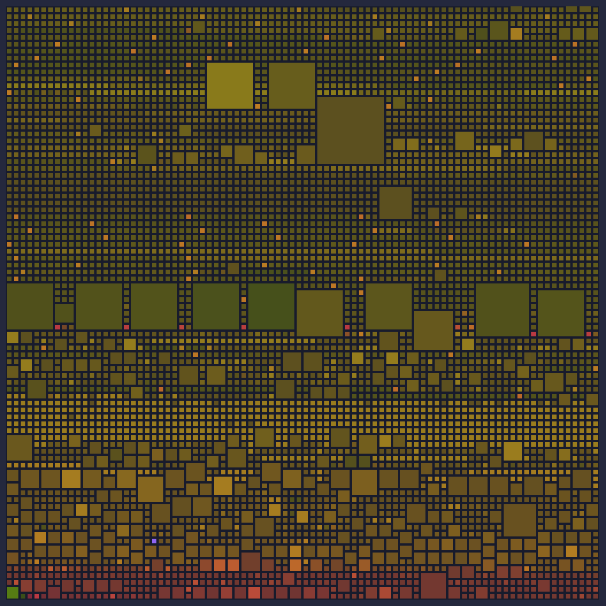
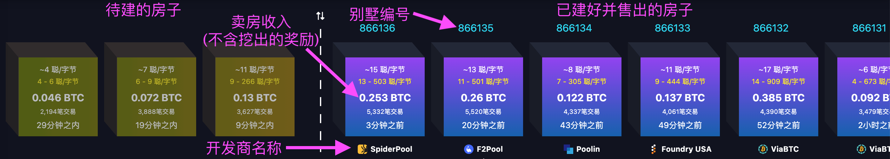
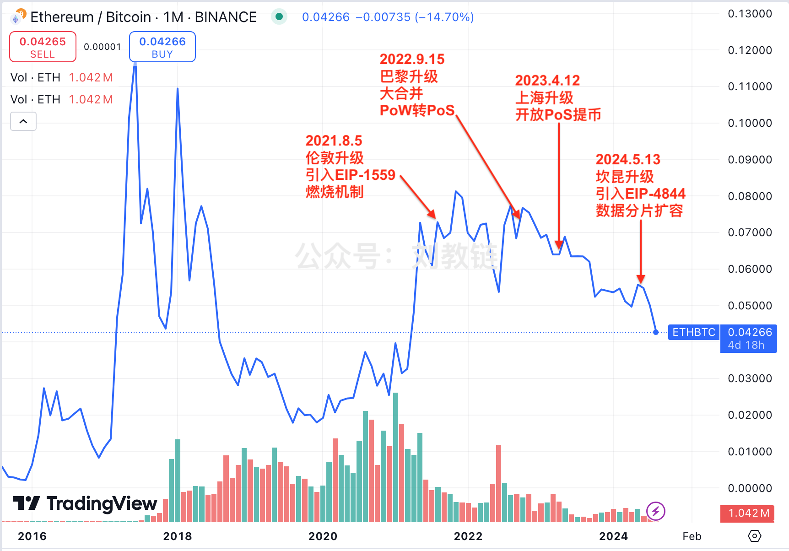

# 每十分钟卖掉一套房子的无限生意

以下教链要讲的是一个虚构的故事。

在2008年的时候，有一个聪明的房地产大亨，想出了一个与众不同的房地产开发模式。

他设想，从全世界所有愿意参与盖房子的开发商当中随机选择一个来盖房子。

所有的房子都是独栋大别墅，单独占据一个地块。

如何决定谁来盖哪一栋别墅呢？答案是靠运气。但不是凭空的运气，而是需要凭实力和汗水去搏这个运气。

所有的开发商到指定的地块上去随便找地方开挖地基，谁先挖到地下有金子的点位，谁就抢到了盖一栋大别墅的资格。

这个挖地基是一个极其费时费力的工作，开发商需要付出巨大的成本。

盖房子几乎不费吹灰之力（基建狂魔！）。主要的成本和时间都花费在挖掘地块上面了。平均而言，大概每10分钟能够盖好一栋大别墅。

那么又该如何吸引全世界最优秀的开发商来参与呢？他和所有人约定，挖地基时挖出来的金子，就奖励给挖出这些金子的开发商。

注意，和传统房地产生意中，资金往往来自于银行贷款不同，这里挖出的金子是直接奖励给开发商的，不是贷款，不需要偿还。

通常而言，目前主流的开发商也不是自己亲自盖房子，而是用这些金子去招募大量的施工队来一起盖房子。

另外，约定每块地皮只能盖21万栋大别墅。盖满一块地皮就需要到下一块地皮上去盖了。新地皮地下的金子数量更贫瘠，每栋别墅所在点位的地底下能挖出来的金子更少。具体的，最开始的地皮，每个点位能挖出50亿克拉的金子（克拉是一种重量单位）；第二块地皮，就只有25亿克拉；第三块地皮，12.5亿克拉；……

这些房子盖好后有什么用途呢？

这房子不能住人，只能当仓库用。而且还只能存放一种东西，就是地下挖出来的这些金子。

所以这些房子的销路只面向一种人，就是那些拥有金子、需要存放金子的人。

每栋大别墅都是定制化设计建造的。在盖成之前就已经通过众筹竞拍的方式卖掉了（卖房收入也是全部归开发商）。

中拍的一批人会在新别墅里分到一户，用于存放他们的金子。因为是按需定制，所以每栋大别墅里，户数和每一户的设计都不同。

上图是866135号大别墅的内部构造图。里面的每一个小方格是一户。没错，迄今这个房地产项目已经盖了接近87万栋大别墅了。

所有这些房子只能拿金子来换。目前每套大别墅的售价大约相当于10万rmb。地下挖出的金子大概价值150多万rmb。以上面866135号大别墅为例，其开发商F2Pool净收入约为23万usd，折合160万rmb左右。

买到房子、分到一户的每个人都把他们的金子锁在保险柜里，然后放在房子里。保险柜的钥匙只由每个人自己掌握。

为了防止窃贼把保险柜直接搬走，开发商还需要负责给每栋大别墅加一把大锁。

这把大锁不是开发商的，而是在地下挖出来的，和金子一起挖出来的。

随着越来越多的开发商参与到挖金子盖房子的浪潮里面来，金子是越来越难挖，挖到金子所需要耗费的人力物力财力也越来越大，相应的，和金子配套的大锁也越来越坚固了。

为了进一步增强别墅群的安全，于是就让前一个开发商盖好一栋大别墅后，把大锁的钥匙交给下一个开发商，请后者给锁到下一个大别墅里；同理，每一个开发商盖好的每一栋大别墅的每一把大锁，都把钥匙锁到下一栋大别墅里……

这样一来，小偷若想打开第1栋别墅的大锁，就要先打开第2栋别墅，拿到第1栋别墅的钥匙；要打开第2栋别墅，就要先打开第3栋别墅，拿到第2栋别墅的钥匙；要打开第3栋别墅，就要先打开第4栋别墅；要打开第4栋别墅，就要先打开第5栋别墅；……

如此，所有别墅首尾相接，形成了一个层层锁定的链条，被称为别墅链，或者大锁链。

* * *

在真实的故事中：

金子叫做BTC（比特币）。

重量单位克拉叫做聪。1亿克拉也就是1亿聪有一个新单位，叫做BTC。重量为1 BTC的比特币被称之为1枚BTC。

大别墅叫做区块。

大锁叫做哈希。而大别墅专用的大锁，叫做PoW（工作量证明）。对，PoW是一种哈希，一种特别的哈希，一种需要耗费巨大算力和电力才能得到的哈希。

于是，别墅链就被称为区块链。而大锁链则被称为哈希链，特别的，工作量证明链。

保险柜叫做地址。

保险柜钥匙叫做私钥。

买房的业主叫做用户。

开发商叫做节点，施工队叫做矿工。自己单干的被称为Solo矿工。招募一大堆施工队一起干的叫做矿池。他们整体上会被模糊地统称为矿工。

而最初的那位房地产大亨，自称其名——中本聪。

* * *

后来，2014年左右，有一个聪明的俄罗斯少年，借鉴中本聪的新型房地产开发思路，搞了另外一个项目，叫做以太坊（ETH）。

最开始，以太坊的别墅链也是工作量证明链，即，使用从地里挖出来的PoW大锁来锁起来。

2022年，以太坊弃用了PoW大锁，不再要求开发商挖地三尺，而是让开发商们抵押一些钱，获得自行造锁的资格，然后轮流造锁。从此，以太坊的别墅群，就都用上了开发商不费吹灰之力自行制造的新型大锁了。这被称为PoS大锁。

说来也怪，自从以太坊的新别墅用上了开发商们自造的PoS大锁之后，ETH对BTC的比价就一路下滑，跌跌不休。

下图是摘自教链2024.8.27文章《以太坊的人生困局》中的一幅图：

* * *

比喻得再怎么形象，也还是远远无法接近真实。

我们常常感叹于文学作品的超乎想象。但是，现实中每日上演的真实故事，往往比最大胆的文学作品还要更加不可思议，更加出乎意料。

毕竟，文学作品的作者的想象力上限受到宇宙过去演化历史的制约，而宇宙未来演化的可能性上限是无限可能。

在真实的比特币故事中，最不可思议的部分，并没有被包含在上面的虚构故事里：

为什么地下能挖出金子？

为什么金子总是和大锁在一起？

为什么大锁的牢固程度会和挖金子的难度有关系？

为什么挖的人越多，金子就越难挖？

为什么其实大锁并没有钥匙？

为什么金子只是表象，大锁才是灵魂？

为什么这一切可以在不靠中本聪或者任何一个人或组织统一指挥协调的情况下井然有序、从不间断地进行？

为什么会有越来越多人想要金子，因而金子会持续升值？

……

有很多人，包括专业人士，能够理解前文的虚构故事，但是无法理解上面的这些问题。因而，他们就无法真正理解比特币。

大多数谈论区块链的人，理解力所限也是前文的虚构故事，而对上面的关键问题未及深究。所以，他们会误以为区块链就是比特币。

而上面这些使得比特币是比特币，而不是区块链的关键问题，恰恰是无法比喻、无法编造进前文的虚构故事之中去的。

如果硬要编，那么就只能虚构一个上帝出来，由上帝来完成这些事情，比如：埋金子，造大锁，上难度，……

中本聪最厉害的地方，根本不是在于运用那些前人发明过的技术，而是在于他在系统中去掉了上帝。

不理解、不相信比特币的人，也不是因为他们不能理解那些概念、那些比喻、那些技术，而是在于他们本质上无法理解，为什么可以没有上帝。

在中本聪之前，人类历史上，所有人造的系统都需要一个上帝，而系统的创造者、统治者，往往作为君权神授的上帝代理人身份，控制、管理和驾驭着整个系统。

在中本聪之后，所有对他及其作品的模仿者，都有意无意地打着改进的旗号，把自己变成上帝的代言人和大祭司。这些人，往往受到韭菜们的顶礼膜拜，被称为“某神”。

为了避免被黄袍加身、推上祭坛，中本聪早有准备，隐姓埋名，激流勇退，彻底消失，没有募集一分钱，没有抛售一枚币。其重要意义在于，现实世界、法币世界的价值流动，没有一分钱流经中本聪。

中本聪的高风亮节、大公无私，有效保证了BTC是彻底的“出淤泥而不染，濯清涟而不妖。”

几乎没有人，能够在创业时、革命时不拿别人一分钱资助，而在创业成功、革命成功后，不要一分钱利益，也不要任何名誉，放弃成为上帝代理人的巨大诱惑（往往被称之为责任），彻底一刀两断，退出江湖。

「我希望你们不要一直把我说成一个神秘的魅影，媒体只会把这变成海盗货币的故事。也许应该把它变成开源项目，并给予你的开发贡献者更多的荣誉；这有助于激励他们。」——中本聪，2011年4月26日，给加文的信

自此，没有上帝的比特币，前无古人，后无来者。
