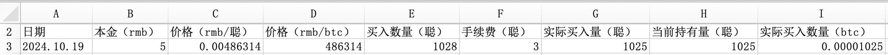

# 如何给孩子做财商教育

时间进入周末，BTC冲高触及69k后回落，但一日仍维持在68k以上，显示出坚守的意志。

据说，股神巴菲特在11岁时就进行了人生第一笔投资。那是1941年，11岁的巴菲特掏出自己积攒的120美元，和姐姐多丽丝合资，购买了6股城市服务公司（后被西方石油公司于1982年收购）的股票。他拥有其中的3股。买入价38.25美元/股。

不过就在巴菲特买入后不久，股价就跌到27美元。巴菲特苦苦煎熬了一段时间，终于等到了反弹。当股价反弹到40美元时，巴菲特赶紧获利了结。最终赚了5.25美元，每股赚了1.75美元。收益率4.58%。

这第一次初试，不能说失败，但也不算成功，让巴菲特学到了一些教训。很显然，还是孩子的巴菲特，表现还像教链说的“韭菜三宝”——高位加仓、低位割肉、回本止盈——一般稚嫩。但是这些早期的尝试，让巴菲特自己完成了对自己的财商教育，为后来成长为一代投资大师奠定了认知基础。

2024年的孩子们，理应比1941年更需要财商教育。毕竟，现在的金融已经成为社会生产生活中不可或缺的重要部分，资本市场也比几十年前要更加发达和触手可及。

最重要的是，总不能让我们的孩子，还像我们这代人，直到贷款买房的时候才开始接触金融知识，在对资产、杠杆、经济周期几近一无所知的时候，做出影响一生的重大财务决定。

人生第一次投资，就是押上“六个钱包”、还要贷款加满杠杆的一场豪赌。赢了的人，懵懂之中赢得盆满钵满。输了的人，也是稀里糊涂地输光了下半生。

及早地给孩子做财商教育，让孩子从小就正确理解金钱、资产、资本、投资、金融市场和经济周期有关的知识，是很有必要的。不是说要把孩子培养成巴菲特那样的投资大师，而是说让孩子能够驾驭金钱，培养正确的价值观、金钱观，掌握一些基本的投资能力，在这个“劳动/资本”二元对立的世界里，能够更加游刃有余，就很好了。

不过，难点很可能在于，做父母的不知道从何入手。买一些书吧，孩子看不懂，也看不进去。给孩子报什么培训班吧，很多也都是智商税，学不到真本事，孩子没有兴趣。

教链觉得，最好的学习就是实践。尤其是对于投资，更是如此。看再多书，听再多课，都不如动手买一买、卖一卖、记记账、算算数所收获的真实感受和经验令人记忆深刻，兴致盎然，思考良多。

因此，上文说到巴菲特少年时代学习投资，是从真金白银买股票开始的，而不是读了一本什么理财书，或者上了一堂什么金融课开始的。

对于今天的孩子，道理是一样的。只不过，今天我们有更好的工具，让我们的孩子能够以更低的门槛和更少的试错成本来学习投资理财，完成自我的财商教育——这就是BTC（比特币）。

为什么这么讲呢？只需要对比一下股市和币市分别的买卖门槛就知道了。

首先股票必须是整数，一股一股的。而且在券商系统里，甚至不能买一股，要买就一次最低必须买一手。而一手通常最少是100股。这么一来，股价为30元的一只股票，一次购买的最低门槛就是3000元。

一个十岁左右的孩子，一次掏出3000元，绝大多数情况下是有困难的。教链说的这投资本金，最好是来自于孩子通过劳动赚来的，而不要是父母无偿赠与的（比如压岁钱），这样才能让他体验到最真实世界的投资逻辑。而且这劳动所得也不要是家庭内部奖励，比如帮妈妈刷碗得到的奖励，而应当是从真实的商品市场中赚来的钱。比如，帮助孩子变卖家里没用的旧物或可回收垃圾，卖出的钱可以作为孩子的劳动收入，交由他支配，引导他拿出来全部或部分来练习投资。

要知道，据说巴菲特在6岁时就已经会挨家挨户地去兜售批发来的可口可乐，还动员邻居去捡别人打飞的高尔夫球，清洁整理后加价卖出来赚钱了。

但毕竟孩子的主业是学习。所以劳动赚钱就只能是勤工俭学的性质，不可能投入太多时间，也就不会赚太多钱。这样看来，一次购买就要投入数千元甚至数万元的股票市场，对于孩子练习投资而言，门槛的确有些高了。（补充：因为钱少而选择低价的垃圾股，反而是在培养错误的投资习惯。）

那么反观币市，龙头市值No.1的BTC，即使目前价格已经高达1枚68000美刀，折合大约48万rmb。但是BTC可以拆分一亿份呀，每份叫1聪，1聪才0.0048rmb。大多数主流交易平台都可以零买，一次买5块、10块钱的，几千聪，稀松平常。这门槛就很低了。

门槛低，带来的是试错成本和学习成本也低。就算是市场波动，投资盈亏，百十块钱的仓位，也不会造成多么无可挽回的后果。特别适合孩子尽情玩耍，体验投资的乐趣。

在实践上，教链先让娃用手机App玩模拟盘，熟悉了几个月。

上图是娃建仓的一个投资组合。标的都是娃自己挑的。概念不懂及时解释，但不给予任何建议和指示，让娃体会什么是“自己决策、自己负责”。

熟悉了之后，进入真金白银的实战练习。这就从BTC开始了。至于足够熟悉了的标志，是娃能够独立设计出投资记账的电子表格——也即是下面这个表格——并进行记账：

教链相信，实践出真知。赚了，会激发孩子进一步学习的兴趣；亏了，也会让孩子思考有哪些教训，这都有助于激励其去钻研更多相关的知识。

孩子的财商教育，还是要从实践入手，从BTC入门，几块钱就可以开始。花费少，风险小，学到的知识和经验却一点儿都不少，性价比很高。

一点儿育儿的心得和体会，真实分享，抛砖引玉。
