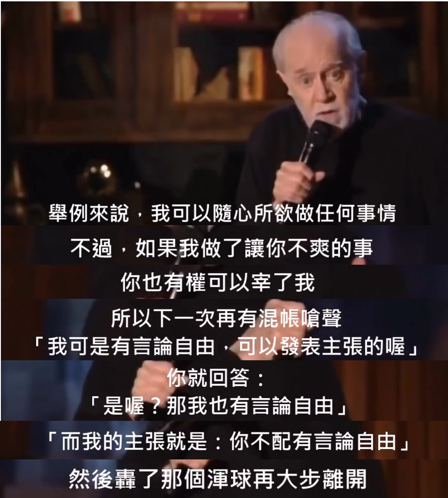

# 从京东玩火自焚看非中性化风险

近日偶然看到，电商平台京东在今年“双11”市场活动上翻车了。教链一贯远离消费主义，从来没有对这些形形色色人为策划出来的所谓购物节上头，冲动消费。作为从京东还是360buy.com的时候就在上面购物的骨灰级男用户，如果不是这次京东的女CEO亲自请来知名脱口秀演员闹出这么一场公共关系危机，笔者还不知道这所谓“普信男”到底是什么意思。这次算是被好好地“科普”了一下 —— 因为有用户编了这样一句朗朗上口的顺口溜：

「购物上京东，自信又普通。」

前不久在京东上花几千大洋买了几条米其林轮胎，结果到货后发现居然是一年前的货。作为生命周期只有4-6年的汽车轮胎，发库存货虽然不能说不道德，但是确实让人“很下头”。

这些日常使用中切身感受到的负面体验，在其玩火自焚式地不顾用户利益、不顾企业利益就是一心要挑弄性别对立议题的情况下，就不由得不令人心生疑问，其内部运营管理是不是已经失控，被一群将群体利益、性别政治置于公司利益、消费者价值之上的“小仙女”、“老仙女”们给“夺舍”了？

有人说，平台无所谓怎么冒犯消费者，特别是这些男性用户，只要性价比高、服务好，他们就不会流失。这看似是低看了用户的骨气，其实是高看了平台的能力。如果平台不能发自真心地把用户利益摆在第一位，而是打着“一边看不起你，一边赚你的钱”的算盘，那么，这样扭曲的心态必然会生出扭曲的动作，从而把心底的动机表现在外在的、可被感知的质量和服务上，从而必然走向损害消费者权利，并最终被消费者抛弃。

当走到这一步时，再做出补救就已经有些迟了。老祖宗早就告诫过，“江山易改，本性难移”。还有“听其言，观其行”。主动的市场行为是对一个群体之本性的最佳暴露。本性暴露了，信任已经产生了裂痕，就很难修复了。

互联网平台是一个中心化平台。中心化平台是一个具有拟人格的行为体，有其独特的性格、利益、立场和价值观。这个拟人格，是群体复杂系统的涌现结果。

国内的脱口秀教链看过一些，普遍是肤浅的、以群体性人身攻击、标签化身份调侃为笑点的空洞作品。20年前中国还没有“脱口秀”这个词的时候，教链就听过一些欧美的脱口秀作品。其中祖师爷级别的脱口秀大师“乔治·卡林”（George Carlin）的作品，对宗教、政治、社会议题进行辛辣讽刺，观点独到，发人深省，几十年仍然记忆犹新。

就比如，每当教链听到那句某些人喜欢挂在嘴边的辩护词“脱口秀是冒犯的艺术”，就会想起乔治·卡林老爷子在几十年前的著名作品「it's bad for ya」中的这段词儿，真是令人拍案叫绝：

复述一下老爷子的脱口秀台词：举例来说，我可以随心所欲做任何事情。不过，如果我做了让你不爽的事，你也有权可以宰了我。所以下一次再有混账堵你的嘴说，“我可是有言论自由的，可以发表任何观点哦”。你就回答说，“是吗？那我也有言论自由。而我的观点就是：你不配拥有言论自由！” 然后给那个混蛋一颗花生米，再大步离开。

本质上，声称脱口秀有权“冒犯”任何人、任何群体的人，暗戳戳地意思不过是双标的把戏：我有冒犯你的权利，但你无权还击哦。而脱口秀祖师爷乔治·卡林老爷子给出的解决方案很简单：你怎么艺术和我没半毛钱关系。但若你胆敢让我感到被冒犯，我就把你丫往死里干。

把宽容留给尊重你的人，把子弹留给冒犯你的人。

以斗争求和平则和平存，以妥协求和平则和平亡。

资本通过三种手段控制和统治人类：一是通过掌握暴力机器——国家，实施权力统治；二是通过掌控人们的欲望，金钱欲、美食欲、两性欲三位一体，实施激素统治；三是通过刷新人们的思想观念，通过舆论和社会运动，灌注各种超越传统伦理观的新意识，瓦解底层人民的力量，实施精神统治。

互联网平台大多借助于资本发展，也就难免身不由己一步步沦为资本贯彻其统治意志的棋子。

脱口秀演员，更是站在其身后、隐藏在幕后的资本的嘴替。

资本是如何做到控制一个个具体的人说什么话、做什么事的呢？其实答案很简单，那就是：筛选。说话做事符合资本利益和口味的公司和个人，会得到资本的金钱和资源的支持。如此日复一日、年复一年地筛选下来，不能符合资本统治世界要求的公司都倒闭了、个人都发不出声音来了，留下来的公司和能够站在台上发声的人，自然都是发自内心地自愿做着资本的提线木偶。

有人觉得资本就是些无生命的商品和金钱而已，人畜无害。这是大错特错。资本的本质是控制这些资源和金钱的一小群人，是这一小群人作为人上人统治其他底层人的这种统治关系。试想如果今晚地球遭遇伽马射线暴，所有人类全部丧生，那么资本一夜消失，黄金就不再是货币而是一堆金原子，商品也不再是商品而是一堆各种原子的混搭而已。这些东西对宇宙而言毫无意义。它们只对人有意义。

一小群人控制资本，借由资本，通过上面讲到的三种手段控制和统治大部分人。这就是资本主义系统的典型结构。

人们常说的所谓“阶层跨越”或者“阶级跨越”，指的就是从被资本统治的下层人，跑到上层去，成为控制资本的人，成为人上人。

中心化平台只要对资本融资，就一定无法“出淤泥而不染”，从而不自觉偏向于资本的意志和价值立场。

即使是不对资本融资，只要一个中心化平台做大做强，它本身就会成长为一个资本，从而拥有自己的意志和价值立场。

以太坊创始人Vitalik Buterin把所有发送到他地址里的模因币都卖掉，款项全部捐赠给公益组织。他还专门发推说，通过模因币来资助公益项目是极好的。

真的是这样吗？

设想一下，中本聪把他早期挖掘的110万枚BTC悉数捐赠给全世界各类公益组织和项目，真的是一件好事吗？

其实上文教链已经说得很清楚了：给钱，哪怕是不计回报的捐赠，本质上就是在进行一种“筛选”。Vitalik选中的受捐对象，肯定是符合他心目中的价值观的项目。因此，通过捐赠，其实他无形之中向这个世界灌输了他的价值偏好和个人意志。

这种真金白银的个人价值观表达，真的对以太坊的价值没有影响吗？

试想如果Vitalik选择给俄罗斯一些捐赠，那么持有ETH但不喜欢俄罗斯的人会怎么想、怎么看呢？

BTC本质上不是软件代码，不是挖矿硬件。它就是一种观念，一种货币不应超发的观念。

观念不死，BTC不灭。

中本聪显然早就看透了这一点。

中心化平台的最大风险，其实是他这个创始人的身份背景、立场、价值观和偏好，给BTC带来的“非中性化”风险。

BTC最大的成功，就在于它做到了真正的“中性化”。

任何一个有资格成为世界货币的物，必须是完全中立和中性化的，不能对任何事关人类意识冲突和斗争议题存在偏好。

非如此而不能做到最大化的包容性（其实是被它的用户所包容），而使之应用范围存在一条无形而不可逾越的边界。

黄金是中性化的天然物，所以屹立千年而不倒。美元不是中性化的，所以1971年放飞自我之后，货币霸权已经岌岌可危。

因此教链断定，中本聪绝不会重新露面，动用他挖出的那110枚BTC。

他是中本聪。他知道，动币就是用行动展示一种价值观。而只要是价值观展示，就必然会在迎合一些人的同时，得罪另一些人。又因为他和BTC无法切割的联系，那么这必定会伤害BTC的中立性和包容性。

如果中本聪真得这么干，那就是亲自摧毁自己一手创作的伟大作品。

而人们也将会实施硬分叉，对中本聪的错误行为予以抵制和反对。

中本聪已死，不是说这个名字背后的人在世与否，而是这个名字必须不再有任何活动。

中本聪已死，而BTC永生。
