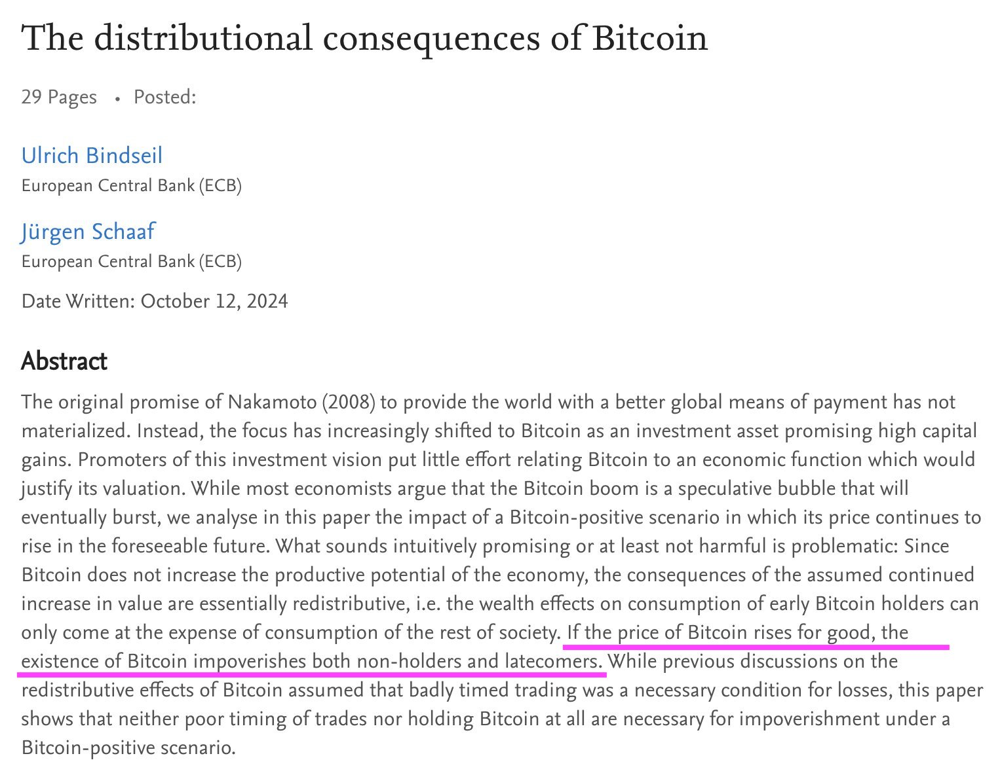
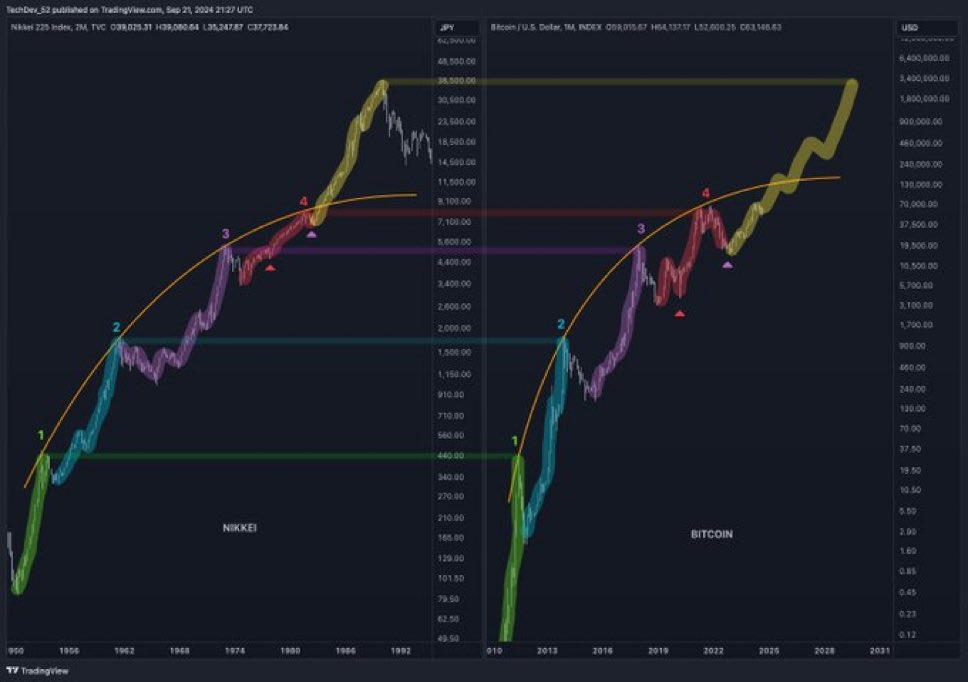

# 欧央行：不持有或晚持有BTC的人将变得贫穷

隔夜BTC继续悄然上攻，突破69000美刀。简单回看了一下记账表格，自今年3月新高以来的所有加仓中，只有6月6日一次“十年之约”的操作加在了7万刀，除此之外，其它各次加仓都低于69k。换句话说，今年虽然是震荡整理行情，但是采用八字诀战术，已经全面转盈。

教链感觉，BTC这一次对震荡区间的突破很可能是真突破，预示了接下来的大行情。从筹码博弈的角度看，昨天《10.20教链内参：BTC站上68000》里面说了，美BTC ETF经过持续不断地加仓，总持仓量已突破112.6万枚BTC，终于超过了中本聪110万枚的持有量。教链觉得这就给华尔街机构以充分的理由去发动行情。

很显然，这轮牛市的显著特征就是ETF牛。ETF需要这一年的时间来抢筹。于是就要横盘洗盘。ETF抢到了筹码肯定不是拿着玩儿。于是就要拉升诱多。

有人可能会说，贝莱德这些ETF发行方又不靠波动赚钱，他们只是稳赚管理费而已。但是，如果他们费那么大劲儿攒了这么大的局，到处路演把投资人给拉进来，结果客户一个二个都被套牢亏损，上不了岸，享受不到路演说的那些好，这贝莱德作为基金经理人，口碑和牌子是不是就砸了？

很清楚的是，作为上一轮周期勇猛尝鲜的微策略和萨尔瓦多，分别作为企业代表和主权国家代表，到这轮周期启动前就已经上岸了，成为了成功典范。他们的成功，是ETF给他们接的盘。ETF不能把这盘子砸自己手里，于是就要找后面更大的玩家和更大体量的资本接盘，好让自己上岸，也成为成功典范。

看清市场大势，核心就看两点：一是人性，顺人性的事就能成；二是资金，现在BTC体量还太小，眼界放开些，手握巨额现金流和信贷资金的企业太多了，还有各种大钱的基金以及主权财富基金，都还没有入局呢。就算这些都入了局，后面还有终极接盘者：能够无限印钞购买的央行们。以贝莱德们的专业性，一定是看清楚了后面几步，才会启动第一步的。既然第一步启动了，就已经说明他们早就看清大势。

这不，欧洲央行（ECB）日前发表了新的研究论文，一改前年熊市BTC 16k时说BTC即将死亡的论调，而是开始关心起BTC的分发方式会不会导致社会财富不公平的问题了。在这篇名为《比特币分发的后果》(The distribtuional consequences of Bitcoin)的论文里，更是直接写了一句这样的话：

「如果BTC的价格持续上涨，那么BTC的存在将使非持有者和晚期投资者变得更加贫穷。」

每轮周期都有很多大聪明人会试图抄底、逃顶，然后被洗下车，消失于历史长河之中。每轮周期也总能看到对自己成功抄底、逃顶津津乐道的KOL，只不过每轮周期都会换人罢了。从天纵英才，到天妒英才，往往只需要一轮周期。教链研究的课题恰恰相反，是如何不抄底、不逃顶，或者抄底失败、逃顶失败，但仍然能赢。战略的成功不是由战术的成功所构成，而是正确战略的必然结果。

过去15年，BTC经历了一浪、二浪、三浪、四浪，四个牛熊周期。五浪呢？幂律式的涨幅消退，顶部15万刀？还是反幂律的突破，把15万刀从阻力位反转为支撑位，爆冲到几十万刀，彻底打破前四浪的幂律约束，站上一个新台阶、新起点呢？

（注：上图左边是日经指数，右边是BTC）

面对这种千年一遇的财富机遇，最佳的策略就是“待在车上”。能不能变富我不知道，但是几乎可以确信的是，至少我不会变得更贫穷。
