# 疯狂的2024年

隔夜BTC暂时在67k上方企稳。今年以来，BTC从约43600刀（2024年1月1日）到约67500刀（今天2024年10月22日），接近2021年牛市最高点69000刀，YTD(Year-To-Date)涨幅近55%。不过，绝大部分的涨幅是在前三个月完成的。

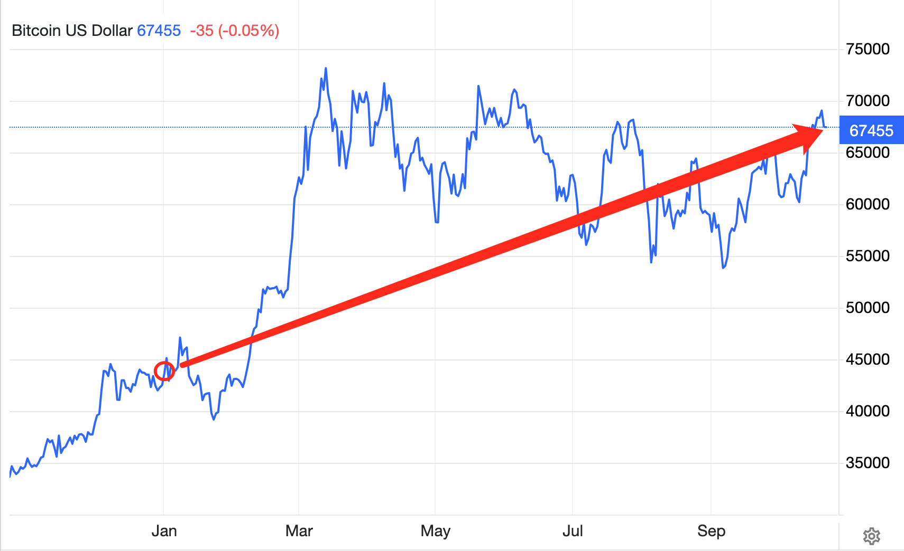

黄金从年初的约2055刀到今天约2730刀，YTD涨幅近33%，创下了45年来最佳年内涨幅记录。作为经典的避险资产，黄金的节节攀升，对当今世界局势不太平的隐喻似乎已经不言而喻。

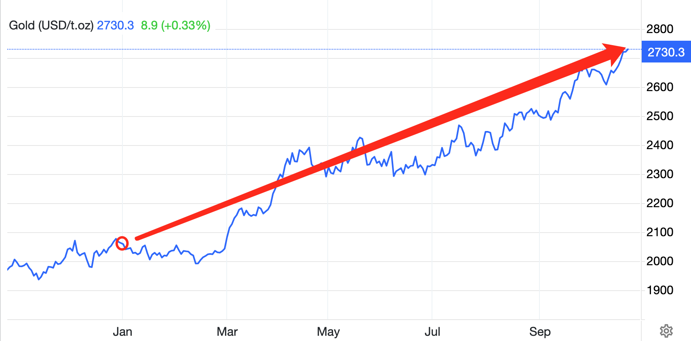

白银也从年初的23.6刀到今天的33.9刀，YTD涨幅近44%。这是白银12年来的新高点。今年的表现也是本世纪以来第5佳的年份。当然，作为已经去货币化的白银，飙升之后仍然未能回到2011年的高点48刀。

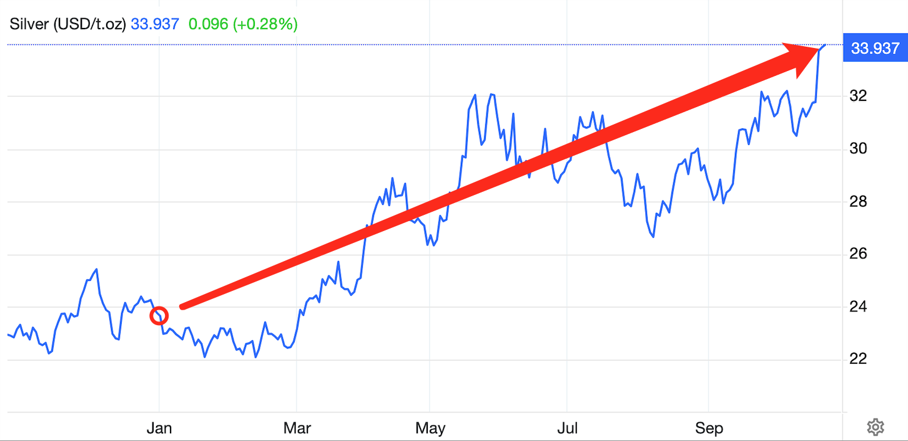

美股标普500指数从年初4743点到如今的5850点，YTD涨幅超23%。这是该指数47年来最高点，也创下美股27年来最佳表现。

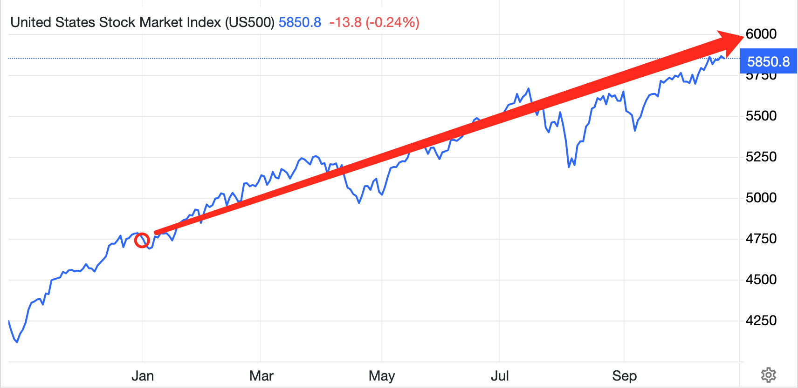

大A上证指数从年初约2960点到如今约3280点，YTD涨幅近11%。

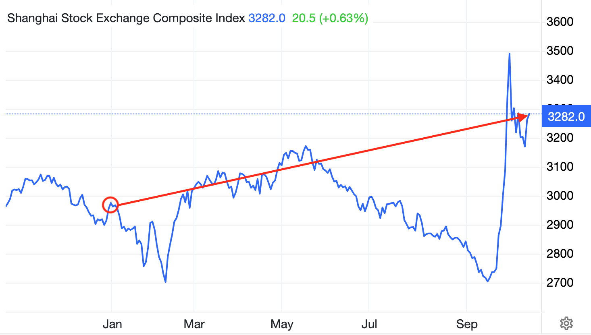

布伦特原油期货却彷佛正在崩溃的路上。从4月份的每桶91刀一路跌到如今的每桶74刀，跌幅近19%。通常而言，原油期货崩盘表明市场对未来需求的悲观预期。经济衰退的阴影开始出现。

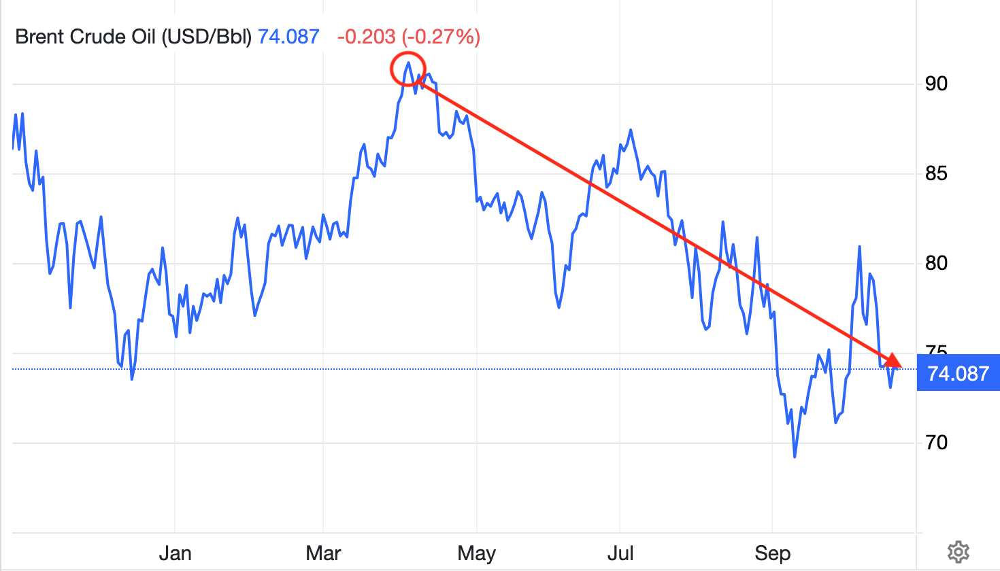

美债规模继续飙升。从年初34.2万亿刀到9月份规模已高达35.5万亿刀。短短10个月增长超过1万亿，平均每个月增加1000亿。如此快速的债务增速，通常不是正在经历金融崩溃，就是处于战争之中，而如今却只是“黑云压城城欲摧”，“于无声处听惊雷”。

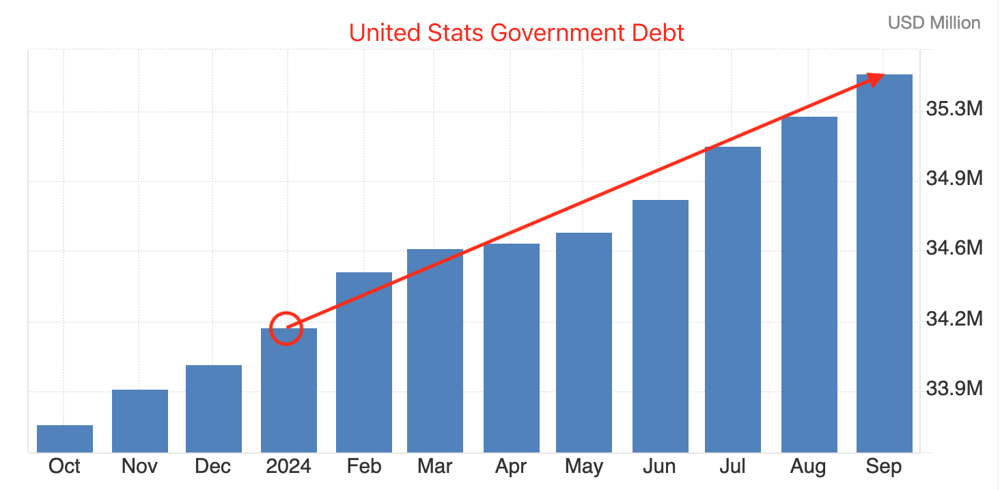

美联储开启降息通道。9月份超预期大幅降息50bp，好像是要对可能的经济衰退进行预防式宽松。

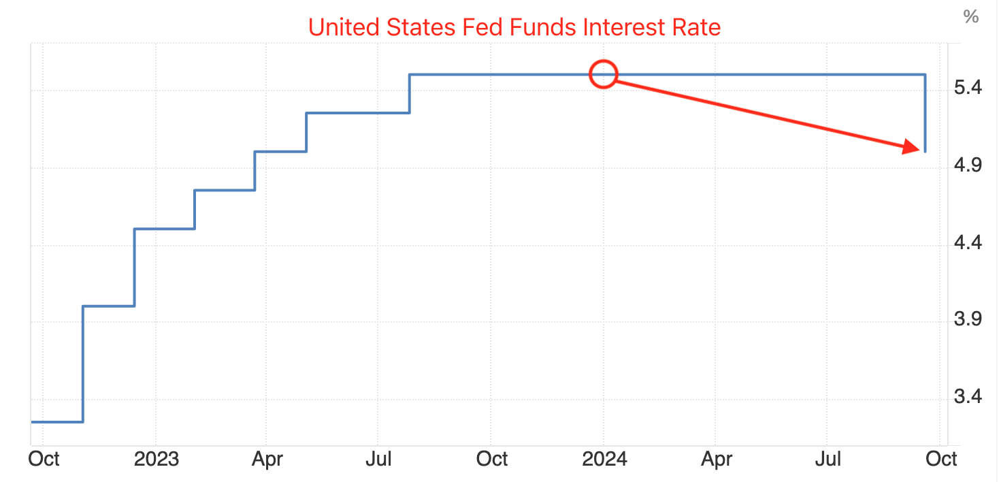

标普500指数期权的隐含波动率指数VIX大幅升高，这通常意味着市场对未来的不确定性和风险感到担忧。

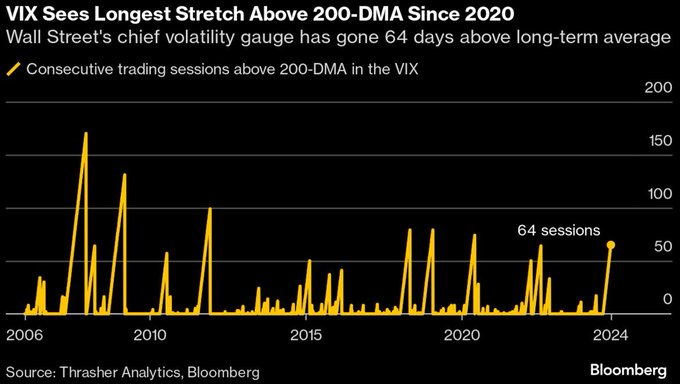

英伟达市值在今年中旬达到美国全年GDP的11.7%。作为对比，24年前的2000年，互联网泡沫时，思科的市值一度高达美国GDP的5.5%。

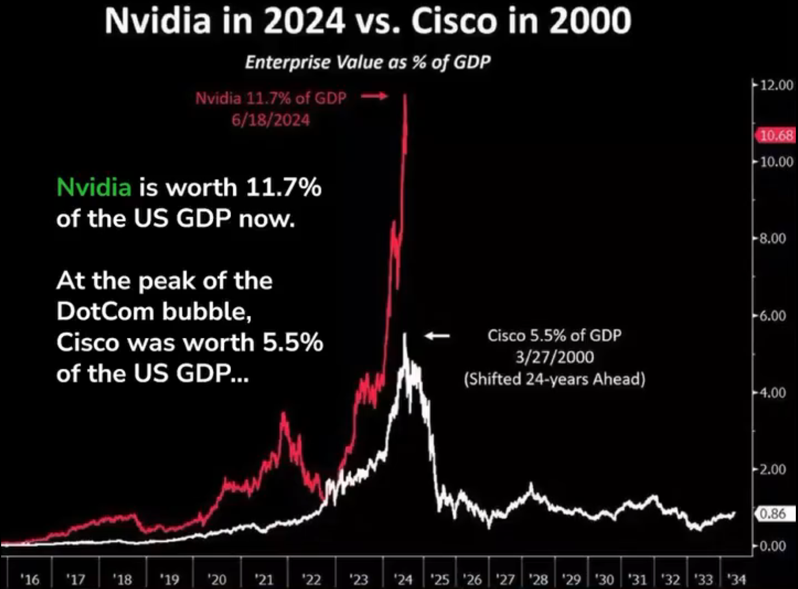

水面之下，是大国博弈，地区热战，炮火连天，生灵涂炭，通货膨胀，民生凋敝。水面之上，是资产价格飙升，美股股价上天，空气中弥漫着发财的味道。

美联储主席鲍威尔又成功地预防了一场衰退或崩溃吗？代价是什么？谁又会成为这一切的代价呢？

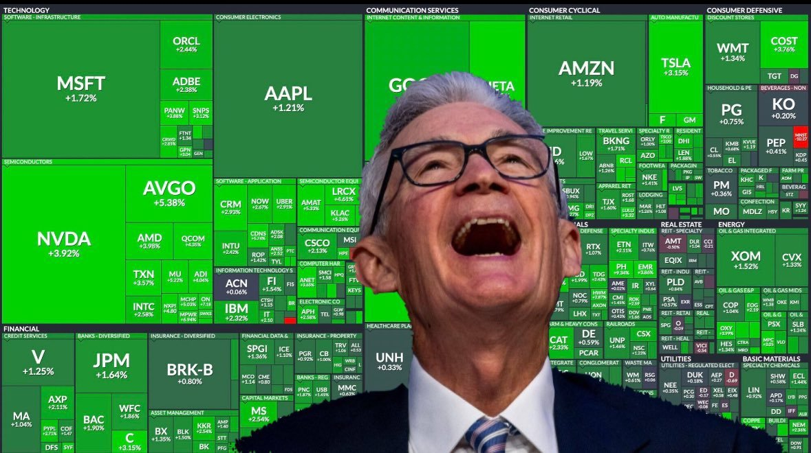

经济热，资产涨的快过工作收入，有产者赢。经济冷，工作收入断崖式下跌，资产却还是在涨，还是有产者赢。

哎，真是—— 兴，百姓苦；衰，百姓亦苦。

无钱不如有钱，有钱不如有产。

疯狂的2024年将会如何结束？

更加疯狂的末日狂欢何时到来？

当潮水退去的时候，何处亦可容身？
