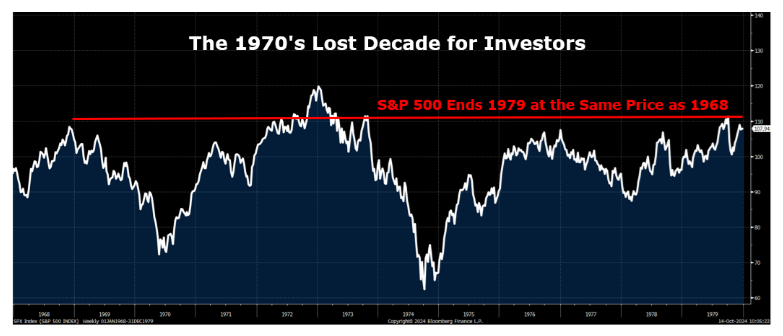
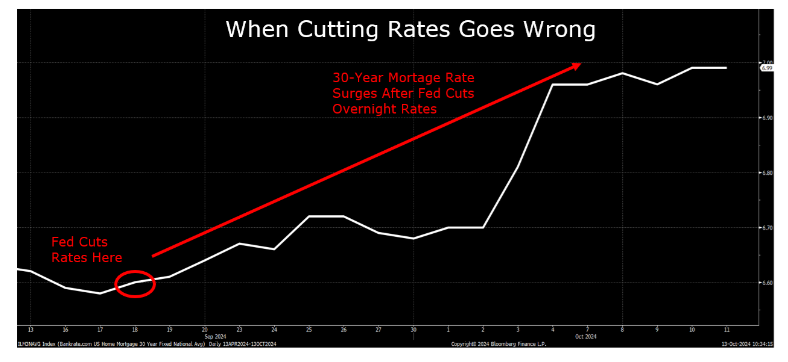
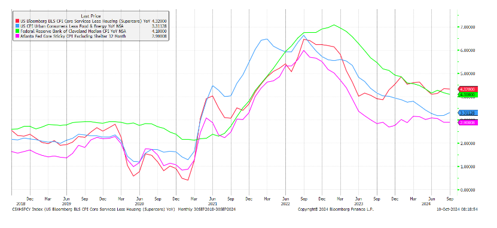
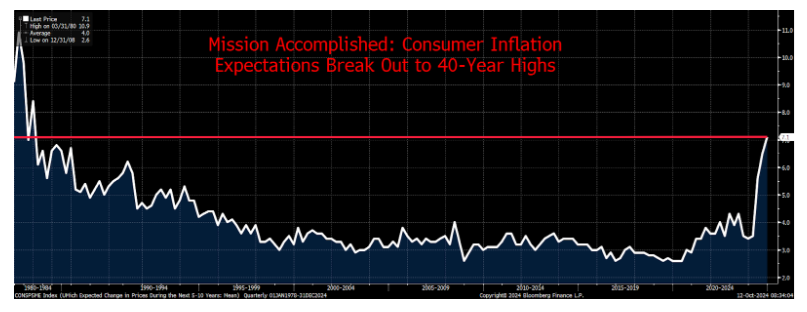

# 高债务、高通胀：美经济或将再陷“失去的十年”

教链按：9月份美联储FOMC会议超预期降息50bp前后，很多自媒体、专家、理财顾问跳出来唱多债券，鼓吹大家冲美债。彼时他们拿出了一个天衣无缝的金融常识：当利率下行时，债券收益率会下降，债券价格会上涨。教链多次在内参和文章中提醒，要注意“反常识”的情况发生，但仍然耳闻目睹了不少不幸中招的案例。9月18日美联储决定降息时，10年期美债收益率是3705bp；一个多月后的今天，已经飙升至4224bp。换句话说，冲美债已亏超12%——对于债券这类通常被认为相对低风险的投资品种而言，一个月亏超过10%就是很不少的了。如果上了杠杆，那感受只会更加酸爽。屡试不爽的一句话：一个确定性简直是100%的赚钱机会，大概率会是亏钱的。如果一件事必然赚钱，那么你可能根本就不会知道有这么个机会。而天降馅饼还由理财顾问主动送到你的嘴边，那大概率是有毒的馅饼。下面，教链编译了网友Porter Standsberry的一篇帖子，为你揭开此次美联储降息和美债收益率反常冲高背后的真相。

* * *

“每个人都有计划，直到他们被打了一拳。”

这是杰罗姆·鲍威尔（教链注：现任美联储主席）所面临的情况，债券市场对美联储降低借贷成本的最佳计划进行了反击。

在鲍威尔于9月18日将隔夜利率下调50个基点后，10年期美国国债等长期债券的收益率却相反，飙升了50个基点。

这本不应该发生…

在正常情况下，当美联储与市场步调一致时，长期借贷成本会跟随美联储设定的隔夜利率。但当美联储犯政策错误——如在总统选举前降息，尽管通胀高企——市场就会反击。

我们之前见过这样的情况，剧透一下：结局并不好。

1971年，尽管通胀超过4%，美联储主席亚瑟·伯恩斯仍降息，以提高尼克松在1972年总统选举中的政治前景。

在高通胀下降息，使得价格压力在美国经济中根深蒂固。美国工人担心物价持续上涨会侵蚀工资，开始要求更高的薪资。

这导致了一个自我强化的工资-价格螺旋，带来了十年的双位数通胀、破坏性利率和停滞的经济增长：一种被称为“滞涨”的有毒组合。

为了最终遏制通胀，沃尔克时代的美联储将隔夜利率提高到20%。

但在此期间，美国投资者经历了一个「失去的十年」，股票和债券的实际回报率为负。1979年标准普尔500指数的价格水平与1968年相同……而考虑到超过50%的肆虐通胀，股票投资者在实际回报上损失了一半的资金。

债券投资者的情况也好不到哪里，10年期国债经过通胀调整后，每年损失3%，十年的购买力下降大约30%。

这是自大萧条以来投资者回报最差的十年。

在这个帖子中，我将解释为什么所有迹象表明未来会重演这样的情况。

与股票不同，后者在极度乐观的时期（如今天）往往会暂时抵消经济重力，债券市场则要严格得多。对于固定收益投资者来说，通胀是头号敌人——这个无声的窃贼能够将正的名义利率转变为负的实际（通胀调整后）回报。

在未驯服消费价格之前，杰罗姆·鲍威尔过早地降低短期利率，重蹈亚瑟·伯恩斯美联储的致命错误，助长了人们对根深蒂固通胀的恐惧。

债券投资者铭记1970年代。对持续通胀压制实际回报的日益担忧使他们现在要求更大的安全边际，导致长期借贷成本飙升，例如10年期国债利率。

10年期美国国债是全球最重要的借贷基准之一，决定着广泛的消费者和商业贷款的借贷成本。这包括标准的30年期美国抵押贷款利率，受10年期国债影响而被推高，在鲍威尔最近降息后飙升了50个基点。

这成为一个大问题，因为较高的借贷成本反而进一步推动了通胀。尤其在住房市场，高抵押贷款利率直接导致了住房拥有成本的上升。

目前，拥有一套平均价格美国住房的月供为2,215美元，这意味着现在需要106,000美元的年家庭收入才能拥有一套平均房屋，而四年前（2020年）仅需59,000美元。

不足为奇的是，9月的通胀报告中，住房成本是最大的赢家之一，同比上涨了4.9%，远超3.3%的整体通胀率。

与此同时，美联储的降息举措——本应支持美国经济增长——也在适得其反。更高的长期利率在实际经济中并没有降低借贷成本和促进贷款，反而起到了相反的效果。

我们可以从最新的每周数据中看到，新的抵押贷款申请骤降17%。抵押贷款再融资的跌幅更大，上周的数字下降了惊人的26%。

较高的借贷成本并不是导致顽固通胀的唯一因素。保险是另一个主要罪魁祸首，费用普遍以高于整体CPI的速度上涨。

对于几乎每位美国成年人而言，保险是主要的生活成本，且常常是法律规定的。试想一下，若不报告医疗保险就报税，没房主保险就申请抵押贷款，或是没有汽车保险开车，后果将如何。

保险公司在疫情后的通胀初期遭遇了重大利润损失，因为他们之前的保单是根据1-2%的历史通胀率定价的。因此，当通胀飙升导致索赔远超预期时，他们不得不承担巨额亏损。

现在，保险公司开始向保单持有人收回损失。

在过去几年中，随着旧保单的到期，保险公司通过对新保单的大幅涨价弥补了损失。例如，雇主赞助的健康保险计划在连续第二年预计成本上涨7%——大约是当前CPI通胀率的两倍。这是十多年来最快的涨幅，仅在过去两年就使平均家庭健康保险费用增加了3,000美元。

与此同时，房屋和汽车保险的保费也在以双位数的速度上涨，最近续保的人对此深有体会。由于两场连续的毁灭性飓风预计将给保险公司带来巨额损失，行业将进一步提高费率以弥补这些损失。

这些以及其他顽固的成本是原因所在——即使剔除波动较大的食品和能源价格，联储的各种“核心通胀”指标在CPI最后一次低于2%的通胀数据后，依然顽固地保持在3%以上。而如果分析CPI篮子中的中位数价格，通胀也一直顽固地维持在4%左右。

值得注意的是，这也是美联储在1970年代滞涨期间无法突破的通胀底线。

尽管政治家和媒体人士竭尽全力让消费者误以为通胀已经被击败，生活在现实世界中的美国人仍然感受到价格猛涨对他们工资的侵蚀。

现在，美国工人正要求不断提高工资，以应对生活成本危机。

例如，最近有32,000名波音工厂工人在他们要求的四年内提高40%薪资未果后罢工。他们在波音同意在接下来的四年内提高35%薪资后结束了罢工，相当于近9%的年增长。

与此同时，国际港口工人协会本月初结束了最新的罢工，因为雇主同意在接下来的六年内提高62%的薪资，平均时薪达到63美元。

在这样的薪资上涨设定了标准后，可以清楚地看出：通胀正在美国经济中根深蒂固，助长了1970年代那种工资-价格螺旋的火焰。

下面的图表很快将成为美联储的噩梦，显示消费者的通胀预期飙升至过去40年的最高水平。

在消费者预期未来5到10年年通胀率将超过7%并继续要求更高工资的情况下，美联储能维持“任务完成”的降息把戏多久？

美国政策制定者正在重蹈1970年代的覆辙。他们已经播下了十年或更长时间的顽固通胀、不断上升的借贷成本以及美国经济和金融资产价格的「失去的十年」的种子。

但这一次，情况可能会更糟。最大的问题是，美国高度负债的经济再也无法承受当年抑制1970年代失控通胀所需的20%利率。

美国的债务与GDP比率高达120%，而1970年代为30%。

如果美联储简单地将利率维持在5%，并强迫美国政府以该利率融资其所有未偿债务，年利息支出将很快接近2万亿美元。这相当于政府每年税收的40%。如果利率升至10%，联邦政府将被迫在支付社会保障和医疗保险福利与资助军队之间做出选择，二者都无法兼顾。

而在20%的借贷成本下，美国将正式关闭商业。山姆大叔每年支付的利息将超过其产生的税收。

这就是为什么所有道路都通向长期失控的通胀。由于美国不可持续的债务负担，单靠提高隔夜借贷利率来控制通胀不再是可行的选择。

美国联邦政府正快速走向破产，而政策制定者甚至不愿承认，更别提解决这个问题。诚实的违约和债务重组显然不是寻求连任的政治家的可行选项。因此，唯一剩下的选择就是通过通胀进行不诚实的违约。

但不要只听我说，看看传奇交易员保罗·都铎·琼斯，他今天刚刚解释：

“所有道路都通向通胀。我持有黄金和比特币，零固定收益。走出这个[债务问题]的办法就是通过通胀来解脱。”

比他们所说的更重要的是，关注世界顶级投资者的行动。

注意斯坦利·德鲁肯米勒，他刚刚对长期美国国债进行了大规模做空。注意沃伦·巴菲特的伯克希尔·哈撒韦和瑞·达里奥的桥水基金，他们正在像变卖过时商品一样抛售银行股票。

这个周末，我被几个「键盘金融大师」告知，我对美国银行所警告的问题不过是“小事一桩”。当我警告房利美、通用汽车以及更近期的波音面临的危机时，我也听到了同样的反对声音。

这些判断并不需要什么天才，只是资产负债表的数学问题。今天的银行业也同样如此。

美国银行目前正面临一个破损的债券投资组合，损失相当于其有形股本价值的一半。如果长期利率超过10%，美国银行将破产。

当然，你可以希望货币和财政当局阻止这种情况的发生。

但是，正如他们所说的，「希望」并不是一种策略。[1]

1: 教链注：这句话的意思是，单靠“希望”并不足以应对现实中的问题或挑战。它强调了希望的无力，尤其是在面对严重经济和财务危机时。希望可以激励人们，但它并不是解决问题的有效方法或策略。真正有效的策略需要具体的行动和计划，而不仅仅是期望事情会好转。因此，作者在这里强调，依赖希望而不采取实际措施是不可行的。

