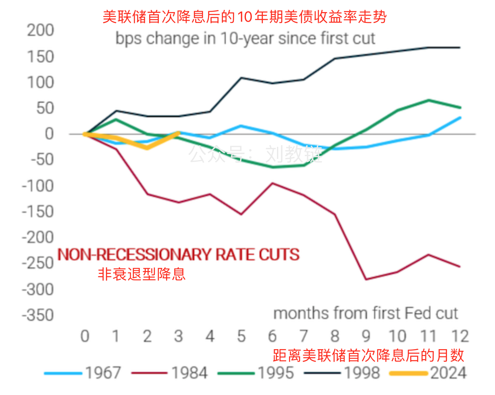

# 押注美联储犯了错的人或将铸成大错

隔夜BTC向30日线65k附近回归，然后开始大举反弹，至今晨已拉回67k上方。可见这一波回调目前看起来还是一个良性的均线回归而已，并未改变突破性的走势。只不过，这个十月可能表现并不会特别好看，尤其是和历史数据比较起来的话。这也告诉我们一个道理：如果一件好事人人都知道了，那么它也就要变成坏事了。这就是老子说的，天下皆知美之为美，斯不美矣。

金融市场，处处充满了“反者道之动”的辩证逻辑。就像昨天教链文章《高债务、高通胀：美经济或将再陷“失去的十年”》介绍了一位美国网友看衰美经济前景的观点。不是他一个人这么看，而是有很多人。多少呢？大概有一半吧。那么另外一半呢？当然是持相反的观点。相反的观点是什么呢？相反的观点就是，美联储9月超预期降息50bp并不是一次政策失误，美国经济很可能会如美联储所期望的那样成功实现软着陆。这正是昨晚《10.23教链内参：BTC出现多个牛市信号，研究机构称明年保守20万刀》中所介绍的宏观经济研究公司TS Lombard的观点。

不妨把前一种观点称为“崩溃论”，后一种称为“软着陆论”。

有些朋友可能会在听到截然相反的观点时感到困惑。这只能说明我们还需要学习和提高。股神巴菲特的搭档查理·芒格曾经说过，顶级的头脑总是可以容纳完全相反的观点而并行不悖。为什么？金融市场的价格都是均衡价格。均衡价格的来源就是多空双方暂时所处的力量平衡点。一半买单，一半卖单，中间才有平衡点。一半看多，一半看空。有一半看多的观点，就必然有另一半看空的观点。有一半看空的观点，也就必然有另一半看多的观点。

二者就像太极图，黑和白，你的另一半是我，我的另一半是你，你中有我，我中有你，你就是我，我就是你。所以老子又说，有无相生，难易相成，长短相形，前后相随。

因此，这里再重复一遍教链在《9.22教链内参：惊人一幕，USDT跌破7，金融战转入新阶段》中所作的忠告：「不要交易宏观因子。」

正如昨晚《10.23教链内参：BTC出现多个牛市信号，研究机构称明年保守20万刀》中，宏观经济研究公司TS Lombard全球宏观管理董事达里奥·帕金斯所说的那样：「如果有人犯错，那就是那些将观点固定在‘政策失误’上的人——似乎与当局（美联储）的做法无关。」

宏观系统除了是一个混沌的复杂系统外，还有另外一个重要的问题：宏观因子大多是表象，而不是本质。

这话如果用德国哲学家叔本华的语言来说，那就是宏观因子是宏观经济的表象，而不是主导这些经济现象背后的意志。

我们要想看透复杂而混沌的宏观经济的本质，就不能只停留在分析表象，也就是宏观因子，而是要以入木三分的洞察力，准确把握一切现象背后的那个意志。

崩溃论的逻辑很简单：美联储大幅降息，而美债收益率反常升高。一方面，债券收益率升高会继续推高通胀；另一方面，美债的下跌会吸收风险资产（比如美股、BTC等）中的流动性，从而导致风险资产下跌。经济陷入滞涨。滞涨引发更严重的经济衰退。

但是，上述因果逻辑也可以颠倒过来讲：因为美联储大幅降息，所以流动性逃离美债，引起美债下跌。美债下跌，所以美债收益率反常升高。流动性逃逸到风险资产以及新兴市场，所以推高美股、BTC甚至是大A。

客观世界无因果。因果只存在于人的认知里。就像教链在15年前从高处跌落、大难不死，可以说“因为15年前大难不死，所以今天得以在此讲述此事”，也可以说“因为今天在此讲述此事，所以15年前大难不死”。认真地深入思考就会发现，这两种逻辑对于宇宙而言都是相容的。

正因为因果链可正可反，为了给思考定一个方向，所以人进化出了时间感知能力。宇宙中并无时间。时间也只存在于人的认知中，只存在于人的时间感里面。

所以，BTC系统中存放交易记录的账本，最重要的事情是“定向”，确定一个时间之矢的方向。“区块链”这个词把这个最重要的关键点给遗漏了。而中本聪在比特币白皮书里第三节写的就是时间戳服务器，并且在最初版本的代码里，把工作量证明的链条称之为“时间链”（timechain）。

因为中本聪明白，有了时间，才有方向。交易有了方向，才有价值。思维有了方向，才有因果。

知历史，懂因果。读史可以明智，不是从历史中刻舟求剑，而是从历史中学习规律。

从历史上看，美联储实施所谓“非衰退性降息”后，长期美债收益率并不是必然下跌，这也意味着，美债并不会必然走高。

从图上看，在美联储首次降息后的一年时间内，除了1984年之外，其他几次降息，十年期美债收益率都没有大幅下行，反而多有所提升。

而这一次，看起来并没有什么特别令人惊讶之处。

最有趣的是，无论是“崩溃论”还是“软着陆论”，都导向了一个共同的结论：看涨BTC。前者看到BTC作为零息资产和实际负利率的对冲，在滞涨衰退中将会成为高通胀的避难所。而后者则看到流动性宽松推高风险资产，从而推高常常与风险资产联动的BTC。

愚笨的人信任美联储的全知全能。聪明的人押注美联储的错误。智慧的人关注BTC的正确。

《让子弹飞》场景闪回：

黄四郎：我和钱，哪个对你更重要？

马县长：你和钱，对我都不重要。

黄四郎：（疑惑状）

马县长：没有你，对我很重要！

「传统货币的根本问题在于使其运转所需要的所有信任。必须信任央行不会让货币贬值，但是法币的历史却充斥着对这一信任的破坏；必须信任银行并由其持有 我们的钱，以便我们进行电子转账，但是他们会在信贷泡沫周期大肆放贷，只留下很少的准备金。」—— 中本聪，2009年2月11日，《比特币史话》第八章第34话
