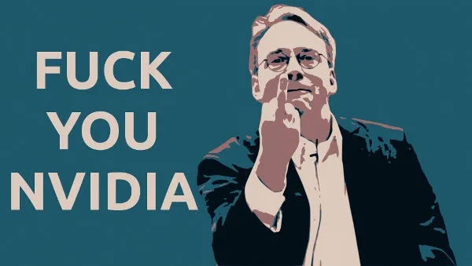
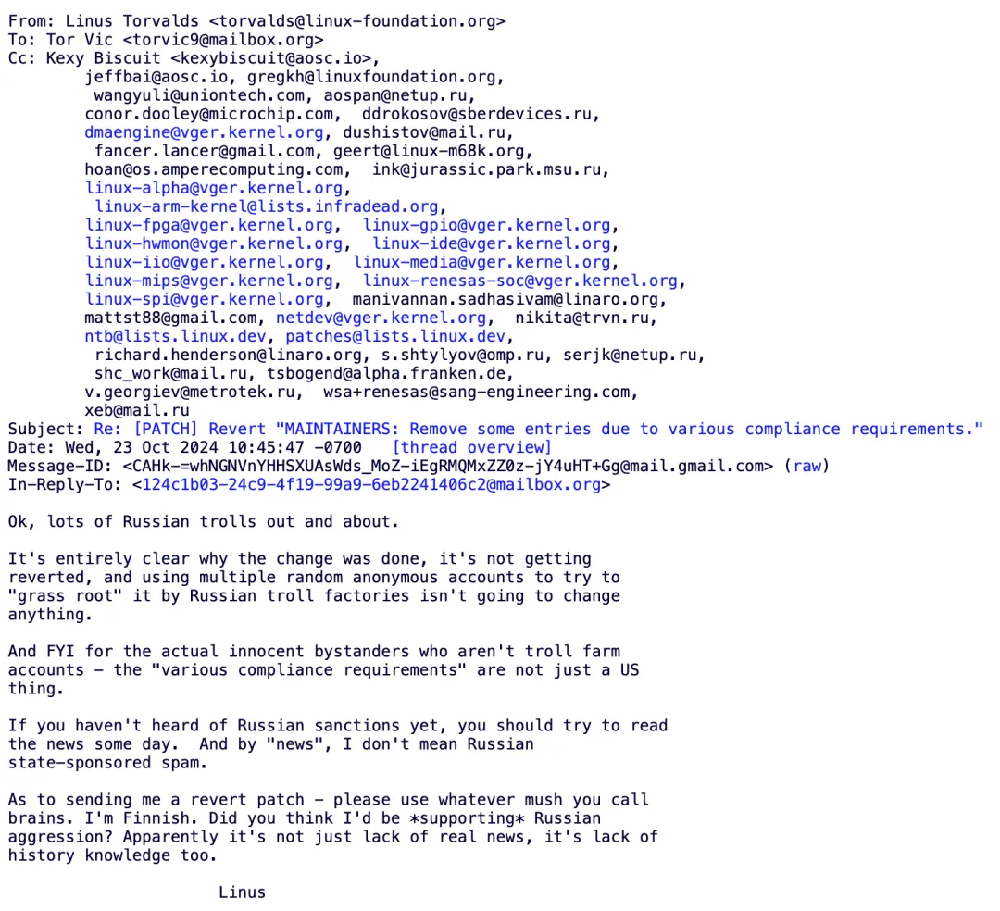

# 自由、独裁和暴君统治

近日，开源社区发生了一件惊天动地的大事：最著名的自由软件项目之一，世界上应用最为广泛的开源操作系统，几乎所有安卓手机和云服务器的底层操作系统的代码基础—— Linux，合并了一个新补丁，把几位俄罗斯开发者踢出了项目。

合并这个补丁的，正是“Linux之父”、芬兰人Linus Torvalds。

补丁提交邮件的主题给出的理由是“合规需要”。众所周知，美国正在制裁俄罗斯。而Linux基金会设在美国，必须遵守美国的合规要求和制裁规定。

但是，Linus在驳回一些开发者请求撤销补丁的邮件中，并没有把“锅”完全扣在美国政府的头上。他说，「所谓“一些合规要求”并不仅仅是美国的事」。他还说，「如果你没听说过对俄罗斯的制裁，你应该抽空读读新闻」。

最后是他的一段“暴论”：「关于给我发送撤销补丁 —— 你那个叫做“大脑”的东西是浆糊吗？我可是芬兰人！你觉得我会支持俄罗斯的侵犯吗？显然这不仅是对新闻的无视，更是对历史的无知。」（教链注：不了解这段历史的朋友可以搜索一下“1939年苏芬战争”）

嗯，不得不说，这很Linus。在Linux全球社区中，他就是一个不折不扣的独裁者和“暴君”。他会在邮件中使用对其他开发者骂脏话进行羞辱。他会在公开场合对顶级厂商竖中指。

开源软件可能是自由的，但通常不会是民主的。恰恰相反，大多数开源项目的最终权力掌握在一个或少数几个维护者手里。像Linux项目的最终合并由Linus Torvalds一人独裁。而最主要的比特币客户端Bitcoin Core的维护者有五位：Hennadii Stepanov, Michael Ford, Andrew Chow, Marco Falke, Gloria Zhao。

权力的本质是他人的服从。人类社会传统的权力来源主要有二：其一，暴力，谁敢不服就打到他服；其二，金钱收买，吃饭靠你的人自然就会归顺于你。

但这两个权力来源在开源软件项目中都不存在。首先，谁也无权拿枪指着别人脑袋逼人写代码。其次，开源项目本身是纯公益性质的，没有收入也不给任何人开工资，所有人参与贡献都是纯粹发自内心的爱好和奉献精神。

开源软件的权力来源是不同于传统的，是新型的。是什么呢？共识。

真正的共识是所有人用脚投票的结果。

暴力和金钱收买其实也会得到一种表面的共识。只不过这种共识是扭曲了的共识，是伪共识。只有不受暴力胁迫、不受金钱诱惑的纯自然情况下，自发建立的共识，才是真正的共识。

这并不否定少数人的个人能力在其中发挥的决定性作用。正是因为Linus Torvalds的技术实力非凡，令所有的开发者、厂商、用户甘愿忍受他的独裁和暴君统治。

任何人不服，都可以“分叉”Linux项目代码，另立门户，看看是不是全世界都转而支持你。如果你能够引领全世界心甘情愿地抛弃Linus而追随你，那么你就成功“干掉”了Linus。他的权力也就被大大削弱甚至消失不见了。

利益不够大的时候，可能没有人会跳出来搞“分叉”。但是，如果出现了利益分歧，且利益巨大呢？

比特币的发明者中本聪为了避免自己成为独裁者，选择了激流勇退，彻底消失。如此一来，他就避免了在未来的利益冲突和“分叉”斗争中，冲突各方诉诸权威。

在他离开前留给继任开发者Gavin Andresen的邮件中，中本聪告诫他，不要过度强调中本聪这个名号，而是要把荣誉归于广大的社区开发者的贡献。

比特币(BTC)的权力格局就成了：开发者维护代码，节点和矿工运行代码，持币用户用脚投票。

无论开发者出于何种动机或原因，主动或是被迫，违背大多数人的意愿，改写了代码中的关键部分，那么节点和矿工可以拒绝运行新代码。如果节点和矿工同流合污了，那么持币用户可以抛售清仓，切割走人。

可见，对独裁最佳的制约和制衡方法是充分的“自由” —— 审查监督的自由、分叉的自由、用脚投票的自由，而不是所谓的“民主” —— 当代语境下的西式投票式民主。

开源软件的选择是独裁+自由，而不是民主+自由，因为不可能所有人都具备高度专业的知识，以及无限充足的时间深入参与审阅和评判每一段代码、每一个提交，对每一段代码的每一次提交、合并都进行民主投票决策，不仅在理论上是糟糕的，而且在技术上是不可行的。

DAO的民主投票，像是一种和平接管的机制。而BTC的硬分叉，则更像是一种暴力革命的机制。前者是迷魂汤药。后者是刮骨疗毒。

2017-2018年兴起的对BTC硬分叉的轰轰烈烈的造反运动虽然都失败了——因为最大多数人依然选择了BTC，但是从社会实验的角度看，却是中本聪“持续革命”理念的成功。

未来，BTC身上会不会再次出现不可调和的矛盾，以至于又要闹到硬分叉来一决胜负呢？这个可能性当然不能排除。只不过，到那个时候，代表广大用户用脚投票买入或者抛售的，可能不仅仅包含中心化交易所，还会有贝莱德这样的ETF基金，以及各种主权财富基金等等大玩家粉墨登场，参与博弈了。
