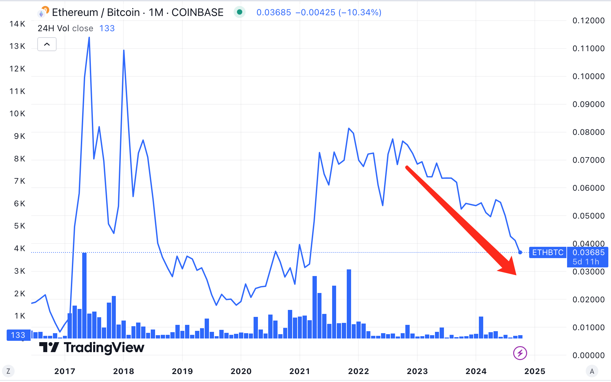

# 为什么今年ETH对BTC表现这么拉垮？

最近眼瞅着BTC突破下降通道，一举从60k附近拉升到67-69k，作势要形成向上的突破。而ETH则从8月份以来一直横盘震荡。那个横盘横得，真的是特别地水平。

教链在8月底2024.8.27写过一篇文章叫做《以太坊的人生困局》，里面放了一张ETH/BTC的汇率走势图。彼时已经跌破0.05关键心理关口，但尚在0.04上方。如今已有效跌破0.04，来到了“3字头”。

从2022年底也就是刚刚过去的最近一个熊市底部开始，ETH/BTC就一路跌跌不休，从接近0.08（这其实是一个接近于2021年底牛市高峰期的表现），一路下降，来到了如今低于0.04，近乎腰斩了。

这也就意味着，如果没有在2021年牛市末段山寨狂热时，或者2022年熊市末段BTC超跌时，趁着ETH对BTC相对坚挺，抓紧换仓BTC的话，拿住ETH到现在，只能换回来一半数量的BTC了。即，以BTC本位衡量，持有ETH已经损失了一半价值。

BTC的市值占比已经接近60%了。而且似乎距离突然发动行情越来越近了。不知哪天一个暴拉，吸血山寨，ETH/BTC会不会再创新低也不好说。毕竟，2019年最低可是到过0.02。

但这并不意味着现在换仓就是明智的。原因很简单：人尽皆知，赚钱就是低买高卖，亏钱就是高买低卖。现在割肉，肯定不是高卖。

ETH如今的拉垮表现，其实早在2023年底就已经被“诅咒”过了。回看一下2023年《12.20教链内参：Messari看空以太坊，ETH/BTC再创新低》，加密研究机构Messari的老板Ryan Selkis在2023年底的研报里明牌唱衰以太坊，唱多Solana。

更早，在2021年，教链2021.11.24文章《以太坊腹背受敌》中就已经写出了以太坊面临的、被前后夹击的巨大挑战：「前有围堵，后有追兵，以太坊腹背受敌。」

从市值的追及关系上看，可以说，ETH前有强敌BTC，站稳了价值存储这个定位；而后有追兵，被以Solana为代表的侧链（新公链）抢走了大量市场——“炒币”市场。

区块链或者说加密行业，发展了15年，就只有两个需求被验证为真：一是BTC的价值存储，二就是炒币。这两者是真正被验证的PMF（Product-Market Fit，产品-市场匹配）。其他所有的各种所谓区块链应用需求，截至目前，都是伪需求，没有一个被证明具有真正商业价值。

“炒币”拆开来，就是三大块儿：发币，交易，以及衍生品。对应链上应用，分别是ICO、DEX以及各种DeFi（比如借贷）。“币”，则涵盖了同质化的代币以及非同质化的NFT（所谓数字藏品）。

剥开云山雾罩的花言巧语，归根结底就是一个字——“炒”。何所谓“炒”？就是不做价值创造，只做财富转移。“炒”，就是一个游戏，一个把财富从一堆人的口袋里掏出来，装进少数人口袋里的游戏。

“币”是工具，“炒”是目的。

看透了这一本质，就看明白了：

2017年ICO热，都用以太坊发币，ETH/BTC创下迄今历史最高超过0.11。

2020年DeFi之夏，DEX龙头Uniswap开链上炒土狗之先河，至2021年上半年，SHIB破圈，“一时新韭菜只知有SHIB而不知有BTC”，NFT扯着“艺术”的大旗吸引落魄艺人进圈“收割”，好一个“人傻钱多速来”…… 所有这些都落在了以太坊链上，一时拥挤不堪，费用飙升，被戏称“贵族链”。ETH/BTC也一度回升到0.08。

一家饭店挤爆了。聪明人就会瞅准机会，赶紧在旁边开新饭店，分一杯流量红利的羹。于是2021年，新公链赛道爆发。各种所谓新公链（比如Solana）兴起，承接以太坊溢出的流量，美滋滋。

大家都心知肚明，这些挂着“饭店”招牌的店面，客人络绎不绝，但没有一家是吃饭的，都是打牌的（赌博的）。

于是这新饭店干得更猛，干脆连遮羞布也扯掉不要了。别谈什么加密愿景，什么去中心化，什么价值主张，客官们来咱店里，就是来炒币的。发币工具，上！模因币批量发，一天发几百上千不在话下。交易工具，上！低费用，丝滑流畅。一币一模因，一币一盘子。盘子开，盘子崩，三五天不算短，十天半月不算长。一拥而上，一鼓作气，一蹴而就，一哄而散。跑得慢的人，吃屎都赶不上热乎的。

炒币这个赛道，这块市场的肥肉，就被新公链们从以太坊嘴里“虎口夺食”了。

昨天《10.25 内参：BTC对山寨输血吸血的四个阶段》说到，Solana链上DEX七日交易额已经接近以太坊的2倍了。

当炒币的流量全都跑去Solana或别的地方玩了，以太坊还能剩下什么？

2024年，是加密行业价值感幻灭的一年。

相信加密价值的，只相信BTC。不相信加密价值的，只炒模因币。

这两类人，都不再踏进以太坊的门。

人走茶凉，用户流失，丢了市场，这就是ETH这两年越来越拉垮的主要原因。

为什么BTC的用户不会流失，反而越来越忠实呢？因为价值存储这个需求，具有极强的用户粘性。“安全”，是一种真正稀缺的产品。

但是“炒币”这个需求则完全不同。对这类用户而言，哪里炒不是炒，哪里赌不是赌？于是几无粘性。哪条链上玩的更花、更刺激，更多发财美梦，就一窝蜂都过去了。

以太坊技术是先进，架构是更去中心化，但是用户往往对技术是无感的，他们只关心能感知到的体验，操作是不是简单、丝滑，炒起来爽不爽，肾上腺素能不能飙升，是不是天天都有新花样可以玩，就像澳门或者拉斯维加斯的体验那样丰富多彩。

现在ETH的表现逼得社区都开始谣传Vitalik Buterin已经和女朋友分手准备专心致力于以太坊了。但是以Vitalik那么阳春白雪地整天谈技术、谈高大上的应用场景，还是完全不能挽回那些跑到Solana等上面冲土狗、炒模因的用户的心。

所以以太坊还是必须要想想明白，搞价值存储再也不可能搞得过BTC，搞炒币又被Solana“截胡”，那么自己的定位究竟是什么，下一步该占领哪个市场，又该由谁来买单呢？

你不买单，我不买单，他也不买单，那么以太坊基金会天天卖的币，就只能是让二级市场的韭菜们买单了。
